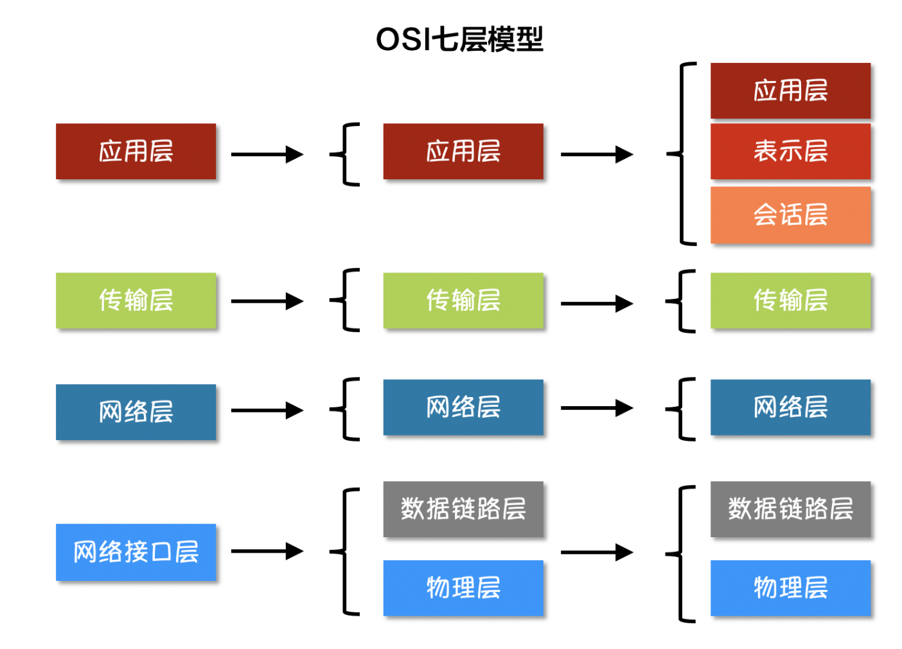

# 网络编程基础
## 互联网分层模型&协议介绍

**物理层**  
规定网络电气特性，负责传输电信号

**数据链路层**  
**规定解读电信号的方式，主要使用"以太网(Ethernet)"协议**    
以太网规定，一组电信号构成一个数据包，叫做”帧”（Frame）。连入网络的所有设备都必须具有”网卡”接口。数据包必须是从一块网卡，传送到另一块网卡。网卡的地址，就是数据包的发送地址和接收地址，这叫做MAC地址。  
通过ARP协议来获取接受方的MAC地址    

**网络层**  
以太网协议采用广播的方式来发送数据包，因此我们需要将不同的计算机纳入不同的子网络中以减少消耗。  
如果是同一个子网络，数据包就采用广播方式发送，否则就采用”路由”方式发送。这就导致了”网络层”的诞生。它的作用是引进一套新的地址，**使得我们能够区分不同的计算机是否属于同一个子网络**  
每台计算机具有两个地址，IP地址(即网络地址)负责确定计算机所在的子网络，MAC地址负责将数据包发送给该子网络中的目标网卡 

**传输层**  
IP地址+MAC地址可以让互联网上任意两台计算机建立通信，现在我们需要添加一个参数用于区分数据包供哪个应用程序使用。**这个参数就叫做”端口”（port），它其实是每一个使用网卡的程序的编号。** 每个数据包都发到主机的特定端口，所以不同的程序就能取到自己所需要的数据。   
UDP协议：它的格式几乎就是在数据前面，加上端口号。简单易实现但是不可靠  
TCP协议：确保数据不会遗失，但是过程复杂、消耗较多

**应用层**  
应用程序收到传输层的数据就需要进行解包，`应用层`的作用就是规定应用程序使用的数据格式，例如我们TCP协议之上常见的Email、HTTP、FTP等协议，这些协议就组成了互联网协议的应用层。

## pprof性能分析
性能分析的5个指标：CPU, 内存, I/O, goroutine泄露, 死锁检测&数据竞态分析
- [Go性能分析工具](https://golang2.eddycjy.com/posts/ch6/01-pprof-1/)

## 参考资料
- [网络编程](https://www.topgoer.com/%E7%BD%91%E7%BB%9C%E7%BC%96%E7%A8%8B/%E4%BA%92%E8%81%94%E7%BD%91%E5%8D%8F%E8%AE%AE%E4%BB%8B%E7%BB%8D.html)
- [Go网络编程基础](https://books.studygolang.com/Mastering_Go_ZH_CN/eBook/chapter12/12.0.html)