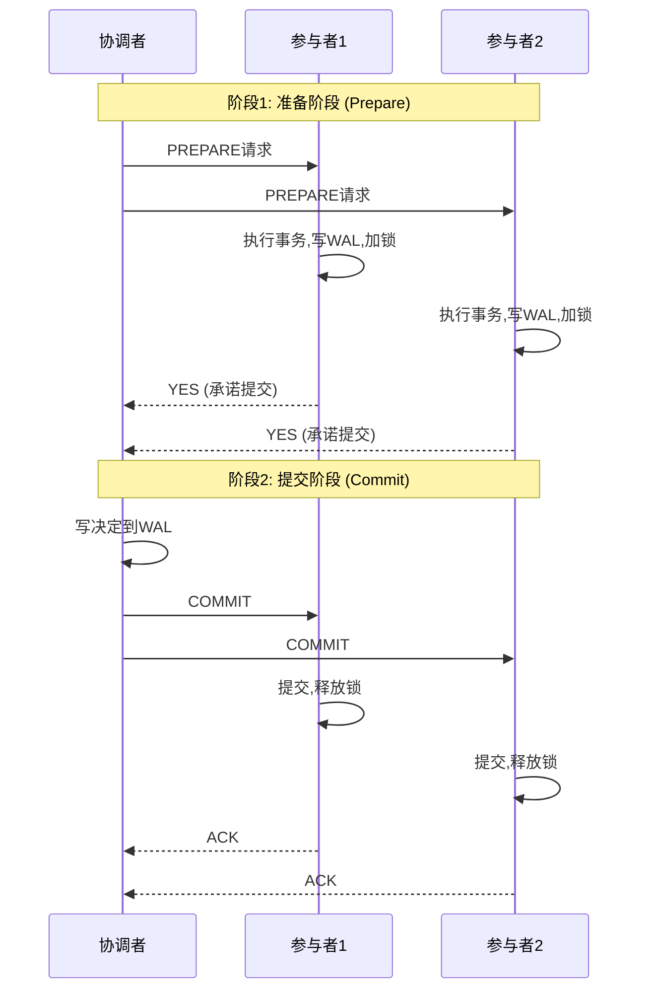
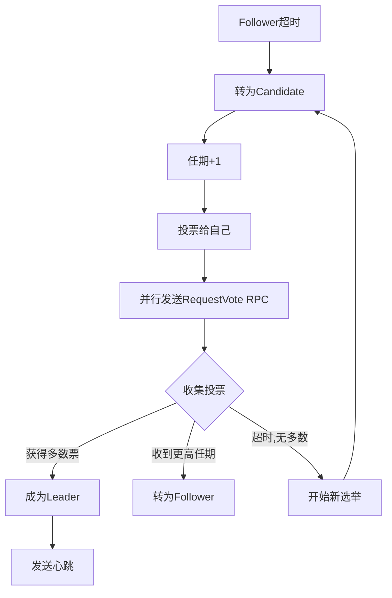
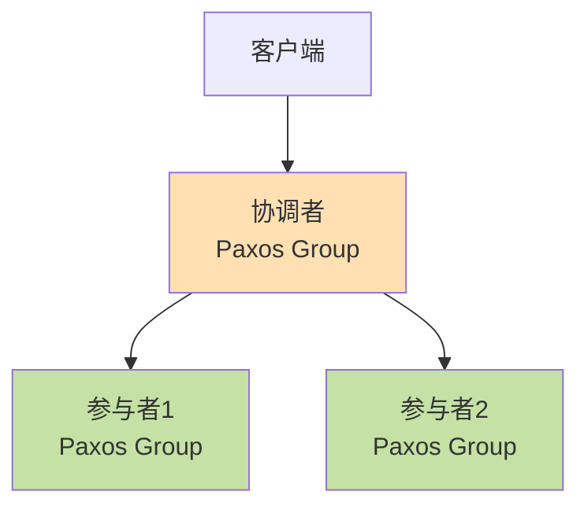

# Ch09 一致性与共识

> **阅读时间**: Week 8-9
> **核心主题**: 分布式系统中的一致性保证、共识算法、分布式事务
> **关键价值**: 理解分布式系统如何在故障、延迟、分区情况下保证数据一致性

## 本章概览

分布式系统中最困难的问题之一是如何处理故障。本章深入探讨:

1. **一致性保证**的不同级别
2. **分布式事务**的实现机制
3. **共识算法**如何解决一致性问题
4. 实际系统中的权衡与取舍

---

## 1. 一致性保证 (Consistency Guarantees)

### 1.1 最终一致性 (Eventual Consistency)

**定义**: 如果停止写入,所有副本最终会收敛到相同的值。

**问题**:

- "最终"可能很长时间
- 读取可能返回旧值
- 不同副本可能返回不同的值

**实际案例**:

```
用户更新个人资料 → 主库写入成功 → 从副本复制延迟
→ 用户刷新页面,从另一个副本读取 → 看到旧数据
```

**适用场景**: DNS、电商产品库存(可容忍短暂不一致)

### 1.2 线性一致性 (Linearizability)

[线性一致性详细笔记](./线性一致性深入理解.md)
**定义**: 系统表现得像只有一个数据副本,所有操作都是原子的、即时生效的。

**核心特征**:

1. **原子性**: 一旦写入完成,所有客户端立即看到新值
2. **全局顺序**: 所有操作有唯一的全局时间顺序
3. **实时性**: 如果操作A在操作B开始前完成,A必须在B之前

**线性一致性示例**:

```
Timeline:
Client 1:  |--write(x=1)--|              |--read(x)=1--|
Client 2:                    |--read(x)=1--|
Client 3:                                       |--read(x)=1--|

✓ 线性一致: 一旦write完成,所有读取都返回新值
```

**非线性一致性示例**:

```
Timeline:
Client 1:  |--write(x=1)--|
Client 2:                    |--read(x)=0--|  (看到旧值!)
Client 3:                         |--read(x)=1--|

✗ 非线性一致: Client 2在write完成后读到旧值
```

**实现代价**:

- **性能**: 需要协调,增加延迟
- **可用性**: CAP定理 - 网络分区时必须牺牲可用性
- **扩展性**: 难以在多数据中心实现

**线性一致性 vs 可序列化**:

| 维度 | 线性一致性     | 可序列化             |
| ---- | -------------- | -------------------- |
| 范围 | 单个对象的读写 | 事务中的多个对象     |
| 保证 | 实时顺序       | 某种顺序(不保证实时) |
| 实现 | 分布式共识算法 | 锁、MVCC、SSI        |
| 开销 | 高(需要协调)   | 中到高               |

**组合使用**: 严格可序列化 = 可序列化 + 线性一致性

### 1.3 顺序保证 (Ordering Guarantees)

**全序 vs 偏序**:

```
全序 (Total Order):
事件: A → B → C → D
特点: 任意两个事件都可比较

偏序 (Partial Order):
    A → C
    B → D
特点: 不同分支的事件无法比较(如不同分区的事件)
```

**因果一致性 (Causality)**:

**定义**: 如果事件A影响事件B,所有副本必须按A→B的顺序看到这些事件。

**案例分析**:


**因果顺序要求**:

- 所有人必须先看到问题Q,再看到答案A
- 如果顺序颠倒,答案A就没有意义

**实现机制**:

1. **序列号排序**:

   ```
   节点1: seq=1, seq=3, seq=5 (奇数)
   节点2: seq=2, seq=4, seq=6 (偶数)
   问题: 无法区分因果关系
   ```
2. **Lamport时间戳**:

   ```
   规则:
   - 每个节点维护计数器counter
   - 发送消息时: timestamp = (counter, nodeID)
   - 接收消息时: counter = max(local_counter, msg_counter) + 1

   优势: 提供全序
   劣势: 无法判断是否存在因果关系(只有顺序,无因果信息)
   ```
3. **版本向量 (Version Vectors)**:

   ```
   节点A: [A:2, B:1, C:0]  # 知道A的2个事件,B的1个事件
   节点B: [A:1, B:3, C:1]

   因果关系判断:
   - V1 < V2 当且仅当 V1[i] <= V2[i] for all i
   - V1和V2并发 当且仅当 neither V1 < V2 nor V2 < V1
   ```

**因果一致性的实现**:

| 方法          | 优点             | 缺点              | 使用场景                 |
| ------------- | ---------------- | ----------------- | ------------------------ |
| Lamport时间戳 | 简单,开销小      | 无法检测并发      | 需要全序但不需要检测因果 |
| 版本向量      | 能检测并发和因果 | 空间开销O(节点数) | Dynamo, Riak             |
| 因果广播      | 保证因果顺序     | 需要所有节点在线  | 协作系统                 |

---

## 2. 分布式事务与共识 (Distributed Transactions and Consensus)

### 2.1 两阶段提交 (2PC - Two-Phase Commit)

**目标**: 原子性地在多个节点上提交事务(要么全部成功,要么全部回滚)

**角色**:

- **协调者 (Coordinator)**: 管理事务流程
- **参与者 (Participants)**: 执行实际操作的节点

**流程图**:



**详细步骤**:

**阶段1 - 准备 (Prepare)**:

1. 协调者向所有参与者发送PREPARE请求
2. 参与者:
   - 执行事务到准备提交状态
   - 将修改写入WAL(预写日志)
   - 获取所有必要的锁
   - 回复YES(可以提交)或NO(需要回滚)
3. 参与者回复YES后,**承诺**无论发生什么都能提交

**阶段2 - 提交 (Commit)**:

1. 协调者收集所有回复:
   - 如果**所有**参与者回复YES → 决定COMMIT
   - 如果**任何**参与者回复NO → 决定ABORT
2. 协调者将决定写入WAL(这是**提交点**)
3. 协调者向所有参与者发送决定(COMMIT或ABORT)
4. 参与者执行决定,释放锁,回复ACK

**故障场景分析**:

**场景1: 参与者在准备前崩溃**

```
结果: 协调者超时 → 中止事务
影响: 无 (参与者恢复后回滚)
```

**场景2: 参与者准备后、提交前崩溃**

```
问题: 参与者已承诺提交,持有锁
解决:
1. 参与者恢复后,从WAL读取准备记录
2. 向协调者查询事务状态
3. 根据协调者决定提交或回滚
影响: 恢复期间锁一直持有,阻塞其他事务
```

**场景3: 协调者在决定后、通知前崩溃**

```
问题: 参与者不知道是提交还是回滚,持有锁等待
解决:
1. 协调者恢复后,从WAL读取决定
2. 重新发送COMMIT/ABORT消息
影响: 参与者在等待期间锁持有(可能很长时间)
```

**场景4: 协调者在决定前崩溃**

```
最坏情况:
- 一些参与者已回复YES,持有锁等待
- 协调者日志损坏,无法恢复
结果: 参与者永久阻塞(需要人工干预)
```

**2PC的问题**:

1. **阻塞协议**:

   - 参与者在准备后必须等待协调者决定
   - 期间持有锁,阻塞其他事务
   - 协调者故障 → 参与者无限期等待
2. **单点故障**:

   - 协调者是单点故障
   - 协调者失败 → 整个系统阻塞
3. **性能开销**:

   - 两次网络往返
   - 多次磁盘fsync(写WAL)
   - 增加延迟

**实际使用**:

- **数据库**: MySQL XA事务,PostgreSQL两阶段提交
- **微服务**: 很少使用(更倾向补偿事务/Saga)
- **趋势**: 逐渐被更灵活的方案替代

### 2.2 三阶段提交 (3PC - Three-Phase Commit)

**改进**: 增加超时机制,减少阻塞

**流程**:

1. **CanCommit**: 询问是否可以提交
2. **PreCommit**: 准备提交
3. **DoCommit**: 执行提交

**优势**: 参与者超时后可以自动提交(假设协调者已决定提交)

**问题**: 网络分区时可能导致不一致

**实际情况**: 很少使用,因为仍无法解决所有问题

### 2.3 共识算法 (Consensus Algorithms)

**共识问题定义**:

一组节点需要对某个值达成一致,必须满足:

1. **一致性 (Agreement)**: 所有节点决定相同的值
2. **完整性 (Integrity)**: 每个节点最多决定一次,且值必须是某节点提议的
3. **有效性 (Validity)**: 如果决定了值v,v必须是某节点提议的
4. **终止性 (Termination)**: 最终所有非故障节点都会做出决定

**FLP不可能性定理**:

> 在异步网络中,即使只有一个节点可能故障,也不存在总能终止的确定性共识算法。

**实际意义**:

- 理论上无法在所有情况下保证共识
- 实践中通过超时、随机化等方法绕过
- 现实系统假设"部分同步"网络(有界延迟)

---

## 3. Raft共识算法详解

### 3.1 Raft概述

**设计目标**:

- 易于理解(相比Paxos)
- 实用性强
- 正确性可证明

**核心思想**: 将共识问题分解为:

1. **领导者选举 (Leader Election)**
2. **日志复制 (Log Replication)**
3. **安全性 (Safety)**

**节点状态**:

```
Follower → (超时) → Candidate → (获得多数票) → Leader
   ↑                     ↓                          ↓
   └─────────(发现更高任期/更高任期的Leader)───────┘
```

### 3.2 任期 (Term)

**定义**: 逻辑时钟,单调递增的编号

```
Term 1      Term 2      Term 3      Term 4
 Leader      Leader    (no leader)   Leader
|-------|  |---------|  |-----|   |------------|
   时间轴 ───────────────────────────────────────>
```

**规则**:

- 每个任期最多一个领导者
- 任期可能没有领导者(选举失败)
- 节点看到更高任期 → 立即转为Follower,更新自己的任期

**作用**:

- 检测过期信息
- 保证每个任期只有一个领导者

### 3.3 领导者选举 (Leader Election)

**选举触发**:

Follower在**选举超时**时间内没收到Leader心跳 → 发起选举

**选举流程**:



**RequestVote RPC参数**:

```go
type RequestVoteArgs struct {
    Term         int  // 候选人的任期
    CandidateId  int  // 候选人ID
    LastLogIndex int  // 候选人最后日志条目的索引
    LastLogTerm  int  // 候选人最后日志条目的任期
}

type RequestVoteReply struct {
    Term        int   // 当前任期,用于候选人更新自己
    VoteGranted bool  // 是否投票
}
```

**投票规则**:

```go
func (rf *Raft) handleRequestVote(args RequestVoteArgs) RequestVoteReply {
    reply := RequestVoteReply{Term: rf.currentTerm}

    // 1. 如果候选人任期小于自己,拒绝
    if args.Term < rf.currentTerm {
        reply.VoteGranted = false
        return reply
    }

    // 2. 如果候选人任期更大,更新自己的任期,转为Follower
    if args.Term > rf.currentTerm {
        rf.currentTerm = args.Term
        rf.votedFor = -1  // 新任期,还没投票
        rf.state = Follower
    }

    // 3. 检查是否已经投票给其他候选人
    if rf.votedFor != -1 && rf.votedFor != args.CandidateId {
        reply.VoteGranted = false
        return reply
    }

    // 4. 检查候选人的日志是否至少和自己一样新
    lastLogIndex := len(rf.log) - 1
    lastLogTerm := rf.log[lastLogIndex].Term

    logIsUpToDate := args.LastLogTerm > lastLogTerm ||
                     (args.LastLogTerm == lastLogTerm &&
                      args.LastLogIndex >= lastLogIndex)

    if logIsUpToDate {
        rf.votedFor = args.CandidateId
        reply.VoteGranted = true
        // 重置选举超时,避免自己也发起选举
        rf.resetElectionTimeout()
    } else {
        reply.VoteGranted = false
    }

    return reply
}
```

**防止脑裂 (Split Brain)**:

**问题**: 如果允许多个Leader,数据会不一致

**Raft解决方案**:

1. **多数派原则**: 获得**超过半数**节点投票才能成为Leader
2. **每个任期每个节点只能投一票**
3. **数学保证**: 任意两个多数派必有交集

**示例**:

```
5个节点的集群:
多数派 = 3个节点

可能的多数派: {1,2,3}, {1,2,4}, {1,3,4}, {2,3,4}, {1,3,5}...
任意两个多数派都至少有1个共同节点

→ 不可能在同一任期选出两个Leader
```

**选举超时随机化**:

**问题**: 如果所有节点同时超时 → 同时发起选举 → 票数分散 → 没人获得多数

**解决**:

```go
// 随机选举超时: 150-300ms
electionTimeout = 150ms + rand(150ms)
```

**效果**: 通常一个节点先超时,先发起选举,获得多数票

### 3.4 日志复制 (Log Replication)

**日志结构**:

```
Index:  1    2    3    4    5    6    7
Term:   1    1    1    2    3    3    3
Cmd:   [x←1][y←2][x←3][y←4][x←5][y←6][x←7]
        ↑                              ↑
      committed                    未提交
```

**日志条目**:

```go
type LogEntry struct {
    Term    int         // 收到该条目时的Leader任期
    Index   int         // 日志中的索引位置
    Command interface{} // 要执行的命令
}
```

**复制流程**:

1. **客户端请求**: 发送命令给Leader
2. **Leader追加**: Leader将命令追加到本地日志
3. **并行复制**: Leader发送AppendEntries RPC给所有Follower
4. **多数确认**: Leader等待多数节点回复成功
5. **提交**: Leader提交日志条目,应用到状态机
6. **通知Follower**: 在下次AppendEntries中告知Follower提交进度
7. **Follower提交**: Follower提交并应用日志

**AppendEntries RPC**:

```go
type AppendEntriesArgs struct {
    Term         int        // Leader的任期
    LeaderId     int        // Leader的ID
    PrevLogIndex int        // 新日志条目之前的索引
    PrevLogTerm  int        // PrevLogIndex处的任期
    Entries      []LogEntry // 要存储的日志条目(心跳时为空)
    LeaderCommit int        // Leader的commitIndex
}

type AppendEntriesReply struct {
    Term    int  // 当前任期,用于Leader更新自己
    Success bool // 如果Follower包含匹配PrevLogIndex和PrevLogTerm的条目,返回true

    // 优化字段(快速回退)
    ConflictTerm  int // 冲突条目的任期
    ConflictIndex int // 该任期的第一个索引
}
```

**一致性检查**:

Leader通过**PrevLogIndex**和**PrevLogTerm**确保Follower日志一致:

```
Leader日志:  1 1 1 2 3 3
             ↑ ↑ ↑ ↑ ↑ ↑
Index:       1 2 3 4 5 6

发送entries[5,6], PrevLogIndex=4, PrevLogTerm=2

Follower接收:
1. 检查index=4的条目是否存在且term=2
2. 如果不匹配 → 返回Success=false
3. Leader收到false → 递减nextIndex,重试
4. 最终找到一致点,从那里开始复制
```

**日志匹配特性 (Log Matching Property)**:

1. **相同索引、相同任期的条目存储相同命令**
2. **相同索引、相同任期,则之前所有条目都相同**

**处理不一致**:

**场景**: Follower崩溃后恢复,日志可能不一致

```
Leader:    1 1 1 2 3 3 3
Follower1: 1 1 1 2 3     (缺少条目)
Follower2: 1 1 1 2 2 2   (多余条目,任期冲突)
Follower3: 1 1           (严重落后)
```

**修复流程**:

```go
// Leader为每个Follower维护nextIndex
nextIndex[follower] = len(leader.log)  // 初始为Leader日志末尾+1

// 复制失败时回退
if !reply.Success {
    nextIndex[follower]--  // 递减,重试
}

// 优化: 快速回退
if !reply.Success {
    if reply.ConflictTerm > 0 {
        // Follower在PrevLogIndex处的任期不匹配
        // Leader跳过整个冲突任期
        for i := PrevLogIndex; i >= 1; i-- {
            if leader.log[i].Term == reply.ConflictTerm {
                nextIndex[follower] = i + 1
                break
            }
        }
        if nextIndex[follower] == PrevLogIndex {
            nextIndex[follower] = reply.ConflictIndex
        }
    } else {
        // Follower日志太短
        nextIndex[follower] = reply.ConflictIndex
    }
}
```

**提交规则**:

Leader只能提交**当前任期**的日志条目,旧任期的条目通过间接提交:

```
场景:
Term 2: Leader写入日志[4],崩溃
Term 3: 新Leader,未看到日志[4]
Term 4: 旧Leader恢复成为Leader,看到日志[4]已被多数复制

问题: 能否直接提交日志[4]?
答案: 不能! 必须先写入一条Term 4的日志,复制到多数派,
      提交Term 4的日志时,连带提交日志[4]

原因: 防止已提交的日志被覆盖
```

**详细示例**:

```
时刻1 (Term 2):
S1 (Leader): 1 1 2
S2:          1 1 2
S3:          1 1
S4:          1
S5:          1

S1复制日志[3]=Term2到S2,然后崩溃

时刻2 (Term 3):
S5当选Leader(获得S3,S4,S5的票)
S5: 1 1 3
假设S5提交了日志[3]=Term3,然后崩溃

时刻3 (Term 4):
S1恢复,当选Leader
S1能否直接提交日志[3]=Term2?

如果可以:
S1提交Term2的日志 → 应用到状态机
S1崩溃,S5当选 → S5的Term3日志覆盖Term2 → 不一致!

正确做法:
S1写入日志[4]=Term4,复制到多数派,提交日志[4]
此时日志[3]=Term2也间接提交(因为日志匹配特性)
```

### 3.5 安全性保证 (Safety)

**选举限制 (Election Restriction)**:

**规则**: 只有拥有"最新"日志的节点才能当选Leader

**"最新"定义**:

1. 最后日志条目的任期更大,或
2. 任期相同,日志更长

```go
func isLogUpToDate(candidateLastTerm, candidateLastIndex, myLastTerm, myLastIndex int) bool {
    if candidateLastTerm != myLastTerm {
        return candidateLastTerm > myLastTerm
    }
    return candidateLastIndex >= myLastIndex
}
```

**示例**:

```
候选人日志: 1 1 1 2 3 (lastTerm=3, lastIndex=5)
节点A日志:  1 1 1 2 3 3 (lastTerm=3, lastIndex=6)
节点B日志:  1 1 1 2 (lastTerm=2, lastIndex=4)

A不会投票给候选人(A的日志更新:相同任期但更长)
B会投票给候选人(候选人任期更大)
```

**Leader完整性 (Leader Completeness)**:

**定理**: 如果日志条目在某个任期被提交,那么该条目会出现在所有更高任期的Leader日志中。

**证明思路**:

1. 日志条目提交 → 已被多数派复制
2. 新Leader必须获得多数派投票
3. 两个多数派必有交集 → 交集中至少一个节点有该日志
4. 该节点不会投票给日志更旧的候选人
5. → 新Leader必然有该日志

**状态机安全性 (State Machine Safety)**:

**定理**: 如果节点在某索引应用了日志条目,其他节点不会在相同索引应用不同命令。

**保证**: 通过日志匹配特性 + Leader完整性

---

## 4. 实际系统中的共识

### 4.1 etcd中的Raft实现

**etcd**: 分布式键值存储,Kubernetes的核心组件

**源码阅读**: `github.com/etcd-io/etcd/raft`

**关键文件**:

- `raft/raft.go:712`: 核心Raft状态机
- `raft/log.go:156`: 日志管理
- `raft/node.go:289`: 对外接口封装

**核心优化**:

**1. 日志压缩 (Snapshot)**

```go
// raft/raft.go
type Snapshot struct {
    Data             []byte  // 状态机快照数据
    Metadata         SnapshotMetadata
}

type SnapshotMetadata struct {
    Index            uint64  // 快照包含的最后一个日志索引
    Term             uint64  // 该索引的任期
    ConfState        ConfState
}
```

**流程**:

1. 日志过多时,状态机创建快照
2. 快照包含当前状态 + 最后应用的日志索引
3. 删除快照之前的所有日志
4. 落后的Follower接收快照而非逐条日志

**2. Pipeline优化**

```go
// 不等待前一个AppendEntries响应,连续发送
for {
    sendAppendEntries(follower, nextIndex[follower])
    nextIndex[follower]++  // 乐观递增
}
// 如果失败,批量回退
```

**3. Batch批处理**

```go
// 累积多个客户端请求,批量追加到日志
batch := []Entry{}
for len(batch) < maxBatchSize && time < batchTimeout {
    batch = append(batch, <-proposals)
}
appendToLog(batch)
```

### 4.2 ZooKeeper的ZAB协议

**ZAB (ZooKeeper Atomic Broadcast)**: 类似Raft,但设计更早

**与Raft的区别**:

| 维度     | Raft                 | ZAB                 |
| -------- | -------------------- | ------------------- |
| 日志编号 | (term, index)        | (epoch, counter)    |
| 选举     | 随机超时             | 快速选举算法        |
| 提交     | 多数派复制后提交     | 类似,但还需同步阶段 |
| 一致性读 | ReadIndex/Lease Read | 同步读              |

**源码位置**: `zookeeper/src/java/main/org/apache/zookeeper/server/quorum/`

### 4.3 一致性读优化

**问题**: 直接读取可能返回旧数据(Follower滞后或网络分区)

**方案**:

**1. 从Leader读**

```
客户端 → Leader → 返回最新数据
缺点: Leader负载高,可扩展性差
```

**2. ReadIndex (Raft)**

```go
// Leader处理读请求
func (r *Raft) handleRead() {
    // 1. 记录当前commitIndex
    readIndex := r.commitIndex

    // 2. 发送心跳,确认自己仍是Leader(防止网络分区)
    if !r.confirmLeadership() {
        return ErrNotLeader
    }

    // 3. 等待状态机应用到readIndex
    r.waitApplied(readIndex)

    // 4. 执行读取
    return r.stateMachine.Read(key)
}
```

**优势**: 线性一致读,无需写日志

**3. Lease Read**

```go
// Leader获得多数派心跳响应后,在electionTimeout时间内认为自己是Leader
if time.Now() < r.leaseExpiry {
    // 直接读取,无需确认
    return r.stateMachine.Read(key)
}
```

**风险**: 时钟偏移可能导致短暂不一致

**4. Follower Read (牺牲线性一致性)**

```
允许从Follower读取,返回可能稍旧的数据
适用场景: 可容忍短暂不一致(如监控指标)
```

---

## 5. 分布式事务实践

### 5.1 Google Spanner

**核心技术**:

- **TrueTime API**: 提供全局时间戳,误差<7ms
- **2PC + Paxos**: 每个分片用Paxos保证一致性,跨分片用2PC
- **Snapshot隔离**: 使用时间戳实现多版本并发控制

**架构**:



**关键洞察**:

- 协调者本身是Paxos组 → 单点故障问题解决
- TrueTime提供全局顺序 → 无需Lamport时间戳

### 5.2 Percolator (Google)

**场景**: 大规模增量处理(Google索引更新)

**机制**: 基于BigTable的分布式事务,使用2PC

**优化**:

- 懒惰清理:避免阻塞
- 列锁:细粒度锁减少冲突

**流程**:

```
1. PreWrite阶段:
   - 写入所有数据(带锁标记)
   - 选一个单元作为primary

2. Commit阶段:
   - 先提交primary
   - primary提交成功 = 事务成功
   - 后台异步提交secondary

3. 崩溃恢复:
   - 检查primary状态
   - primary已提交 → 继续提交secondary
   - primary未提交 → 回滚所有
```

### 5.3 Saga模式

**适用场景**: 微服务中的长事务

**思想**: 将长事务拆分为多个本地事务,每个配补偿操作

**示例 - 订单流程**:

```
正向操作:
T1: 创建订单 → T2: 扣减库存 → T3: 扣款 → T4: 发货

补偿操作:
C1: 取消订单 ← C2: 恢复库存 ← C3: 退款 ← C4: 取消发货

执行:
if T4成功: 完成
if T3失败: 执行C2, C1
```

**实现方式**:

**1. 编排 (Orchestration)**

```
中央协调器控制流程:
Orchestrator → Service1 → Service2 → Service3
              ↓ 失败    ↓ 补偿
              Compensate
```

**2. 编舞 (Choreography)**

```
事件驱动,无中央协调器:
Service1发布事件 → Service2监听并执行 → Service3监听...
```

**取舍**:

- Saga**不保证隔离性**(中间状态可见)
- 需要业务设计补偿逻辑
- 适合最终一致性场景

---

## 6. 总结与思考

### 6.1 一致性级别对比

| 级别       | 保证                 | 实现代价 | 适用场景     |
| ---------- | -------------------- | -------- | ------------ |
| 最终一致性 | 无冲突时最终收敛     | 低       | 社交网络feed |
| 因果一致性 | 保持因果顺序         | 中       | 协作编辑     |
| 顺序一致性 | 全局顺序(不保证实时) | 中       | 分布式锁     |
| 线性一致性 | 全局实时顺序         | 高       | 银行转账     |

### 6.2 共识算法选择

**Raft**:

- **优点**: 易理解,易实现,工业界广泛使用
- **缺点**: 不支持成员变更优化,性能略逊Paxos变种
- **使用**: etcd, Consul, TiKV

**Multi-Paxos**:

- **优点**: 理论完善,性能优化空间大
- **缺点**: 难理解,实现复杂
- **使用**: Chubby, Spanner

**ZAB**:

- **优点**: 专为ZooKeeper优化
- **缺点**: 通用性弱
- **使用**: ZooKeeper

**EPaxos**:

- **优点**: 无Leader,低延迟
- **缺点**: 复杂度极高
- **使用**: 学术研究为主

### 6.3 CAP定理实践

**定理**: 分布式系统最多同时满足C(一致性)、A(可用性)、P(分区容忍)中的两个

**实际场景**:

**CP系统** (牺牲可用性):

```
示例: HBase, MongoDB(强一致配置), etcd
场景: 银行转账,库存扣减
网络分区时: 少数派节点拒绝服务,等待恢复
```

**AP系统** (牺牲一致性):

```
示例: Cassandra, DynamoDB, Riak
场景: 购物车,社交网络,CDN
网络分区时: 各分区继续服务,事后合并冲突
```

**实际权衡**:

- P(分区容忍)通常不可避免 → 选择C或A
- 很多系统**可配置**: Cassandra调整一致性级别
- **渐变而非绝对**: 弱一致↔强一致是光谱

### 6.4 关键洞察

1. **没有银弹**:

   - 2PC简单但阻塞
   - Raft容错但复杂
   - Saga灵活但无隔离性
   - 根据场景选择
2. **时间的困境**:

   - 分布式系统中无全局时钟
   - Lamport时间戳提供逻辑顺序
   - TrueTime(Spanner)用硬件解决
   - 大部分系统依赖因果顺序
3. **多数派的力量**:

   - Quorum机制保证一致性
   - N=2F+1容忍F个故障
   - 任意两个多数派必有交集 → 数学保证
4. **Leader的利弊**:

   - 简化一致性问题(单点决策)
   - 引入单点故障(需要快速重选举)
   - 负载集中(需要优化读取)

### 6.5 实践建议

**选择一致性级别**:

```
问题清单:
□ 能否容忍短暂不一致?(如能 → 最终一致性)
□ 需要跨数据中心部署?(如是 → 避免线性一致性)
□ 读多写少?(如是 → 考虑缓存+弱一致性)
□ 涉及金钱交易?(如是 → 强一致性)
```

**实现分布式事务**:

```
决策树:
1. 能否避免分布式事务?
   是 → 设计成单机事务
   否 → 继续

2. 是否跨服务/数据库?
   否 → 使用数据库内置事务
   是 → 继续

3. 能否接受最终一致性?
   是 → 使用消息队列+幂等性
   否 → 继续

4. 事务是否短小?
   是 → 考虑2PC
   否 → 使用Saga模式
```

---

## 7. 扩展资源

### 7.1 必读论文

1. **Paxos Made Simple** (Lamport, 2001)

   - 经典Paxos算法
   - 难度: ★★★★☆
2. **In Search of an Understandable Consensus Algorithm** (Ongaro & Ousterhout, 2014)

   - Raft论文
   - 难度: ★★★☆☆
   - 推荐先读
3. **Spanner: Google's Globally-Distributed Database** (Corbett et al., 2012)

   - TrueTime + 2PC/Paxos
   - 难度: ★★★★☆
4. **Life beyond Distributed Transactions** (Pat Helland, 2007)

   - 分布式事务的替代方案
   - 难度: ★★☆☆☆

### 7.2 源码阅读推荐

**初学者**:

- `hashicorp/raft`: Go实现,代码清晰
- `etcd-io/raft`: 生产级,注释丰富

**进阶**:

- `etcd-io/etcd`: 完整分布式KV存储
- `cockroachdb/cockroach/pkg/kv/kvserver`: CockroachDB的Raft实现

**专家**:

- `apache/zookeeper`: ZAB协议
- `tikv/tikv`: Rust实现的Raft + 事务

### 7.3 实践项目建议

**Week 8项目**:

1. **基础Raft实现** (Go)

   - 领导者选举
   - 日志复制
   - 持久化
   - 基于MIT 6.824 Lab 2
2. **Raft KV存储** (Go)

   - 在Raft上实现简单KV存储
   - 支持Get/Put/Delete
   - 线性一致性读

**Week 9项目**:

1. **日志压缩** (扩展Week 8)

   - 实现Snapshot
   - 快照传输
2. **分布式事务模拟** (Python)

   - 实现2PC协调者和参与者
   - 模拟各种故障场景
   - 测试恢复机制

---

## 8. 思考题

1. **一致性模型**:

   - 为什么线性一致性在多数据中心场景下代价高昂?
   - 设计一个系统,既要低延迟又要强一致性,如何权衡?
2. **共识算法**:

   - Raft中为什么Leader不能直接提交旧任期的日志?
   - 如果去掉这个限制会出现什么问题?
3. **分布式事务**:

   - 2PC中协调者和参与者都可能故障,最坏情况是什么?
   - Saga模式下如何处理补偿操作本身失败的情况?
4. **实际应用**:

   - 电商秒杀场景,库存扣减需要什么一致性级别?
   - 社交网络的点赞功能,线性一致性是否必要?
5. **系统设计**:

   - 设计一个全球分布式的配置中心,如何选择一致性模型?
   - 跨云服务商部署Raft集群,需要注意什么?

---

## 9. 学习检查清单

完成本章学习后,你应该能够:

**理论理解**:

- [ ] 解释线性一致性、因果一致性、最终一致性的区别
- [ ] 描述Raft的三个核心子问题
- [ ] 说明2PC为什么是阻塞协议
- [ ] 理解CAP定理的实际含义

**算法掌握**:

- [ ] 画出Raft选举的完整流程图
- [ ] 解释Raft日志复制的一致性检查机制
- [ ] 说明为什么只能提交当前任期的日志
- [ ] 描述2PC的两个阶段及各自的持久化要求

**实践能力**:

- [ ] 能阅读etcd/raft的核心代码
- [ ] 能实现基础Raft的选举和日志复制
- [ ] 能设计Saga补偿流程
- [ ] 能根据场景选择合适的一致性级别

**系统思维**:

- [ ] 理解强一致性的代价(延迟、可用性)
- [ ] 知道如何在一致性和性能间权衡
- [ ] 能分析真实系统(etcd, ZooKeeper)的设计选择
- [ ] 能设计满足特定一致性需求的系统架构

---

**下一步**: 继续Week 9的实践项目,通过代码实现加深对共识算法的理解。
