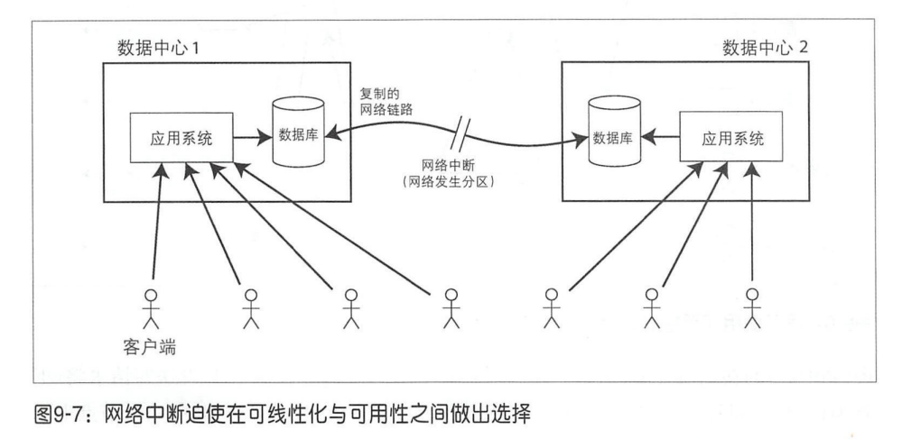

| col1 | col2 | col3 |
| ---- | ---- | ---- |
|      |      |      |
|      |      |      |

# Ch09 一致性与共识

由于分布式系统存在太多出错的场景，处理故障最简单的办怯就是直接让整个服务停下来，然后向用户提示出错信息。但**如果不能接受服务中止，就需要更加容错的解决方案**。

本章节讨论构建容错式分布式系统的相关算法和协议。

为了构建容错系统，最好先建立一套通用的抽象机制和与之对应的技术保证，这样只需实现一次，其上的各种应用程序都可以安全地信赖底层的保证。

> 这就像建房子时，先统一打好 “抗震地基”（通用抽象机制），并通过工程技术保证地基能抗 8 级地震（技术保证）。之后不管盖居民楼、办公楼还是商场（上层应用），都不用再自己设计抗震结构，只需直接建在这个地基上，就能安全应对地震。这样既省力，又比每个建筑各自设计抗震方案更可靠。

分布式系统最重要的抽象之一就是共识:**所有的节点就某项提议达成一致。**

> 分布式系统的核心矛盾是 “分散的节点” 与 “需要整体一致的行为” 之间的冲突。共识作为抽象，本质上是为了解决这种冲突—— 它屏蔽了底层网络、节点故障的复杂性，为上层提供了 “即使在不可靠环境中，所有节点仍能对关键决策达成一致” 的保证。没有共识，分布式系统就无法实现数据一致、协作可靠，更谈不上正确性和可用性。因此，共识成为分布式系统中最核心的抽象之一。

本章我们将主要研究解决共识问题的相关算法。

## 一致性保证

**最终一致性**: 如果停止更新数据库，并等待一段时间（长度未知）之后，最终所有读请求会返回相同的内容。

问题:

- "最终"可能很长时间
- 读取可能返回旧值
- 不同副本可能返回不同的值

本章主要探讨的内容:

- 最强的一致性模型: **线性化**
- 探讨分布式系统中事件顺序问题, 特别是**因果关系和全局顺序**
- 探索如何自动提交分布式事务, 并最终解决**共识问题**

## 可线性化

**直觉含义**: 让一个系统看起来好像只有一个数据副本, 且所有的操作都是原子的。

通过记录所有请求和响应的顺序，然后检查它们是否可以顺序排列，可以用来测试系统是否可线性化

**核心特征**:

1. **原子性**: 一旦写入完成,所有客户端立即看到新值
2. **全局顺序**: 所有操作有唯一的全局时间顺序
3. **实时性**: 如果操作A在操作B开始前完成,A必须在B之前

**可线性化与可串行化的区别**

可线性化：强绑定真实时间。

假设操作 A 在真实时间 t1 完成，操作 B 在真实时间 t2（t2>t1）开始，那么在可线性化的系统中，A 的执行顺序必须排在 B 之前。例：用户 1 在 10:00:01 完成 “给计数器 + 1”（结果从 0→1），用户 2 在 10:00:02 开始 “读计数器”，那么用户 2 必须读到 1，不能读到0。

可串行化：不绑定真实时间。

只要多个事务的最终结果等价于 “某种串行顺序” 即可，不管事务中操作的真实发生时间。
例：事务 T1（A 转 100 给 B）和事务 T2（B 转 100 给 C）并发执行：
- 真实时间顺序可能是 “T1 读 A→T2 读 B→T1 写 A→T2 写 B→T1 读 B→T1 写 B→T2 读 C→T2 写 C”；
- 但最终结果只要是 “A-100、B 不变、C+100”，就等价于 “先 T1 再 T2” 或 “先 T2 再 T1” 的串行结果，满足可串行化 —— 哪怕中间操作的真实顺序打乱了。

## 线性化的依赖条件

### 加锁与主节点选举
主从复制的系统需要确保有且只有一个主节点，否则会产生脑裂。

选举新的主节点常见方法是使用锁：即**每个启动的节点都试图获得锁，其中只有一个可以成功成为主节点。**

锁的实现必须满足可线性化：**所有节点都必须同意那个节点持有锁。**

归根结底，线性化存储服务是所有这些协调服务的基础。

### 约束与唯一性保证
硬性的唯一性约束，常见的如关系型数据库中的主键的约束，则需要线性化保证；其他如外键或者属性约束，则并不要求一定线性化。
> 主键的唯一性是 “不能有任何冲突” 的硬性要求，必须通过线性化保证操作的严格顺序和结果可见性；而外键、属性约束更关注 “最终是否符合规则”，对并发操作的实时顺序要求较低，因此不需要线性化。

### 跨通道的时间依赖
线性化违例之所以被注意到，是因为系统中存在其他的通信渠道。
> 简单说：系统自己不会喊 “我违例了”，但用户之间的聊天、系统之间的日志比对等 “额外沟通”，会让 “你看到的和我看到的不一样” 这个事实浮出水面 —— 这就是这句话的含义。

## 实现线性化系统
**最简单的方案：只用一个数据副本。**

但是该方案无法容错，如果该副本节点发生故障就会导致数据丢失。

**系统容错最常见的方怯就是采用复制机制。**
- 主从复制(部分支持可线性化)
- 共识算法(可线性化)
- 多主复制(不可线性化)
- 无主复制(可能不可线性化)

### 线性化与quorum
在分布式系统中，quorum（通常翻译为 “仲裁” 或 “法定人数”） 是一种通过 “节点数量约定” 来平衡数据一致性和系统可用性的机制。它的核心思想是：**通过设定一个 “最小节点数阈值”，只有当操作（读 / 写）获得至少这么多节点的响应时，才认为操作成功，从而避免因部分节点故障或网络分区导致的数据混乱。**

线性化（Linearizability）和 quorum（仲裁）是分布式系统中两个关联密切但目标不同的概念：quorum 是一种通过 “节点数量约定” 平衡可用性与一致性的机制，而线性化是一种强一致性保障（要求操作顺序符合真实时间）。两者的关系可以概括为：quorum 可以作为实现线性化的工具，但单纯的 quorum 机制并不一定能保证线性化，需要额外条件配合。

## 线性化的代价

如果应用程序要求线性化读写，则网络中断一定会违背这样的要求。

### CAP理论
**CAP 定理** (也称为 Brewer's Theorem) 指出:在一个分布式系统中,以下三个属性**不可能同时满足**,最多只能同时满足其中两个:

- **C (Consistency)** - 一致性
- **A (Availability)** - 可用性
- **P (Partition Tolerance)** - 分区容错性

更额外的是，由于分布式系统不可避免的存在网络分区，P(分区容错性)必须得到满足，因此剩下的就是在C或者A中选择。

在网络正常的时候，系统可以同时保证一致性（线性化）和可用性。而一旦发生
了网络故障，必须要么选择线性（一致性），要么可用性。

正式定义的CAP定理范围很窄，它只考虑了一种一致性模型（即线性化）和一种故障（网络分区，节点仍处于活动状态但相互断开），而没有考虑网络延迟、节点失败或其他需要折中的情况。因此对于现代的系统设计来说，没有太多实际的价值。

### 可线性化与网络延迟
线性化对性能的影响是巨大的，例如在现代多核CPU系统中的内存就是非线性化的，为了速度考虑。

## 顺序保证
由于线性一致性对面表现的就像是只有一个数据副本，每个操作都是原子性生效的，这就意味着操作对外是按照某种顺序执行的。

## 顺序与因果关系
顺序有助于保持因果关系，而**因果关系的重要性核心在于：它是维持 “操作逻辑正确性” 和 “系统行为可预测性” 的基石—— 如果忽略因果关系，原本符合直觉的操作会变得混乱，甚至导致数据错误、业务逻辑崩坏。** 

一旦因果关系被破坏，系统会从 “可预测的可靠工具” 变成 “充满不确定性的黑盒”，即违背了人类的直觉。
