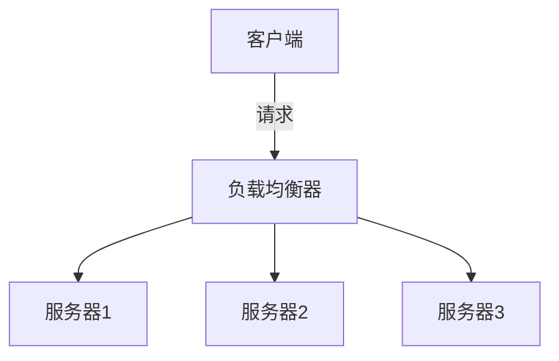
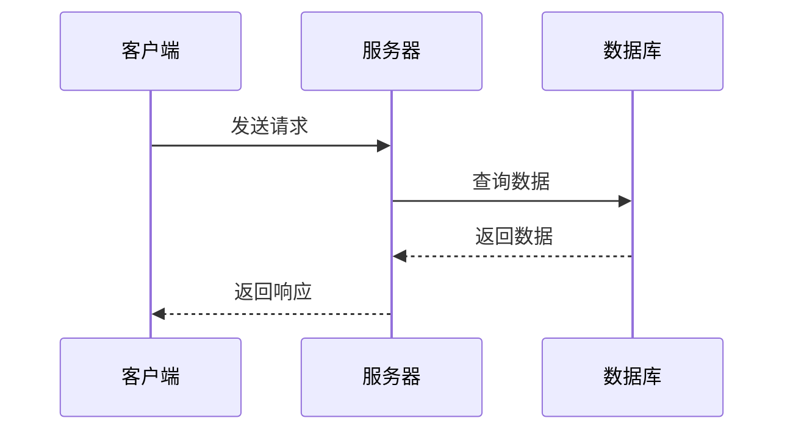

# 系统设计学习笔记

这个目录用于存放学习过程中的所有笔记和总结。

## 目录结构

```
notes/
├── week1/          # Week 1: 系统设计基础概念
├── week2/          # Week 2: 数据存储基础
├── week3/          # Week 3: 网络与通信基础
├── week4/          # Week 4: 缓存系统设计
├── week5/          # Week 5: 数据库进阶
├── week6/          # Week 6: 消息队列与异步处理
├── week7/          # Week 7: 微服务架构
├── week8/          # Week 8: 分布式系统理论
├── week9/          # Week 9: 监控、日志与追踪
├── week10/         # Week 10: 安全与性能优化
├── week11/         # Week 11: 经典系统设计案例
├── week12/         # Week 12: 综合项目实战
├── phase1-summary.md   # Phase 1 总结
├── phase2-summary.md   # Phase 2 总结
├── phase3-summary.md   # Phase 3 总结
└── final-summary.md    # 最终学习总结
```

## 笔记规范

### 每日笔记模板

```markdown
# Day {N} - {主题}

**日期**: YYYY-MM-DD
**学习时长**: X 小时

## 学习内容

### 1. 主要概念

- 概念1: 简要说明
- 概念2: 简要说明

### 2. 关键知识点

#### 2.1 知识点A
详细说明...

#### 2.2 知识点B
详细说明...

## 代码示例

```language
// 代码示例
```

## 架构图/流程图

[插入图片或使用文本描述]

## 重点总结

- 要点1
- 要点2
- 要点3

## 疑问与思考

- 疑问1: xxx?
- 思考1: xxx

## 参考资料

- [文章标题](链接)
- [视频标题](链接)

## 下一步计划

- [ ] 任务1
- [ ] 任务2
```

### 周总结模板

```markdown
# Week {N} 总结 - {主题}

**时间范围**: YYYY-MM-DD ~ YYYY-MM-DD
**总学习时长**: X 小时

## 本周学习内容概览

1. 主题1
2. 主题2
3. 主题3

## 重点知识梳理

### 知识点1
...

### 知识点2
...

## 实践项目

1. 项目名称1 - 简要说明
2. 项目名称2 - 简要说明

## 收获与反思

### 主要收获
- 收获1
- 收获2

### 遇到的困难
- 困难1及解决方案
- 困难2及解决方案

### 改进计划
- 改进点1
- 改进点2

## 下周学习计划

- [ ] 目标1
- [ ] 目标2
```

## 笔记技巧

### 1. 使用 Markdown 语法
- 标题层次分明
- 使用列表、表格
- 代码块标注语言
- 插入链接和图片

### 2. 善用图示
- 架构图
- 流程图
- 时序图
- 思维导图

推荐工具:
- [draw.io](https://app.diagrams.net/)
- [Excalidraw](https://excalidraw.com/)
- [PlantUML](https://plantuml.com/)
- [Mermaid](https://mermaid-js.github.io/)

### 3. 记录代码片段
- 添加注释说明
- 标注关键逻辑
- 记录遇到的坑

### 4. 建立知识关联
- 新旧知识点联系
- 不同主题的关联
- 实际应用场景

### 5. 定期回顾
- 每周回顾本周笔记
- 每月回顾当月内容
- 阶段性总结

## 常用图示示例

### Mermaid 流程图示例


### Mermaid 时序图示例


## 学习资源整理

建议在笔记中整理以下资源:

### 书籍
- 书名 + 阅读进度 + 关键章节笔记

### 文章
- 标题 + 链接 + 关键要点

### 视频
- 标题 + 链接 + 时长 + 核心内容

### 代码仓库
- 项目名 + 链接 + 学习要点

## 提示

1. **及时记录**: 学完就记,不要拖延
2. **用自己的话**: 不要照搬,理解后用自己的语言表达
3. **标注重点**: 使用粗体、高亮等方式标注重点
4. **记录疑问**: 不懂的地方及时记录,后续解决
5. **定期整理**: 每周整理一次笔记,查漏补缺

祝学习顺利! 📚
