# Ch03 存储与检索

> 数据库的核心职责有两个：存储数据和检索数据。本章深入探讨数据库存储引擎的内部原理，理解不同数据结构的权衡。

**核心问题**：数据库如何存储数据？如何高效检索数据？

---

## 存储引擎的两大流派

数据库存储引擎主要分为两大类，它们在设计哲学和性能特性上有根本性的差异：

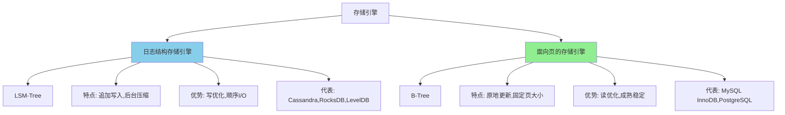

**核心差异**：

| 维度               | 日志结构存储 | 面向页存储 |
| ------------------ | ------------ | ---------- |
| **写入方式** | 追加写入     | 原地更新   |
| **数据组织** | 顺序日志     | 固定页     |
| **写性能**   | ✅ 高        | ❌ 低      |
| **读性能**   | ❌ 较低      | ✅ 高      |
| **压缩需求** | 需要后台压缩 | 需要 WAL   |

---

## 最简单的数据库：追加日志

### 极简实现

最简单的数据库可以用两个 Bash 函数实现：

```bash
#!/bin/bash

# 写入数据（追加到文件末尾）
db_set() {
  echo "$1,$2" >> database
}

# 读取数据（倒序查找最新值）
db_get() {
  grep "^$1," database | tail -n 1 | cut -d',' -f2
}
```

**使用示例**：

```bash
$ db_set 123 '{"name":"London","attractions":["Big Ben"]}'
$ db_set 456 '{"name":"San Francisco","attractions":["Golden Gate"]}'
$ db_get 123
{"name":"London","attractions":["Big Ben"]}

# 更新操作（追加新值）
$ db_set 123 '{"name":"New London","attractions":["Big Ben","Tower Bridge"]}'
$ db_get 123
{"name":"New London","attractions":["Big Ben","Tower Bridge"]}
```

### 性能分析

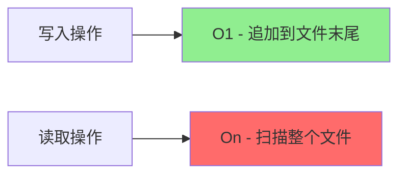

**性能特点**：

- **写入**：O(1) - 仅需追加到文件末尾
- **读取**：O(n) - 需要扫描整个文件

**核心问题**：随着数据增长，读取性能会线性下降！

---

## 索引：加速查询的代价

### 索引的本质

**定义**：索引是额外的数据结构，用于快速定位数据。

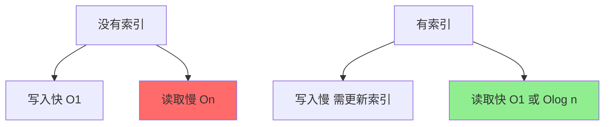

**权衡（Trade-off）**：

| 方面               | 无索引         | 有索引             |
| ------------------ | -------------- | ------------------ |
| **读性能**   | 慢（全表扫描） | 快（直接定位）     |
| **写性能**   | 快（直接写入） | 慢（需更新索引）   |
| **空间占用** | 小             | 大（额外索引结构） |

**关键洞察**：索引不是免费的，需要根据查询模式（读多写少 vs 写多读少）选择是否建立索引。

---

## 哈希索引

### 实现原理

**核心思想**：在内存中维护哈希表，键 → 文件偏移量。

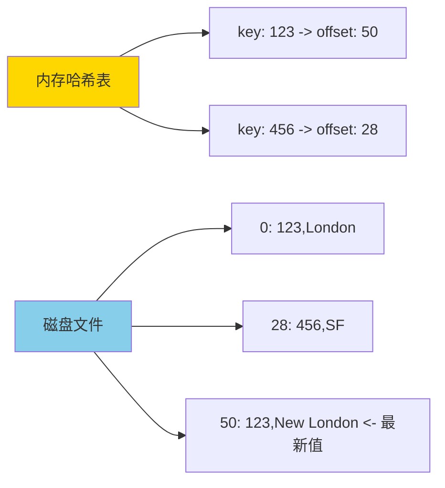

**数据结构**：

```
内存哈希表：
123 → 50  （指向最新值的偏移量）
456 → 28

磁盘文件（追加日志）：
偏移0:  123,{"name":"London"}
偏移28: 456,{"name":"SF"}
偏移50: 123,{"name":"New London"}  ← 更新操作追加新值
```

### 性能分析

**时间复杂度**：

- **写入**：O(1) - 追加文件 + 更新哈希表
- **读取**：O(1) - 哈希查找 + 一次磁盘 I/O

### 真实案例：Bitcask

**Bitcask** 是 Riak 的默认存储引擎，采用哈希索引。

**适用场景**：

- 值频繁更新的场景（如视频播放次数、用户会话数据）
- 键的数量不大，能全部放入内存
- 每个键对应的值变化频繁

**限制**：

- ❌ 所有键必须放入内存（内存限制了数据量）
- ❌ 不支持范围查询（如 `key BETWEEN 'kitty00000' AND 'kitty99999'`）

---

## 压缩与合并

### 问题：日志无限增长

**核心问题**：追加日志会无限增长，浪费磁盘空间。

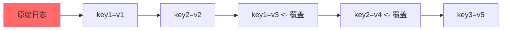

**后果**：

- 磁盘空间浪费（存储了大量过期数据）
- 读取性能下降（需要扫描更多数据）

### 解决方案：段压缩（Segment Compaction）

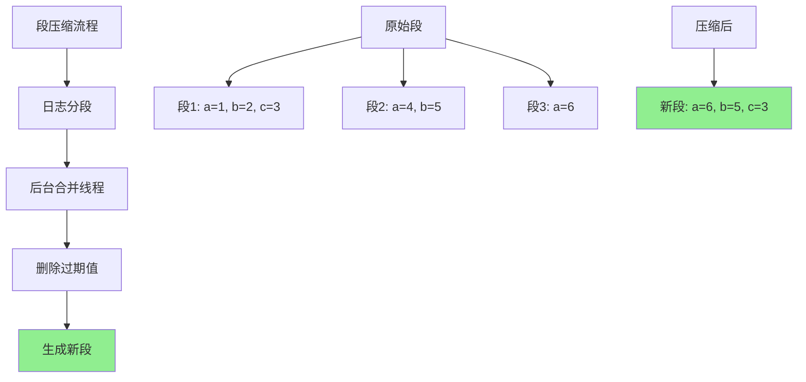

**工作原理**：

1. **日志分段（Segmentation）**：

   - 达到阈值（如 1MB）后，关闭当前段，创建新段
   - 新写入追加到新段
2. **后台合并**：

   - 后台线程合并多个旧段
   - 保留每个键的最新值
   - 删除过期值和墓碑标记
3. **读取逻辑**：

   - 从新段到旧段依次查找
   - 找到第一个匹配即停止

**示例**：

```
原始数据：
段1: a=1, b=2, c=3
段2: a=4, b=5
段3: a=6

合并后：
新段: a=6, b=5, c=3  （保留每个键的最新值）
```

### 实现细节

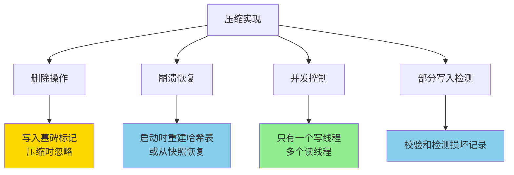

**关键技术**：

1. **删除操作**：

   - 写入特殊的"墓碑"（tombstone）标记
   - 压缩时遇到墓碑，丢弃该键的所有旧值
2. **崩溃恢复**：

   - 重启时重建哈希表（扫描所有段）
   - 或从快照恢复（定期保存哈希表快照）
3. **并发控制**：

   - 只有一个写线程（避免并发写入冲突）
   - 多个读线程（读取是只读操作，无冲突）
4. **部分写入检测**：

   - 每条记录附加校验和（checksum）
   - 读取时验证校验和，丢弃损坏记录

### 哈希索引的局限性

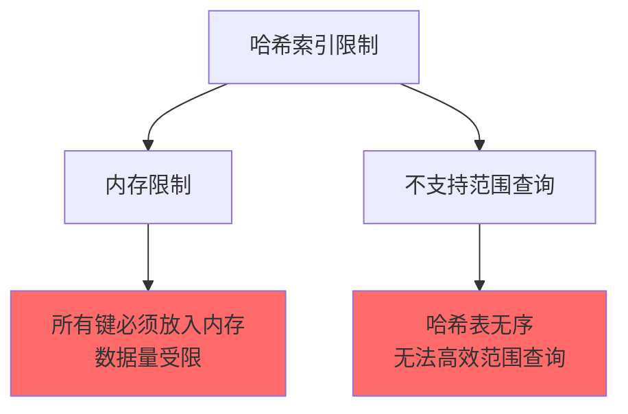

**限制**：

- ❌ **内存限制**：哈希表必须完全放入内存
- ❌ **无范围查询**：无法高效执行 `WHERE key BETWEEN 'a' AND 'z'`

**解决方案**：SSTable 和 LSM-Tree

---

## SSTables 与 LSM-Tree -> [笔记](./sstable-lsm-deep-dive.md)

### SSTable（Sorted String Table）

**核心改进**：键在段内**有序存储**。

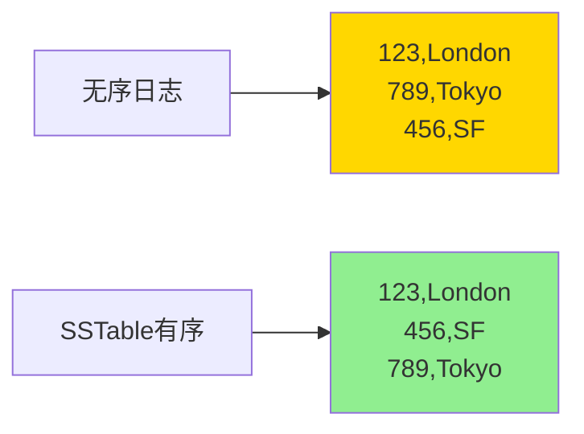

### 有序带来的优势

#### 1. 合并更高效（归并排序）

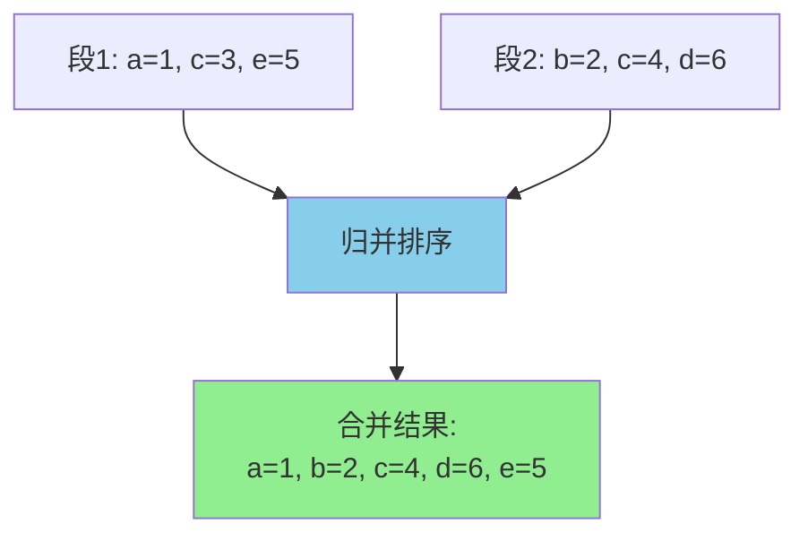

**特点**：

- 线性扫描，不需要全部加载到内存
- 时间复杂度：O(n)
- 类似归并排序的合并过程

**代码逻辑**：

```python
def merge_segments(seg1, seg2):
    """归并两个有序段"""
    merged = []
    i, j = 0, 0

    while i < len(seg1) and j < len(seg2):
        if seg1[i].key < seg2[j].key:
            merged.append(seg1[i])
            i += 1
        elif seg1[i].key > seg2[j].key:
            merged.append(seg2[j])
            j += 1
        else:  # 相同键，保留新段的值
            merged.append(seg2[j])
            i += 1
            j += 1

    # 添加剩余元素
    merged.extend(seg1[i:])
    merged.extend(seg2[j:])

    return merged
```

#### 2. 稀疏索引

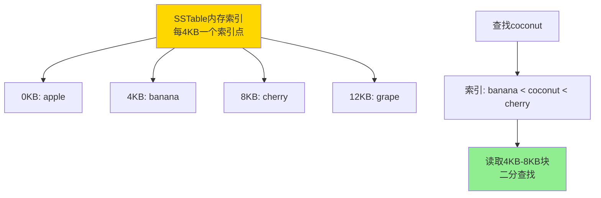

**关键特性**：

- 不需要为每个键维护索引（节省内存！）
- 索引指向每 N KB 的起始键
- 查询时：索引定位 → 读取块 → 二分查找

**示例**：

```
内存稀疏索引（每 4KB 一个索引点）：
0KB:    "apple"
4KB:    "banana"
8KB:    "cherry"
12KB:   "grape"

查找 "coconut"：
1. 索引查找：banana < coconut < cherry
2. 读取 4KB-8KB 块到内存
3. 在块内二分查找 "coconut"
```

#### 3. 压缩块

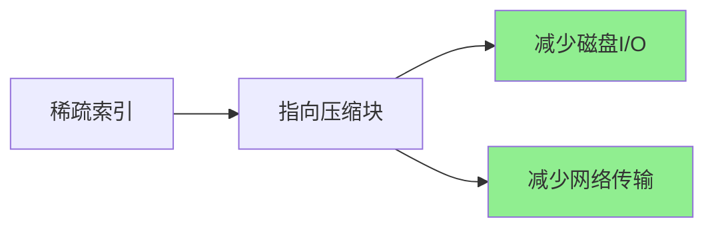

**优势**：

- 每个块可以独立压缩（如 Snappy、LZ4）
- 减少磁盘读取量
- 减少网络传输（分布式系统）

---

## LSM-Tree 架构

### 构建与维护 SSTable

**问题**：如何保证写入数据有序？

**解决方案**：内存排序 + 定期刷盘

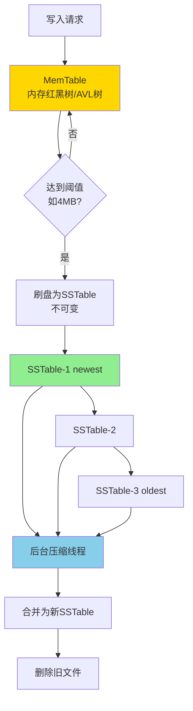

### LSM-Tree 完整流程

**写入流程**：

```
1. 写入 MemTable（内存中的平衡树）
   MemTable: {c:3, a:1, b:2}
   自动排序: a:1, b:2, c:3

2. MemTable 达到阈值（如 4MB）
   刷盘为 SSTable（磁盘上的有序文件）

3. SSTable 不可变，只追加
   SSTable-1 (newest): a:10, b:20, c:30
   SSTable-2:          a:5,  d:15
   SSTable-3 (oldest): a:1,  e:25

4. 后台压缩
   合并多个 SSTable → 新 SSTable
   删除旧文件
```

**查询流程**：

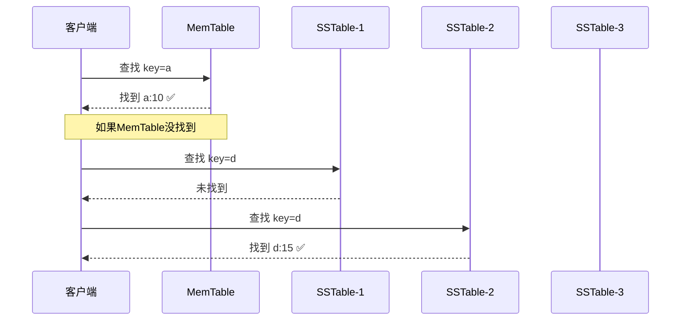

**查找逻辑**：

```
查找 key "a":
1. 先查 MemTable → 找到 a:10（最新）
2. 如果没找到，查 SSTable-1（最新）→ 找到就返回
3. 再查 SSTable-2, SSTable-3...
4. 都没找到 → 返回 NULL
```

### 性能优化：Bloom Filter

**问题**：查询不存在的键需要扫描所有 SSTable，性能差！

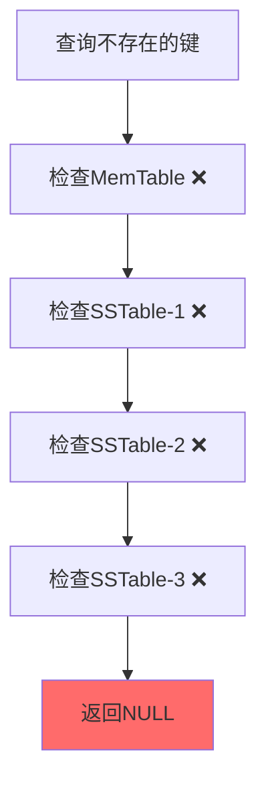

**解决方案：Bloom Filter（布隆过滤器）**

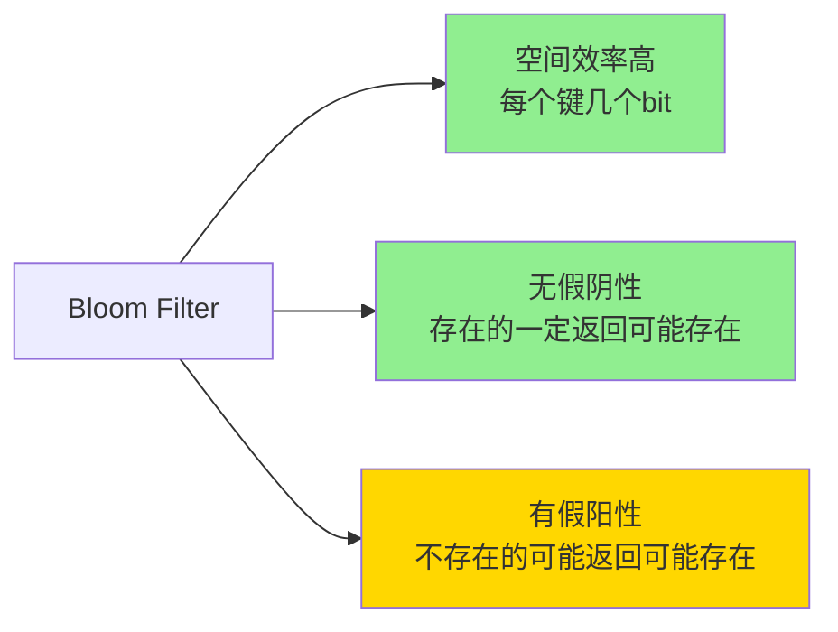

**工作原理**：

```
位数组 + 多个哈希函数

插入 "apple":
hash1("apple") = 3 → 设置 bit[3] = 1
hash2("apple") = 7 → 设置 bit[7] = 1
hash3("apple") = 12 → 设置 bit[12] = 1

查询 "banana":
hash1("banana") = 3 → bit[3] = 1
hash2("banana") = 5 → bit[5] = 0  ← 有0
结果: 一定不存在！（快速返回，无需读磁盘）

查询 "cherry":
hash1("cherry") = 3 → bit[3] = 1
hash2("cherry") = 7 → bit[7] = 1
hash3("cherry") = 12 → bit[12] = 1
结果: 可能存在（需要查文件确认）
```

**特点**：

- ✅ **空间效率高**：每个键只需几个 bit（通常 10 bit/key）
- ✅ **无假阴性**：存在的键一定返回"可能存在"
- ⚠️ **有假阳性**：不存在的键可能返回"可能存在"（概率可控，如 1%）

**优化效果**：

```
无 Bloom Filter:
查不存在的键 → 扫描所有 SSTable → 10 次磁盘 I/O

有 Bloom Filter:
查不存在的键 → Bloom Filter 判断不存在 → 0 次磁盘 I/O
查存在的键 → Bloom Filter 判断可能存在 → 正常查询
```

---

## 压缩策略

### Size-Tiered Compaction

**策略**：相似大小的段合并。

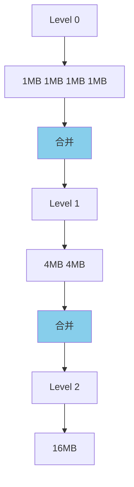

**特点**：

- 新写入的小段会快速合并
- 每层大小呈指数增长
- 相似大小的段合并

**优缺点**：

| 方面     | 表现                        |
| -------- | --------------------------- |
| 写放大   | ✅ 低（数据重写次数少）     |
| 读放大   | ❌ 高（可能需要查找多个段） |
| 空间放大 | ❌ 高（旧版本保留时间长）   |

**适用场景**：写密集型工作负载（Cassandra, HBase）

### Leveled Compaction

**策略**：每层容量限制，层间合并时只处理重叠键范围。

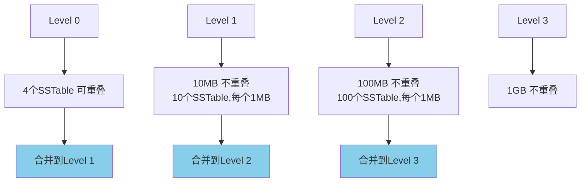

**核心特性**：

1. **Level 0**：可重叠（直接从 MemTable 刷盘）
2. **Level 1+**：不重叠（每层内的 SSTable 键范围不重叠）
3. **容量限制**：每层有容量上限
4. **合并策略**：只合并键范围重叠的 SSTable

**优缺点**：

| 方面     | 表现                          |
| -------- | ----------------------------- |
| 写放大   | ❌ 高（数据可能被多次重写）   |
| 读放大   | ✅ 低（每层最多查1个SSTable） |
| 空间放大 | ✅ 低（旧版本快速清理）       |

**适用场景**：读密集型工作负载（LevelDB, RocksDB）

### 两种策略对比

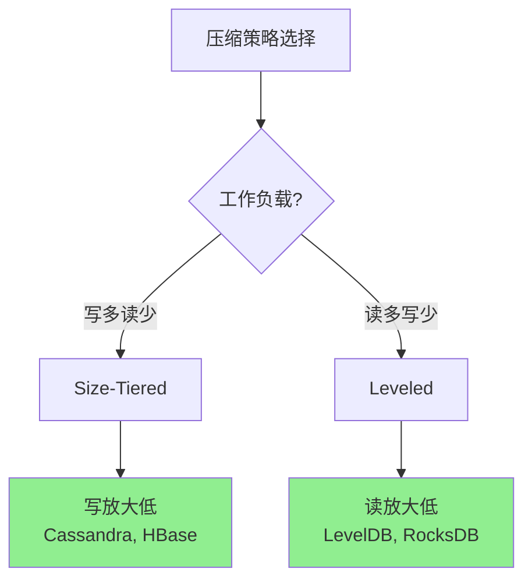

| 策略        | 写放大 | 读放大 | 空间放大 | 适用场景       |
| ----------- | ------ | ------ | -------- | -------------- |
| Size-Tiered | 低     | 高     | 高       | 日志、时序数据 |
| Leveled     | 高     | 低     | 低       | 事务型应用     |

---

## LSM-Tree 的优势与劣势

### 优势

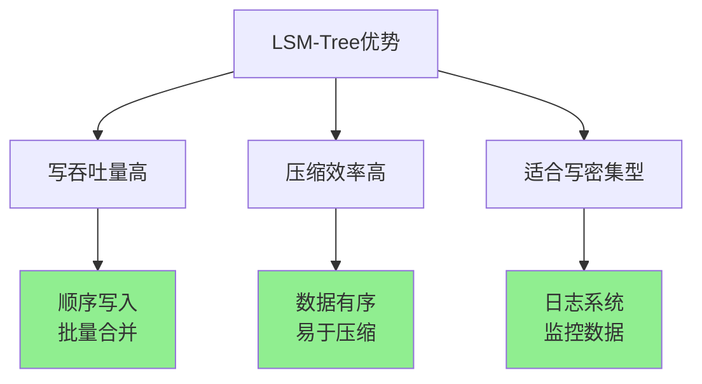

✅ **写吞吐量高**：

- 写入只需追加到 MemTable
- 批量刷盘，顺序 I/O
- HDD 顺序写 100MB/s vs 随机写 1MB/s（100x 差异！）

✅ **压缩效率高**：

- 数据有序，压缩率高
- 支持块级压缩（Snappy、LZ4）

✅ **适合写密集型**：

- 日志收集系统
- 时序数据库
- 监控指标存储

### 劣势

```mermaid
graph TB
    A[LSM-Tree劣势] --> B[读可能慢]
    A --> C[压缩开销]
    A --> D[写放大]

    B --> B1[需查找多个SSTable]
    C --> C1[后台压缩消耗CPU和I/O]
    D --> D1[数据可能被多次重写]

    style B1 fill:#FF6B6B
    style C1 fill:#FF6B6B
    style D1 fill:#FF6B6B
```

❌ **读可能慢**：

- 需要查找 MemTable + 多个 SSTable
- 虽然有 Bloom Filter 优化，但仍比 B-Tree 慢

❌ **压缩开销**：

- 后台压缩消耗 CPU 和磁盘 I/O
- 可能影响前台查询性能

❌ **写放大**：

- Leveled Compaction 可能导致数据被重写 10+ 次
- 影响 SSD 寿命

### 真实案例

**LevelDB**：

- Google 开发
- Chrome 浏览器存储 IndexedDB
- 单机嵌入式数据库

**RocksDB**：

- Facebook 基于 LevelDB 优化
- 支持多线程压缩
- 支持 Column Family

**Cassandra**：

- 分布式 NoSQL 数据库
- 使用 Size-Tiered Compaction
- 适合写密集型场景

**HBase**：

- Hadoop 生态系统
- 基于 HDFS
- 大数据场景

---

## B-Tree：最流行的索引结构

### 设计哲学

**核心思想**：将数据库分解成固定大小的**页（Page）**，通常 4KB。

```mermaid
graph TB
    A[数据库] --> B[Page 1 - 4KB]
    A --> C[Page 2 - 4KB]
    A --> D[Page 3 - 4KB]
    A --> E[Page N - 4KB]

    style B fill:#87CEEB
    style C fill:#87CEEB
    style D fill:#87CEEB
    style E fill:#87CEEB
```

**为什么是页？**

- 与操作系统页大小对齐（通常 4KB）
- 磁盘 I/O 单位是页
- 缓存以页为单位

### B-Tree 结构

```mermaid
graph TB
    Root["Root Page<br/>[10 | 20]"] --> L1["Page 1<br/>[3|5|7]"]
    Root --> L2["Page 2<br/>[12|15]"]
    Root --> L3["Page 3<br/>[25|30|35]"]

    L1 --> Leaf1["Leaf"]
    L1 --> Leaf2["Leaf"]
    L2 --> Leaf3["Leaf"]
    L3 --> Leaf4["Leaf"]

    style Root fill:#FFD700
    style L1 fill:#87CEEB
    style L2 fill:#87CEEB
    style L3 fill:#87CEEB
```

**查找示例（查找 12）**：

```
1. 读取根页: [10 | 20]
   10 < 12 < 20 → 走中间分支

2. 读取 Page 2: [12 | 15]
   找到 12

磁盘 I/O: 2 次
```

### 关键特性

#### 1. 平衡树

```mermaid
graph TB
    A[平衡树特性] --> B[所有叶子节点深度相同]
    A --> C[深度 = logₐn]

    B --> B1[查询性能稳定]
    C --> C1[b = 分支因子<br/>n = 键数量]

    style B1 fill:#90EE90
    style C1 fill:#87CEEB
```

**深度分析**：

```
分支因子 b = 100（4KB 页可容纳约 100 个键）

100 万个键:
深度 = log₁₀₀(1,000,000) ≈ 3 层
最多 3 次磁盘 I/O

10 亿个键:
深度 = log₁₀₀(1,000,000,000) ≈ 4-5 层
最多 5 次磁盘 I/O
```

**关键洞察**：B-Tree 深度增长极慢，即使数据量巨大，查询仍然很快！

#### 2. 原地更新

```mermaid
graph LR
    A[LSM-Tree] --> A1[追加写入<br/>后台压缩]
    B[B-Tree] --> B1[原地更新<br/>直接覆盖]

    style A1 fill:#87CEEB
    style B1 fill:#90EE90
```

**B-Tree 更新流程**：

```
1. 定位到叶页
2. 直接覆盖旧值
3. 写回磁盘
```

**与 LSM-Tree 对比**：

- LSM-Tree：追加写入，不覆盖旧值
- B-Tree：原地更新，覆盖旧值

#### 3. 范围查询高效

```mermaid
graph LR
    A[查询 key 从10到30] --> B[定位到10的叶页]
    B --> C[顺序扫描相邻叶页]
    C --> D[返回结果]

    style C fill:#90EE90
```

**范围查询流程**：

```sql
SELECT * FROM users WHERE age BETWEEN 20 AND 30;

1. B-Tree 定位到 age=20 的叶页
2. 顺序扫描叶页（叶页间有指针链接）
3. 直到 age > 30 停止
```

---

## B-Tree 的插入与分裂

### 正常插入

```
插入前: [3 | 7 | 12]
插入 5:  [3 | 5 | 7 | 12]  ← 直接插入，保持有序
```

### 页满时分裂

```mermaid
sequenceDiagram
    participant P as Parent Page
    participant C as Child Page (Full)
    participant N as New Page

    Note over C: 页满,最多3个键<br/>[3|5|7|9]

    C->>C: 插入6 → 需要分裂
    C->>N: 分裂成两页
    Note over C: [3|5|6]
    Note over N: [9]

    C->>P: 中间键7提升到父页
    Note over P: [7|10]
```

**分裂示例**：

```
插入前（页满,最多3个键）:
Parent:    [10]
            /  \
Child:  [3|5|7|9]  [12|15]

插入 6:
1. 叶页满，需要分裂
2. 分裂成两页: [3|5|6] 和 [9]
3. 中间键 7 提升到父页

插入后:
Parent:    [7 | 10]
          /   |   \
      [3|5|6] [9] [12|15]
```

### 递归分裂

```mermaid
graph TB
    A[叶页满] --> B[分裂叶页]
    B --> C{父页满?}
    C -->|是| D[分裂父页]
    C -->|否| E[插入完成]
    D --> F{祖父页满?}
    F -->|是| G[递归向上分裂]
    F -->|否| E

    style E fill:#90EE90
```

**关键点**：

- 分裂可能递归向上传播
- 最坏情况：根页分裂 → 树高度增加 1
- B-Tree 深度增长极慢（log 级别）

---

## B-Tree 的可靠性保障

### 问题 1：崩溃恢复

**场景**：

```
正在分裂页:
1. 写入新页
2. 更新父页指针  ← 如果在这里崩溃?
3. 释放旧页

结果: 数据库损坏!（父页指针指向无效位置）
```

**解决方案：Write-Ahead Log (WAL)**

```mermaid
sequenceDiagram
    participant A as 应用
    participant W as WAL日志
    participant B as B-Tree页

    A->>W: 1. 写入操作日志
    Note over W: "即将插入key=5,分裂页X"

    W->>B: 2. 执行操作
    Note over B: 修改B-Tree页

    B->>W: 3. 标记完成

    alt 崩溃恢复
        W->>B: 重放未完成操作
        Note over B: 根据WAL恢复一致性状态
    end
```

**WAL 工作原理**：

```
操作顺序:
1. 写 WAL: "即将插入 key=5, 分裂页 X"
2. 执行操作: 修改 B-Tree 页
3. WAL 标记完成

崩溃恢复:
扫描 WAL → 重放未完成操作 → 恢复一致性
```

**WAL 的作用**：

- 重做日志（Redo Log）- MySQL InnoDB
- 确保崩溃后数据不丢失
- 先写日志，再修改数据

### 问题 2：并发控制

**场景**：多个线程同时修改 B-Tree

**解决方案：Latches（轻量级锁）**

```mermaid
graph TB
    A[Latch类型] --> B[共享锁 Shared]
    A --> C[排他锁 Exclusive]

    B --> B1[读操作<br/>多个线程可同时持有]
    C --> C1[写操作<br/>只有一个线程持有]

    style B1 fill:#90EE90
    style C1 fill:#FFD700
```

**锁规则**：

| 操作 | 锁类型 | 规则         |
| ---- | ------ | ------------ |
| 读   | 共享锁 | 多个读可并发 |
| 写   | 排他锁 | 独占访问     |

**Latch Crabbing（锁蟹行）**：

```
从根到叶一路加锁:
1. 加锁父节点
2. 加锁子节点
3. 如果子节点安全（不会分裂），释放父节点锁
4. 继续向下
```

---

## B-Tree 优化技巧

### 1. 写时复制（Copy-on-Write）

```mermaid
graph TB
    A[修改页时] --> B[复制一份新页]
    B --> C[修改新页]
    C --> D[原子切换指针]

    E[优势] --> E1[无需WAL]
    E --> E2[天然支持快照隔离]

    style E1 fill:#90EE90
    style E2 fill:#90EE90
```

**工作流程**：

```
修改页时:
1. 复制旧页 → 新页
2. 在新页上修改
3. 原子切换父页指针（指向新页）
4. 旧页延后删除

优势:
- 无需 WAL（旧页仍保留）
- 支持 MVCC（多版本并发控制）
- 支持快照读取

示例: LMDB, BoltDB
```

### 2. 页内压缩

**前缀压缩**：

```
原始键:
"handlebars"
"handlebra"
"handlebar"

压缩后:
"handlebars"  （完整存储）
"-s+a"        （删除-s，添加+a）
"-a+r"        （删除-a，添加+r）

节省空间，每页可容纳更多键
```

### 3. 兄弟页指针

```mermaid
graph LR
    A["Leaf Page 1"] --> B["Leaf Page 2"]
    B --> C["Leaf Page 3"]

    style A fill:#87CEEB
    style B fill:#87CEEB
    style C fill:#87CEEB
```

**优势**：

- 范围查询不需要回到父页
- 顺序扫描更快

### 4. B+ Tree 变种

```mermaid
graph TB
    A[B-Tree vs B+ Tree] --> B[B-Tree]
    A --> C[B+ Tree]

    B --> B1[内部节点和叶节点都存数据]
    C --> C1[只有叶节点存数据<br/>内部节点只存键]

    C --> C2[优势:<br/>内部节点更小<br/>可缓存更多<br/>范围查询更快]

    style C2 fill:#90EE90
```

**B+ Tree 优势**：

- 内部节点更小（不存数据），可缓存更多
- 范围查询更快（叶节点链表）
- **MySQL InnoDB 使用 B+ Tree**

---

## LSM-Tree vs B-Tree 对比

### 性能对比表

| 维度               | LSM-Tree               | B-Tree                |
| ------------------ | ---------------------- | --------------------- |
| **写性能**   | ✅ 高（顺序写）        | ❌ 低（随机写 + WAL） |
| **读性能**   | ❌ 慢（多个 SSTable）  | ✅ 快（直接定位）     |
| **范围查询** | ❌ 较慢                | ✅ 快（顺序扫描）     |
| **空间放大** | 中等（取决于压缩策略） | 低（页内碎片）        |
| **写放大**   | 高（多次压缩）         | 中等（WAL + 页更新）  |

### 写放大分析

```mermaid
graph TB
    A[写放大对比] --> B[B-Tree]
    A --> C[LSM-Tree]

    B --> B1["写入1个键值对100字节:<br/>1. 写WAL: 100字节<br/>2. 写B-Tree页: 4KB<br/>3. 可能分裂: 再写4KB<br/><br/>写放大 = 8KB/100字节 = 80x"]

    C --> C1["写入1个键值对100字节:<br/>1. 写MemTable: 100字节<br/>2. 刷盘SSTable: 4MB<br/>3. 压缩5次 Leveled<br/><br/>写放大 = 5倍以上"]

    style B1 fill:#FFD700
    style C1 fill:#FF6B6B
```

**但 LSM-Tree 是顺序写，B-Tree 是随机写**：

- HDD：顺序写 100MB/s vs 随机写 1MB/s（**100x 差异！**）
- SSD：顺序写仍快于随机写

### 选择决策树

```mermaid
graph TD
    A[选择存储引擎] --> B{工作负载?}

    B -->|写密集| C[LSM-Tree]
    C --> C1[日志收集 Elasticsearch<br/>时序数据 InfluxDB<br/>高写入吞吐量]

    B -->|读密集| D[B-Tree]
    D --> D1[事务型数据库 MySQL<br/>PostgreSQL<br/>范围查询频繁]

    B -->|混合| E[根据具体场景]
    E --> E1[TiDB: LSM-Tree存储<br/>+ B-Tree索引<br/>MyRocks: MySQL + RocksDB]

    style C1 fill:#87CEEB
    style D1 fill:#90EE90
    style E1 fill:#FFD700
```

---

## 其他索引结构

### 聚簇索引 vs 非聚簇索引

#### 聚簇索引（Clustered Index）

```mermaid
graph TB
    Root["Root"] --> L1["Leaf 1<br/>完整行数据"]
    Root --> L2["Leaf 2<br/>完整行数据"]

    L1 --> Data1["id=1, name='Alice'<br/>email='alice@example.com'"]
    L2 --> Data2["id=5, name='Bob'<br/>email='bob@example.com'"]

    style Data1 fill:#90EE90
    style Data2 fill:#90EE90
```

**特点**：

- B-Tree 叶节点直接存储完整行数据
- 主键即数据存储顺序
- 查询主键不需要额外 I/O

**优势**：

- ✅ 主键查询极快
- ✅ 范围查询高效

**劣势**：

- ❌ 二级索引需要存储主键（占空间）
- ❌ 每个表只能有一个聚簇索引

**示例**：MySQL InnoDB 主键索引

#### 非聚簇索引（Secondary Index）

```mermaid
graph TB
    Root["Root"] --> L1["Leaf 1"]
    Root --> L2["Leaf 2"]

    L1 --> Ptr1["'Alice' → RowID=1"]
    L2 --> Ptr2["'Bob' → RowID=5"]

    Ptr1 --> Row1["Heap File Row 1<br/>完整数据"]
    Ptr2 --> Row2["Heap File Row 5<br/>完整数据"]

    style Ptr1 fill:#FFD700
    style Ptr2 fill:#FFD700
```

**特点**：

- B-Tree 叶节点存储指针（行号或主键）
- 需要**回表查询**（额外 I/O）

**示例**：MySQL InnoDB 非主键索引指向主键

#### 覆盖索引（Covering Index）

```sql
CREATE INDEX idx_name_age ON users(name, age);

SELECT name, age FROM users WHERE name = 'Alice';
-- ↑ 无需回表，直接从索引返回！
```

**优势**：

- ✅ 避免回表查询
- ✅ 减少磁盘 I/O

---

## 全文搜索索引

### 倒排索引（Inverted Index）

```mermaid
graph LR
    A[文档] --> A1["Doc1: the quick brown fox"]
    A --> A2["Doc2: the fox jumped"]

    B[倒排索引] --> B1["brown → Doc1"]
    B --> B2["fox → Doc1, Doc2"]
    B --> B3["jumped → Doc2"]
    B --> B4["quick → Doc1"]

    style B fill:#FFD700
```

**查询 "fox jumped"**：

```
1. 查找 "fox" → [Doc1, Doc2]
2. 查找 "jumped" → [Doc2]
3. 交集 → [Doc2]
```

**优化：位置信息**

```
"fox" → [(Doc1, pos=3), (Doc2, pos=1)]
"jumped" → [(Doc2, pos=2)]

短语查询 "fox jumped"（相邻词）:
Doc2 中 "fox" 在位置 1，"jumped" 在位置 2 → 匹配！
```

**示例**：

- Elasticsearch, Solr（基于 Lucene）
- MongoDB 全文索引

---

## OLTP vs OLAP

### 两种工作负载

```mermaid
graph TB
    A[数据库工作负载] --> B[OLTP]
    A --> C[OLAP]

    B --> B1[特点:<br/>小批量读写<br/>低延迟 毫秒级<br/>随机访问<br/>用户请求驱动]

    C --> C1[特点:<br/>大批量读取<br/>高吞吐量<br/>顺序扫描<br/>分析师查询驱动]

    B --> B2[示例:<br/>电商下单<br/>银行转账<br/>用户登录]

    C --> C2[示例:<br/>销售报表<br/>用户行为分析<br/>数据挖掘]

    style B1 fill:#87CEEB
    style C1 fill:#90EE90
```

**对比表**：

| 维度             | OLTP                 | OLAP              |
| ---------------- | -------------------- | ----------------- |
| **读模式** | 少量行，根据键查询   | 大量行聚合        |
| **写模式** | 随机写入，低延迟     | 批量导入（ETL）   |
| **用户**   | 终端用户（Web 应用） | 分析师（BI 工具） |
| **数据量** | GB ~ TB              | TB ~ PB           |
| **索引**   | B-Tree, LSM-Tree     | 列存储，位图索引  |

### 数据仓库（Data Warehouse）

**问题**：在 OLTP 数据库上跑分析查询会怎样？

**后果**：

- 扫描大量数据，锁表
- 拖慢交易处理
- 影响用户体验

**解决方案：分离存储**

```mermaid
graph LR
    A[OLTP数据库] --> B[ETL]
    B --> C[数据仓库 OLAP]

    B --> B1["Extract: 提取数据<br/>Transform: 转换格式<br/>Load: 加载到仓库"]

    style C fill:#90EE90
```

**星型模式（Star Schema）**：

```
事实表（Fact Table）:
sales (sale_id, product_id, store_id, date_id, amount)

维度表（Dimension Tables）:
products (product_id, name, category)
stores (store_id, name, city)
dates (date_id, year, month, day)
```

---

## 列式存储

### 为什么需要列存储？

**分析查询特点**：

```sql
SELECT SUM(sales.amount)
FROM sales
WHERE sales.date >= '2024-01-01';
```

- 只需要 `amount` 和 `date` 两列
- 但行存储要读取整行！

### 行存储 vs 列存储

```mermaid
graph TB
    A[行存储] --> A1["Row1: id=1,date=2024-01-01,product_id=10,amount=100<br/>Row2: id=2,date=2024-01-02,product_id=20,amount=200"]
    A1 --> A2[读取100万行:<br/>需要读取所有列 → 浪费I/O!]

    B[列存储] --> B1["id列: 1,2,3,...<br/>date列: 2024-01-01,2024-01-02,...<br/>amount列: 100,200,150,..."]
    B1 --> B2[读取100万行的amount:<br/>只读取amount列 → 节省I/O!]

    style A2 fill:#FF6B6B
    style B2 fill:#90EE90
```

**性能提升**：

```
示例：100 列，只查询 3 列
行存储：读取 100 列
列存储：读取 3 列
I/O 减少 97%！
```

### 列压缩

**Bitmap Encoding（位图编码）**：

```
原始数据（product_id 列）:
[10, 20, 10, 10, 30, 20, 10]

编码:
product_id=10: [1, 0, 1, 1, 0, 0, 1]
product_id=20: [0, 1, 0, 0, 0, 1, 0]
product_id=30: [0, 0, 0, 0, 1, 0, 0]

查询 product_id IN (10, 20):
bitmap_10 OR bitmap_20 = [1, 1, 1, 1, 0, 1, 1]

CPU 可以直接对位图做位运算！
```

**Run-Length Encoding（游程编码）**：

```
原始位图:
[1, 1, 1, 1, 0, 0, 0, 1, 1]

压缩:
1×4, 0×3, 1×2

大量连续重复值时极致压缩！
```

**压缩比**：

- 典型数据仓库：10:1 ~ 100:1 压缩比
- 更少 I/O，更快查询！

---

## 关键洞察总结

1. **没有万能的存储引擎**

   - LSM-Tree：写优化，适合日志和时序数据
   - B-Tree：读优化，适合事务型数据库
2. **索引是查询性能的关键**

   - 但索引不是免费的（写放大，空间占用）
   - 需要根据查询模式选择
3. **OLTP 和 OLAP 需要不同存储**

   - OLTP：行存储 + B-Tree
   - OLAP：列存储 + 压缩
4. **顺序 I/O 是性能关键**

   - LSM-Tree 通过顺序写提升性能
   - 列存储通过批量读提升性能
5. **压缩可以大幅提升性能**

   - 减少 I/O
   - 更好利用 CPU 缓存

---

## 延伸阅读

### 经典论文

**LSM-Tree**:

- [The Log-Structured Merge-Tree (LSM-Tree)](https://www.cs.umb.edu/~poneil/lsmtree.pdf) - O'Neil et al., 1996

**B-Tree**:

- [The Ubiquitous B-Tree](https://dl.acm.org/doi/10.1145/356770.356776) - Comer, 1979
- [Organization and Maintenance of Large Ordered Indices](https://infolab.usc.edu/csci585/Spring2010/den_ar/indexing.pdf) - Bayer & McCreight, 1970

**列存储**:

- [C-Store: A Column-oriented DBMS](http://db.csail.mit.edu/projects/cstore/vldb.pdf) - Stonebraker et al., 2005
- [Dremel: Interactive Analysis of Web-Scale Datasets](https://static.googleusercontent.com/media/research.google.com/en//pubs/archive/36632.pdf) - Google, 2010

### 技术文章

**LSM-Tree 深度解析**:

- [LSM Trees: The Go-To Data Structure](https://tikv.org/deep-dive/key-value-engine/b-tree-vs-lsm/)
- [RocksDB Wiki](https://github.com/facebook/rocksdb/wiki)
- [LevelDB Implementation Notes](https://github.com/google/leveldb/blob/main/doc/impl.md)

**B-Tree 实现**:

- [SQLite B-Tree Module](https://www.sqlite.org/btreemodule.html)
- [PostgreSQL B-Tree Index](https://www.postgresql.org/docs/current/btree-implementation.html)
- [InnoDB B+Tree Index](https://dev.mysql.com/doc/refman/8.0/en/innodb-physical-structure.html)

### 开源项目源码

**LSM-Tree 实现**:

- [RocksDB](https://github.com/facebook/rocksdb) - Facebook, C++
- [LevelDB](https://github.com/google/leveldb) - Google, C++
- [BadgerDB](https://github.com/dgraph-io/badger) - Go 实现

**B-Tree 实现**:

- [BoltDB](https://github.com/boltdb/bolt) - Go, B+Tree, Copy-on-Write
- [LMDB](https://github.com/LMDB/lmdb) - C, B+Tree, Memory-Mapped

**列存储**:

- [Apache Parquet](https://github.com/apache/parquet-format)
- [ClickHouse](https://github.com/ClickHouse/ClickHouse) - 列存储 OLAP 数据库

---

## 实践练习

### 练习 1：实现简单 LSM-Tree

**任务**：用 Go/Python 实现一个简化版 LSM-Tree

**要求**：

1. 内存 MemTable（使用跳表或红黑树）
2. SSTable 文件格式（键有序）
3. 合并压缩逻辑
4. Bloom Filter 优化

### 练习 2：B-Tree 插入模拟

**任务**：手动模拟 B-Tree 插入过程

**场景**：

- B-Tree 阶数 = 3（每个节点最多 2 个键）
- 依次插入：10, 20, 5, 6, 12, 30, 7, 17

### 练习 3：列存储性能对比

**任务**：对比行存储和列存储的查询性能

**工具**：Python + Pandas + PyArrow

---

## 核心要点

**存储引擎选择**：

- 写多读少 → LSM-Tree
- 读多写少 → B-Tree
- 分析查询 → 列存储

**索引设计**：

- 根据查询模式建立索引
- 考虑写放大和空间占用
- 使用覆盖索引减少回表

**性能优化**：

- 顺序 I/O 优于随机 I/O
- 压缩减少 I/O
- 批量操作提升吞吐量
