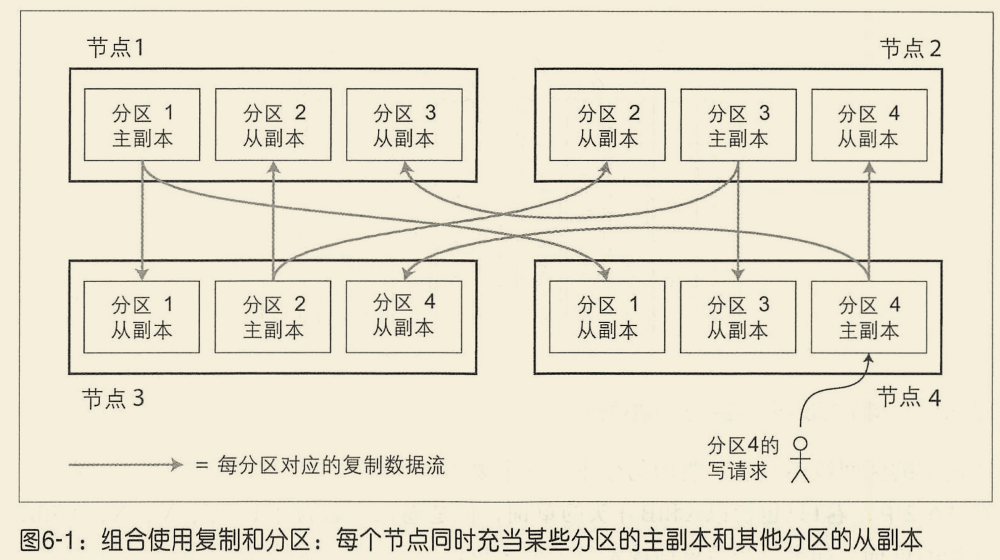
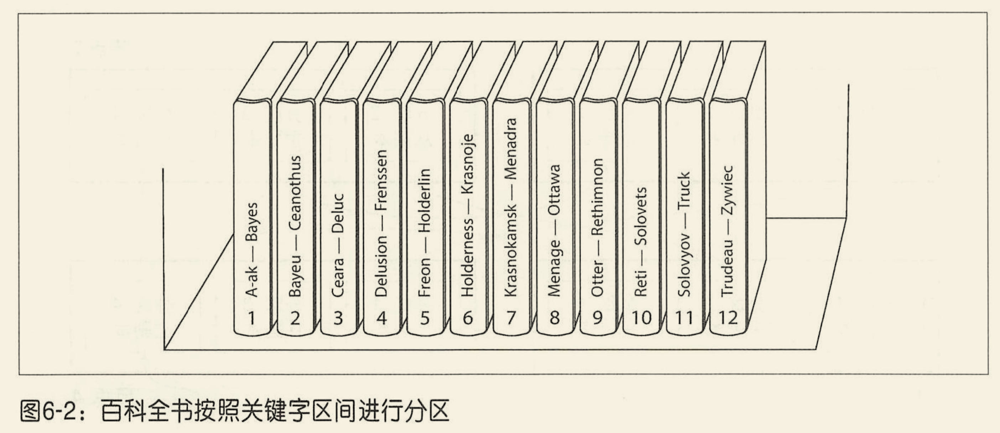
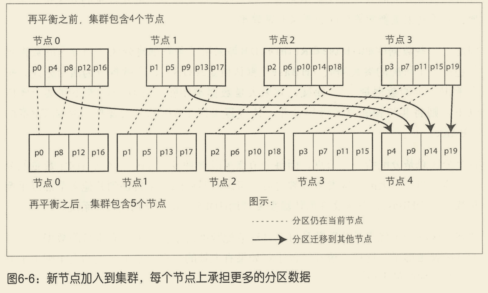
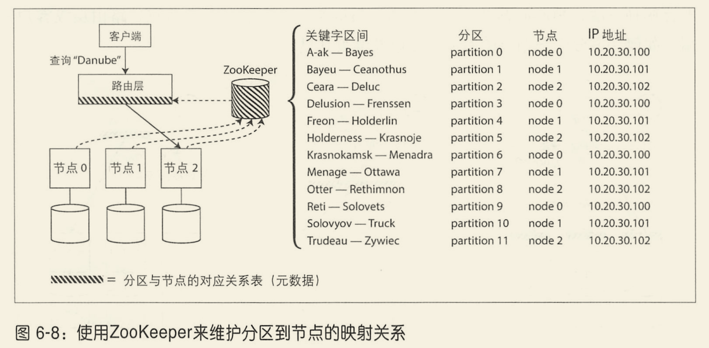

# Ch06 数据分区

**背景**: 面对海量数据集或者非常高的查询压力, 我们需要将数据拆分成分区。

**定义**: 每一条数据（或者每条记录，每行或每个文档）只属于某个特定分区。

**目的**: 提高可扩展性。可以将一个大数据集分散到更多的磁盘上，查询负载也随之分布到更多的处理器上。

**本章节讨论的内容**

- 介绍切分大型数据集的方法, 讨论数据索引如何影响分区;
- 分区再平衡;
- 数据库如何将请求路由到正确的分区并执行查询。

## 数据分区与数据复制

分区通常与复制结合使用，即每个分区在多个节点都存有副本。这意味着某条记录属于特定的分区，而同样的内容会保存在不同的节点上以提高系统的容错性。



## 键-值数据的分区

**分区的主要目标是将数据和查询负载均匀分布在所有节点上。** 如果分区不均匀，则会出现某些分区节点比其他分区承担更多的数据量或查询负载，称之为倾斜。倾斜会导致分区效率严重下降，这种负载严重不成比例的分区即成为系统热点。

避免热点最简单的方怯是将记录随机分配给所有节点上。但是有一个很大的缺点：**当试图读取特定的数据时，没有办陆知道数据保存在哪个节点上，所以不得不井行查询所有节点。**

我们可以通过假设数据是简单的键-值模型来改进上述方法，这意味着我们可以通过关键字来访问数据记录。

### 基于关键字区间分区

我们可以像百科全书的卷目录一样为**每个分区分配一段连续的关键字或者关键字区间范围**。



关键字的区间段不一定非要均匀分布，这主要是因为数据本身可能就不均匀。

每个分区内可以按照关键字排序保存。这样可以轻松支持区间查询，即将关键字作为一个拼接起来的索引项从而一次查询得到多个相关记录。

基于关键字的区间分区的缺点是**某些访问模式会导致热点。** 例如将时间戳作为关键字，按照每天一个分区，那么在当天的写入操作都会写入当天的分区中，导致其余分区的负载低。

为了避免以上的问题，需要在关键字的前面使用其他内容作为关键字的第一项，例如名称等。这样首先通过名称，然后再通过时间戳就可以将写入负载分布到多个节点上。

### 基于关键字哈希值分区

一个好的哈希函数可以处理数据倾斜并使其均匀分布。这得益于哈希函数的性质，即使是微小的变化哈希函数的值也会完全不同。

然而，通过关键字哈希进行分区，我们丧失了良好的区间查询特性。即使关键字相邻，但经过哈希之后会分散在不同的分区中，区间查询就失去了原有的有序相邻的特性。

### 负载倾斜与热点

基于哈希的分区方法可以减轻热点，但是没有办法完全避免。一个极端情况是所有的写入操作都是针对同一个关键字，这样所有的请求都会被路由到同一个分区。

目前大多数系统仍然无法自动消除这种高度倾斜的负载，只能通过应用层策略来减轻倾斜程度。

## 分区与二级索引

基于键值模型来进行分区涉及到二级索引时，情况会变得复杂。因为数据是按照主键关键字分区的，二级索引分散在所有分区上。例如执行以下的查询:
```sql
select * from table where email = 'tmp@email.com';
```

**二级索引带来的主要挑战是它们不能规整的地映射到分区中。** 有两种主要的方法来支持对二级索引进行分区：基于文档的分区和基于词条的分区。

### 基于文档分区的二级索引

**也称为**: 本地索引（Local Index）

**核心思想**: 每个分区维护自己的二级索引，这个索引只索引该分区内的文档。

#### 实例说明

假设我们有一个汽车销售网站的数据库，按照`car_id`（文档ID）进行分区：

**分区0**:
```
car_id=0: {color: "red", make: "Honda"}
car_id=3: {color: "red", make: "Toyota"}
car_id=6: {color: "blue", make: "Honda"}
```

**分区1**:
```
car_id=1: {color: "yellow", make: "Toyota"}
car_id=4: {color: "red", make: "BMW"}
car_id=7: {color: "blue", make: "BMW"}
```

**分区2**:
```
car_id=2: {color: "blue", make: "Honda"}
car_id=5: {color: "yellow", make: "Honda"}
car_id=8: {color: "red", make: "Toyota"}
```

#### 本地索引结构

每个分区都维护自己的`color`和`make`二级索引：

**分区0的本地索引**:
```
color索引:
  red → [car_id=0, car_id=3]
  blue → [car_id=6]

make索引:
  Honda → [car_id=0, car_id=6]
  Toyota → [car_id=3]
```

**分区1的本地索引**:
```
color索引:
  red → [car_id=4]
  yellow → [car_id=1]
  blue → [car_id=7]

make索引:
  Toyota → [car_id=1]
  BMW → [car_id=4, car_id=7]
```

**分区2的本地索引**:
```
color索引:
  red → [car_id=8]
  blue → [car_id=2]
  yellow → [car_id=5]

make索引:
  Honda → [car_id=2, car_id=5]
  Toyota → [car_id=8]
```

#### 查询过程（关键点！）

当查询 `SELECT * FROM cars WHERE color = 'red'` 时：

1. **问题**: 不知道红色的车在哪个分区，因为数据是按`car_id`分区的，不是按`color`分区的
2. **解决方案**: 必须向**所有分区**发送查询请求（scatter-gather模式）
3. **执行流程**:
   ```
   协调节点 → 分区0: 查询color='red' → 返回 [car_id=0, 3]
   协调节点 → 分区1: 查询color='red' → 返回 [car_id=4]
   协调节点 → 分区2: 查询color='red' → 返回 [car_id=8]

   协调节点汇总: [0, 3, 4, 8]
   ```

#### 为什么叫"基于文档的分区"？

因为每个分区的索引**只包含该分区内的文档**（记录），索引和文档存储在一起。

#### 优点

✅ **写入高效**: 写入一个文档时，只需要更新**一个分区**的索引
- 例如: 插入 `car_id=9: {color: "red", make: "Honda"}`
- 计算分区: `9 % 3 = 0`，只需更新分区0的索引
- 不需要跨分区协调

✅ **实现简单**: 每个分区独立维护索引，不需要分布式协调

#### 缺点

❌ **读取需要scatter-gather**: 按二级索引查询时，必须查询**所有分区**
- 查询 `WHERE color = 'red'` 需要访问所有3个分区
- 即使结果只有几条记录，也要查所有分区

❌ **尾延迟问题**: 整体查询时间取决于**最慢的那个分区**
- 即使2个分区在10ms内返回，如果第3个分区需要100ms，总延迟就是100ms

❌ **网络开销大**: 需要N次网络往返（N=分区数）

#### 实际应用

这种方法被许多数据库使用：
- **MongoDB**: 每个分片维护自己的索引
- **Riak**: 每个节点的本地索引
- **Cassandra**: 每个分区的本地二级索引
- **Elasticsearch**: 每个分片的倒排索引
- **VoltDB**: 分区内的索引

#### 使用场景

适合以下情况：
- ✅ 写操作频繁
- ✅ 主要通过主键查询，二级索引查询较少
- ✅ 可以接受二级索引查询的延迟
- ✅ 分区数量不是特别多（否则scatter-gather开销太大）

#### 图示

```
查询: WHERE color = 'red'

          [协调节点]
          /    |    \
         /     |     \
    分区0    分区1   分区2
    查color  查color  查color
     ↓       ↓        ↓
   [0,3]    [4]      [8]
     \       |        /
      \      |       /
       [汇总: 0,3,4,8]
```

#### 关键理解

**本地索引 = 每个分区独立索引自己的数据**

这就像每个城市的图书馆都有自己的书目索引，但只索引本馆的书。如果你想找一本书但不知道在哪个馆，就得问所有图书馆。

相比之下，下一节的"基于词条分区的二级索引"就像有一个**全国统一的书目索引**，但这个索引本身也需要分布式存储。

### 基于词条的二级索引分区

**也称为**: 全局索引（Global Index）

**核心思想**: 构建一个覆盖所有分区数据的全局索引，然后将这个索引本身也进行分区。

#### 实例说明

继续使用前面的汽车销售数据库，但这次我们构建**全局的**二级索引。

**主数据分区（按car_id哈希）**:

```
分区0 (car_id % 3 = 0):
  car_id=0: {color: "red", make: "Honda"}
  car_id=3: {color: "red", make: "Toyota"}
  car_id=6: {color: "blue", make: "Honda"}

分区1 (car_id % 3 = 1):
  car_id=1: {color: "yellow", make: "Toyota"}
  car_id=4: {color: "red", make: "BMW"}
  car_id=7: {color: "blue", make: "BMW"}

分区2 (car_id % 3 = 2):
  car_id=2: {color: "blue", make: "Honda"}
  car_id=5: {color: "yellow", make: "Honda"}
  car_id=8: {color: "red", make: "Toyota"}
```

**全局color索引分区（按color首字母分区）**:

现在我们把color索引本身也进行分区，比如按照颜色首字母：

```
索引分区A (color: b-r):
  blue → [car_id=2, 6, 7]
  red → [car_id=0, 3, 4, 8]

索引分区B (color: y-z):
  yellow → [car_id=1, 5]
```

或者按照color哈希分区：

```
索引分区A (hash(color) % 2 = 0):
  red → [car_id=0, 3, 4, 8]
  yellow → [car_id=1, 5]

索引分区B (hash(color) % 2 = 1):
  blue → [car_id=2, 6, 7]
```

**全局make索引分区（按make首字母分区）**:

```
索引分区A (make: a-h):
  BMW → [car_id=4, 7]

索引分区B (make: h-t):
  Honda → [car_id=0, 2, 5, 6]

索引分区C (make: t-z):
  Toyota → [car_id=1, 3, 8]
```

#### 关键点：索引和数据分离

**重要**: 注意索引分区和主数据分区是**完全独立**的！

- 主数据按`car_id`分区（分区0, 1, 2）
- color索引按`color`分区（索引分区A, B）
- make索引按`make`分区（索引分区A, B, C）

它们可以在**不同的节点**上！

#### 查询过程（关键点！）

查询 `SELECT * FROM cars WHERE color = 'red'`:

**步骤1: 查询索引分区**
```
1. 计算red应该在哪个索引分区
   - 如果按首字母: 'r' → 索引分区A
   - 如果按哈希: hash('red') % 2 = 0 → 索引分区A

2. 只查询索引分区A
   索引分区A: red → [car_id=0, 3, 4, 8]
```

**步骤2: 根据car_id查询主数据**
```
3. car_id=0 → 主数据分区0 (0 % 3 = 0)
4. car_id=3 → 主数据分区0 (3 % 3 = 0)
5. car_id=4 → 主数据分区1 (4 % 3 = 1)
6. car_id=8 → 主数据分区2 (8 % 3 = 2)

7. 汇总结果
```

**对比本地索引**:
- 本地索引需要查询**所有3个主数据分区**
- 全局索引只需要查询**1个索引分区** + 对应的主数据分区

#### 为什么叫"基于词条的分区"？

因为索引是按照**词条**（term，即索引的键，如'red'、'blue'）来分区的，而不是按照文档ID。

**词条** = 索引中的值（颜色名、品牌名等）

#### 图示

```
查询: WHERE color = 'red'

步骤1: 查索引
          [协调节点]
               ↓
          hash('red') % 2 = 0
               ↓
         [索引分区A]
               ↓
      red → [0, 3, 4, 8]

步骤2: 查数据
         [协调节点]
        /    |    |   \
       /     |    |    \
   分区0   分区0  分区1  分区2
   (id=0)  (id=3) (id=4) (id=8)
      \      |     |     /
       \     |     |    /
        [汇总结果]
```

#### 写入过程（关键！）

这是全局索引最复杂的部分。

**写入一条新记录**: `car_id=9: {color: "red", make: "Honda"}`

```
步骤1: 计算主数据分区
  9 % 3 = 0 → 写入主数据分区0

步骤2: 更新color索引
  - 计算索引分区: hash('red') % 2 = 0 → 索引分区A
  - 更新索引分区A: red → [..., 9]

步骤3: 更新make索引
  - 计算索引分区: 'Honda' → 索引分区B (h-t)
  - 更新索引分区B: Honda → [..., 9]

总共需要写入3个分区:
  - 主数据分区0
  - color索引分区A
  - make索引分区B
```

**问题**: 这是一个**分布式事务**！需要保证一致性。

#### 优点

✅ **读取高效**: 查询时只需访问**相关的索引分区**，而不是所有分区
- 查询 `WHERE color = 'red'` 只需查1个索引分区（而不是所有主数据分区）
- 避免了scatter-gather

✅ **支持高效的范围查询**: 如果索引按范围分区
- 例如: `WHERE make BETWEEN 'A' AND 'H'` 只查索引分区A

✅ **查询延迟低**: 不受尾延迟影响（不需要等所有分区）

#### 缺点

❌ **写入复杂**: 一次写入可能需要更新**多个分区**
- 写入一条记录需要：
  - 写主数据分区（1个）
  - 更新color索引分区（1个）
  - 更新make索引分区（1个）
  - 如果有N个二级索引，需要写N+1个分区

❌ **写入慢**: 涉及分布式事务或异步更新
- 同步更新：需要分布式事务，性能差
- 异步更新：索引可能滞后，一致性弱

❌ **一致性问题**: 索引更新通常是**异步**的
- 刚写入的数据可能查询不到（索引还没更新）
- 最终一致性模型

❌ **实现复杂**: 需要处理跨分区写入、故障恢复等

#### 异步索引更新

由于分布式事务开销大，大多数使用全局索引的系统采用**异步更新**：

```
时间线:
T=0: 写入 car_id=9 到主数据分区0 → 成功返回给客户端
T=1: 异步更新 color索引分区A (后台任务)
T=2: 异步更新 make索引分区B (后台任务)

T=0.5: 此时查询 WHERE color='red'
       → 可能查不到car_id=9 (索引还没更新)

T=3: 索引全部更新完成
     → 现在查询能找到car_id=9了
```

**权衡**:
- ✅ 写入快（不等索引更新完成）
- ❌ 读一致性弱（可能读不到刚写入的数据）

#### 实际应用

使用全局索引的系统：

- **Amazon DynamoDB**: Global Secondary Index (GSI)
  - 异步更新，最终一致性
  - 读快写慢

- **Riak 搜索功能**:
  - 基于Solr的全局索引
  - 异步更新

- **Oracle 数据库**: Global Index
  - 用于分区表

#### 使用场景

适合以下情况：
- ✅ 读操作频繁（读多写少）
- ✅ 需要高效的二级索引查询
- ✅ 可以接受索引的短暂延迟（最终一致性）
- ✅ 写入不是性能瓶颈

#### 对比图：本地索引 vs 全局索引

**读取 WHERE color='red'**:

```
本地索引:
  查询 → [分区0 + 分区1 + 分区2] → 汇总
  网络请求: 3次

全局索引:
  查询 → [索引分区A] → 得到ID列表 → [查对应的主数据分区]
  网络请求: 1次索引 + N次数据（N=结果数量）
```

**写入新记录**:

```
本地索引:
  写入 → [分区0的数据和索引]
  网络请求: 1次

全局索引:
  写入 → [分区0的数据] + [索引分区A] + [索引分区B]
  网络请求: 3次（或异步）
```

---

## 两种二级索引方案总结对比

### 核心区别

| 维度 | 本地索引 (Local Index) | 全局索引 (Global Index) |
|------|------------------------|-------------------------|
| **别名** | 基于文档的分区、scatter-gather | 基于词条的分区 |
| **索引范围** | 每个分区只索引自己的数据 | 一个索引覆盖所有分区的数据 |
| **索引位置** | 索引和数据在同一分区 | 索引和数据可以在不同节点 |
| **索引分区** | 按主键分区（跟随数据） | 按索引键（词条）分区 |

### 性能对比

| 操作 | 本地索引 | 全局索引 |
|------|----------|----------|
| **按主键查询** | ✅ 快（1个分区） | ✅ 快（1个分区） |
| **按二级索引查询** | ❌ 慢（查所有分区） | ✅ 快（查1个索引分区） |
| **写入单条记录** | ✅ 快（写1个分区） | ❌ 慢（写多个分区） |
| **批量写入** | ✅ 快 | ❌ 慢 |
| **范围查询** | ❌ 慢（scatter-gather） | ✅ 快（如果索引按范围分区） |

### 一致性对比

| 特性 | 本地索引 | 全局索引 |
|------|----------|----------|
| **读一致性** | ✅ 强一致性 | ⚠️ 最终一致性（异步更新） |
| **写一致性** | ✅ 单分区事务 | ❌ 需要分布式事务或异步 |
| **延迟** | 高（尾延迟） | 低 |

### 实现复杂度

| 方面 | 本地索引 | 全局索引 |
|------|----------|----------|
| **实现难度** | ✅ 简单 | ❌ 复杂 |
| **分布式协调** | ❌ 不需要 | ✅ 需要 |
| **故障处理** | ✅ 简单 | ❌ 复杂 |

### 适用场景

**本地索引适合**:
- ✅ 写操作频繁（写多读少）
- ✅ 主要通过主键查询
- ✅ 二级索引查询不频繁
- ✅ 可以接受查询延迟
- ✅ 需要强一致性

**全局索引适合**:
- ✅ 读操作频繁（读多写少）
- ✅ 大量二级索引查询
- ✅ 需要快速查询
- ✅ 可以接受最终一致性
- ✅ 写入不是瓶颈

### 实际系统选择

| 数据库系统 | 使用方案 | 特点 |
|-----------|---------|------|
| **MongoDB** | 本地索引 | 每个分片独立索引 |
| **Cassandra** | 本地索引 | 二级索引查询慢 |
| **Elasticsearch** | 本地索引 | 每个分片的倒排索引 |
| **DynamoDB** | 全局索引(GSI) | 异步更新，最终一致性 |
| **Riak** | 两者都支持 | Search功能用全局索引 |

### 形象类比

**本地索引** = 每个城市图书馆独立的书目索引
- 优点: 添加新书很快（只更新本馆索引）
- 缺点: 找书要问所有图书馆

**全局索引** = 全国统一的图书目录系统
- 优点: 找书很快（查统一目录）
- 缺点: 添加新书要同步更新全国目录

### 混合方案

实际生产环境中，常常**混合使用**：

```
主数据库 (MySQL/PostgreSQL):
  - 按主键分区
  - 使用本地索引（如果有）
  - 保证强一致性

搜索引擎 (Elasticsearch):
  - 全局索引
  - 异步同步数据
  - 快速全文搜索

缓存层 (Redis):
  - 缓存热点数据
  - 缓存索引查询结果
```

这样可以发挥各自优势：
- 主数据库保证一致性
- 搜索引擎提供快速查询
- 缓存提升性能

### 关键takeaway

1. **没有完美方案**: 两种方案都是权衡的结果
2. **读写矛盾**: 优化读取会牺牲写入，反之亦然
3. **理解场景**: 根据业务特点选择合适方案
4. **混合架构**: 实际系统常用多种技术组合

## 分区再平衡

数据库的变化要求数据和请求可以从一个节点转移到另一个节点，这个过程称为**再平衡**。

分区再平衡至少要满足:
- 平衡之后，负载、数据存储、读写请求等应该在集群范围更均匀地分布；
- 再平衡执行过程中，数据库应该可以继续正常提供读写服务；
- 避免不必要的负载迁移，以加快动态再平衡，尽量减少网络和磁盘I/O影响。

### 动态再平衡的策略

#### 固定数量的分区

1. 创建远超实际节点数的分区数，然后为每个节点分配多个分区;
2. 如果集群中添加了一个新节点，该新节点可以从每个现有的节点上匀走几个分区，直到分区再次达到全局平衡.

选中的整个分区会在节点之间迁移，但分区的总数量仍维持不变，也不会改变关键字到分区的映射关系。这里唯一要调整的是分区与节点的对应关系。



使用该策略时，分区的数量往往在数据库创建时就确定好，之后不会改变。原则上也可以拆分和合并分区（稍后介绍），但固定数量的分区使得相关操作非常简单，因此许多采用固定分区策略的数据库决定不支持分区拆分功能。

#### 动态分区

对于采用关键字区间分区的数据库，如果边界设置有问题则很容易存在数据分区不均衡的问题。因此一些数据库采用了动态创建分区，即**当分区的数据增长超过一个可配的参数阈值时，就拆分成两个分区，每个分区承担一半的数据量；反之则合并。**

动态分区的一个优点是分区数量可以自动适配数据总量。缺点就是最开始数据集比较小时，可能所有的操作都由一个单一节点完成。

#### 按节点比例分区

以上两种分区方法都和节点数量无关。某些数据库采用了第三种方式：是分区数与集群节点数成正比关系。

当一个新节点加入集群时，它随机选择固定数量的现有分区进行分裂，然后拿走这些分区的一半数据量，将另一半数据留在原节点。

随机选择分区边界的前提要求采用基于哈希分区（可以从哈希函数产生的数字范围里设置边界）。

### 自动与手动再平衡操作

全自动式再平衡会更加方便，它在正常维护之外所增加的操作很少。但是，也有可能出现结果难以预测的情况。再平衡总体讲是个比较昂贵的操作，它需要重新路由请求井将大量数据从一个节点迁移到另一个节点。万一执行过程中间出现异常，会使网络或节点的负载过重，井影响其他请求的性能。

## 请求路由

当客户端需要发送请求时，如何知道应该连接到哪个节点？ 这属于一类典型的服务发现问题，通常有以下处理策略:
1. 允许客户端链接任意的节点。如果节点恰好有请求的分区则处理该请求；否则则继续转发到下一个合适的节点；
2. 将所有客户端的请求都发送到一个路由层，由后者负责将请求转发到对应的分区节点上。路由层本身不处理任何请求，它仅充一个分区感知的负载均衡器；
3. 客户端感知分区和节点分配关系。此时，客户端可以直接连接到目标节点，而不需要任何中介。

这是一个很有挑战性的问题，所有参与者都要达成共识，否则请求可能被发送到错误的节点。许多分布式数据系统依靠独立的协调服务（如Zookeeper）来跟踪集群范围内的元数据。



### 并行查询执行

对于大规模并行处理（massively parallel processing, MPP）这一类主要用于数据分析的关系数据库，在查询类型方面要复杂得多。典型的数据仓库查询包含多个联合、过雄、分组和聚合操作。MPP 查询优化器会将复杂的查询分解成许多执行阶段和分区，以便在集群的不同节点上井行执行。尤其是涉及全表扫描这样的查询操作，可以通过并行执行获益颇多。