# Ch07 事务

在一个苛刻的数据存储环境中可能会遇到许多可能出错的情况；为了实现可靠的系统，我们必须问题发生时不会发生系统级的失效。

**事务技术**一直是简化这些问题的首选机制；其通过将程序的多个读、写操作作为一个逻辑操作单元。事务中的操作是一个执行的整体，整个事务要么执行成功（提交）、要么全部失败（中止或者回滚）。这样应用层就不必过于担心各种失败的情况，简化了应用层的编程模型。

## 深入理解事务

### ACID的含义

ACID 是事务的四个核心特性，共同保证数据库操作的可靠性：

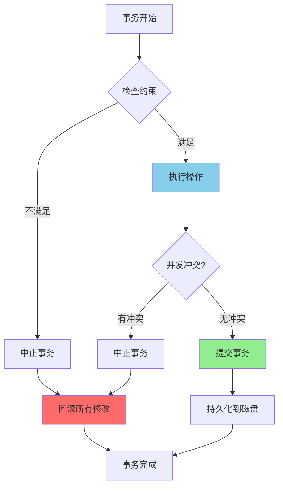
```mermaid
graph TB
    Start[事务开始] --> Check{检查约束}
    Check -->|不满足| Abort1[中止事务]
    Check -->|满足| Execute[执行操作]

    Execute --> Concurrent{并发冲突?}
    Concurrent -->|有冲突| Abort2[中止事务]
    Concurrent -->|无冲突| Commit[提交事务]

    Commit --> Persist[持久化到磁盘]
    Persist --> End[事务完成]

    Abort1 --> Rollback[回滚所有修改]
    Abort2 --> Rollback
    Rollback --> End

    style Execute fill:#87CEEB
    style Commit fill:#90EE90
    style Rollback fill:#FF6B6B
```

**ACID 四特性及其作用**：

| 特性   | 英文        | 核心作用         | 谁负责      |
| ------ | ----------- | ---------------- | ----------- |
| 原子性 | Atomicity   | 全做或全不做     | 数据库      |
| 一致性 | Consistency | 满足业务约束     | 应用+数据库 |
| 隔离性 | Isolation   | 并发事务互不干扰 | 数据库      |
| 持久性 | Durability  | 提交后永久保存   | 数据库      |

---

#### Atomicity(原子性)

**核心概念**：一个事务中的所有操作要么全部成功，要么全部失败回滚。

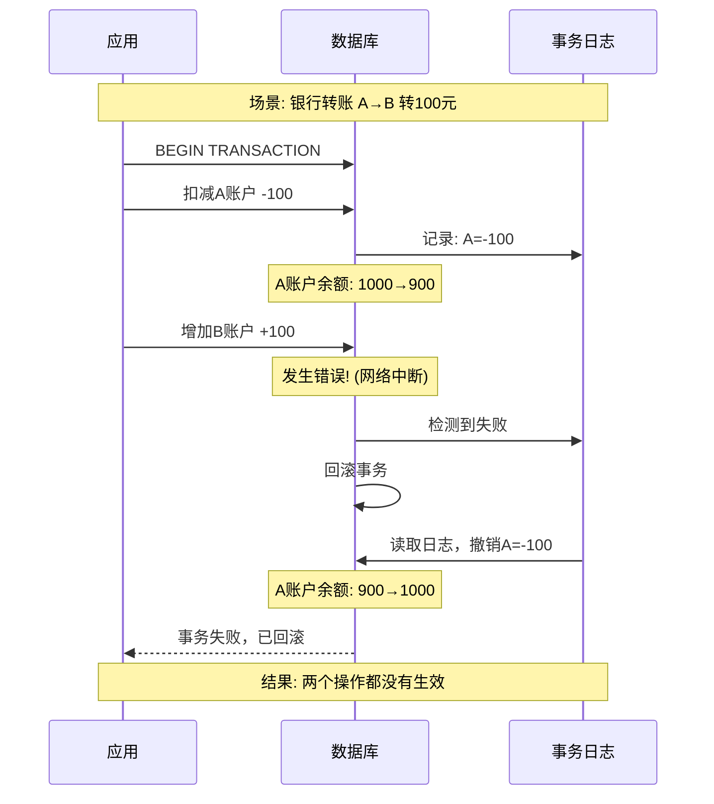
```mermaid
sequenceDiagram
    participant App as 应用
    participant DB as 数据库
    participant Log as 事务日志

    Note over App,Log: 场景: 银行转账 A→B 转100元

    App->>DB: BEGIN TRANSACTION
    App->>DB: 扣减A账户 -100
    DB->>Log: 记录: A=-100
    Note over DB: A账户余额: 1000→900

    App->>DB: 增加B账户 +100
    Note over DB: 发生错误! (网络中断)
    DB->>Log: 检测到失败

    DB->>DB: 回滚事务
    Log->>DB: 读取日志，撤销A=-100
    Note over DB: A账户余额: 900→1000

    DB-->>App: 事务失败，已回滚
    Note over App,Log: 结果: 两个操作都没有生效
```

**关键特征**：

- 不会出现"钱从A扣了，但B没收到"的情况
- 失败时自动回滚，保证数据一致性

#### Consistency(一致性)

**一致性（Consistency）指的是事务执行前后，数据库必须保持合法的状态，即遵循所有定义的约束条件（Constraints）和规则。**

**一致性状态转换流程**：


```mermaid
graph LR
    State1[一致性状态1<br/>余额总和=10000] --> Txn[事务执行]
    Txn -->|成功提交| State2[一致性状态2<br/>余额总和=10000]
    Txn -->|失败回滚| State1

    style State1 fill:#90EE90
    style State2 fill:#90EE90
    style Txn fill:#87CEEB
```

**常见约束类型**：

| 约束类型   | 示例              | 谁检查 |
| ---------- | ----------------- | ------ |
| 主键约束   | user_id 不能重复  | 数据库 |
| 外键约束   | order_id 必须存在 | 数据库 |
| 业务约束   | 余额≥0，库存≥0  | 应用层 |
| 唯一性约束 | 用户名不能重复    | 数据库 |

**重要说明**：

- 原子性、隔离性、持久性由**数据库**保证
- 一致性需要**应用层和数据库**共同保证

---

#### Isolation(隔离性)

**核心概念**：并发执行的多个事务之间互不干扰，就像各自独占数据库一样。

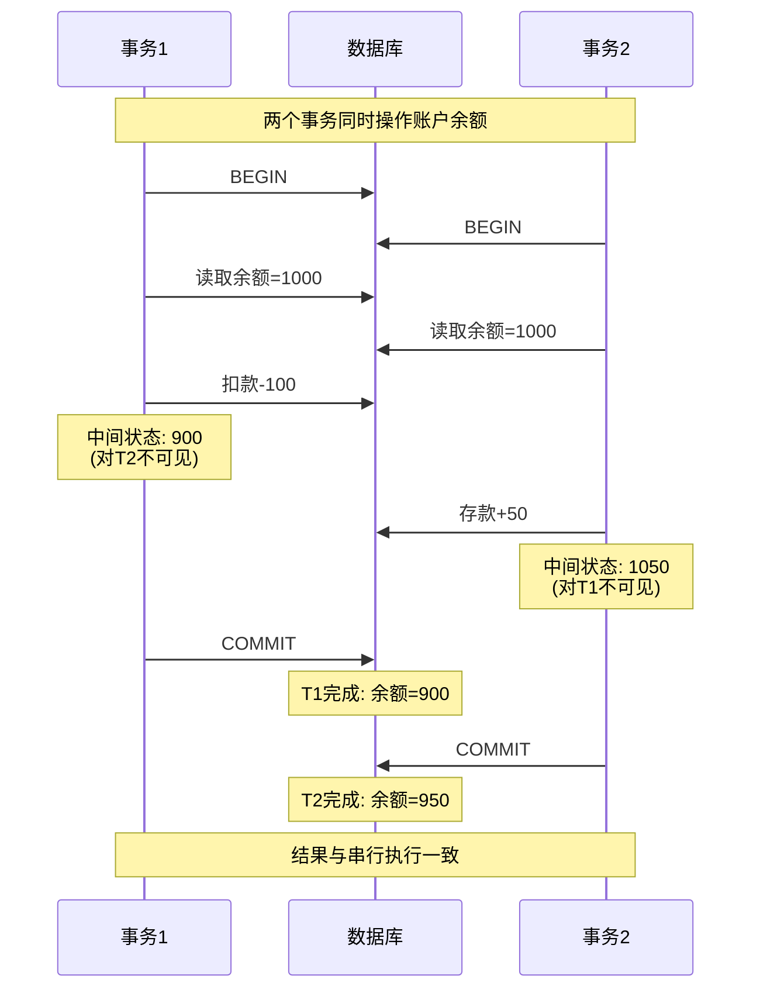
```mermaid
sequenceDiagram
    participant T1 as 事务1
    participant DB as 数据库
    participant T2 as 事务2

    Note over T1,T2: 两个事务同时操作账户余额

    T1->>DB: BEGIN
    T2->>DB: BEGIN

    T1->>DB: 读取余额=1000
    T2->>DB: 读取余额=1000

    T1->>DB: 扣款-100
    Note over T1: 中间状态: 900<br/>(对T2不可见)

    T2->>DB: 存款+50
    Note over T2: 中间状态: 1050<br/>(对T1不可见)

    T1->>DB: COMMIT
    Note over DB: T1完成: 余额=900

    T2->>DB: COMMIT
    Note over DB: T2完成: 余额=950

    Note over T1,T2: 结果与串行执行一致
```

**关键特征**：

- 事务的中间状态对其他事务不可见
- 并发执行结果等同于串行执行

#### Durability(持久性)

**核心概念**：事务一旦提交，数据永久保存，即使系统崩溃也不会丢失。

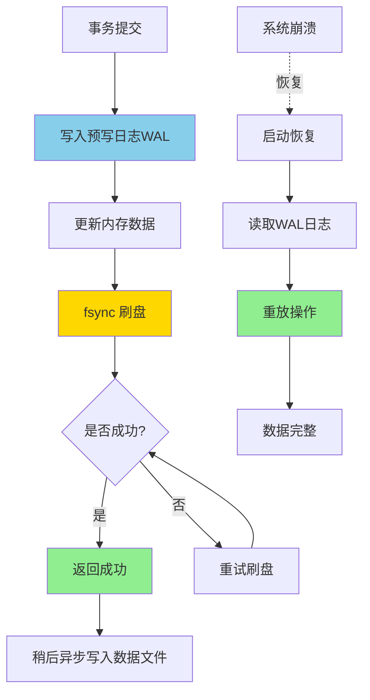
```mermaid
graph TB
    Start[事务提交] --> WAL[写入预写日志WAL]
    WAL --> Mem[更新内存数据]
    Mem --> Sync[fsync 刷盘]

    Sync --> Check{是否成功?}
    Check -->|是| Success[返回成功]
    Check -->|否| Retry[重试刷盘]
    Retry --> Check

    Success --> Later[稍后异步写入数据文件]

    Crash[系统崩溃] -.恢复.-> Recovery[启动恢复]
    Recovery --> ReadWAL[读取WAL日志]
    ReadWAL --> Restore[重放操作]
    Restore --> Complete[数据完整]

    style WAL fill:#87CEEB
    style Sync fill:#FFD700
    style Success fill:#90EE90
    style Restore fill:#90EE90
```

**实现机制**：

| 机制      | 作用               | 时机     |
| --------- | ------------------ | -------- |
| WAL日志   | 先写日志再修改数据 | 每次提交 |
| fsync刷盘 | 确保写入磁盘       | 提交时   |
| 恢复机制  | 系统重启后重放日志 | 崩溃后   |

**关键特征**：

- 提交成功 = 数据已持久化
- 系统崩溃后可通过日志恢复

## 单对象与多对象事务操作

### 核心问题：什么需要事务保证?

事务的原子性保证分为两个层面，它们的需求和实现复杂度不同：

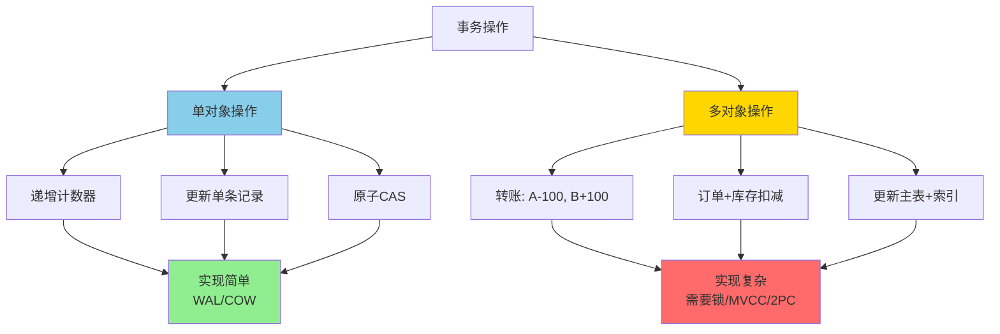
```mermaid
graph TB
    Ops[事务操作] --> Single[单对象操作]
    Ops --> Multi[多对象操作]

    Single --> S1[递增计数器]
    Single --> S2[更新单条记录]
    Single --> S3[原子CAS]

    Multi --> M1[转账: A-100, B+100]
    Multi --> M2[订单+库存扣减]
    Multi --> M3[更新主表+索引]

    S1 --> SImpl[实现简单<br/>WAL/COW]
    S2 --> SImpl
    S3 --> SImpl

    M1 --> MImpl[实现复杂<br/>需要锁/MVCC/2PC]
    M2 --> MImpl
    M3 --> MImpl

    style Single fill:#87CEEB
    style Multi fill:#FFD700
    style SImpl fill:#90EE90
    style MImpl fill:#FF6B6B
```

**核心区别**：

| 维度     | 单对象操作         | 多对象操作           |
| -------- | ------------------ | -------------------- |
| 失败场景 | 写入部分数据时崩溃 | 修改了部分对象后崩溃 |
| 实现难度 | 简单（WAL/COW）    | 复杂（锁/MVCC/2PC）  |
| 性能开销 | 低                 | 较高                 |
| 适用场景 | 计数器、单记录     | 转账、订单系统       |

---

### 1. 单对象写入（Single-Object Writes）

#### 1.1 为什么单对象也需要原子性？

即使是单个对象的操作，也可能面临失败场景：

**场景示例**：

- 写入 20KB JSON 文档时，写了 10KB 后网络中断
- 更新磁盘上的数据时，电源故障
- 覆盖旧值时，部分写入了新值

**后果**：如果没有原子性保证，可能读到"半成品"数据（部分旧值 + 部分新值）

#### 1.2 数据库如何实现单对象原子性？

**方案1: 预写日志（Write-Ahead Log, WAL）**

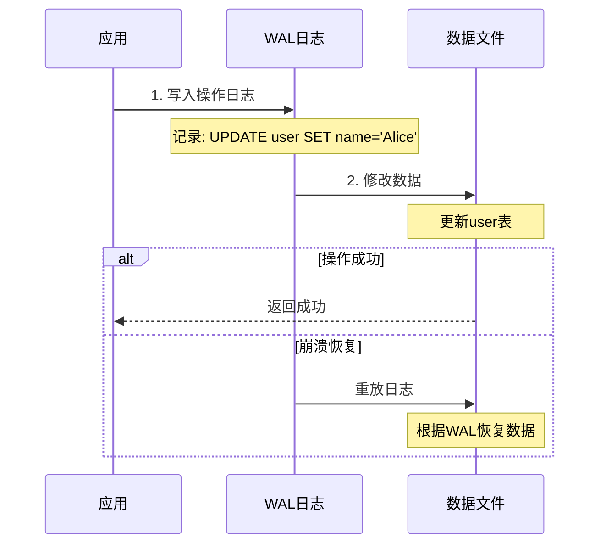
```mermaid
sequenceDiagram
    participant App as 应用
    participant WAL as WAL日志
    participant Data as 数据文件

    App->>WAL: 1. 写入操作日志
    Note over WAL: 记录: UPDATE user SET name='Alice'

    WAL->>Data: 2. 修改数据
    Note over Data: 更新user表

    alt 操作成功
        Data-->>App: 返回成功
    else 崩溃恢复
        WAL->>Data: 重放日志
        Note over Data: 根据WAL恢复数据
    end
```

**方案2: 写时复制（Copy-on-Write）**

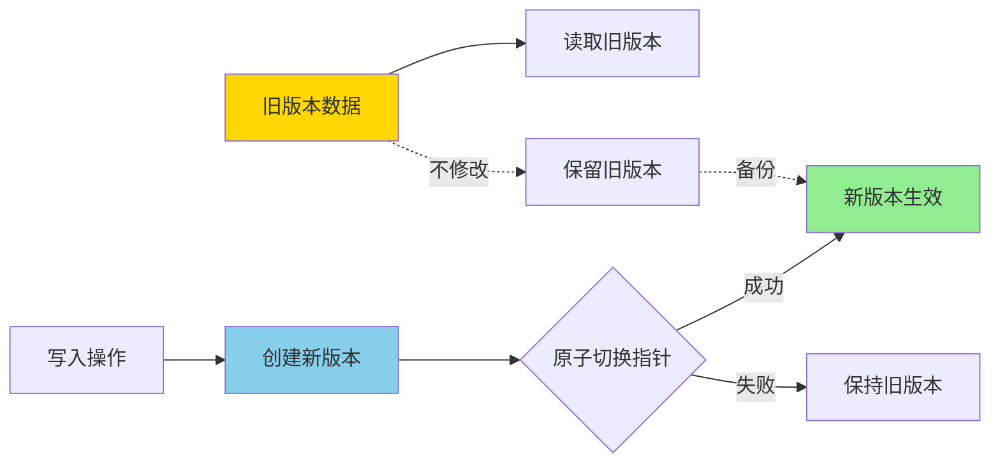
```mermaid
graph LR
    Old[旧版本数据] --> Read[读取旧版本]
    Old -.不修改.-> Keep[保留旧版本]

    Write[写入操作] --> New[创建新版本]
    New --> Switch{原子切换指针}
    Switch -->|成功| Active[新版本生效]
    Switch -->|失败| Rollback[保持旧版本]

    Keep -.备份.-> Active

    style Old fill:#FFD700
    style New fill:#87CEEB
    style Active fill:#90EE90
```

**两种方案对比**：

| 方案 | 优点         | 缺点             | 典型应用          |
| ---- | ------------ | ---------------- | ----------------- |
| WAL  | 通用，易实现 | 需要额外日志空间 | PostgreSQL, MySQL |
| COW  | 并发性能好   | 需要垃圾回收     | B-Tree, LMDB      |

##### （2）单对象的高级操作

**常见原子操作**：

| 操作类型 | SQL示例                                     | NoSQL示例                       | 用途     |
| -------- | ------------------------------------------- | ------------------------------- | -------- |
| 原子递增 | `UPDATE counters SET value = value + 1`   | `redis.incr('key')`           | 计数器   |
| CAS      | `UPDATE t SET v=new WHERE v=old`          | `redis.set('key', 'new', XX)` | 乐观锁   |
| 原子追加 | `UPDATE t SET arr = array_append(arr, x)` | `list.append(x)`              | 日志追加 |

#### 1.3 单对象操作的局限性

虽然提供原子性，但**不是真正的事务**：

- ❌ 不支持跨多个对象的原子性
- ❌ 不提供回滚机制（某些 NoSQL）
- ❌ 不保证跨操作的隔离性

---

### 2. 多对象事务（Multi-Object Transactions）

#### 2.1 为什么需要多对象事务？

**核心问题**：许多操作需要同时修改多个对象，且要么全部成功，要么全部失败。

#### 典型场景

##### 场景 1：维护外键约束

```sql
-- 插入订单明细时，必须保证订单存在
BEGIN TRANSACTION;
  INSERT INTO orders (id, user_id) VALUES (1001, 42);
  INSERT INTO order_items (order_id, product_id) VALUES (1001, 'SKU123');
COMMIT;
```

如果没有事务：

- `orders` 插入成功，`order_items` 失败 → 留下孤儿记录
- 或者 `order_items` 引用不存在的 `order_id` → 违反外键约束

##### 场景 2：非规范化数据的一致性

```json
// 用户文档（非规范化存储）
{
  "user_id": 42,
  "name": "Alice",
  "unread_count": 5  // 冗余字段
}

// 消息文档
{
  "msg_id": 101,
  "to_user": 42,
  "is_read": false
}
```

**更新操作**：用户读取消息时

```python
# 需要同时更新两个文档
BEGIN TRANSACTION
  UPDATE messages SET is_read = true WHERE msg_id = 101
  UPDATE users SET unread_count = unread_count - 1 WHERE user_id = 42
COMMIT
```

如果没有事务保证：

- 消息标记为已读，但 `unread_count` 未减少 → 数据不一致
- 并发操作可能导致计数错误

##### 场景 3：二级索引的更新

```sql
-- 更新用户邮箱
UPDATE users SET email = 'new@example.com' WHERE id = 42;
```

数据库内部需要：

1. 更新主表记录
2. 删除旧索引项 `old@example.com → user_id:42`
3. 插入新索引项 `new@example.com → user_id:42`

**如果索引更新失败**：

- 索引与数据不一致
- 查询 `SELECT * FROM users WHERE email = 'new@example.com'` 可能找不到记录

##### 场景 4：经典转账问题

```sql
BEGIN TRANSACTION;
  UPDATE accounts SET balance = balance - 100 WHERE account_id = 'A';
  UPDATE accounts SET balance = balance + 100 WHERE account_id = 'B';
COMMIT;
```

要求：

- 要么两个账户都更新成功
- 要么都不更新（保持原状）
- 不能出现钱"消失"或"凭空产生"

---

### 3. 处理错误和中止（Error Handling and Aborts）

#### 3.1 事务中止的语义

**ACID 数据库的承诺**：

- 如果事务中止（abort），所有写入都会被**回滚**（rolled back）
- 应用可以安全地**重试**（retry）

```python
# 典型的事务重试逻辑
max_retries = 3
for attempt in range(max_retries):
    try:
        with db.transaction():
            # 执行多个操作
            db.execute("UPDATE accounts SET balance = balance - 100 WHERE id = 'A'")
            db.execute("UPDATE accounts SET balance = balance + 100 WHERE id = 'B'")
        break  # 成功，退出重试
    except TransactionAbortError:
        if attempt == max_retries - 1:
            raise  # 最后一次重试失败，抛出异常
        time.sleep(0.1 * (2 ** attempt))  # 指数退避
```

#### 3.2 并非所有系统都支持中止

**无事务回滚的系统**（如部分 NoSQL）：

- Leaderless replication（如 Dynamo 风格的数据库）
- 应用层需要自己处理失败

```python
# 应用层需要手动清理
try:
    db.put('order:1001', order_data)
    db.put('order_items:1001', items_data)
except Exception:
    # 需要手动删除已写入的数据
    db.delete('order:1001')  # 补偿操作
    raise
```

#### 3.3 重试的陷阱

重试并非总是安全的：

##### （1）网络问题导致的重复提交

```
Client → [UPDATE balance...] → Database
        ← [网络超时，未收到响应]
Client → [重试 UPDATE balance...] → Database
```

可能结果：

- 第一次请求实际成功了，但客户端超时
- 重试导致扣款两次

**解决方案**：

- 使用**幂等性操作**（idempotent operations）
- 客户端生成唯一请求 ID，数据库去重

##### （2）重试风暴导致过载

- 系统过载时，大量客户端同时重试
- 进一步加剧过载 → 雪崩效应

**解决方案**：

- 指数退避（exponential backoff）
- 限流和熔断机制

##### （3）副作用已执行

```python
with db.transaction():
    db.execute("INSERT INTO orders ...")
    send_email_to_customer()  # 外部副作用
    # 如果此处失败，事务回滚但邮件已发送
```

**问题**：事务回滚不会撤销外部副作用（如发邮件、调用第三方 API）

**解决方案**：

- 将副作用移到事务外部
- 使用**两阶段提交**或**消息队列**确保最终一致性

---

### 4. 关键设计权衡

| 特性                 | 单对象操作         | 多对象事务           |
| -------------------- | ------------------ | -------------------- |
| **实现复杂度** | 低（日志/COW）     | 高（锁/MVCC/2PC）    |
| **性能开销**   | 低                 | 较高（协调成本）     |
| **适用场景**   | 计数器、单记录更新 | 转账、订单系统       |
| **分布式支持** | 容易               | 困难（需分布式事务） |

#### 何时使用多对象事务？

**需要事务**：

- 金融系统（转账、支付）
- 订单系统（订单 + 库存 + 积分）
- 强一致性要求的场景

**可以不用事务**：

- 日志写入（追加操作）
- 分析数据（可容忍短暂不一致）
- 使用最终一致性的推荐系统

#### 替代方案

如果系统不支持事务，可以使用：

1. **应用层事务**：自己实现补偿逻辑（Saga 模式）
2. **最终一致性**：允许短暂不一致，后台异步修复
3. **冲突解决**：使用 CRDT（Conflict-free Replicated Data Types）

---

### 5. 实际案例对比

#### 案例 1：Redis（单对象原子性）

```python
# Redis 只保证单个命令的原子性
redis.incr('counter')  # ✅ 原子的

# 多个命令需要使用 Lua 脚本或 MULTI/EXEC
pipe = redis.pipeline()
pipe.decr('stock:item123')
pipe.incr('sales:item123')
pipe.execute()  # ⚠️ 非原子的（可能部分成功）

# 使用 MULTI/EXEC 实现事务
with redis.pipeline() as pipe:
    pipe.multi()
    pipe.decr('stock:item123')
    pipe.incr('sales:item123')
    pipe.execute()  # ✅ 原子执行
```

#### 案例 2：PostgreSQL（完整事务支持）

```sql
BEGIN;
  -- 扣减库存
  UPDATE inventory SET stock = stock - 1 WHERE product_id = 123 AND stock > 0;

  -- 如果库存不足，上面的 UPDATE 影响 0 行
  -- 检查并中止事务

  -- 创建订单
  INSERT INTO orders (user_id, product_id) VALUES (42, 123);

COMMIT;  -- 全部成功或全部失败
```

#### 案例 3：MongoDB（有限的事务支持）

```javascript
// MongoDB 4.0+ 支持多文档事务（需 replica set）
const session = client.startSession();
session.startTransaction();

try {
  await ordersCollection.insertOne({ order_id: 1001, user_id: 42 }, { session });
  await usersCollection.updateOne(
    { user_id: 42 },
    { $inc: { total_orders: 1 } },
    { session }
  );

  await session.commitTransaction();
} catch (error) {
  await session.abortTransaction();
  throw error;
} finally {
  session.endSession();
}
```

---

### 6. 核心要点总结

#### 单对象操作

✅ 大多数数据库提供单对象原子性（通过 WAL 或 COW）
✅ 支持原子递增、CAS 等高级操作
❌ 无法处理跨对象的一致性需求

#### 多对象事务

✅ 保证多个操作的原子性（全部成功或全部失败）
✅ 维护数据一致性（外键、索引、非规范化数据）
❌ 实现复杂，性能开销较高
❌ 分布式环境下更加困难

#### 设计建议

1. **优先使用单对象操作**：如果业务逻辑允许
2. **必要时使用事务**：涉及多个对象且必须保持一致性
3. **考虑最终一致性**：某些场景可以接受短暂不一致
4. **注意重试安全性**：实现幂等性，避免重复执行
5. **外部副作用需谨慎**：不要在事务内执行不可回滚的操作

---

## 弱隔离级别

只有出现某个事务修改数据而另一个事务同时要读取该数据，或者两个事务同时修改相同数据时，才会引发并发问题（引入了竞争条件）。

数据库一直试图通过事务隔离来对应用开发者隐藏内部的各种并发问题。可串行化的隔离会严重影响性能，而许多数据库却不愿意牺牲性能，因而更多倾向于**采用较弱的隔离级别**，它可以防止某些但并非全部的并发问题。

### 读-提交

读提交是最基本的事务隔离级别，提供两个核心保证：

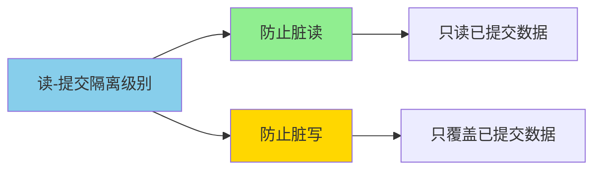
```mermaid
graph LR
    RC[读-提交隔离级别] --> DR[防止脏读]
    RC --> DW[防止脏写]

    DR --> DR1[只读已提交数据]
    DW --> DW1[只覆盖已提交数据]

    style RC fill:#87CEEB
    style DR fill:#90EE90
    style DW fill:#FFD700
```

**两大保证**：

1. **防止脏读**：只能看到已提交的数据
2. **防止脏写**：只能覆盖已提交的数据

---

#### 防止脏读

**核心要求**：事务的写入只有在成功提交后，才对其他事务可见。

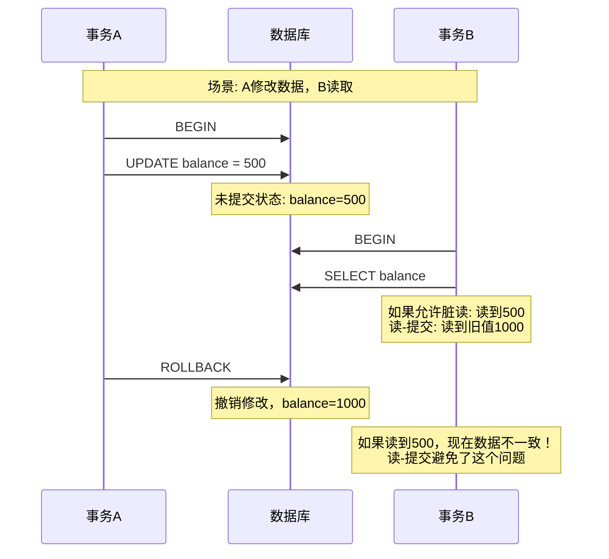
```mermaid
sequenceDiagram
    participant A as 事务A
    participant DB as 数据库
    participant B as 事务B

    Note over A,B: 场景: A修改数据，B读取

    A->>DB: BEGIN
    A->>DB: UPDATE balance = 500
    Note over DB: 未提交状态: balance=500

    B->>DB: BEGIN
    B->>DB: SELECT balance
    Note over B: 如果允许脏读: 读到500<br/>读-提交: 读到旧值1000

    A->>DB: ROLLBACK
    Note over DB: 撤销修改，balance=1000

    Note over B: 如果读到500，现在数据不一致！<br/>读-提交避免了这个问题
```

**为什么需要防止脏读**：

| 问题场景           | 后果                                 |
| ------------------ | ------------------------------------ |
| 事务读取未提交数据 | 该事务可能回滚，导致读到不存在的数据 |
| 看到中间状态       | 违反业务约束（如转账中途余额不对）   |

#### 防止脏写

要求：**事务只能覆盖已经成功提交的数据，不能覆盖其他未提交事务的写入。**

##### 什么是脏写？

**定义**：一个事务覆盖了另一个**尚未提交**事务的写入。

**问题场景：汽车销售系统**

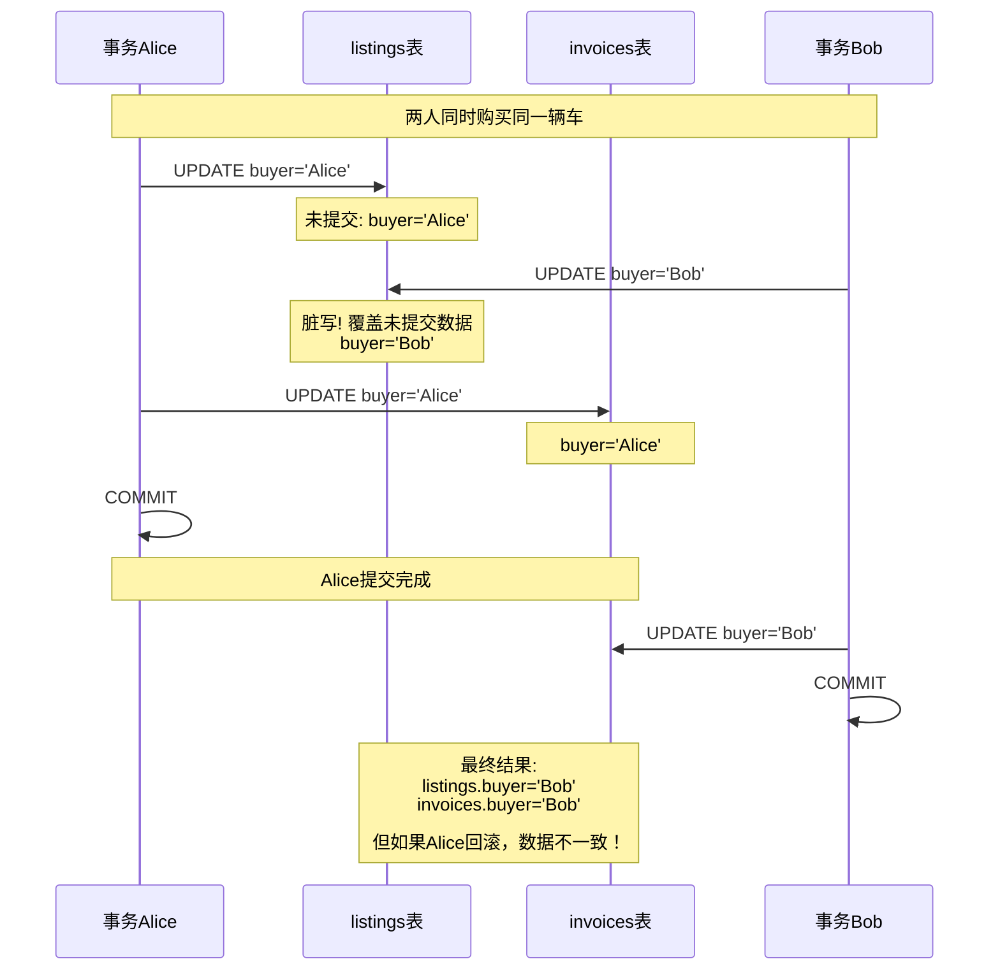
```mermaid
sequenceDiagram
    participant Alice as 事务Alice
    participant Listings as listings表
    participant Invoices as invoices表
    participant Bob as 事务Bob

    Note over Alice,Bob: 两人同时购买同一辆车

    Alice->>Listings: UPDATE buyer='Alice'
    Note over Listings: 未提交: buyer='Alice'

    Bob->>Listings: UPDATE buyer='Bob'
    Note over Listings: 脏写! 覆盖未提交数据<br/>buyer='Bob'

    Alice->>Invoices: UPDATE buyer='Alice'
    Note over Invoices: buyer='Alice'

    Alice->>Alice: COMMIT
    Note over Alice,Invoices: Alice提交完成

    Bob->>Invoices: UPDATE buyer='Bob'
    Bob->>Bob: COMMIT

    Note over Listings,Invoices: 最终结果:<br/>listings.buyer='Bob'<br/>invoices.buyer='Bob'<br/><br/>但如果Alice回滚，数据不一致！
```

**脏写导致的问题**：

| 问题类型     | 具体表现                       |
| ------------ | ------------------------------ |
| 数据不一致   | 同一业务的多个字段来自不同事务 |
| 回滚复杂     | 无法确定回滚到哪个版本         |
| 并发控制失效 | 事务间产生意外影响             |

---

##### 如何防止脏写？

**核心方案**：使用**行级锁**（Row-level Lock）

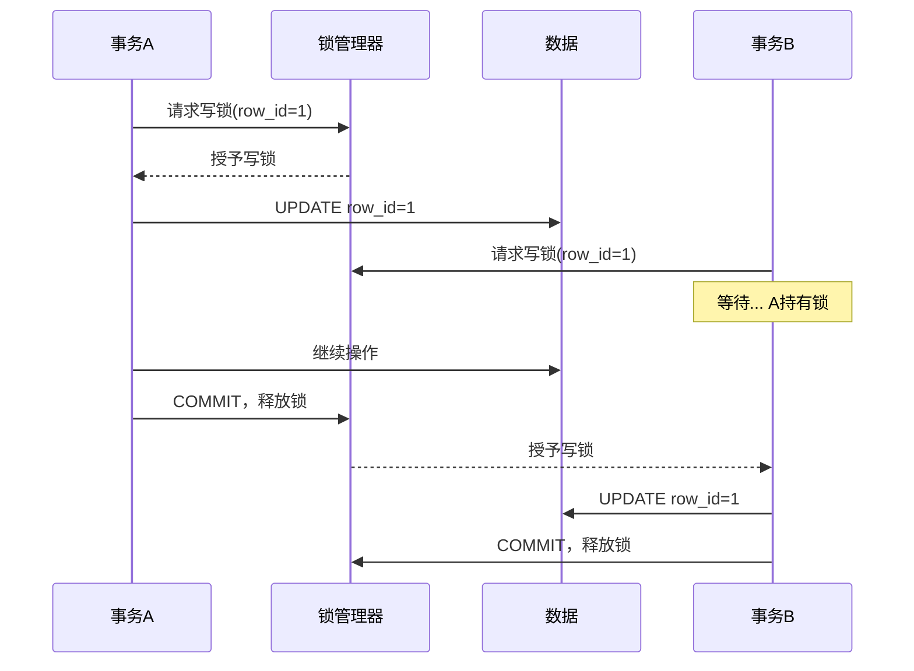
```mermaid
sequenceDiagram
    participant A as 事务A
    participant Lock as 锁管理器
    participant Data as 数据
    participant B as 事务B

    A->>Lock: 请求写锁(row_id=1)
    Lock-->>A: 授予写锁
    A->>Data: UPDATE row_id=1

    B->>Lock: 请求写锁(row_id=1)
    Note over B: 等待... A持有锁

    A->>Data: 继续操作
    A->>Lock: COMMIT，释放锁

    Lock-->>B: 授予写锁
    B->>Data: UPDATE row_id=1
    B->>Lock: COMMIT，释放锁
```

**锁机制保证**：

| 时刻 | 事务A            | 事务B      | 锁状态   |
| ---- | ---------------- | ---------- | -------- |
| T1   | 获取锁，修改数据 | -          | A持有锁  |
| T2   | 继续操作         | 尝试获取锁 | B被阻塞  |
| T3   | 提交，释放锁     | 继续等待   | 锁释放中 |
| T4   | -                | 获取锁成功 | B持有锁  |

---

##### 读-提交的实现

**实现策略对比**：

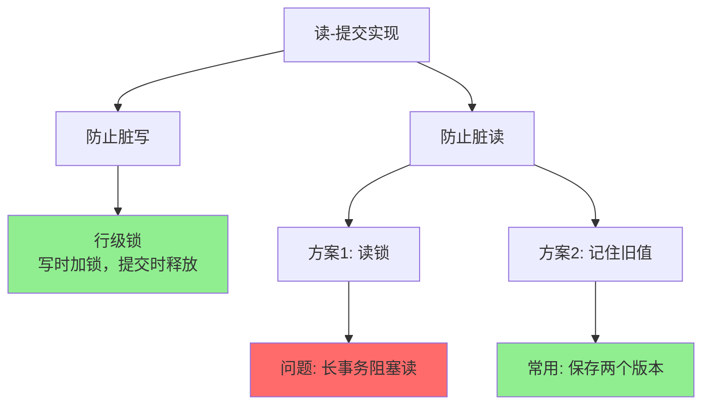
```mermaid
graph TB
    RC[读-提交实现] --> DW[防止脏写]
    RC --> DR[防止脏读]

    DW --> DWImpl[行级锁<br/>写时加锁，提交时释放]

    DR --> DR1[方案1: 读锁]
    DR --> DR2[方案2: 记住旧值]

    DR1 --> DR1P[问题: 长事务阻塞读]
    DR2 --> DR2P[常用: 保存两个版本]

    style DWImpl fill:#90EE90
    style DR2P fill:#90EE90
    style DR1P fill:#FF6B6B
```

**防止脏读的两种方案**：

| 方案     | 实现方式       | 优点       | 缺点             | 使用情况           |
| -------- | -------------- | ---------- | ---------------- | ------------------ |
| 读锁     | 读操作也加锁   | 实现简单   | 写事务阻塞所有读 | 很少使用           |
| 记住旧值 | 保存已提交版本 | 读写不阻塞 | 需要额外空间     | **常用方案** |

**记住旧值的工作原理**：

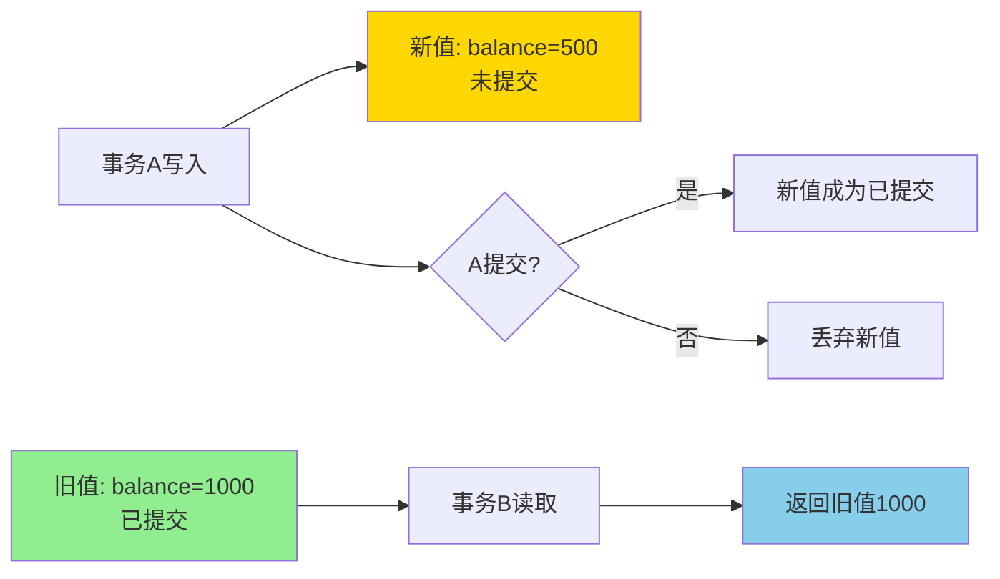
```mermaid
graph LR
    Write[事务A写入] --> NewV[新值: balance=500<br/>未提交]
    OldV[旧值: balance=1000<br/>已提交] --> Read[事务B读取]

    Read --> Return[返回旧值1000]
    Write --> Commit{A提交?}
    Commit -->|是| NewCommit[新值成为已提交]
    Commit -->|否| Rollback[丢弃新值]

    style OldV fill:#90EE90
    style NewV fill:#FFD700
    style Return fill:#87CEEB
```

##### 防止脏写的实际应用

**并发修改场景对比**：

| 方面     | 无锁（允许脏写）                 | 使用行锁（防止脏写）         |
| -------- | -------------------------------- | ---------------------------- |
| 事务执行 | 两个事务同时修改同一行           | 后执行的事务等待先执行的完成 |
| 核心问题 | Bob覆盖了Alice未提交的写入       | 数据库自动阻塞冲突的写入     |
| 最终结果 | 数据不一致（部分Alice，部分Bob） | 数据一致（全Alice或全Bob）   |
| 实现方式 | 直接执行UPDATE                   | 使用事务+数据库自动加锁      |

**PostgreSQL 行锁机制**：

```
时间线：
T1: Alice BEGIN → 锁定 car_id=1
T2: Bob BEGIN → 尝试锁定 car_id=1（被阻塞，等待中...）
T3: Alice 完成操作 → COMMIT（释放锁）
T4: Bob 获得锁 → 继续执行 → COMMIT

关键点：
- Alice持有锁期间，Bob的UPDATE会阻塞
- Alice提交后立即释放锁，Bob才能继续
- 保证了两个事务串行执行，避免数据混乱
```

##### 读-提交的局限性

虽然防止了脏读和脏写，但**读-提交级别仍然存在其他并发问题**：

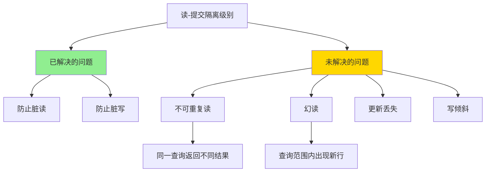
```mermaid
graph TB
    RC[读-提交隔离级别] --> Solved[已解决的问题]
    RC --> Unsolved[未解决的问题]

    Solved --> S1[防止脏读]
    Solved --> S2[防止脏写]

    Unsolved --> U1[不可重复读]
    Unsolved --> U2[幻读]
    Unsolved --> U3[更新丢失]
    Unsolved --> U4[写倾斜]

    U1 --> U1E[同一查询返回不同结果]
    U2 --> U2E[查询范围内出现新行]

    style Solved fill:#90EE90
    style Unsolved fill:#FFD700
```

**并发问题示例**：

| 问题类型   | 场景描述                  | 具体表现                                            |
| ---------- | ------------------------- | --------------------------------------------------- |
| 不可重复读 | 事务A读取账户余额两次     | 第1次读到100，第2次读到200（期间事务B修改并提交）   |
| 幻读       | 事务A统计成年用户数量两次 | 第1次统计10人，第2次统计11人（期间事务B插入新用户） |

**解决方案**：使用更强的隔离级别（快照隔离、可串行化隔离）。

##### 核心要点

✅ **读-提交保证**：

- 只读取已提交的数据（防止脏读）
- 只覆盖已提交的数据（防止脏写）

✅ **实现方式**：

- 脏写：行级锁
- 脏读：保存旧值版本

❌ **不解决的问题**：

- 不可重复读
- 幻读
- 写偏斜（Write Skew）
- 更新丢失（Lost Update）

🎯 **适用场景**：

- 大多数 OLTP 系统的默认隔离级别
- PostgreSQL、Oracle、SQL Server 的默认设置
- 性能与一致性的平衡选择

### 快照级别隔离与可重复读

#### 核心问题：为什么需要快照隔离？

读-提交隔离级别存在**不可重复读**问题，这在某些场景下会导致严重的业务错误。

##### 典型问题场景

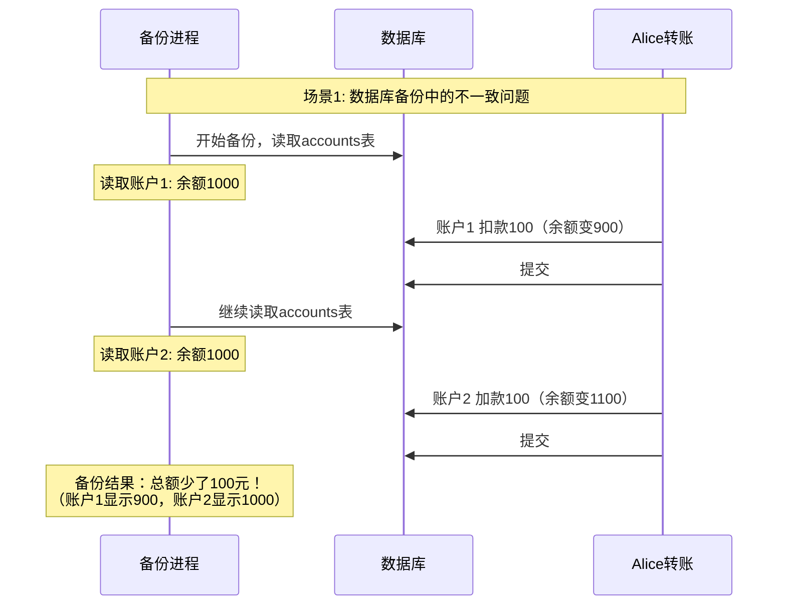
```mermaid
sequenceDiagram
    participant Backup as 备份进程
    participant DB as 数据库
    participant Alice as Alice转账

    Note over Backup,Alice: 场景1: 数据库备份中的不一致问题

    Backup->>DB: 开始备份，读取accounts表
    Note over Backup: 读取账户1: 余额1000

    Alice->>DB: 账户1 扣款100（余额变900）
    Alice->>DB: 提交

    Backup->>DB: 继续读取accounts表
    Note over Backup: 读取账户2: 余额1000

    Alice->>DB: 账户2 加款100（余额变1100）
    Alice->>DB: 提交

    Note over Backup: 备份结果：总额少了100元！<br/>（账户1显示900，账户2显示1000）
```

**不可重复读的两大问题**：

| 场景       | 问题描述                         | 后果                         |
| ---------- | -------------------------------- | ---------------------------- |
| 数据库备份 | 备份过程中读到部分提交的数据     | 备份数据不一致，总金额对不上 |
| 分析查询   | 同一查询在同一事务中返回不同结果 | 报表数据前后矛盾，无法信任   |

---

#### 快照隔离（Snapshot Isolation）

##### 核心思想

**每个事务都从数据库的一致性快照中读取数据**。

```mermaid
graph LR
    T1[事务1开始<br/>快照时刻=10:00] --> S1[读取快照<br/>数据版本@10:00]
    T2[事务2开始<br/>快照时刻=10:05] --> S2[读取快照<br/>数据版本@10:05]

    T3[事务3修改数据<br/>10:03提交] -.影响.-> S2
    T3 -.不影响.-> S1

    S1 --> R1[事务1看到的<br/>始终是10:00的数据]
    S2 --> R2[事务2看到的<br/>是10:05的数据<br/>包含事务3的修改]

    style S1 fill:#87CEEB
    style S2 fill:#90EE90
    style T3 fill:#FFD700
```

**三大保证**：

| 保证         | 含义                       | 解决的问题       |
| ------------ | -------------------------- | ---------------- |
| 一致性读取   | 事务中多次读取看到相同版本 | 不可重复读       |
| 时间点一致性 | 只看到快照时刻已提交的数据 | 部分提交的脏数据 |
| 读写不阻塞   | 读取历史版本，不需要锁     | 性能问题         |

---

#### 实现机制：多版本并发控制（MVCC）

##### MVCC 基本原理

**Multi-Version Concurrency Control**：数据库维护一个对象的**多个版本**。

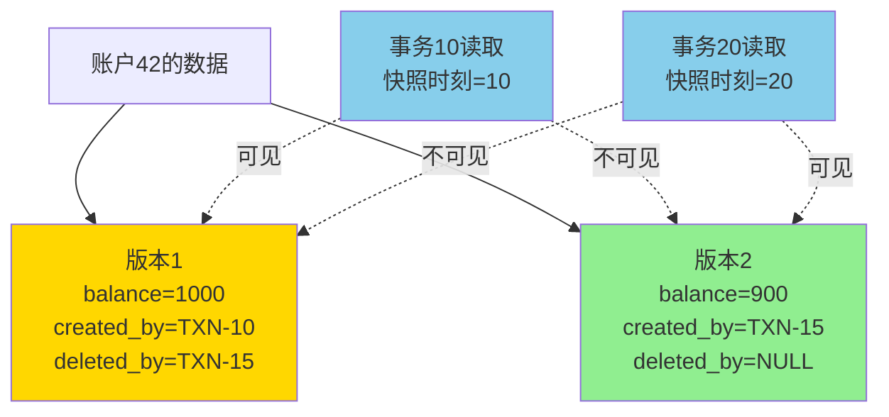
```mermaid
graph TB
    Data[账户42的数据] --> V1[版本1<br/>balance=1000<br/>created_by=TXN-10<br/>deleted_by=TXN-15]
    Data --> V2[版本2<br/>balance=900<br/>created_by=TXN-15<br/>deleted_by=NULL]

    T10[事务10读取<br/>快照时刻=10] -.可见.-> V1
    T10 -.不可见.-> V2

    T20[事务20读取<br/>快照时刻=20] -.不可见.-> V1
    T20 -.可见.-> V2

    style V1 fill:#FFD700
    style V2 fill:#90EE90
    style T10 fill:#87CEEB
    style T20 fill:#87CEEB
```

**核心数据结构**：

| 字段       | 作用               | 示例值                   |
| ---------- | ------------------ | ------------------------ |
| account_id | 数据主键           | 42                       |
| balance    | 业务数据           | 1000                     |
| created_by | 创建此版本的事务ID | TXN-10                   |
| deleted_by | 删除此版本的事务ID | TXN-15（NULL表示未删除） |

**事务ID分配**：每个事务获得单调递增的唯一ID（TXN-10 < TXN-11 < TXN-12...）

##### 版本可见性规则

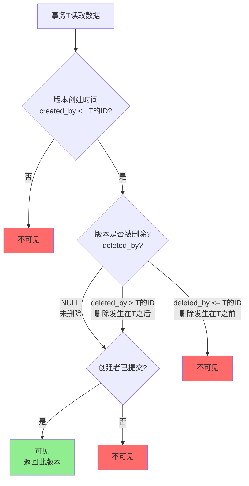
```mermaid
graph TB
    Start[事务T读取数据] --> Check1{版本创建时间<br/>created_by <= T的ID?}
    Check1 -->|否| Invisible1[不可见]
    Check1 -->|是| Check2{版本是否被删除?<br/>deleted_by?}

    Check2 -->|NULL<br/>未删除| Check3{创建者已提交?}
    Check2 -->|deleted_by > T的ID<br/>删除发生在T之后| Check3
    Check2 -->|deleted_by <= T的ID<br/>删除发生在T之前| Invisible2[不可见]

    Check3 -->|是| Visible[可见<br/>返回此版本]
    Check3 -->|否| Invisible3[不可见]

    style Visible fill:#90EE90
    style Invisible1 fill:#FF6B6B
    style Invisible2 fill:#FF6B6B
    style Invisible3 fill:#FF6B6B
```

**可见性判断的4个条件**：

| 条件       | 规则                                     | 含义                       |
| ---------- | ---------------------------------------- | -------------------------- |
| 创建时间   | created_by ≤ T的事务ID                  | 版本在事务T开始前已存在    |
| 删除时间   | deleted_by IS NULL 或 deleted_by > T的ID | 版本在事务T看来未被删除    |
| 创建者状态 | created_by对应的事务已提交               | 不看未提交的数据           |
| 隔离性     | 不看其他事务未提交的写入                 | 只看自己和已提交事务的数据 |

##### 详细示例

**场景**：多个事务并发读写账户余额

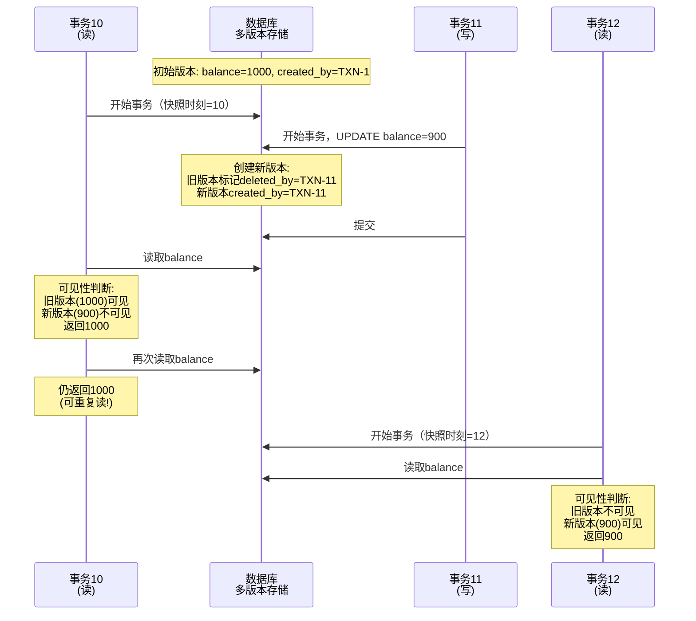
```mermaid
sequenceDiagram
    participant T10 as 事务10<br/>(读)
    participant DB as 数据库<br/>多版本存储
    participant T11 as 事务11<br/>(写)
    participant T12 as 事务12<br/>(读)

    Note over DB: 初始版本: balance=1000, created_by=TXN-1

    T10->>DB: 开始事务（快照时刻=10）
    T11->>DB: 开始事务，UPDATE balance=900
    Note over DB: 创建新版本:<br/>旧版本标记deleted_by=TXN-11<br/>新版本created_by=TXN-11
    T11->>DB: 提交

    T10->>DB: 读取balance
    Note over T10: 可见性判断:<br/>旧版本(1000)可见<br/>新版本(900)不可见<br/>返回1000

    T10->>DB: 再次读取balance
    Note over T10: 仍返回1000<br/>(可重复读!)

    T12->>DB: 开始事务（快照时刻=12）
    T12->>DB: 读取balance
    Note over T12: 可见性判断:<br/>旧版本不可见<br/>新版本(900)可见<br/>返回900
```

**版本演变时间线**：

| 时刻 | 事务动作         | 版本1 (balance=1000)          | 版本2 (balance=900)     | TXN-10读到 | TXN-12读到 |
| ---- | ---------------- | ----------------------------- | ----------------------- | ---------- | ---------- |
| T1   | 初始状态         | created_by=1, deleted_by=NULL | 不存在                  | -          | -          |
| T2   | TXN-10开始       | 可见                          | 不存在                  | 1000       | -          |
| T3   | TXN-11修改并提交 | deleted_by=11                 | created_by=11           | 1000       | -          |
| T4   | TXN-10再次读取   | 可见（deleted_by>10）         | 不可见（created_by>10） | 1000       | -          |
| T5   | TXN-12开始并读取 | 不可见                        | 可见                    | -          | 900        |

---

#### 更新和删除的实现

```mermaid
graph TB
    A[应用层: UPDATE balance=900] --> B[MVCC内部处理]
    B --> C[1. 标记旧版本<br/>deleted_by=当前事务ID]
    B --> D[2. 插入新版本<br/>created_by=当前事务ID]

    E[应用层: DELETE] --> F[MVCC内部处理]
    F --> G[标记为删除<br/>deleted_by=当前事务ID]
    G --> H[物理删除延后<br/>垃圾回收时清理]

    style A fill:#87CEEB
    style E fill:#87CEEB
    style C fill:#FFD700
    style D fill:#90EE90
    style G fill:#FF6B6B
```

**UPDATE和DELETE的MVCC实现**：

| 操作   | 内部实现                                      | 旧版本                   | 新版本                   |
| ------ | --------------------------------------------- | ------------------------ | ------------------------ |
| UPDATE | 1. 标记旧版本deleted_by``2. 插入新版本 | deleted_by设为当前事务ID | created_by设为当前事务ID |
| DELETE | 只标记deleted_by                              | deleted_by设为当前事务ID | 无（不插入新版本）       |

**关键点**：

- UPDATE = 逻辑删除旧版本 + 插入新版本
- DELETE = 只做逻辑删除，物理删除由垃圾回收负责
- 所有版本保留直到没有事务需要它们

---

#### 索引与 MVCC

```mermaid
graph TB
    Query[查询: account_id=42] --> Index[索引查找]
    Index --> Method1[方案1:<br/>索引指向所有版本]
    Index --> Method2[方案2:<br/>Append-Only B-Tree]

    Method1 --> V1[版本1<br/>TXN-1]
    Method1 --> V2[版本2<br/>TXN-11]
    Method1 --> V3[版本3<br/>TXN-15]
    V1 --> Filter1[应用可见性规则]
    V2 --> Filter1
    V3 --> Filter1
    Filter1 --> Result1[返回可见版本]

    Method2 --> Entry1[(account_id=42, TXN-1)<br/>→行位置1]
    Method2 --> Entry2[(account_id=42, TXN-11)<br/>→行位置2]

    style Method1 fill:#FFD700
    style Method2 fill:#90EE90
```

**两种方案对比**：

| 方案               | 工作原理               | 优点       | 缺点           | 使用数据库 |
| ------------------ | ---------------------- | ---------- | -------------- | ---------- |
| 索引指向所有版本   | 一个键对应多个版本记录 | 实现简单   | 垃圾版本占空间 | 部分数据库 |
| Append-Only B-Tree | 每个版本单独的索引项   | 查询效率高 | 索引项较多     | PostgreSQL |

---

#### 垃圾回收（Garbage Collection）

```mermaid
graph TB
    A[版本积累] --> B[版本1: 1000<br/>deleted_by=TXN-11]
    A --> C[版本2: 900<br/>deleted_by=TXN-15]
    A --> D[版本3: 800<br/>deleted_by=TXN-20]
    A --> E[版本4: 700<br/>deleted_by=NULL]

    B --> F{可删除?<br/>deleted_by < 最小活跃事务ID}
    C --> F
    D --> F

    F -->|是| G[物理删除]
    F -->|否| H[保留]

    E --> I[当前版本<br/>不删除]

    style B fill:#FF6B6B
    style C fill:#FF6B6B
    style D fill:#FFD700
    style E fill:#90EE90
    style G fill:#FF6B6B
```

**垃圾回收机制**：

| 阶段    | 操作                 | 判断条件                     |
| ------- | -------------------- | ---------------------------- |
| 1. 扫描 | 找到所有已删除版本   | deleted_by IS NOT NULL       |
| 2. 检查 | 判断是否还有事务需要 | deleted_by < MIN(活跃事务ID) |
| 3. 清理 | 物理删除旧版本       | 无事务依赖                   |
| 4. 更新 | 移除索引中的旧项     | 对应版本已删除               |

**PostgreSQL的VACUUM**：

- **手动触发**：`VACUUM table_name;`
- **自动运行**：后台进程定期检查（默认每分钟一次）
- **作用**：回收空间，更新统计信息，防止事务ID回卷

---

#### 快照隔离的写冲突

```mermaid
sequenceDiagram
    participant A as 事务A
    participant DB as 数据库
    participant B as 事务B

    Note over DB: 初始: content='Hello', version=1

    A->>DB: BEGIN (快照时刻=10)
    B->>DB: BEGIN (快照时刻=10)

    A->>DB: 读取content='Hello'
    B->>DB: 读取content='Hello'

    Note over A: 编辑为'Hello World'
    Note over B: 编辑为'Hello Alice'

    A->>DB: UPDATE content='Hello World'
    A->>DB: COMMIT
    Note over DB: (成功) version=2

    B->>DB: UPDATE content='Hello Alice'
    B->>DB: COMMIT
    Note over DB: (失败!) 检测到冲突<br/>ERROR: could not serialize

    Note over B: 应用层需处理:<br/>重试或提示用户
```

**First-Committer-Wins策略**：

| 事务  | 操作       | 结果           | 原因                  |
| ----- | ---------- | -------------- | --------------------- |
| 事务A | 先提交修改 | 成功           | 无冲突                |
| 事务B | 后提交修改 | **失败** | 检测到同一行已被A修改 |

**冲突处理机制**：

- **提交时检查**：事务提交时，数据库检查是否有其他事务修改了相同的行
- **中止后提交者**：如果有冲突，后提交的事务被中止（abort）
- **应用层重试**：应用需捕获SerializationError异常并重试

---

#### 可重复读（Repeatable Read）

##### 术语混淆

**可重复读**是 SQL 标准定义的隔离级别，但不同数据库的实现不同：

| 数据库                   | REPEATABLE READ 实现                                                |
| ------------------------ | ------------------------------------------------------------------- |
| **PostgreSQL**     | 快照隔离（Snapshot Isolation）                                      |
| **MySQL (InnoDB)** | 快照隔离                                                            |
| **Oracle**         | 不支持此级别，使用 SERIALIZABLE 或 READ COMMITTED                   |
| **SQL Server**     | 快照隔离（需显式启用 `SET TRANSACTION ISOLATION LEVEL SNAPSHOT`） |

##### SQL 标准定义

SQL 标准要求 REPEATABLE READ 防止：

- ✅ 脏读（Dirty Read）
- ✅ 不可重复读（Non-repeatable Read）
- ⚠️ 幻读（Phantom Read）- 标准允许，但某些数据库也防止了

---

#### 应用示例

**快照隔离使用场景**：

| 操作         | 关键代码                                               | 行为说明               |
| ------------ | ------------------------------------------------------ | ---------------------- |
| 启用快照隔离 | `BEGIN TRANSACTION ISOLATION LEVEL REPEATABLE READ;` | 设置隔离级别           |
| 并发场景     | 会话1读到500，会话2更新为600并提交                     | 会话1仍读到500（快照） |
| 写冲突处理   | 会话1尝试UPDATE                                        | 可能失败，需重试       |

**应用层重试模式**（以Python为例）：

```
核心逻辑：
1. 设置REPEATABLE READ隔离级别
2. try-catch捕获TransactionRollbackError异常
3. 失败时重试（最多3次），使用指数退避策略
4. 重试仍失败则向上抛出异常
```

---

#### 快照隔离的优缺点

##### 优点

✅ **解决读异常**：

- 防止脏读
- 防止不可重复读
- 某些实现也防止幻读

✅ **性能优异**：

- 读操作不阻塞写操作
- 写操作不阻塞读操作
- 适合读多写少的场景

✅ **一致性视图**：

- 长时间分析查询得到一致结果
- 备份数据保证时间点一致性

##### 缺点

❌ **写冲突处理**：

- 需要应用层处理冲突重试
- 高竞争场景下重试频繁

❌ **存储开销**：

- 需要保存多个版本
- 垃圾回收增加系统负担

❌ **仍存在异常**：

- 写偏斜（Write Skew）
- 幻读（某些实现）
- 更新丢失（Lost Update）

---

#### 核心要点总结

**快照隔离（Snapshot Isolation）**：

- 每个事务看到数据库的一致性快照
- 通过 MVCC 实现多版本并发控制
- 读操作不加锁，性能优异

**可重复读（Repeatable Read）**：

- SQL 标准定义的隔离级别
- 大多数现代数据库通过快照隔离实现
- 不同数据库实现细节有差异

**实现机制**：

- 每行数据维护多个版本
- 事务 ID 标记版本创建和删除
- 可见性规则决定事务看到哪个版本
- 垃圾回收清理旧版本

**适用场景**：

- 数据分析和报表（长时间读取）
- 数据库备份
- 读多写少的 OLTP 系统
- 需要可重复读保证的业务

---

### 防止更新丢失

#### 核心问题：更新丢失（Lost Update）

**更新丢失**是指两个事务执行"读-修改-写"（Read-Modify-Write）序列时，其中一个事务的写入覆盖了另一个事务的写入，导致数据丢失。

##### 典型的读-修改-写模式

```
1. 读取当前值
2. 基于当前值计算新值
3. 写入新值
```

如果两个事务并发执行这个序列，可能会发生更新丢失。

---

#### 典型场景

```mermaid
sequenceDiagram
    participant A as 事务A
    participant DB as 数据库<br/>counter=5
    participant B as 事务B

    Note over A,B: 场景: 两个事务同时递增计数器

    A->>DB: 读取counter=5
    B->>DB: 读取counter=5

    Note over A: 计算: 5+1=6
    Note over B: 计算: 5+1=6

    A->>DB: 写入counter=6
    A->>DB: COMMIT

    B->>DB: 写入counter=6
    B->>DB: COMMIT

    Note over DB: 最终结果: counter=6<br/>期望: 7（一次更新丢失!)
```

**常见更新丢失场景**：

| 场景       | 读-修改-写过程                                                          | 丢失的后果              |
| ---------- | ----------------------------------------------------------------------- | ----------------------- |
| 计数器递增 | 读5 → 计算6 → 写6                                                     | 两个事务都写6，期望7    |
| 购物车更新 | Alice读cart → 添加item3 → 写回``Bob读cart → 修改item1 → 写回 | Alice的item3丢失        |
| 文档编辑   | Alice和Bob都读版本1 → 各自编辑 → 先后保存                             | 先提交的修改被覆盖      |
| 银行余额   | A读1000 → 存500 → 写1500``B读1000 → 取200 → 写800            | 最终800或1500，期望1300 |

---

#### 解决方案选择

```mermaid
graph TB
    Problem[更新丢失问题] --> Q1{能用原子操作?}

    Q1 -->|是<br/>简单计数/追加| S1[方案1: 原子写操作<br/>推荐优先使用]
    Q1 -->|否<br/>复杂逻辑| Q2{冲突频率?}

    Q2 -->|低| S2[方案2: CAS乐观锁<br/>性能好]
    Q2 -->|高| Q3{需要复杂逻辑?}

    Q3 -->|是| S3[方案3: 显式加锁<br/>FOR UPDATE]
    Q3 -->|否| S4[方案4: 数据库自动检测<br/>REPEATABLE READ]

    style S1 fill:#90EE90
    style S2 fill:#87CEEB
    style S3 fill:#FFD700
    style S4 fill:#87CEEB
```

**五种解决方案对比**：

| 方案                 | 核心思想       | 示例代码                     | 适用场景       | 优点           | 缺点               |
| -------------------- | -------------- | ---------------------------- | -------------- | -------------- | ------------------ |
| **原子写操作** | 数据库原生支持 | `UPDATE counter=counter+1` | 简单计数、追加 | 最快、最简单   | 不支持复杂逻辑     |
| **显式加锁**   | 读时加锁       | `SELECT ... FOR UPDATE`    | 复杂业务逻辑   | 适用面广       | 性能较差、可能死锁 |
| **自动检测**   | 数据库检测冲突 | REPEATABLE READ隔离级别      | 通用场景       | 自动化、性能好 | 需要应用层重试     |
| **CAS乐观锁**  | 版本号检查     | `UPDATE WHERE version=old` | 冲突少的场景   | 性能优异       | 冲突多时效率低     |
| **冲突合并**   | 应用层合并     | CRDT、三路合并               | 协作编辑       | 支持离线       | 实现复杂           |

---

##### 方案 2：显式加锁（Explicit Locking）

**核心思想**：事务在读取对象时显式加锁，阻止其他事务并发修改。

**FOR UPDATE 锁**：

```sql
-- 事务 A
BEGIN;
SELECT balance FROM accounts WHERE id = 42 FOR UPDATE;
-- 此行被锁定，其他事务无法修改
-- 计算新余额
UPDATE accounts SET balance = new_balance WHERE id = 42;
COMMIT;  -- 释放锁

-- 事务 B（并发）
BEGIN;
SELECT balance FROM accounts WHERE id = 42 FOR UPDATE;
-- 这里会阻塞，等待事务 A 释放锁
```

**完整示例**：

```sql
-- 购物车更新（PostgreSQL）
BEGIN;
  -- 锁定购物车记录
  SELECT cart_data FROM shopping_carts
  WHERE user_id = 123 FOR UPDATE;

  -- 应用层修改
  -- cart_data['item3'] = 1

  -- 更新购物车
  UPDATE shopping_carts
  SET cart_data = new_cart_data
  WHERE user_id = 123;
COMMIT;
```

**Python 应用代码**：

```python
def add_item_to_cart(user_id, item_id, quantity):
    with db.transaction():
        # 锁定购物车
        cursor.execute(
            "SELECT cart_data FROM shopping_carts WHERE user_id = %s FOR UPDATE",
            (user_id,)
        )
        cart = cursor.fetchone()['cart_data']

        # 修改购物车
        cart[item_id] = cart.get(item_id, 0) + quantity

        # 写回数据库
        cursor.execute(
            "UPDATE shopping_carts SET cart_data = %s WHERE user_id = %s",
            (json.dumps(cart), user_id)
        )
```

**优点**：

- 简单直接，容易理解
- 适用于复杂的业务逻辑
- 保证强一致性

**缺点**：

- 性能开销（锁等待）
- 可能导致死锁
- 不适合高并发场景

**死锁示例**：

```sql
-- 事务 A
BEGIN;
SELECT * FROM accounts WHERE id = 1 FOR UPDATE;  -- 锁定账户 1
SELECT * FROM accounts WHERE id = 2 FOR UPDATE;  -- 等待账户 2

-- 事务 B
BEGIN;
SELECT * FROM accounts WHERE id = 2 FOR UPDATE;  -- 锁定账户 2
SELECT * FROM accounts WHERE id = 1 FOR UPDATE;  -- 等待账户 1

-- 死锁！两个事务互相等待
```

---

##### 方案 3：自动检测更新丢失

**核心思想**：数据库自动检测并发的读-修改-写序列，如果检测到更新丢失，则中止事务。

**实现方式**：

某些数据库（如 PostgreSQL 的 REPEATABLE READ 隔离级别）会自动检测：

```sql
-- 事务 A
BEGIN TRANSACTION ISOLATION LEVEL REPEATABLE READ;
SELECT balance FROM accounts WHERE id = 42;  -- 读到 1000
UPDATE accounts SET balance = 1500 WHERE id = 42;
COMMIT;  ✅ 成功

-- 事务 B（并发）
BEGIN TRANSACTION ISOLATION LEVEL REPEATABLE READ;
SELECT balance FROM accounts WHERE id = 42;  -- 也读到 1000
UPDATE accounts SET balance = 800 WHERE id = 42;
COMMIT;  ❌ 失败！ERROR: could not serialize access due to concurrent update
```

**应用层处理**：

```python
max_retries = 3
for attempt in range(max_retries):
    try:
        with db.transaction(isolation='repeatable-read'):
            balance = db.query("SELECT balance FROM accounts WHERE id = %s", (account_id,))
            new_balance = balance + amount
            db.execute("UPDATE accounts SET balance = %s WHERE id = %s", (new_balance, account_id))
        break  # 成功
    except SerializationError:
        if attempt == max_retries - 1:
            raise
        time.sleep(0.1 * (2 ** attempt))  # 指数退避
```

**支持的数据库**：

- ✅ PostgreSQL（REPEATABLE READ 及以上）
- ✅ MySQL InnoDB（REPEATABLE READ）
- ✅ SQL Server（SNAPSHOT ISOLATION）
- ❌ Oracle（不自动检测）
- ❌ MongoDB（不自动检测）

**优点**：

- 自动检测，无需手动加锁
- 性能优于显式加锁（读不阻塞）

**缺点**：

- 需要应用层处理冲突重试
- 不是所有数据库都支持

---

##### 方案 4：Compare-and-Set (CAS)

**核心思想**：更新时检查值是否被修改，只有值未变时才更新。

**乐观锁实现**：

```sql
-- 表结构包含版本号
CREATE TABLE documents (
    id INT PRIMARY KEY,
    content TEXT,
    version INT NOT NULL
);

-- 初始状态：version = 1

-- 事务 A
BEGIN;
SELECT content, version FROM documents WHERE id = 1;  -- 读到 version=1
-- 修改内容...
UPDATE documents
SET content = new_content, version = 2
WHERE id = 1 AND version = 1;  -- ✅ 成功（影响 1 行）
COMMIT;

-- 事务 B（并发）
BEGIN;
SELECT content, version FROM documents WHERE id = 1;  -- 读到 version=1
-- 修改内容...
UPDATE documents
SET content = another_content, version = 2
WHERE id = 1 AND version = 1;  -- ❌ 失败（影响 0 行，因为版本已变）
-- 检测到冲突
ROLLBACK;
```

**Python 实现**：

```python
def update_document_with_cas(doc_id, new_content):
    max_retries = 3
    for attempt in range(max_retries):
        # 读取当前版本
        result = db.query(
            "SELECT content, version FROM documents WHERE id = %s",
            (doc_id,)
        )
        current_version = result['version']

        # 修改内容
        modified_content = modify(result['content'], new_content)

        # CAS 更新
        affected_rows = db.execute(
            """UPDATE documents
               SET content = %s, version = %s
               WHERE id = %s AND version = %s""",
            (modified_content, current_version + 1, doc_id, current_version)
        )

        if affected_rows == 1:
            return True  # 成功

        # 冲突，重试
        if attempt == max_retries - 1:
            raise ConflictError("Update conflict after retries")
        time.sleep(0.1 * (2 ** attempt))

    return False
```

**使用时间戳的 CAS**：

```sql
CREATE TABLE documents (
    id INT PRIMARY KEY,
    content TEXT,
    last_modified TIMESTAMP NOT NULL
);

-- 更新时检查时间戳
UPDATE documents
SET content = new_content, last_modified = NOW()
WHERE id = 1 AND last_modified = expected_timestamp;
```

**Redis 的 WATCH/MULTI/EXEC**：

```python
def transfer_with_watch(redis_client, from_key, to_key, amount):
    with redis_client.pipeline() as pipe:
        max_retries = 3
        for attempt in range(max_retries):
            try:
                # 监视键
                pipe.watch(from_key, to_key)

                # 读取当前值
                from_balance = int(pipe.get(from_key) or 0)
                to_balance = int(pipe.get(to_key) or 0)

                # 检查余额
                if from_balance < amount:
                    raise InsufficientFunds()

                # 开始事务
                pipe.multi()
                pipe.set(from_key, from_balance - amount)
                pipe.set(to_key, to_balance + amount)
                pipe.execute()

                return True  # 成功
            except WatchError:
                # 键被修改，重试
                if attempt == max_retries - 1:
                    raise
                time.sleep(0.01)
```

**优点**：

- 乐观并发控制，性能好
- 适合冲突较少的场景
- 实现简单，跨数据库兼容

**缺点**：

- 需要额外的版本字段
- 冲突时需要重试
- 高竞争场景下重试频繁

---

##### 方案 5：冲突解决与合并

**核心思想**：允许并发更新，通过应用层逻辑合并冲突。

**场景：协作编辑**

```python
# 文档结构
document = {
    'id': 1,
    'content': 'Hello World',
    'version_vector': {'alice': 5, 'bob': 3}  # 向量时钟
}

# Alice 的修改
alice_version = {'alice': 6, 'bob': 3}
alice_content = 'Hello Beautiful World'

# Bob 的修改（并发）
bob_version = {'alice': 5, 'bob': 4}
bob_content = 'Hello World!!!'

# 冲突检测：版本向量不可比较
# 解决方案：三路合并（Three-Way Merge）
base_content = 'Hello World'
merged_content = three_way_merge(base_content, alice_content, bob_content)
# 结果：'Hello Beautiful World!!!'

merged_version = {'alice': 6, 'bob': 4}
```

**购物车冲突合并**：

```python
def merge_shopping_carts(base_cart, cart_a, cart_b):
    """合并两个并发修改的购物车"""
    merged = {}

    # 合并所有商品
    all_items = set(base_cart.keys()) | set(cart_a.keys()) | set(cart_b.keys())

    for item in all_items:
        base_qty = base_cart.get(item, 0)
        qty_a = cart_a.get(item, 0)
        qty_b = cart_b.get(item, 0)

        # 计算变化量
        delta_a = qty_a - base_qty
        delta_b = qty_b - base_qty

        # 合并变化
        merged_qty = base_qty + delta_a + delta_b

        if merged_qty > 0:
            merged[item] = merged_qty

    return merged

# 示例
base_cart = {'item1': 2, 'item2': 3}
cart_a = {'item1': 2, 'item2': 3, 'item3': 1}  # Alice 添加 item3
cart_b = {'item1': 5, 'item2': 3}              # Bob 修改 item1

merged = merge_shopping_carts(base_cart, cart_a, cart_b)
# 结果：{'item1': 5, 'item2': 3, 'item3': 1}
```

**CRDT（Conflict-free Replicated Data Types）**：

```python
# 使用 CRDT 的计数器
class GCounter:
    """只增计数器（Grow-only Counter）"""
    def __init__(self):
        self.counts = {}  # {replica_id: count}

    def increment(self, replica_id):
        self.counts[replica_id] = self.counts.get(replica_id, 0) + 1

    def value(self):
        return sum(self.counts.values())

    def merge(self, other):
        """合并两个副本（自动解决冲突）"""
        merged = GCounter()
        all_replicas = set(self.counts.keys()) | set(other.counts.keys())
        for replica_id in all_replicas:
            merged.counts[replica_id] = max(
                self.counts.get(replica_id, 0),
                other.counts.get(replica_id, 0)
            )
        return merged

# 使用示例
counter_a = GCounter()
counter_a.increment('replica1')  # 1
counter_a.increment('replica1')  # 2

counter_b = GCounter()
counter_b.increment('replica2')  # 1

# 并发修改后合并
merged = counter_a.merge(counter_b)
print(merged.value())  # 3（无冲突）
```

**适用场景**：

- 协作编辑（Google Docs）
- 分布式系统（最终一致性）
- 离线优先应用

**优点**：

- 允许高并发修改
- 无需锁或阻塞
- 支持离线操作

**缺点**：

- 实现复杂
- 需要领域特定的合并逻辑
- 可能需要人工干预解决冲突

---

#### 各方案对比

| 方案                 | 性能       | 复杂度     | 适用场景         | 数据库支持        |
| -------------------- | ---------- | ---------- | ---------------- | ----------------- |
| **原子写操作** | ⭐⭐⭐⭐⭐ | ⭐         | 简单计数、追加   | 大部分数据库      |
| **显式加锁**   | ⭐⭐       | ⭐⭐       | 复杂业务逻辑     | 所有 SQL 数据库   |
| **自动检测**   | ⭐⭐⭐⭐   | ⭐⭐⭐     | 通用场景         | PostgreSQL, MySQL |
| **CAS**        | ⭐⭐⭐⭐   | ⭐⭐       | 冲突较少场景     | 所有数据库        |
| **冲突合并**   | ⭐⭐⭐⭐⭐ | ⭐⭐⭐⭐⭐ | 协作编辑、分布式 | 需应用层实现      |

---

#### 实际案例

##### 案例 1：Twitter 点赞计数

```python
# ❌ 错误：读-修改-写
likes = redis.get(f'tweet:{tweet_id}:likes')
redis.set(f'tweet:{tweet_id}:likes', likes + 1)

# ✅ 正确：原子递增
redis.incr(f'tweet:{tweet_id}:likes')
```

##### 案例 2：库存扣减

```sql
-- ❌ 错误：读-修改-写
BEGIN;
SELECT stock FROM inventory WHERE product_id = 123;  -- 读到 10
-- 检查库存充足...
UPDATE inventory SET stock = 9 WHERE product_id = 123;
COMMIT;

-- ✅ 正确：原子扣减 + 约束检查
UPDATE inventory
SET stock = stock - 1
WHERE product_id = 123 AND stock >= 1;
-- 检查 affected_rows，如果为 0 则库存不足
```

##### 案例 3：Notion 协作编辑

**使用 Operational Transformation (OT)**：

```python
# 操作类型
class Operation:
    INSERT = 'insert'
    DELETE = 'delete'

# 两个并发操作
op_a = {'type': 'insert', 'pos': 5, 'char': 'X'}
op_b = {'type': 'delete', 'pos': 3}

# 转换操作（确保一致性）
def transform(op1, op2):
    if op1['type'] == 'insert' and op2['type'] == 'delete':
        if op1['pos'] > op2['pos']:
            op1['pos'] -= 1  # 调整插入位置
    return op1, op2
```

---

#### 核心要点总结

**更新丢失（Lost Update）**：

- 读-修改-写序列的并发问题
- 导致一个事务的修改被另一个覆盖
- 读-提交和快照隔离都无法防止

**解决方案选择**：

1. **优先使用原子操作**（最简单、最快）
2. **CAS 适合冲突少的场景**（乐观锁）
3. **显式加锁适合复杂逻辑**（悲观锁）
4. **自动检测需要数据库支持**（REPEATABLE READ）
5. **冲突合并适合协作场景**（CRDT、OT）

**设计建议**：

- 优先在数据库层面解决（原子操作、约束）
- 避免应用层读-修改-写模式
- 使用版本号实现乐观锁
- 高并发场景考虑 CRDT
- 复杂业务逻辑使用显式锁

### 写倾斜与幻读

#### 核心概念

**写倾斜（Write Skew）** 和 **幻读（Phantom Read）** 是比脏写、更新丢失更微妙的并发问题，即使在快照隔离级别下也可能发生。

---

#### 写倾斜（Write Skew）

##### 定义

两个事务读取相同的数据，基于读取结果做决策，然后更新**不同的对象**，最终违反业务约束。

**关键特征**：

- 读取相同数据集合
- 基于快照做决策
- 更新不同对象（与更新丢失的区别）
- 违反业务不变量

##### 典型场景：医生值班系统

```mermaid
sequenceDiagram
    participant A as 事务A (Alice)
    participant DB as 数据库
    participant B as 事务B (Bob)

    Note over DB: 初始：Alice和Bob都在值班

    A->>DB: SELECT COUNT(*) WHERE on_call=true
    DB-->>A: 返回 2
    B->>DB: SELECT COUNT(*) WHERE on_call=true
    DB-->>B: 返回 2（快照隔离）

    Note over A: 判断：2人值班，可以请假
    Note over B: 判断：2人值班，可以请假

    A->>DB: UPDATE doctors SET on_call=false WHERE id=Alice
    B->>DB: UPDATE doctors SET on_call=false WHERE id=Bob

    A->>DB: COMMIT
    B->>DB: COMMIT

    Note over DB: 结果：0人值班（违反约束！）
```

**问题**：

- 两个事务看到的都是"2人值班"的快照
- 各自更新不同的行（Alice、Bob）
- 快照隔离无法检测此冲突
- 最终违反"至少1人值班"的约束

##### 其他常见场景

| 场景       | 约束                 | 冲突表现   |
| ---------- | -------------------- | ---------- |
| 会议室预订 | 同一时段只能一个会议 | 双重预订   |
| 用户名注册 | 用户名唯一           | 重复用户名 |
| 游戏位置   | 一个坐标一个玩家     | 多玩家重叠 |
| 库存扣减   | 库存≥0              | 超卖       |
| 银行转账   | 余额≥0              | 透支       |

---

#### 幻读（Phantom Read）

##### 定义

事务在读取某个范围的记录时，另一个事务在该范围内插入/删除了记录，导致再次查询时出现"幻影"行。

**关键特征**：

- 范围查询
- 查询结果行数变化
- 新行"凭空出现"或"消失"

##### 示例：SELECT FOR UPDATE 的幻读

```mermaid
sequenceDiagram
    participant A as 事务A
    participant DB as 数据库
    participant B as 事务B

    A->>DB: SELECT * FROM users WHERE status='online' FOR UPDATE
    DB-->>A: 锁定5个用户
    Note over A: 以为锁定了所有在线用户

    B->>DB: INSERT INTO users (status='online')
    B->>DB: COMMIT
    Note over DB: 新用户上线

    A->>DB: SELECT COUNT(*) WHERE status='online'
    DB-->>A: 返回 6
    Note over A: 出现"幻影"用户！
```

**快照隔离的局限**：

- 可以防止简单的幻读（同一查询看到一致结果）
- 但无法防止写倾斜导致的幻读
- 无法防止基于范围查询的决策错误

---

#### 写倾斜 vs 更新丢失

| 特性     | 更新丢失   | 写倾斜             |
| -------- | ---------- | ------------------ |
| 读取     | 同一对象   | 相同数据集合       |
| 修改     | 同一对象   | **不同对象** |
| 模式     | 读-修改-写 | 读-决策-写         |
| 检测难度 | 容易       | 困难               |
| 快照隔离 | 部分可检测 | 无法检测           |

---

#### 解决方案对比

```mermaid
graph TB
    A[写倾斜/幻读问题] --> B{选择解决方案}

    B --> C[数据库约束]
    B --> D[显式锁定]
    B --> E[SERIALIZABLE]
    B --> F[乐观锁]

    C --> C1[UNIQUE约束<br/>CHECK约束<br/>排他约束<br/>触发器]
    D --> D1[FOR UPDATE<br/>物化冲突]
    E --> E1[两阶段锁2PL<br/>串行化快照SSI]
    F --> F1[版本号CAS<br/>应用层重试]

    style C1 fill:#90EE90
    style D1 fill:#FFD700
    style E1 fill:#FF6B6B
    style F1 fill:#87CEEB
```

##### 方案1：数据库约束 ✅ 推荐优先使用

```sql
-- 唯一性约束
ALTER TABLE users ADD CONSTRAINT unique_username UNIQUE (username);

-- 排他约束（PostgreSQL）
CREATE EXTENSION btree_gist;
ALTER TABLE bookings ADD CONSTRAINT no_overlap
EXCLUDE USING GIST (
  room_id WITH =,
  tsrange(start_time, end_time) WITH &&
);

-- 触发器检查
CREATE TRIGGER check_min_doctors
BEFORE UPDATE ON doctors
FOR EACH ROW
EXECUTE FUNCTION check_min_on_call();
```

**优点**：在数据库层面强制，不依赖应用逻辑
**缺点**：复杂约束难以表达，性能开销

##### 方案2：显式锁定

```sql
BEGIN;
  -- 锁定相关行
  SELECT * FROM doctors WHERE on_call = true FOR UPDATE;

  -- 基于锁定结果做决策
  IF COUNT >= 2 THEN
    UPDATE doctors SET on_call = false WHERE id = 1;
  END IF;
COMMIT;
```

**物化冲突**（高级技巧）：

```sql
-- 创建虚拟锁对象
CREATE TABLE shift_locks (shift_name VARCHAR PRIMARY KEY);
INSERT INTO shift_locks VALUES ('main_shift');

BEGIN;
  SELECT * FROM shift_locks WHERE shift_name='main_shift' FOR UPDATE;
  -- 执行业务逻辑...
COMMIT;
```

**优点**：适用于复杂逻辑
**缺点**：性能开销，可能死锁

##### 方案3：SERIALIZABLE 隔离级别

```sql
BEGIN TRANSACTION ISOLATION LEVEL SERIALIZABLE;
  -- 正常的业务逻辑
  SELECT COUNT(*) FROM doctors WHERE on_call = true;
  UPDATE doctors SET on_call = false WHERE id = 1;
COMMIT;  -- 冲突时自动中止
```

**实现机制**：

- **两阶段锁（2PL）**：读写都加锁
- **串行化快照隔离（SSI）**：乐观检测冲突

**优点**：完全防止并发异常
**缺点**：性能开销大，频繁重试

##### 方案4：乐观锁 + 版本号

```sql
-- 表结构
ALTER TABLE doctors ADD COLUMN version INT DEFAULT 0;

-- 更新时检查版本
UPDATE doctors
SET on_call = false, version = version + 1
WHERE id = 1 AND version = expected_version;

-- 检查 affected_rows，如果为0则重试
```

**优点**：高并发性能好
**缺点**：需要重试逻辑，冲突多时低效

---

#### 方案选择决策树

```mermaid
graph TD
    Start[写倾斜/幻读] --> Q1{能用数据库约束?}

    Q1 -->|是| Use1[UNIQUE/CHECK/EXCLUDE<br/>优先选择]
    Q1 -->|否| Q2{冲突频率?}

    Q2 -->|低| Use2[乐观锁+版本号<br/>推荐]
    Q2 -->|高| Q3{逻辑复杂度?}

    Q3 -->|简单| Use3[FOR UPDATE锁定<br/>中等推荐]
    Q3 -->|复杂| Use4[SERIALIZABLE<br/>性能开销大]

    style Use1 fill:#90EE90
    style Use2 fill:#87CEEB
    style Use3 fill:#FFD700
    style Use4 fill:#FF6B6B
```

---

#### 实际案例速览

##### 案例1：电商库存超卖

**问题**：最后1件商品被2个订单同时购买

**解决方案**：

```sql
-- ✅ 原子扣减
UPDATE inventory SET stock = stock - 1
WHERE product_id = 123 AND stock >= 1;
-- 检查 affected_rows = 0 则库存不足
```

##### 案例2：Uber司机派单

**问题**：同一司机被派发多个订单

**解决方案**：

```sql
-- ✅ 状态字段 + 原子更新
UPDATE drivers SET current_order_id = 999
WHERE id = 42 AND current_order_id IS NULL;
-- affected_rows = 0 说明司机不可用
```

##### 案例3：GitHub PR合并

**问题**：两个PR修改不同文件，但组合后编译失败

**解决方案**：

- 使用 Merge Queue（合并队列）
- 每次合并后重新运行CI测试
- 串行合并而非并行

---

#### 核心要点总结

**识别写倾斜的信号**：

- ✓ 业务有不变量约束（至少N个、不能超过M个）
- ✓ 查询某个集合，基于结果做决策
- ✓ 修改的是不同对象
- ✓ 快照隔离下可能违反约束

**防止策略优先级**：

1. **数据库约束** - 能用则用（UNIQUE、CHECK、EXCLUDE）
2. **乐观锁** - 冲突少时最优
3. **FOR UPDATE** - 简单场景足够
4. **SERIALIZABLE** - 复杂场景最后手段

**设计建议**：

- 明确识别业务不变量
- 在数据库层面强制约束
- 为高并发场景设计重试机制
- 充分测试并发冲突场景

**隔离级别对比**：

| 隔离级别        | 脏读 | 不可重复读 | 幻读 | 更新丢失 | 写倾斜 |
| --------------- | ---- | ---------- | ---- | -------- | ------ |
| READ COMMITTED  | ✅   | ❌         | ❌   | ❌       | ❌     |
| REPEATABLE READ | ✅   | ✅         | ⚠️ | ⚠️     | ❌     |
| SERIALIZABLE    | ✅   | ✅         | ✅   | ✅       | ✅     |

✅=防止 | ❌=不防止 | ⚠️=部分数据库防止

---

## 可串行化

### 核心问题

前面讨论的所有隔离级别（读-提交、快照隔离）都存在并发异常，即使快照隔离也无法防止写倾斜和幻读。

**可串行化（Serializable）** 是最强的隔离级别，保证即使事务并发执行，最终结果也如同串行执行（一个接一个）。

---

#### 为什么需要可串行化？

```mermaid
graph LR
    A[应用需求] --> B{能容忍数据不一致?}

    B -->|是| C[弱隔离级别<br/>读-提交/快照隔离<br/>性能更好]
    B -->|否| D[可串行化<br/>完全正确<br/>性能较差]

    D --> E[金融系统]
    D --> F[库存管理]
    D --> G[预订系统]
    D --> H[关键业务]

    style D fill:#90EE90
    style C fill:#FFD700
```

**典型场景**：

- 银行转账（不能出现钱凭空消失）
- 库存扣减（不能超卖）
- 座位预订（不能双重预订）
- 医疗系统（不能出现任何数据错误）

---

### 实现可串行化的三种方式

```mermaid
graph TB
    A[可串行化实现] --> B[严格串行执行]
    A --> C[两阶段锁 2PL]
    A --> D[串行化快照隔离 SSI]

    B --> B1[单线程顺序执行<br/>简单但慢]
    C --> C1[读写都加锁<br/>传统方案]
    D --> D1[乐观并发控制<br/>现代方案]

    style B1 fill:#FF6B6B
    style C1 fill:#FFD700
    style D1 fill:#90EE90
```

---

### 方案1：严格串行执行

#### 核心思想

**一次只执行一个事务，完全避免并发问题。**

```mermaid
sequenceDiagram
    participant Q as 事务队列
    participant E as 执行引擎
    participant DB as 数据库

    Note over Q: 事务A、B、C排队等待

    Q->>E: 取出事务A
    E->>DB: 执行事务A的所有操作
    DB-->>E: 完成
    E->>Q: 事务A完成

    Q->>E: 取出事务B
    E->>DB: 执行事务B的所有操作
    DB-->>E: 完成
    E->>Q: 事务B完成

    Note over Q,DB: 事务串行执行，无并发冲突
```

#### 工作原理

**传统方式的问题**：

```mermaid
graph LR
    A[事务开始] --> B[等待用户输入...]
    B --> C[执行SQL 1]
    C --> D[等待用户输入...]
    D --> E[执行SQL 2]
    E --> F[等待...]
    F --> G[提交]

    style B fill:#FF6B6B
    style D fill:#FF6B6B
    style F fill:#FF6B6B
```

**问题**：等待用户输入期间，数据库被阻塞，吞吐量极低。

**现代解决方案：存储过程（Stored Procedure）**

```mermaid
graph LR
    A[应用准备好所有数据] --> B[一次性提交存储过程]
    B --> C[数据库快速执行]
    C --> D[立即返回结果]

    style C fill:#90EE90
```

**执行流程**：

1. 应用在客户端准备好所有参数
2. 调用数据库中预先定义的存储过程
3. 数据库单线程快速执行（无等待）
4. 返回结果，释放资源

#### 优点与缺点

✅ **优点**：

- 实现简单，完全避免并发问题
- 无需复杂的锁机制
- 无死锁风险

❌ **缺点**：

- 吞吐量受限于单核CPU
- 必须使用存储过程（增加复杂性）
- 事务必须短小精悍
- 无法利用多核优势

**适用场景**：

- 数据集能完全加载到内存
- 事务非常快（毫秒级）
- 写入量不大的场景

**实际案例**：

- Redis（单线程架构）
- VoltDB（内存数据库）
- Datomic

---

### 方案2：两阶段锁（Two-Phase Locking, 2PL）

#### 核心思想

**读写都加锁，事务持有锁直到结束。**

```mermaid
graph TB
    A[事务开始] --> B{需要读取数据?}
    B -->|是| C[获取读锁]
    B -->|否| D{需要写入数据?}

    C --> E[读取数据]
    E --> D

    D -->|是| F[获取写锁]
    D -->|否| G[继续执行]

    F --> H[写入数据]
    H --> G

    G --> I{事务完成?}
    I -->|否| B
    I -->|是| J[提交/回滚]
    J --> K[释放所有锁]

    style C fill:#87CEEB
    style F fill:#FF6B6B
```

#### 锁的规则

**读锁（共享锁）**：

- 多个事务可以同时持有读锁
- 有读锁时，不能获取写锁

**写锁（排他锁）**：

- 只有一个事务能持有写锁
- 有写锁时，不能获取读锁或写锁

```mermaid
graph TB
    A1[事务A读] -.共享读锁<br/>允许.-> B1[事务B读]
    A2[事务A读] -.阻止写锁<br/>阻塞.-> C1[事务B写]
    A3[事务A写] -.阻止读锁<br/>阻塞.-> C2[事务B读]
    A4[事务A写] -.阻止写锁<br/>阻塞.-> C3[事务B写]

    style A1 fill:#90EE90
    style B1 fill:#90EE90
    style A2 fill:#FFD700
    style A3 fill:#FFD700
    style A4 fill:#FFD700
    style C1 fill:#FF6B6B
    style C2 fill:#FF6B6B
    style C3 fill:#FF6B6B
```

#### 并发执行示例

**场景：两个事务访问账户余额**

```mermaid
sequenceDiagram
    participant A as 事务A
    participant Locks as 锁管理器
    participant B as 事务B
    participant DB as 数据库

    A->>Locks: 请求账户1的读锁
    Locks-->>A: 授予读锁
    A->>DB: 读取账户1余额

    B->>Locks: 请求账户1的写锁
    Note over B: 被阻塞，等待A释放读锁

    A->>Locks: 请求账户2的写锁
    Locks-->>A: 授予写锁
    A->>DB: 更新账户2

    A->>Locks: 提交，释放所有锁

    Locks-->>B: 授予写锁（A已释放）
    B->>DB: 更新账户1
    B->>Locks: 提交，释放锁
```

#### 死锁问题

**什么是死锁？**

```mermaid
graph LR
    A[事务A<br/>持有锁X<br/>等待锁Y] -.互相等待.-> B[事务B<br/>持有锁Y<br/>等待锁X]

    style A fill:#FF6B6B
    style B fill:#FF6B6B
```

**死锁示例**：

```mermaid
sequenceDiagram
    participant A as 事务A
    participant B as 事务B
    participant DB as 数据库

    Note over A,B: T1时刻
    A->>DB: 锁定账户1 (成功)
    B->>DB: 锁定账户2 (成功)

    Note over A,B: T2时刻
    A->>DB: 请求锁定账户2 (等待B)
    B->>DB: 请求锁定账户1 (等待A)

    Note over A,B: 死锁！两个事务互相等待
```

**死锁检测与解决**：

```mermaid
graph TB
    A[检测到死锁] --> B{选择牺牲者}
    B --> C[中止事务A]
    B --> D[中止事务B]

    C --> E[释放A持有的锁]
    D --> F[释放B持有的锁]

    E --> G[另一个事务继续执行]
    F --> G

    C --> H[事务A需要重试]
    D --> I[事务B需要重试]

    style C fill:#FF6B6B
    style D fill:#FF6B6B
```

**数据库的死锁处理**：

1. **检测**：定期检查等待图，发现循环等待
2. **选择牺牲者**：通常选择代价最小的事务（如执行时间最短）
3. **中止事务**：回滚被选中的事务，释放锁
4. **通知应用**：返回死锁错误，应用需要重试

#### 谓词锁（Predicate Lock）

**问题**：如何锁定"不存在的行"？

**场景**：预订系统防止双重预订

```mermaid
graph TB
    A[事务A查询:<br/>13:00-14:00是否有预订?] --> B[结果: 无]
    B --> C[准备插入预订A]

    D[事务B查询:<br/>13:00-14:00是否有预订?] --> E[结果: 无]
    E --> F[准备插入预订B]

    C --> G[两个预订冲突!]
    F --> G

    style G fill:#FF6B6B
```

**谓词锁解决方案**：

锁定不是某一行，而是**查询条件本身**。

```mermaid
graph LR
    A[事务A] --> B[锁定条件:<br/>room_id=101<br/>AND 13:00-14:00]

    C[事务B] --> D[尝试锁定相同条件]
    D -.被阻塞.-> B

    style B fill:#90EE90
    style D fill:#FF6B6B
```

**工作流程**：

1. 事务A查询"13:00-14:00的预订"
2. 数据库记录这个查询条件（谓词）
3. 事务B尝试插入"13:00-14:00的预订"
4. 数据库检测到谓词冲突，阻塞事务B
5. 事务A完成后，事务B才能继续

**问题**：性能开销大（需要检查所有事务的谓词）

#### 索引范围锁（Index-Range Lock）

**谓词锁的简化版本**：锁定索引的一个范围。

```mermaid
graph TB
    A[精确谓词锁] --> B[锁定: room_id=101 AND 13:00-14:00 AND floor=3]
    C[索引范围锁] --> D[锁定: room_id=101 的所有时间段]

    B --> E[精确，但检查成本高]
    D --> F[粗粒度，但快速]
```

**权衡**：

- 锁的粒度更粗（可能锁住不冲突的数据）
- 但实现简单，性能更好
- 大多数数据库采用此方案

#### 优点与缺点

✅ **优点**：

- 完全防止所有并发异常
- 实现成熟，被广泛使用
- 支持复杂的事务逻辑

❌ **缺点**：

- 性能开销大（加锁/解锁）
- 容易产生死锁
- 读写互相阻塞（降低并发）
- 慢事务会阻塞快事务

**适用数据库**：

- MySQL InnoDB（默认使用2PL）
- SQL Server
- DB2

---

### 方案3：可串行化快照隔离（SSI）

#### 核心思想

**乐观并发控制：允许并发执行，事务提交时检测冲突。**

```mermaid
graph LR
    A[快照隔离基础] --> B[+ 冲突检测机制]
    B --> C[可串行化快照隔离SSI]

    style C fill:#90EE90
```

**与两阶段锁的对比**：

```mermaid
graph TB
    A1[两阶段锁悲观策略:<br/>假设会冲突] --> A2[提前加锁] --> A3[阻塞其他事务]
    B1[SSI乐观策略:<br/>假设不会冲突] --> B2[并发执行] --> B3[提交时检测冲突]

    style A1 fill:#FFD700
    style A2 fill:#FFD700
    style A3 fill:#FFD700
    style B1 fill:#90EE90
    style B2 fill:#90EE90
    style B3 fill:#90EE90
```

#### 检测过时的前提条件

**问题场景：医生值班系统**

```mermaid
sequenceDiagram
    participant A as 事务A (Alice)
    participant DB as 数据库
    participant B as 事务B (Bob)

    Note over DB: 初始：Alice和Bob在值班

    A->>DB: 读取值班人数 → 2人
    Note over A: 前提：有2人在值班

    B->>DB: 读取值班人数 → 2人
    Note over B: 前提：有2人在值班

    A->>DB: 更新Alice请假
    A->>DB: 提交 (成功)

    Note over DB: 现在只有Bob在值班

    B->>DB: 更新Bob请假
    B->>DB: 尝试提交...

    Note over DB: 检测到：Bob的前提已过时<br/>（读取时是2人，现在是1人）
    DB-->>B: 中止事务，请重试
```

**SSI的检测逻辑**：

```mermaid
graph TB
    A[事务读取数据X] --> B[记录: 事务依赖于X的当前值]

    C[另一个事务修改X] --> D{有其他事务读过X?}

    D -->|是| E[标记那些事务:<br/>前提可能过时]
    D -->|否| F[正常提交]

    E --> G{被标记的事务提交时}
    G --> H[检测前提是否真的过时]
    H -->|是| I[中止事务]
    H -->|否| J[允许提交]

    style I fill:#FF6B6B
    style J fill:#90EE90
```

#### 检测写入影响先前的读取

**另一种冲突：新插入的数据影响之前的查询结果**

**场景：会议室预订**

```mermaid
sequenceDiagram
    participant A as 事务A
    participant DB as 数据库
    participant B as 事务B

    A->>DB: 查询13:00-14:00是否有预订
    DB-->>A: 无预订
    Note over A: 前提：该时段空闲

    B->>DB: 查询13:00-14:00是否有预订
    DB-->>B: 无预订

    A->>DB: 插入预订A
    A->>DB: 提交 (成功)

    Note over DB: 记录：有事务查询过该时段

    B->>DB: 插入预订B
    B->>DB: 尝试提交...

    Note over DB: 检测到：B的查询结果已被A的插入影响
    DB-->>B: 中止事务
```

**SSI的跟踪机制**：

```mermaid
graph TB
    A[事务A查询范围R] --> B[数据库记录:<br/>范围R被事务A读取过]

    C[事务B插入数据到范围R] --> D{有其他事务读过范围R?}

    D -->|是| E[标记事务B:<br/>可能影响其他事务]
    D -->|否| F[正常继续]

    E --> G{事务B提交时}
    G --> H{被影响的事务已提交?}
    H -->|是| I[中止事务B]
    H -->|否| J[中止被影响的事务]

    style I fill:#FF6B6B
    style J fill:#FF6B6B
```

#### SSI的性能优势

**两阶段锁（读写阻塞）**：

```mermaid
graph LR
    A1[事务1读] -.阻塞.-> A2[事务2写]
    A2 -.阻塞.-> A3[事务3读]

    style A1 fill:#FFD700
    style A2 fill:#FF6B6B
    style A3 fill:#FFD700
```

**SSI（并发执行，提交时检测冲突）**：

```mermaid
graph LR
    B1[事务1读] --> B2[事务2写]
    B1 --> B3[事务3读]
    B2 --> B4[事务4写]

    style B1 fill:#90EE90
    style B2 fill:#90EE90
    style B3 fill:#90EE90
    style B4 fill:#90EE90
```

**关键优势**：

- **读写不阻塞**：读事务不会阻塞写事务
- **长时间读取**：分析查询不会阻塞写入
- **更高吞吐量**：更多事务可以并发执行

#### 误报与性能调优

**问题**：SSI可能误判冲突（保守策略）

```mermaid
graph TB
    A[事务A读取room_id=101] --> B[事务B插入room_id=102]

    B --> C{SSI检测}
    C --> D[可能误判为冲突<br/>因为都涉及room表]

    D --> E[中止事务B]

    Note[实际上不冲突<br/>因为是不同的房间]

    style E fill:#FFD700
```

**为什么允许误报？**

- 保证正确性（宁可误杀，不能漏过）
- 大多数情况下准确率很高
- 中止的事务可以重试

**减少误报的方法**：

- **细粒度跟踪**：精确记录读取的索引范围
- **提交顺序优化**：优先提交只读事务
- **减少长事务**：长事务更容易冲突

#### 优点与缺点

✅ **优点**：

- 读写不互相阻塞（性能好）
- 无死锁（冲突时直接中止）
- 适合长时间读取（分析查询）
- 适合读多写少的场景

❌ **缺点**：

- 需要重试机制（应用层处理）
- 可能误报冲突
- 实现复杂
- 需要跟踪大量元数据

**适用数据库**：

- PostgreSQL 9.1+（SERIALIZABLE隔离级别）
- FoundationDB
- CockroachDB

---

### 三种方案对比总结

```mermaid
graph TB
    A[可串行化需求] --> B{数据量大小?}

    B -->|小<br/>全在内存| C[严格串行执行]
    B -->|大| D{读写比例?}

    D -->|写多| E[两阶段锁 2PL]
    D -->|读多| F[串行化快照隔离 SSI]

    C --> C1[Redis, VoltDB]
    E --> E1[MySQL, SQL Server]
    F --> F1[PostgreSQL]

    style C1 fill:#FF6B6B
    style E1 fill:#FFD700
    style F1 fill:#90EE90
```

#### 详细对比表

| 特性                 | 严格串行执行 | 两阶段锁 2PL   | 串行化快照隔离 SSI |
| -------------------- | ------------ | -------------- | ------------------ |
| **并发方式**   | 无并发       | 悲观锁         | 乐观锁             |
| **性能**       | ⭐⭐         | ⭐⭐⭐         | ⭐⭐⭐⭐           |
| **吞吐量**     | 低（单线程） | 中（读写阻塞） | 高（读写不阻塞）   |
| **死锁**       | 无           | 有             | 无                 |
| **适合场景**   | 内存数据库   | 写多场景       | 读多场景           |
| **实现复杂度** | ⭐           | ⭐⭐⭐         | ⭐⭐⭐⭐⭐         |
| **长事务**     | ❌ 阻塞所有  | ❌ 持有锁太久  | ✅ 不影响并发      |
| **重试需求**   | 少           | 中（死锁）     | 较多（冲突检测）   |

#### 选择建议

```mermaid
graph TD
    Start[选择可串行化方案] --> Q1{数据能全部加载到内存?}

    Q1 -->|是| A1{事务能在毫秒内完成?}
    A1 -->|是| Use1[推荐: 严格串行执行<br/>最简单]
    A1 -->|否| Q2

    Q1 -->|否| Q2{有长时间读取事务?<br/>如分析查询}

    Q2 -->|是| Use2[推荐: SSI<br/>读写不阻塞]
    Q2 -->|否| Q3{写入冲突频繁?}

    Q3 -->|是| Use3[注意: 两阶段锁<br/>或考虑降低隔离级别]
    Q3 -->|否| Use4[推荐: SSI<br/>性能更好]

    style Use1 fill:#87CEEB
    style Use2 fill:#90EE90
    style Use3 fill:#FFD700
    style Use4 fill:#90EE90
```

---

### 实际应用建议

#### 什么时候真正需要可串行化？

```mermaid
graph LR
    A[业务场景] --> B{数据不一致的后果?}

    B -->|严重<br/>金钱损失/法律问题| C[必须使用<br/>SERIALIZABLE]
    B -->|可接受<br/>最终一致| D[可用弱隔离级别]

    C --> E[金融转账]
    C --> F[库存扣减]
    C --> G[票务预订]
    C --> H[医疗记录]

    D --> I[社交媒体]
    D --> J[日志记录]
    D --> K[缓存更新]

    style C fill:#FF6B6B
    style D fill:#90EE90
```

**需要可串行化**：

- ✅ 银行转账、支付
- ✅ 库存管理、下单
- ✅ 座位/会议室预订
- ✅ 医疗、法律系统

**可以用弱隔离**：

- ✓ 点赞数、浏览量
- ✓ 推荐系统
- ✓ 日志、监控数据
- ✓ 缓存失效

#### 降低可串行化开销的技巧

```mermaid
graph TB
    A[优化可串行化性能] --> B[缩短事务时间]
    A --> C[减少事务范围]
    A --> D[避免热点数据]
    A --> E[使用存储过程]

    B --> B1[预先准备数据<br/>减少查询次数<br/>避免复杂计算]
    C --> C1[只锁必要的行<br/>分解大事务<br/>延迟非关键操作]
    D --> D1[分片/分区<br/>使用队列<br/>批量处理]
    E --> E1[减少网络往返<br/>原子执行<br/>数据库端处理]

    style B1 fill:#90EE90
    style C1 fill:#90EE90
    style D1 fill:#90EE90
    style E1 fill:#90EE90
```

**实践建议**：

1. **事务越短越好**：毫秒级最佳
2. **只锁需要的数据**：避免全表扫描
3. **批量操作**：减少事务数量
4. **异步处理**：非关键操作移出事务
5. **监控重试率**：如果>5%，考虑优化

---

### 核心要点回顾

**可串行化的本质**：

```mermaid
graph LR
    A[并发执行<br/>多个事务] --> B[可串行化<br/>保证]
    B --> C[结果等价于<br/>串行执行]

    style B fill:#90EE90
```

**三种实现的核心差异**：

| 方案     | 策略     | 何时阻塞   | 适合场景   |
| -------- | -------- | ---------- | ---------- |
| 严格串行 | 真的串行 | 总是阻塞   | 内存数据库 |
| 两阶段锁 | 悲观锁   | 冲突时阻塞 | 传统数据库 |
| SSI      | 乐观锁   | 提交时中止 | 现代数据库 |

**选择隔离级别的决策**：

```mermaid
graph TD
    Start[开始] --> Q1{能否容忍脏读?}
    Q1 -->|是| Level0[未提交读<br/>几乎不用]
    Q1 -->|否| Q2{能否容忍不可重复读?}

    Q2 -->|是| Level1[推荐: 读-提交<br/>最常用]
    Q2 -->|否| Q3{能否容忍幻读?}

    Q3 -->|是| Level2[推荐: 快照隔离<br/>常用]
    Q3 -->|否| Q4{能否容忍写倾斜?}

    Q4 -->|是| Level2
    Q4 -->|否| Level3[注意: 可串行化<br/>性能开销大]

    style Level1 fill:#90EE90
    style Level2 fill:#87CEEB
    style Level3 fill:#FFD700
```

**记住**：

- 大多数应用使用**读-提交**或**快照隔离**就足够
- 只在真正需要时才用可串行化
- 性能与正确性需要权衡
- 测试并发场景非常重要
