# Ch06 锁

锁是数据库系统区别于文件系统的一个关键特性。锁机制用于管理对共享资源的并发访问，保证数据的一致性和完整性。

## 锁的概述

### 什么是锁？

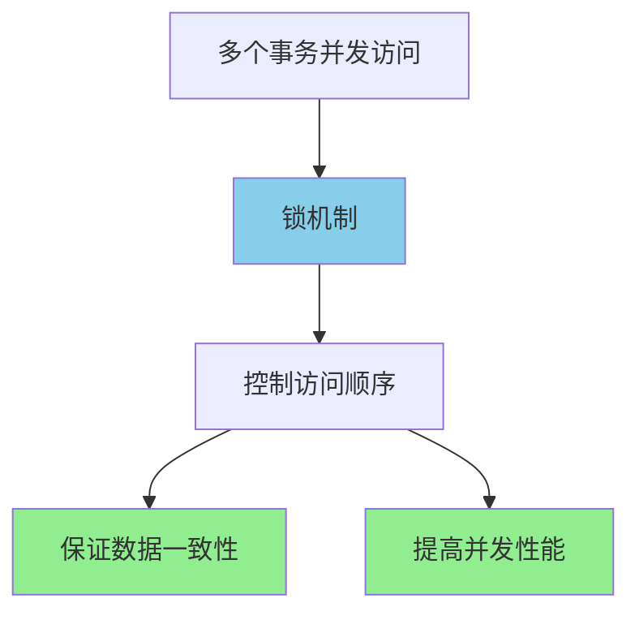

**锁的核心作用**：

| 作用 | 说明 | 示例 |
|------|------|------|
| 并发控制 | 协调多个事务对同一资源的访问 | 两个事务同时修改同一行 |
| 数据一致性 | 防止脏读、不可重复读、幻读 | 事务隔离级别的实现基础 |
| 性能优化 | 合适的锁粒度提高并发度 | 行锁比表锁并发度更高 |

---

## InnoDB中的锁

### 锁的分类

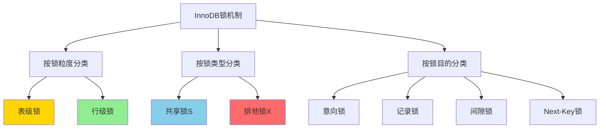

---

### 共享锁与排他锁

**锁兼容性矩阵**：

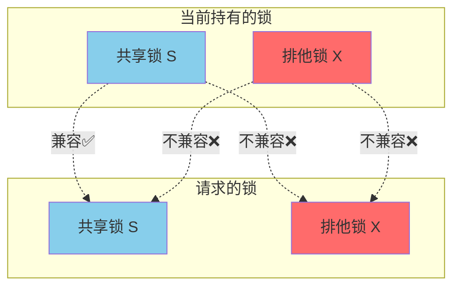

**锁兼容性表**：

|  | 共享锁(S) | 排他锁(X) |
|--|-----------|-----------|
| **共享锁(S)** | ✅ 兼容 | ❌ 不兼容 |
| **排他锁(X)** | ❌ 不兼容 | ❌ 不兼容 |

**使用场景**：

```
-- 共享锁（读锁）
SELECT * FROM users WHERE id = 1 LOCK IN SHARE MODE;
或
SELECT * FROM users WHERE id = 1 FOR SHARE;

-- 排他锁（写锁）
SELECT * FROM users WHERE id = 1 FOR UPDATE;
```

---

### 意向锁（Intention Lock）

**问题场景**：如何高效判断表级锁是否可以被获取？

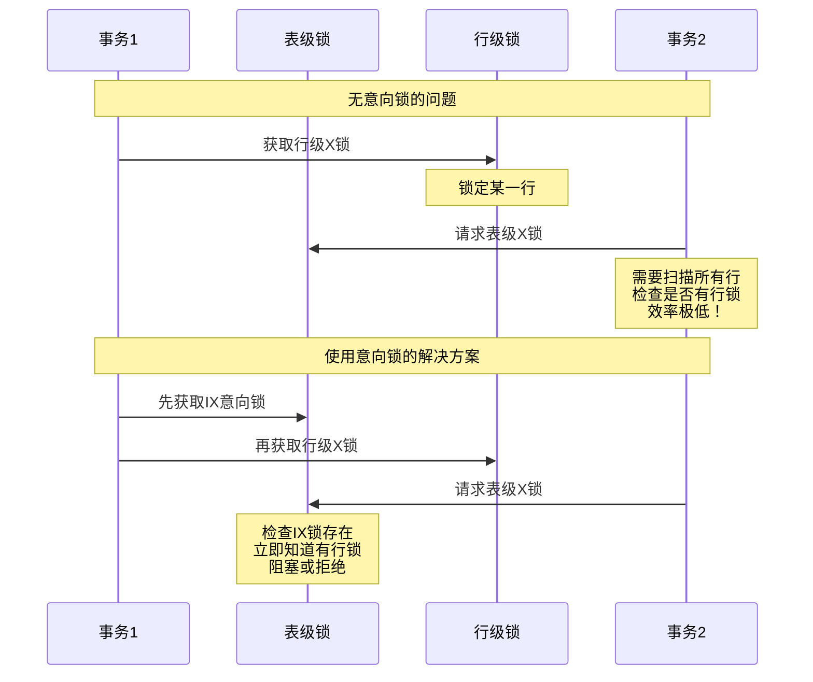

**意向锁类型**：

| 意向锁 | 全称 | 含义 | 与表级锁兼容性 |
|--------|------|------|---------------|
| **IS** | Intention Shared | 事务想要获取表中某些行的S锁 | 与S兼容，与X不兼容 |
| **IX** | Intention Exclusive | 事务想要获取表中某些行的X锁 | 只与IS兼容 |

**完整兼容性矩阵**：

|  | IS | IX | S | X |
|--|----|----|---|---|
| **IS** | ✅ | ✅ | ✅ | ❌ |
| **IX** | ✅ | ✅ | ❌ | ❌ |
| **S**  | ✅ | ❌ | ✅ | ❌ |
| **X**  | ❌ | ❌ | ❌ | ❌ |

---

## 锁的算法

### InnoDB的三种行锁算法

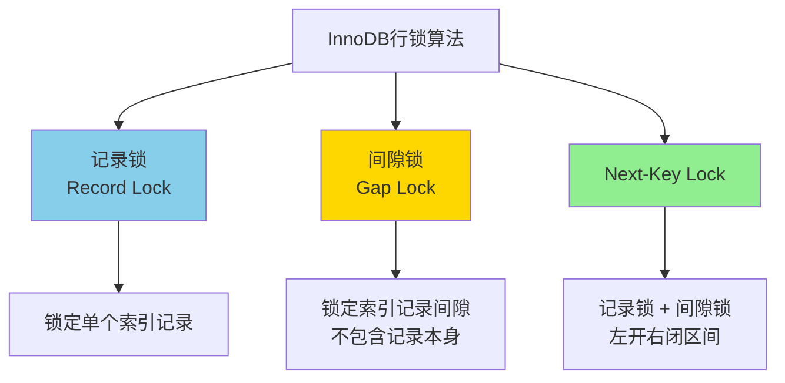

---

### Record Lock（记录锁）

**核心特点**：锁定单个索引记录。

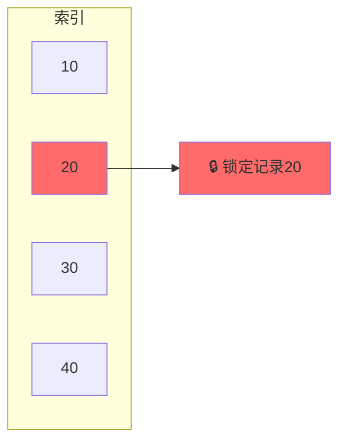

**示例场景**：

```
-- 表结构
CREATE TABLE t (
    id INT PRIMARY KEY,
    name VARCHAR(50)
);

-- 数据：id = 10, 20, 30, 40

-- 事务1
BEGIN;
SELECT * FROM t WHERE id = 20 FOR UPDATE;
-- 锁定：记录id=20
```

**特点**：
- 总是锁定索引记录
- 如果表没有索引，InnoDB会创建隐藏的聚簇索引并对其加锁

---

### Gap Lock（间隙锁）

**核心特点**：锁定索引记录之间的间隙，防止其他事务插入数据。

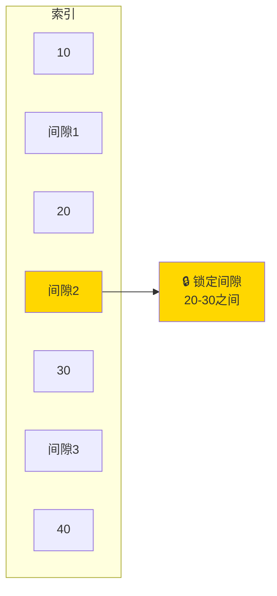

**作用**：防止幻读

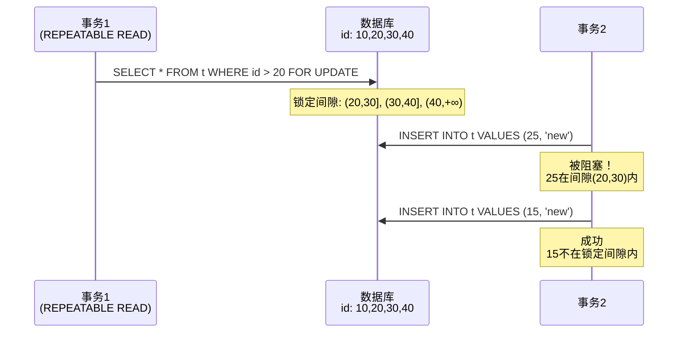

**重要特性**：

| 特性 | 说明 |
|------|------|
| 隔离级别 | 只在REPEATABLE READ及以上级别生效 |
| 锁定范围 | 开区间，不包含端点记录 |
| 目的 | 防止幻读（Phantom Read） |
| 性能影响 | 降低并发插入性能 |

---

### Next-Key Lock

**核心特点**：Record Lock + Gap Lock，锁定一个范围（左开右闭区间）。

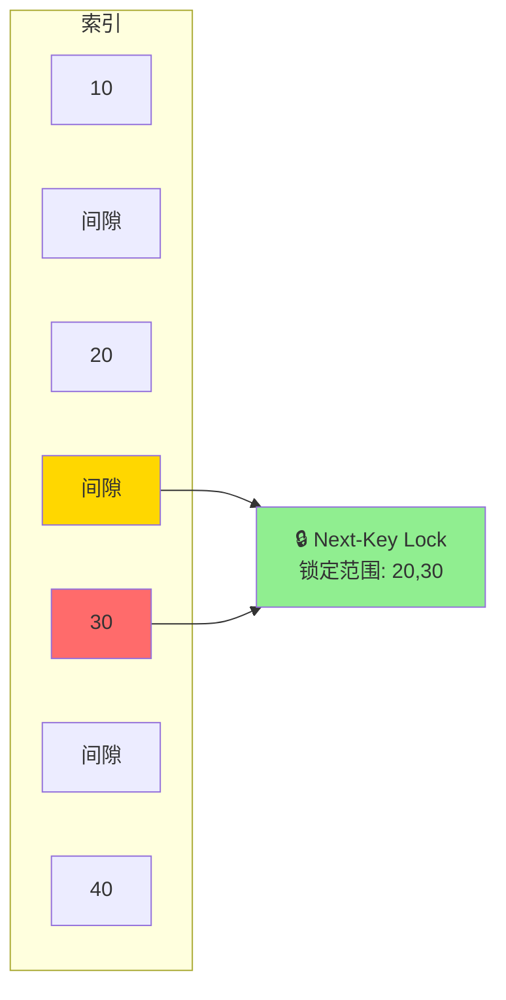

**Next-Key Lock范围示例**：

假设索引有值：10, 20, 30, 40

| 查询条件 | 锁定的Next-Key Lock范围 |
|---------|------------------------|
| `WHERE id = 20` | (10, 20] |
| `WHERE id > 20` | (20, 30], (30, 40], (40, +∞) |
| `WHERE id >= 20 AND id < 40` | (10, 20], (20, 30], (30, 40) |

**工作原理**：

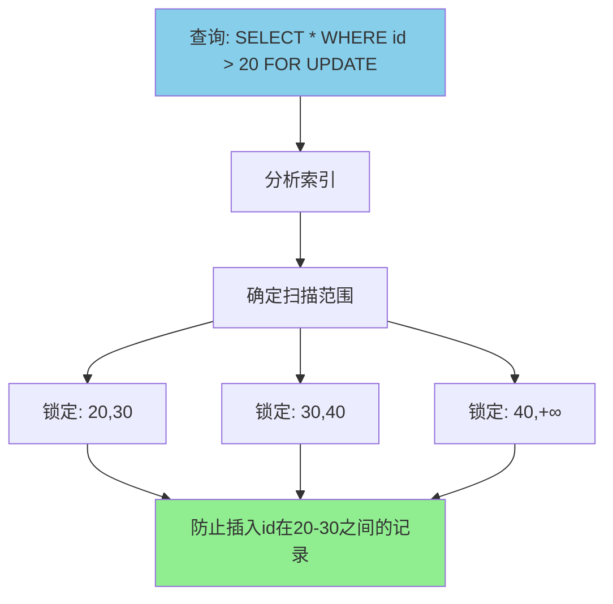

**降级为Record Lock的情况**：

```
-- 当使用唯一索引精确匹配时，Next-Key Lock降级为Record Lock

-- 索引：PRIMARY KEY (id)
-- 数据：id = 10, 20, 30, 40

-- 查询1：唯一索引等值查询，记录存在
SELECT * FROM t WHERE id = 20 FOR UPDATE;
-- 锁定：Record Lock on id=20

-- 查询2：唯一索引等值查询，记录不存在
SELECT * FROM t WHERE id = 25 FOR UPDATE;
-- 锁定：Gap Lock (20, 30)

-- 查询3：非唯一索引或范围查询
SELECT * FROM t WHERE id > 20 FOR UPDATE;
-- 锁定：Next-Key Lock (20,30], (30,40], (40,+∞)
```

---

## 锁问题

### 脏读（Dirty Read）

**问题**：读取到其他事务未提交的数据。

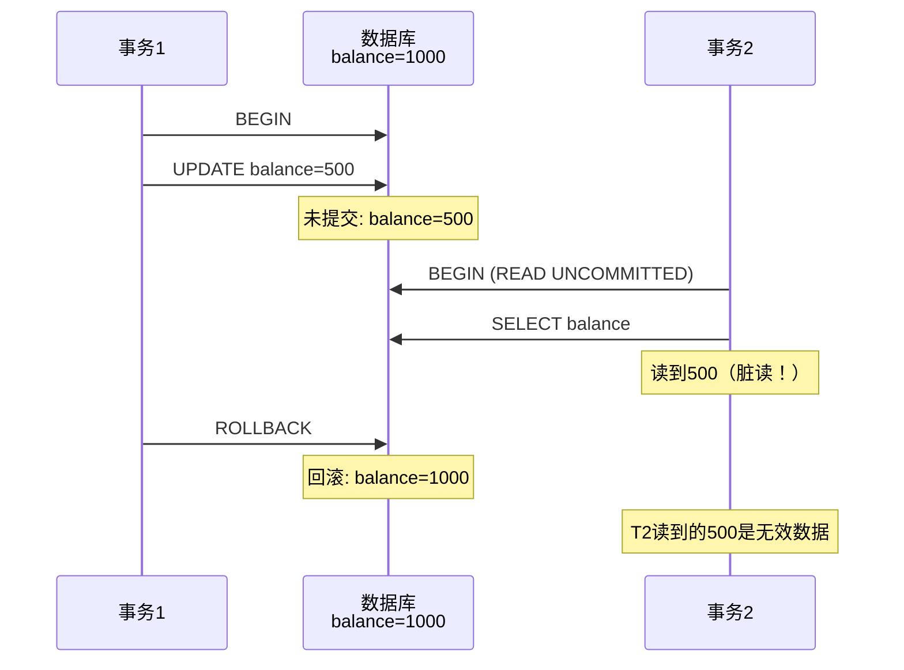

**解决方案**：使用READ COMMITTED或更高隔离级别。

---

### 不可重复读（Non-Repeatable Read）

**问题**：同一事务内，多次读取同一数据返回不同结果。

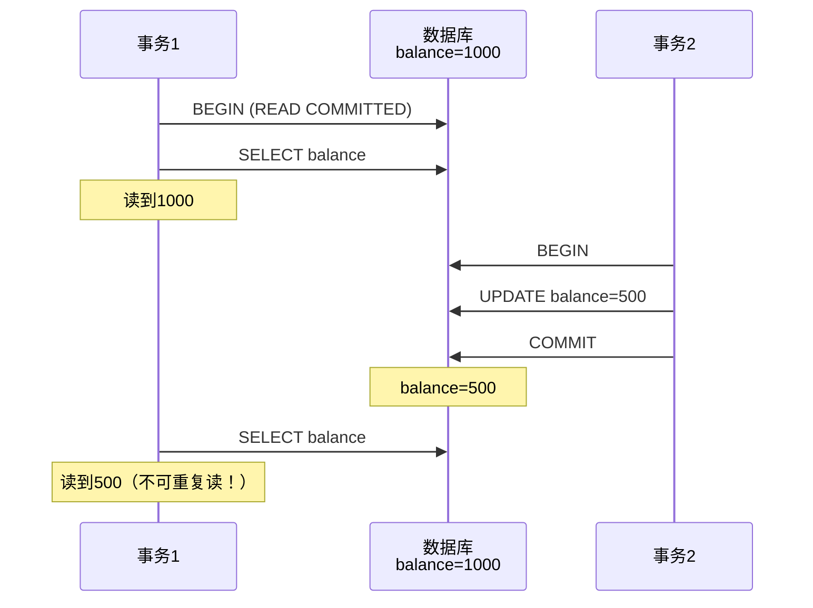

**解决方案**：使用REPEATABLE READ隔离级别（InnoDB默认）。

---

### 幻读（Phantom Read）

**问题**：同一事务内，范围查询时发现新插入的数据。

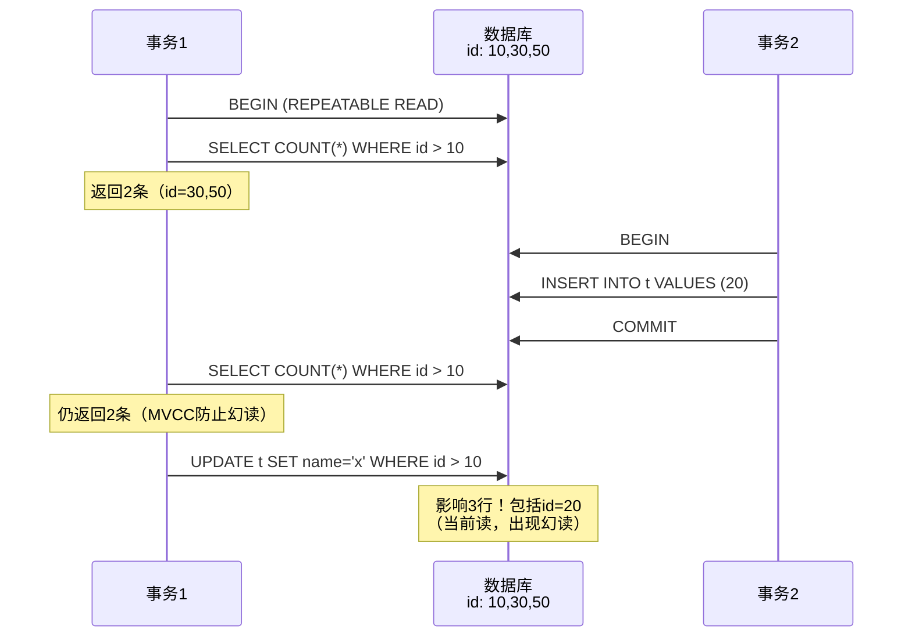

**InnoDB的防幻读机制**：

| 操作类型 | 机制 | 能否防止幻读 |
|---------|------|-------------|
| 快照读 | MVCC（多版本并发控制） | ✅ 能防止 |
| 当前读 | Next-Key Lock | ✅ 能防止 |

```
-- 快照读（使用MVCC）
SELECT * FROM t WHERE id > 10;

-- 当前读（使用Next-Key Lock）
SELECT * FROM t WHERE id > 10 FOR UPDATE;
SELECT * FROM t WHERE id > 10 LOCK IN SHARE MODE;
UPDATE t SET name = 'x' WHERE id > 10;
DELETE FROM t WHERE id > 10;
```

---

### 丢失更新（Lost Update）

**问题场景对比**：

```mermaid
graph TB
    subgraph 问题：丢失更新
    A1[事务1读取balance=100] --> A2[事务1计算: 100+50=150]
    B1[事务2读取balance=100] --> B2[事务2计算: 100-30=70]
    A2 --> A3[事务1写入150]
    B2 --> B3[事务2写入70]
    A3 --> Result1[最终: 70<br/>事务1的+50丢失!]
    B3 --> Result1
    end

    subgraph 解决方案
    C1[事务1: SELECT FOR UPDATE] --> C2[获取排他锁<br/>balance=100]
    C2 --> C3[事务2被阻塞]
    C2 --> C4[事务1更新为150并提交]
    C4 --> C5[事务1释放锁]
    C5 --> C6[事务2获得锁<br/>读到150]
    C6 --> C7[事务2更新为120并提交]
    C7 --> Result2[最终: 120<br/>两个更新都生效✅]
    end

    style Result1 fill:#FF6B6B
    style Result2 fill:#90EE90
```

**解决方案对比**：

| 方案 | SQL示例 | 优点 | 缺点 |
|------|---------|------|------|
| 显式加锁 | `SELECT ... FOR UPDATE` | 简单可靠 | 性能较差 |
| 乐观锁 | 使用version字段 | 性能好 | 需要重试逻辑 |
| 原子操作 | `UPDATE balance=balance+50` | 最优 | 仅适用简单场景 |

---

## 死锁

### 死锁产生的原因

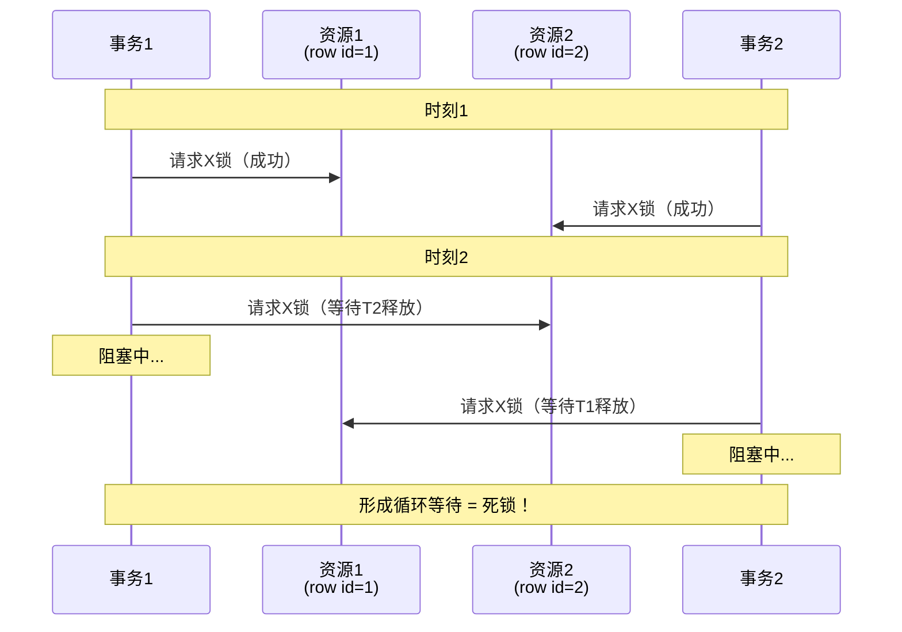

**死锁的四个必要条件**：

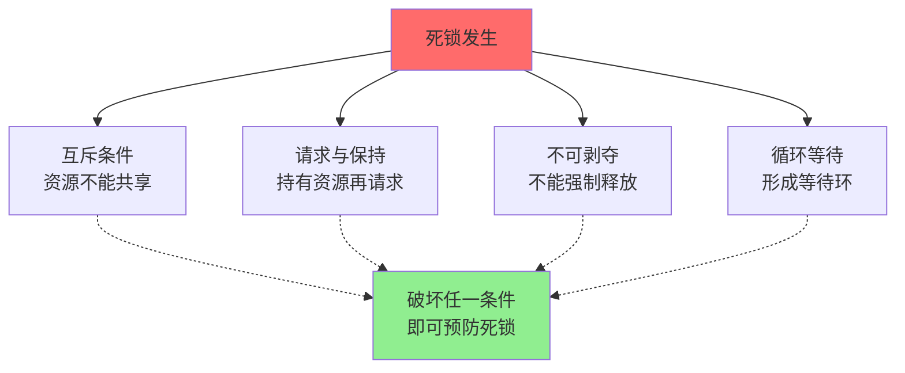

---

### InnoDB的死锁检测

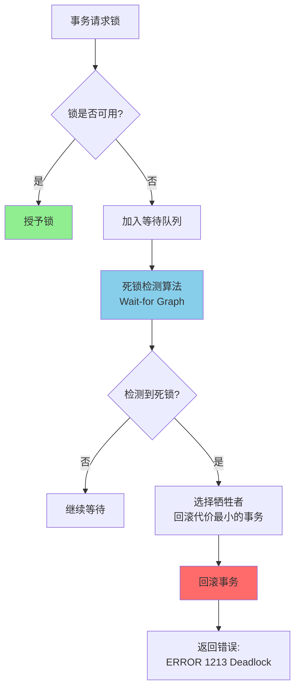

**死锁检测参数**：

| 参数 | 默认值 | 说明 |
|------|--------|------|
| `innodb_deadlock_detect` | ON | 是否开启死锁检测 |
| `innodb_lock_wait_timeout` | 50秒 | 锁等待超时时间 |

**查看死锁信息**：

```sql
-- 查看最近一次死锁信息
SHOW ENGINE INNODB STATUS;

-- 启用死锁日志
SET GLOBAL innodb_print_all_deadlocks = ON;
```

---

### 死锁示例

**示例1：经典死锁**

```
-- 会话1
BEGIN;
UPDATE t SET name='a' WHERE id=1;  -- 获取id=1的X锁
-- 等待...
UPDATE t SET name='a' WHERE id=2;  -- 尝试获取id=2的X锁（等待会话2）

-- 会话2
BEGIN;
UPDATE t SET name='b' WHERE id=2;  -- 获取id=2的X锁
UPDATE t SET name='b' WHERE id=1;  -- 尝试获取id=1的X锁（等待会话1）
-- ERROR 1213: Deadlock found when trying to get lock
```

**示例2：间隙锁死锁**

```
-- 表结构和数据
CREATE TABLE t (id INT PRIMARY KEY, name VARCHAR(10));
INSERT INTO t VALUES (10, 'a'), (30, 'c');

-- 会话1
BEGIN;
SELECT * FROM t WHERE id = 20 FOR UPDATE;  -- Gap Lock (10,30)

-- 会话2
BEGIN;
SELECT * FROM t WHERE id = 25 FOR UPDATE;  -- Gap Lock (10,30)，兼容

-- 会话1
INSERT INTO t VALUES (20, 'b');  -- 等待会话2的Gap Lock

-- 会话2
INSERT INTO t VALUES (25, 'd');  -- 等待会话1的Gap Lock
-- ERROR 1213: Deadlock found
```

---

### 避免死锁的策略

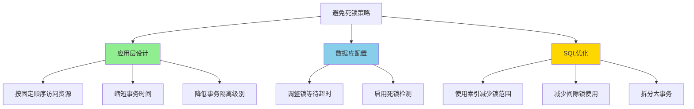

**最佳实践**：

| 策略 | 具体措施 | 效果 |
|------|---------|------|
| 按顺序加锁 | 多个资源按id排序后加锁 | 破坏循环等待条件 |
| 快速提交 | 减少事务持有锁的时间 | 降低死锁概率 |
| 使用索引 | 避免全表扫描导致的锁升级 | 减少锁范围 |
| 降低隔离级别 | 使用READ COMMITTED | 减少间隙锁 |
| 批量操作分批 | 大批量操作分多次执行 | 减少锁冲突 |

---

## 锁升级

**什么是锁升级？**

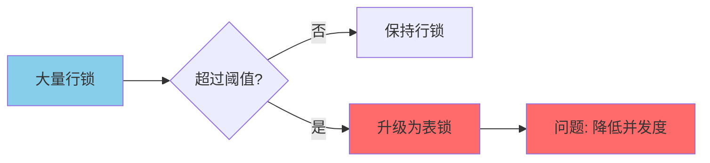

**InnoDB vs SQL Server**：

| 数据库 | 是否支持锁升级 | 说明 |
|--------|--------------|------|
| **SQL Server** | ✅ 支持 | 行锁数量超过阈值时自动升级为表锁 |
| **InnoDB** | ❌ 不支持 | 根据事务访问的每个页加锁，锁粒度固定 |

**InnoDB不支持锁升级的原因**：

- 使用位图管理锁，内存占用少
- 不需要通过锁升级来节省内存
- 保持稳定的并发性能

---

## 锁监控与诊断

### 查看锁信息

```sql
-- 查看当前锁等待情况（MySQL 8.0+）
SELECT * FROM performance_schema.data_locks;
SELECT * FROM performance_schema.data_lock_waits;

-- 查看事务信息
SELECT * FROM information_schema.INNODB_TRX;

-- 查看锁等待信息（旧版本）
SELECT * FROM information_schema.INNODB_LOCKS;
SELECT * FROM information_schema.INNODB_LOCK_WAITS;

-- 查看InnoDB引擎状态
SHOW ENGINE INNODB STATUS;
```

### 锁等待分析流程

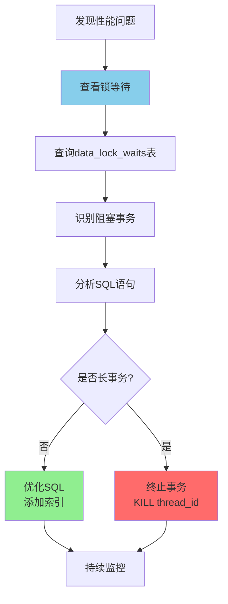

---

## 隔离级别与锁的关系

### 四种隔离级别对比

```mermaid
graph TB
    subgraph READ UNCOMMITTED
    RU[不加锁<br/>可能脏读]
    end

    subgraph READ COMMITTED
    RC[记录锁<br/>不锁间隙]
    end

    subgraph REPEATABLE READ
    RR[Next-Key Lock<br/>默认级别]
    end

    subgraph SERIALIZABLE
    S[所有读加共享锁<br/>严格串行]
    end

    RU --> RC --> RR --> S

    Note1[并发性能 ⬇] --> Note2[数据一致性 ⬆]

    style RU fill:#FF6B6B
    style RC fill:#FFD700
    style RR fill:#90EE90
    style S fill:#87CEEB
```

**隔离级别与锁对比表**：

| 隔离级别 | 脏读 | 不可重复读 | 幻读 | 加锁方式 | 间隙锁 |
|---------|------|-----------|------|---------|-------|
| READ UNCOMMITTED | ❌ | ❌ | ❌ | 几乎不加锁 | ❌ |
| READ COMMITTED | ✅ | ❌ | ❌ | 记录锁 | ❌ |
| REPEATABLE READ | ✅ | ✅ | ✅ | Next-Key Lock | ✅ |
| SERIALIZABLE | ✅ | ✅ | ✅ | 所有读加锁 | ✅ |

**查看和设置隔离级别**：

```sql
-- 查看全局隔离级别
SELECT @@global.transaction_isolation;

-- 查看会话隔离级别
SELECT @@transaction_isolation;

-- 设置会话隔离级别
SET SESSION TRANSACTION ISOLATION LEVEL READ COMMITTED;
SET SESSION TRANSACTION ISOLATION LEVEL REPEATABLE READ;
```

---

## 核心要点总结

### 锁的本质

```mermaid
graph LR
    A[并发控制需求] --> B[锁机制]
    B --> C[数据一致性]
    B --> D[高并发性能]

    style B fill:#87CEEB
    style C fill:#90EE90
    style D fill:#90EE90
```

### InnoDB锁机制核心

**锁类型层次**：

```
表级
├── 意向共享锁 (IS)
├── 意向排他锁 (IX)
├── 表级共享锁 (S)
└── 表级排他锁 (X)

行级
├── 记录锁 (Record Lock) - 锁定索引记录
├── 间隙锁 (Gap Lock) - 锁定间隙，防止插入
└── Next-Key Lock - 记录锁+间隙锁，防止幻读
```

### 关键决策树

```mermaid
graph TD
    Start[遇到并发问题] --> Q1{需要什么隔离级别?}

    Q1 -->|读未提交| L1[READ UNCOMMITTED<br/>几乎不加锁]
    Q1 -->|读已提交| L2[READ COMMITTED<br/>记录锁，无间隙锁]
    Q1 -->|可重复读| L3[REPEATABLE READ<br/>Next-Key Lock]
    Q1 -->|串行化| L4[SERIALIZABLE<br/>最严格]

    L3 --> Q2{是否有幻读问题?}
    Q2 -->|是| Keep[使用Next-Key Lock]
    Q2 -->|否| Consider[考虑降级到RC<br/>提高并发]

    style L3 fill:#90EE90
    style Keep fill:#87CEEB
    style Consider fill:#FFD700
```

### 设计建议

1. **合理选择隔离级别**：大多数场景REPEATABLE READ足够
2. **利用索引**：减少锁的范围，避免全表扫描
3. **控制事务大小**：小事务减少锁持有时间
4. **按顺序加锁**：避免死锁
5. **监控锁等待**：及时发现和优化锁冲突

### 性能优化权衡

| 优化目标 | 措施 | 代价 |
|---------|------|------|
| 提高并发 | 降低隔离级别到RC | 可能出现幻读 |
| 防止幻读 | 使用RR + Next-Key Lock | 降低插入并发 |
| 减少死锁 | 缩短事务、按序加锁 | 增加应用复杂度 |
| 快速响应 | 设置锁等待超时 | 需要重试逻辑 |
