# Ch06 锁

> **本章学习目标**：
>
> - 深入理解锁的本质和作用
> - 掌握InnoDB中lock和latch的区别
> - 理解InnoDB的多种锁类型和锁算法
> - 掌握一致性非锁定读和锁定读的原理
> - 了解常见的锁问题及其解决方案
> - 学会分析和处理死锁问题

---

## 6.1 什么是锁

锁是数据库系统区别于文件系统的一个关键特性。锁机制用于管理对共享资源的并发访问，保证数据的一致性和完整性。

**为什么需要锁？**

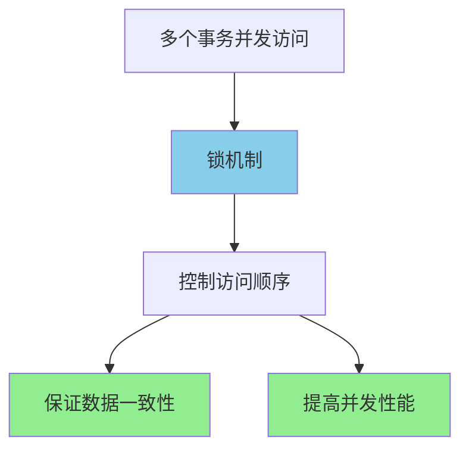
```mermaid
graph TB
    Start[多个事务并发访问] --> Lock[锁机制]
    Lock --> Control[控制访问顺序]
    Control --> Goal1[保证数据一致性]
    Control --> Goal2[提高并发性能]

    style Lock fill:#87CEEB
    style Goal1 fill:#90EE90
    style Goal2 fill:#90EE90
```

**锁的核心作用**：

| 作用       | 说明                         | 示例                   |
| ---------- | ---------------------------- | ---------------------- |
| 并发控制   | 协调多个事务对同一资源的访问 | 两个事务同时修改同一行 |
| 数据一致性 | 防止脏读、不可重复读、幻读   | 事务隔离级别的实现基础 |
| 性能优化   | 合适的锁粒度提高并发度       | 行锁比表锁并发度更高   |

---

## 6.2 lock与latch

在数据库系统中，lock和latch是两个完全不同的概念，但经常被混淆。理解它们的区别对于深入掌握数据库并发控制至关重要。

### 核心区别

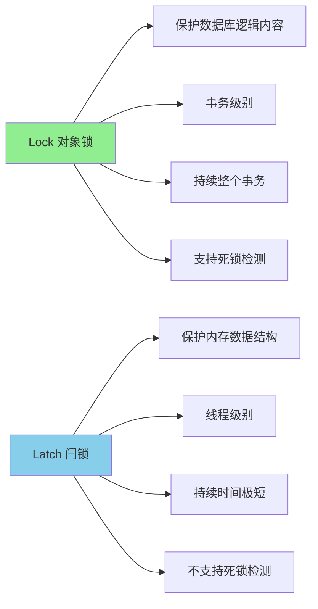
```mermaid
graph LR
    Lock[Lock 对象锁] --> L1[保护数据库逻辑内容]
    Lock --> L2[事务级别]
    Lock --> L3[持续整个事务]
    Lock --> L4[支持死锁检测]

    Latch[Latch 闩锁] --> LA1[保护内存数据结构]
    Latch --> LA2[线程级别]
    Latch --> LA3[持续时间极短]
    Latch --> LA4[不支持死锁检测]

    style Lock fill:#90EE90
    style Latch fill:#87CEEB
```

### 详细对比

| 特性               | Lock（锁）                    | Latch（闩锁）        |
| ------------------ | ----------------------------- | -------------------- |
| **对象**     | 事务                          | 线程                 |
| **保护**     | 数据库内容（表、页、行）      | 内存数据结构         |
| **持续时间** | 整个事务过程                  | 临界资源操作期间     |
| **模式**     | 行锁、表锁、意向锁            | 读写锁、互斥量       |
| **死锁**     | 通过waits-for graph、超时检测 | 无死锁检测机制       |
| **存在于**   | Lock Manager的哈希表          | 每个数据结构的对象中 |
| **粒度**     | 粗（表、页、行）              | 细（内存结构）       |
| **释放时机** | COMMIT或ROLLBACK              | 操作完成立即释放     |

### Latch的实现

**读写锁（rwlock）工作原理**：

**数据结构**：
```cpp
typedef struct rw_lock_t {
    volatile lint   lock_word;    // 锁状态字
    volatile ulint  reader_count; // 读者计数
    volatile ulint  writer_count; // 写者计数
    os_event_t      event;        // 等待事件
} rw_lock_t;
```

**加锁流程**：

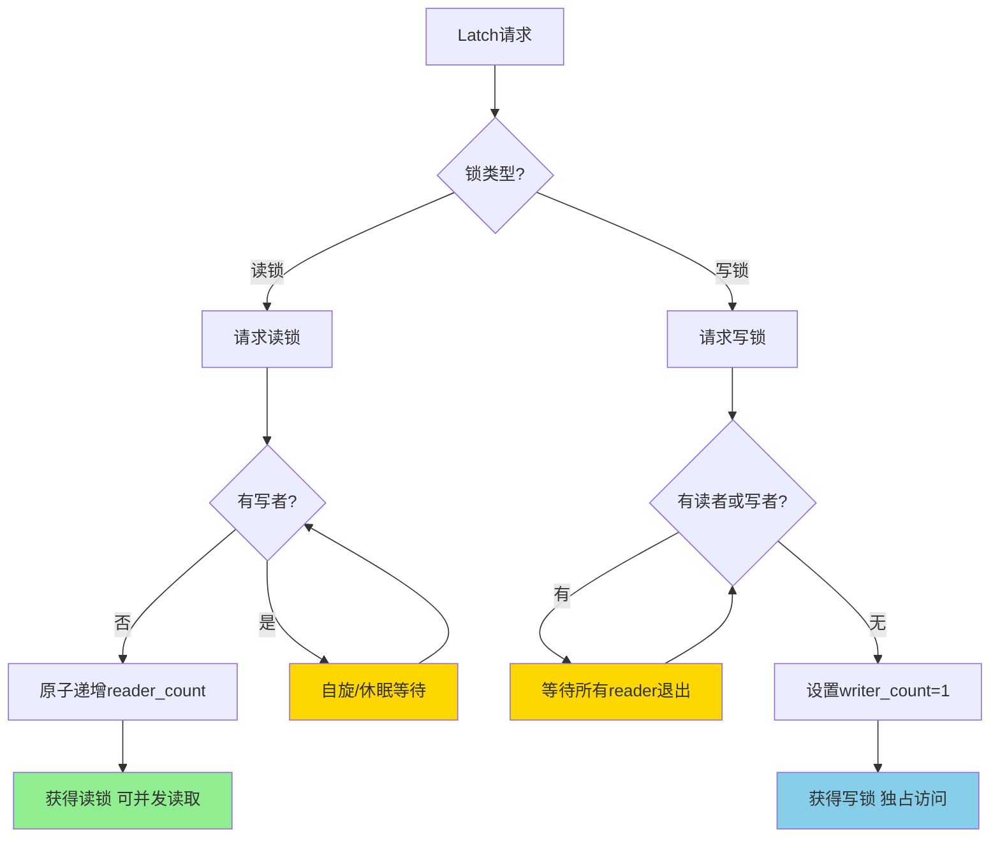
```mermaid
flowchart TB
    Start[Latch请求] --> Type{锁类型?}

    Type -->|读锁| RS[请求读锁]
    Type -->|写锁| WS[请求写锁]

    RS --> RCheck{有写者?}
    RCheck -->|否| RInc[原子递增reader_count]
    RCheck -->|是| RWait[自旋/休眠等待]
    RWait --> RCheck
    RInc --> RSuccess[获得读锁 可并发读取]

    WS --> WCheck{有读者或写者?}
    WCheck -->|有| WWait[等待所有reader退出]
    WCheck -->|无| WSet[设置writer_count=1]
    WWait --> WCheck
    WSet --> WSuccess[获得写锁 独占访问]

    style RSuccess fill:#90EE90
    style WSuccess fill:#87CEEB
    style RWait fill:#FFD700
    style WWait fill:#FFD700
```

### 查看Latch信息

```sql
-- 查看InnoDB当前的mutex和rwlock状态
SHOW ENGINE INNODB MUTEX;

-- 输出示例：
-- Type            Name                    Status
-- InnoDB          &buf_pool->mutex        os_waits=1234
-- InnoDB          &log_sys->mutex         os_waits=567
```

**输出字段解释**：

- `os_waits`：操作系统级别的等待次数（自旋失败后的阻塞）
- 值越大说明竞争越激烈

### Latch模式

InnoDB支持以下latch模式：

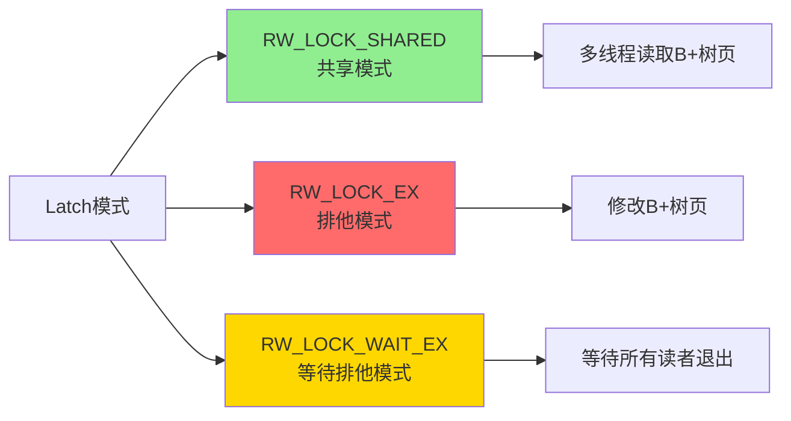
```mermaid
graph LR
    Latch[Latch模式] --> RW[RW_LOCK_SHARED<br/>共享模式]
    Latch --> RWX[RW_LOCK_EX<br/>排他模式]
    Latch --> RWSX[RW_LOCK_WAIT_EX<br/>等待排他模式]

    RW --> Example1[多线程读取B+树页]
    RWX --> Example2[修改B+树页]
    RWSX --> Example3[等待所有读者退出]

    style RW fill:#90EE90
    style RWX fill:#FF6B6B
    style RWSX fill:#FFD700
```

### 实际应用场景

**场景1：读取B+树叶子节点**

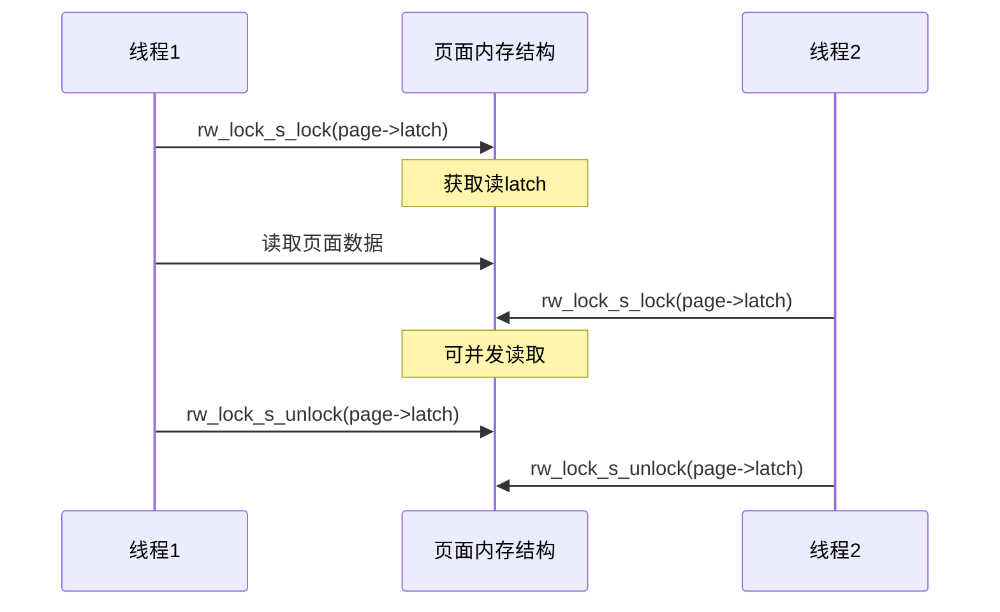
```mermaid
sequenceDiagram
    participant T1 as 线程1
    participant Page as 页面内存结构
    participant T2 as 线程2

    T1->>Page: rw_lock_s_lock(page->latch)
    Note over Page: 获取读latch
    T1->>Page: 读取页面数据

    T2->>Page: rw_lock_s_lock(page->latch)
    Note over Page: 可并发读取

    T1->>Page: rw_lock_s_unlock(page->latch)
    T2->>Page: rw_lock_s_unlock(page->latch)
```

**场景2：修改B+树结构（SMO - Structure Modification Operation）**

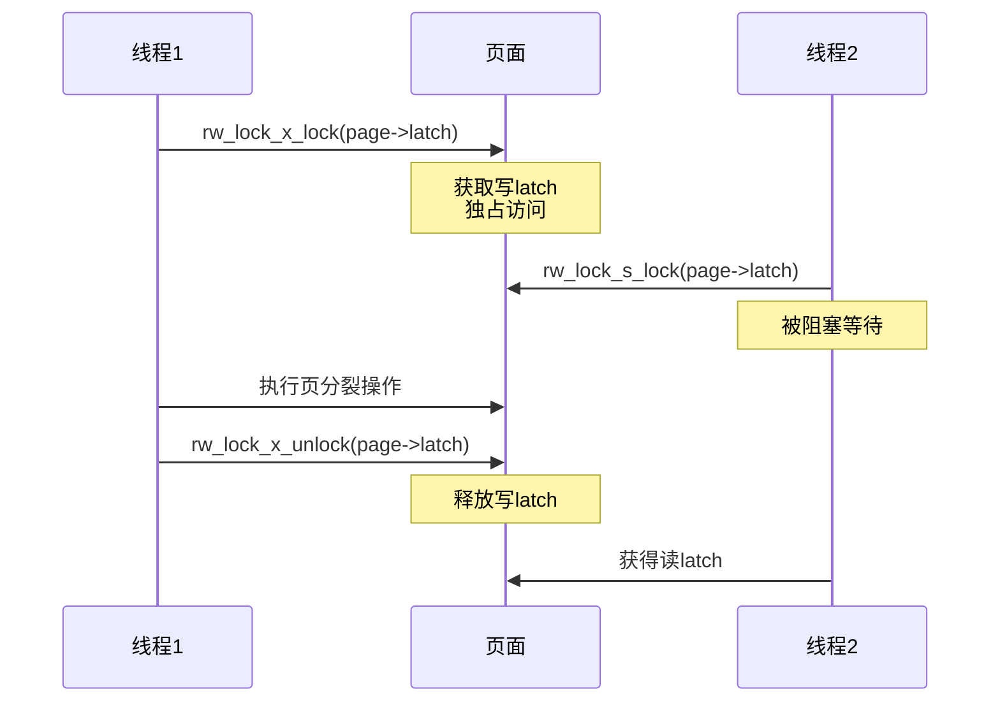
```mermaid
sequenceDiagram
    participant T1 as 线程1
    participant Page as 页面
    participant T2 as 线程2

    T1->>Page: rw_lock_x_lock(page->latch)
    Note over Page: 获取写latch<br/>独占访问

    T2->>Page: rw_lock_s_lock(page->latch)
    Note over T2: 被阻塞等待

    T1->>Page: 执行页分裂操作
    T1->>Page: rw_lock_x_unlock(page->latch)
    Note over Page: 释放写latch

    T2->>Page: 获得读latch
```

### 性能影响

**Latch争用的性能影响**：

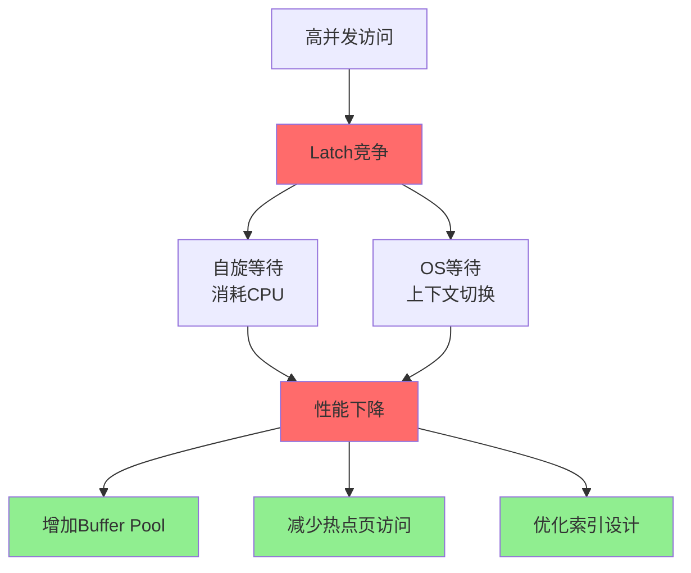
```mermaid
graph TB
    HighConcurrency[高并发访问] --> LatchContention[Latch竞争]

    LatchContention --> Spin[自旋等待<br/>消耗CPU]
    LatchContention --> OSWait[OS等待<br/>上下文切换]

    Spin --> PerfDegradation[性能下降]
    OSWait --> PerfDegradation

    PerfDegradation --> Solution1[增加Buffer Pool]
    PerfDegradation --> Solution2[减少热点页访问]
    PerfDegradation --> Solution3[优化索引设计]

    style LatchContention fill:#FF6B6B
    style PerfDegradation fill:#FF6B6B
    style Solution1 fill:#90EE90
    style Solution2 fill:#90EE90
    style Solution3 fill:#90EE90
```

**监控Latch争用**：

```sql
-- 查看Semaphore等待信息
SHOW ENGINE INNODB STATUS\G

-- 输出片段：
-- SEMAPHORES
-- OS WAIT ARRAY INFO: reservation count 1234567
-- --Thread 139876543211264 has waited at btr0cur.cc line 1234 for 0.01 seconds
-- Mutex spin waits 79626940, rounds 157459864, OS waits 698719
```

**关键指标解读**：

- `spin waits`：自旋等待次数
- `rounds`：自旋轮次
- `OS waits`：操作系统级等待次数
- 如果 `OS waits` 过高，说明有严重的latch争用

---

## 6.3 InnoDB存储引擎中的锁

**锁兼容:** 当一个事务已经获得了行r的共享锁，那么另外的事务可以立即获得行r的共享锁

**锁不兼容:** 如果有事务想获得行r的排他锁，则它必须等待事务释放行r上的共享锁

### 6.3.1 锁的类型

InnoDB实现了两种标准的行级锁和多种表级锁。

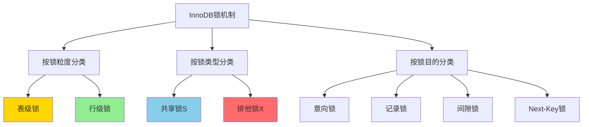
```mermaid
graph TB
    InnoDB[InnoDB锁机制] --> Level[按锁粒度分类]
    InnoDB --> Type[按锁类型分类]
    InnoDB --> Purpose[按锁目的分类]

    Level --> Table[表级锁]
    Level --> Row[行级锁]

    Type --> Shared[共享锁S]
    Type --> Exclusive[排他锁X]

    Purpose --> Intent[意向锁]
    Purpose --> Record[记录锁]
    Purpose --> Gap[间隙锁]
    Purpose --> NextKey[Next-Key锁]

    style Table fill:#FFD700
    style Row fill:#90EE90
    style Shared fill:#87CEEB
    style Exclusive fill:#FF6B6B
```

---

### 共享锁与排他锁

**锁兼容性表**：

|                     | 共享锁(S) | 排他锁(X) |
| ------------------- | --------- | --------- |
| **共享锁(S)** | ✅ 兼容   | ❌ 不兼容 |
| **排他锁(X)** | ❌ 不兼容 | ❌ 不兼容 |

**使用场景**：

```
-- 共享锁（读锁）
SELECT * FROM users WHERE id = 1 LOCK IN SHARE MODE;
或
SELECT * FROM users WHERE id = 1 FOR SHARE;

-- 排他锁（写锁）
SELECT * FROM users WHERE id = 1 FOR UPDATE;
```

---

### 意向锁（Intention Lock）

**问题场景**：如何高效判断表级锁是否可以被获取？

**一、为什么有意向锁（动机）**

InnoDB 实现的是 **多粒度锁（multigranularity locking）** ：既有行级锁，也有表级锁。为了高并发，行级锁是主力，但如果某个事务要在表上加一个表级锁（比如写表级排他锁），必须确保没有其他事务在该表的任何行上持有与之冲突的行锁。逐行检查会成本极高——意向锁就是为了解决这个协调问题：

 **意向锁是表级的“宣告”** ，告诉其他事务：“我在这个表的某些行上已经或将要申请某种类型的行锁（共享或排他）”。这样，当另一个事务要申请表级锁时，只需看表级的意向锁，而不用遍历所有行锁。

**二、 意向锁的类型**

InnoDB 中有两种意向锁，类似于行锁的 S/X：

* **IS（Intention Shared）** ：事务计划在表的某些行上获取共享锁（S）。
* **IX（Intention Exclusive）** ：事务计划在表的某些行上获取排他锁（X）。

*注意：IS/IX 是 **表级锁** ，不是行锁；实际的行锁仍然是 S 或 X（或更细的 gap/next-key）。*

**三、 获取流程（简化）**

当事务要对某一行获取行级锁时，InnoDB 会按“自上而下”的顺序申请锁：

* 若要在某行上申请  **S（共享行锁）** ：
  1. 先在表上申请  **IS** （表级意向锁）。
  2. 再在目标行上申请  **S** 。
* 若要在某行上申请  **X（排他行锁）** ：
  1. 先在表上申请  **IX** 。
  2. 再在目标行上申请  **X** 。

这保证了：任何想拿表级锁（S 表锁或 X 表锁）的事务，只需检查表级的意向锁，就能知道是否安全，而不用看所有行锁。

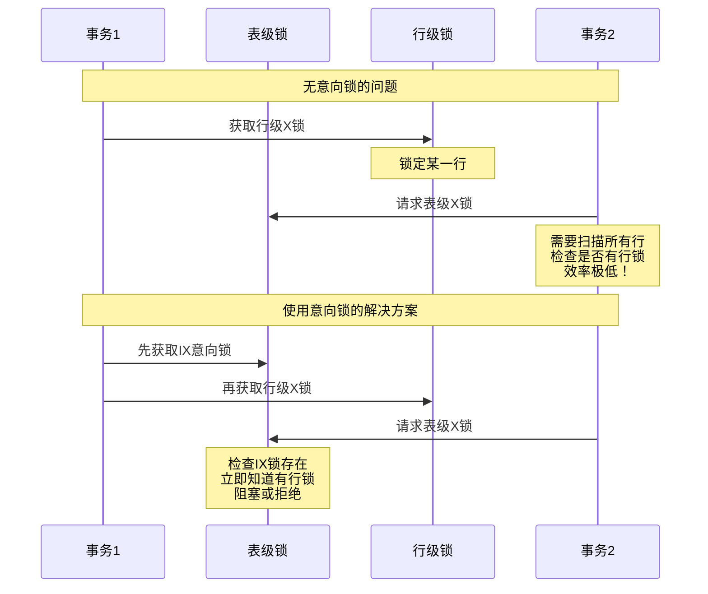
```mermaid
sequenceDiagram
    participant T1 as 事务1
    participant Table as 表级锁
    participant Row as 行级锁
    participant T2 as 事务2

    Note over T1,T2: 无意向锁的问题

    T1->>Row: 获取行级X锁
    Note over Row: 锁定某一行

    T2->>Table: 请求表级X锁
    Note over T2: 需要扫描所有行<br/>检查是否有行锁<br/>效率极低！

    Note over T1,T2: 使用意向锁的解决方案

    T1->>Table: 先获取IX意向锁
    T1->>Row: 再获取行级X锁

    T2->>Table: 请求表级X锁
    Note over Table: 检查IX锁存在<br/>立即知道有行锁<br/>阻塞或拒绝
```

**意向锁类型**：

| 意向锁       | 全称                | 含义                        | 与表级锁兼容性     |
| ------------ | ------------------- | --------------------------- | ------------------ |
| **IS** | Intention Shared    | 事务想要获取表中某些行的S锁 | 与S兼容，与X不兼容 |
| **IX** | Intention Exclusive | 事务想要获取表中某些行的X锁 | 只与IS兼容         |

**完整兼容性矩阵**：

|              | IS | IX | S  | X  |
| ------------ | -- | -- | -- | -- |
| **IS** | ✅ | ✅ | ✅ | ❌ |
| **IX** | ✅ | ✅ | ❌ | ❌ |
| **S**  | ✅ | ❌ | ✅ | ❌ |
| **X**  | ❌ | ❌ | ❌ | ❌ |

---

## 锁的算法

### InnoDB的三种行锁算法

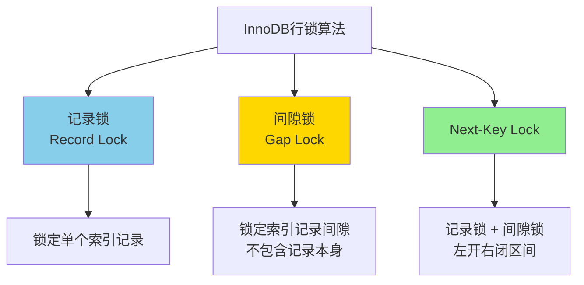
```mermaid
graph TB
    RowLock[InnoDB行锁算法] --> RecordLock[记录锁<br/>Record Lock]
    RowLock --> GapLock[间隙锁<br/>Gap Lock]
    RowLock --> NextKeyLock[Next-Key Lock]

    RecordLock --> R1[锁定单个索引记录]
    GapLock --> G1[锁定索引记录间隙<br/>不包含记录本身]
    NextKeyLock --> N1[记录锁 + 间隙锁<br/>左开右闭区间]

    style RecordLock fill:#87CEEB
    style GapLock fill:#FFD700
    style NextKeyLock fill:#90EE90
```

---

### 6.3.2 一致性非锁定读

**核心概念**：一致性非锁定读（Consistent Nonlocking Read）是InnoDB在READ COMMITTED和REPEATABLE READ隔离级别下，通过多版本并发控制（MVCC）实现的读取方式。

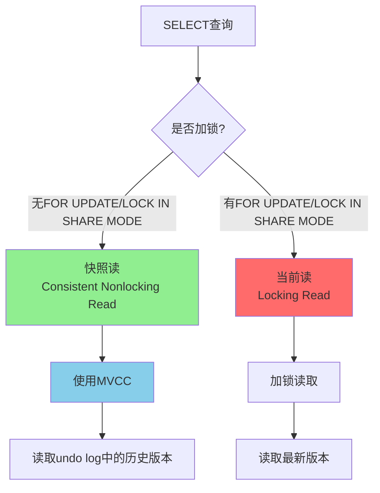
```mermaid
graph TB
    Query[SELECT查询] --> Check{是否加锁?}

    Check -->|无FOR UPDATE/LOCK IN SHARE MODE| Snapshot[快照读<br/>Consistent Nonlocking Read]
    Check -->|有FOR UPDATE/LOCK IN SHARE MODE| Current[当前读<br/>Locking Read]

    Snapshot --> MVCC[使用MVCC]
    MVCC --> Undo[读取undo log中的历史版本]

    Current --> Lock[加锁读取]
    Lock --> Latest[读取最新版本]

    style Snapshot fill:#90EE90
    style Current fill:#FF6B6B
    style MVCC fill:#87CEEB
```

**工作原理**：

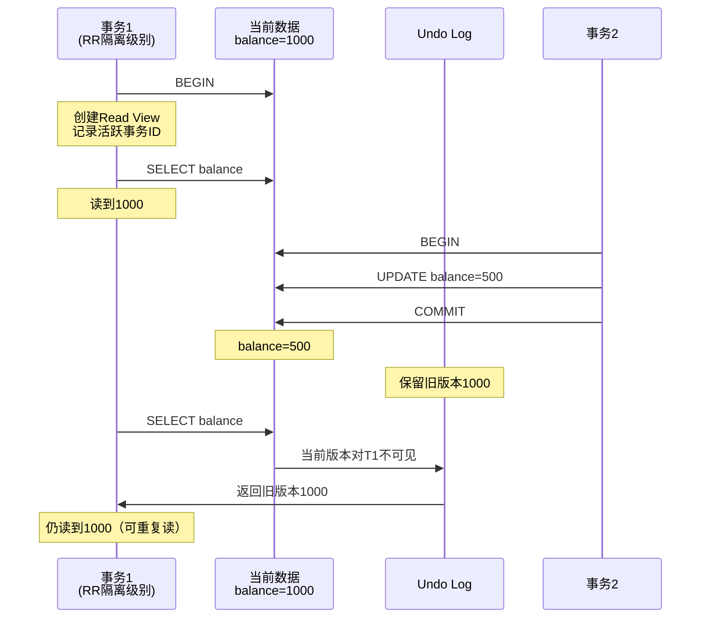
```mermaid
sequenceDiagram
    participant T1 as 事务1<br/>(RR隔离级别)
    participant Data as 当前数据<br/>balance=1000
    participant Undo as Undo Log
    participant T2 as 事务2

    T1->>Data: BEGIN
    Note over T1: 创建Read View<br/>记录活跃事务ID

    T1->>Data: SELECT balance
    Note over T1: 读到1000

    T2->>Data: BEGIN
    T2->>Data: UPDATE balance=500
    T2->>Data: COMMIT
    Note over Data: balance=500
    Note over Undo: 保留旧版本1000

    T1->>Data: SELECT balance
    Data->>Undo: 当前版本对T1不可见
    Undo->>T1: 返回旧版本1000
    Note over T1: 仍读到1000（可重复读）
```

**Read View机制**：

InnoDB通过Read View判断记录的哪个版本对当前事务可见。

**Read View结构**：
```cpp
class ReadView {
    trx_id_t    m_low_limit_id;   // 大于该ID的事务不可见
    trx_id_t    m_up_limit_id;    // 小于该ID的事务可见
    trx_ids_t   m_ids;            // 活跃事务ID列表
    trx_id_t    m_creator_trx_id; // 创建者事务ID
};
```

**可见性判断流程**：

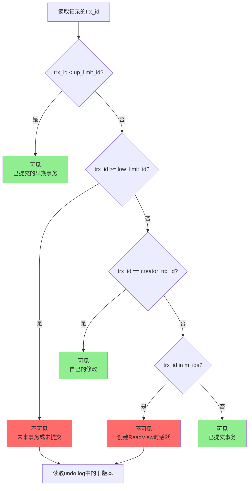
```mermaid
flowchart TB
    Start[读取记录的trx_id] --> Check1{trx_id < up_limit_id?}

    Check1 -->|是| Visible1[可见<br/>已提交的早期事务]

    Check1 -->|否| Check2{trx_id >= low_limit_id?}
    Check2 -->|是| Invisible[不可见<br/>未来事务或未提交]

    Check2 -->|否| Check3{trx_id == creator_trx_id?}
    Check3 -->|是| Visible2[可见<br/>自己的修改]

    Check3 -->|否| Check4{trx_id in m_ids?}
    Check4 -->|是| Invisible2[不可见<br/>创建ReadView时活跃]
    Check4 -->|否| Visible3[可见<br/>已提交事务]

    Invisible --> ReadUndo[读取undo log中的旧版本]
    Invisible2 --> ReadUndo

    style Visible1 fill:#90EE90
    style Visible2 fill:#90EE90
    style Visible3 fill:#90EE90
    style Invisible fill:#FF6B6B
    style Invisible2 fill:#FF6B6B
```

**不同隔离级别下的Read View创建时机**：

| 隔离级别        | Read View创建时机  | 效果                       |
| --------------- | ------------------ | -------------------------- |
| READ COMMITTED  | 每次SELECT时创建   | 能读到其他事务已提交的修改 |
| REPEATABLE READ | 第一次SELECT时创建 | 始终读到一致的快照         |

**示例：RC vs RR**

```sql
-- 初始数据：id=1, name='A', version=100

-- READ COMMITTED
SET SESSION TRANSACTION ISOLATION LEVEL READ COMMITTED;

-- 会话1
BEGIN;
SELECT * FROM t WHERE id=1; -- name='A'

-- 会话2
BEGIN;
UPDATE t SET name='B' WHERE id=1;
COMMIT;

-- 会话1
SELECT * FROM t WHERE id=1; -- name='B'（读到新值！）
-- 因为每次SELECT都创建新的Read View

-- REPEATABLE READ
SET SESSION TRANSACTION ISOLATION LEVEL REPEATABLE READ;

-- 会话1
BEGIN;
SELECT * FROM t WHERE id=1; -- name='A'，创建Read View

-- 会话2
BEGIN;
UPDATE t SET name='B' WHERE id=1;
COMMIT;

-- 会话1
SELECT * FROM t WHERE id=1; -- name='A'（仍是旧值）
-- 使用第一次SELECT时创建的Read View
```

**非锁定读的优势**：

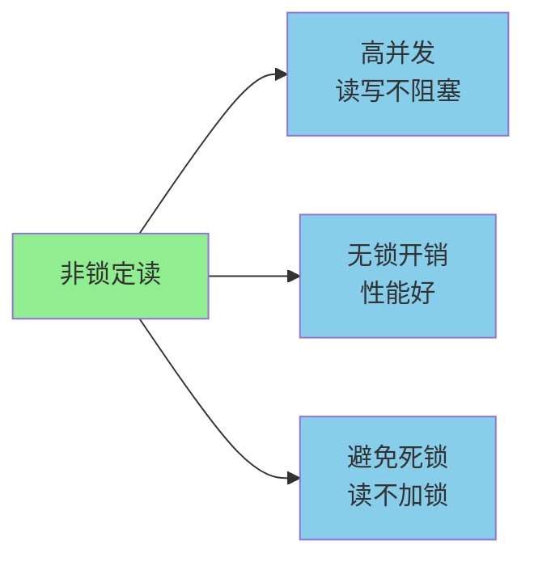
```mermaid
graph LR
    NLR[非锁定读] --> Adv1[高并发<br/>读写不阻塞]
    NLR --> Adv2[无锁开销<br/>性能好]
    NLR --> Adv3[避免死锁<br/>读不加锁]

    style NLR fill:#90EE90
    style Adv1 fill:#87CEEB
    style Adv2 fill:#87CEEB
    style Adv3 fill:#87CEEB
```

---

### 6.3.3 一致性锁定读

**核心概念**：在某些情况下，用户需要显式地对读取操作加锁，以保证数据逻辑的一致性。InnoDB提供两种锁定读方式。

**两种锁定读语法**：

```sql
-- 1. 共享锁（S锁）
SELECT * FROM table WHERE ... LOCK IN SHARE MODE;
-- 或（MySQL 8.0新语法）
SELECT * FROM table WHERE ... FOR SHARE;

-- 2. 排他锁（X锁）
SELECT * FROM table WHERE ... FOR UPDATE;
```

**锁定读对比**：

| 锁类型      | 语法                   | 允许其他事务读 | 允许其他事务写 | 典型场景           |
| ----------- | ---------------------- | -------------- | -------------- | ------------------ |
| 共享锁（S） | `LOCK IN SHARE MODE` | ✅ 允许        | ❌ 阻塞        | 确保读取时数据不变 |
| 排他锁（X） | `FOR UPDATE`         | ❌ 阻塞        | ❌ 阻塞        | 准备修改数据       |

**场景1：防止丢失更新**

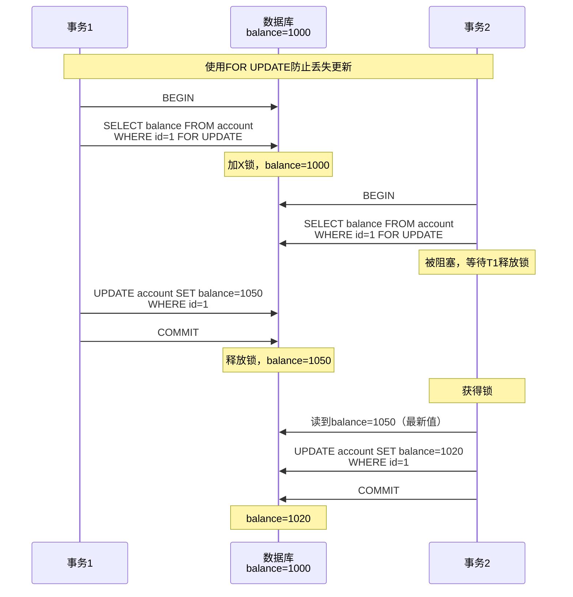
```mermaid
sequenceDiagram
    participant T1 as 事务1
    participant DB as 数据库<br/>balance=1000
    participant T2 as 事务2

    Note over T1,T2: 使用FOR UPDATE防止丢失更新

    T1->>DB: BEGIN
    T1->>DB: SELECT balance FROM account<br/>WHERE id=1 FOR UPDATE
    Note over DB: 加X锁，balance=1000

    T2->>DB: BEGIN
    T2->>DB: SELECT balance FROM account<br/>WHERE id=1 FOR UPDATE
    Note over T2: 被阻塞，等待T1释放锁

    T1->>DB: UPDATE account SET balance=1050<br/>WHERE id=1
    T1->>DB: COMMIT
    Note over DB: 释放锁，balance=1050

    Note over T2: 获得锁
    T2->>DB: 读到balance=1050（最新值）
    T2->>DB: UPDATE account SET balance=1020<br/>WHERE id=1
    T2->>DB: COMMIT
    Note over DB: balance=1020
```

**场景2：SELECT ... FOR SHARE的应用**

```sql
-- 场景：在线商城库存检查
-- 事务1：检查库存并下单
BEGIN;
-- 加共享锁，确保库存在检查期间不被修改
SELECT stock FROM products WHERE id=100 LOCK IN SHARE MODE;
-- stock=50

-- 检查库存充足后插入订单
INSERT INTO orders (product_id, quantity) VALUES (100, 10);

-- 扣减库存（此时升级为X锁）
UPDATE products SET stock=stock-10 WHERE id=100;
COMMIT;

-- 事务2：同时有其他用户查询库存
BEGIN;
SELECT stock FROM products WHERE id=100 LOCK IN SHARE MODE;
-- 可以成功执行（S锁兼容）
-- stock=50
```

**场景3：父子表关系维护**

```sql
-- 确保父记录存在后再插入子记录
BEGIN;

-- 锁定父记录，防止被删除
SELECT * FROM parent WHERE id=1 FOR SHARE;

-- 插入子记录
INSERT INTO child (parent_id, data) VALUES (1, 'some data');

COMMIT;
```

**锁定读的锁范围**：

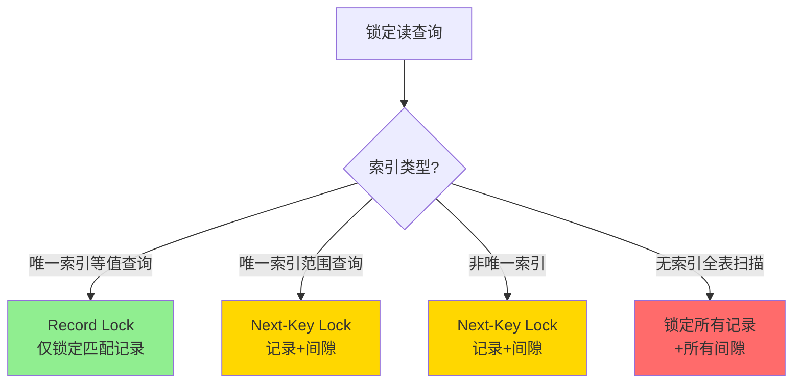
```mermaid
graph TB
    Query[锁定读查询] --> IndexType{索引类型?}

    IndexType -->|唯一索引等值查询| RecordLock[Record Lock<br/>仅锁定匹配记录]
    IndexType -->|唯一索引范围查询| NextKey[Next-Key Lock<br/>记录+间隙]
    IndexType -->|非唯一索引| NextKey2[Next-Key Lock<br/>记录+间隙]
    IndexType -->|无索引全表扫描| TableLock[锁定所有记录<br/>+所有间隙]

    style RecordLock fill:#90EE90
    style NextKey fill:#FFD700
    style NextKey2 fill:#FFD700
    style TableLock fill:#FF6B6B
```

**示例：不同查询的加锁范围**

```sql
-- 表结构
CREATE TABLE t (
    id INT PRIMARY KEY,
    age INT,
    name VARCHAR(50),
    KEY idx_age (age)
);
-- 数据：id=1(age=10), 5(age=20), 10(age=30)

-- 查询1：主键等值查询
SELECT * FROM t WHERE id=5 FOR UPDATE;
-- 加锁：Record Lock on id=5

-- 查询2：普通索引等值查询
SELECT * FROM t WHERE age=20 FOR UPDATE;
-- 加锁：Next-Key Lock (10,20], Record Lock on id=5, Gap Lock (20,30)

-- 查询3：范围查询
SELECT * FROM t WHERE id>=5 FOR UPDATE;
-- 加锁：Next-Key Lock (1,5], Record Lock on id=5, (5,10], (10,+∞)

-- 查询4：无索引查询（全表扫描）
SELECT * FROM t WHERE name='Alice' FOR UPDATE;
-- 加锁：所有记录的Next-Key Lock + 所有间隙锁（等同于锁表）
```

**当前读vs快照读对比**：

```sql
-- 场景：库存扣减
-- 初始：stock=100

-- 事务1
BEGIN;
SELECT stock FROM products WHERE id=1; -- 快照读，stock=100

-- 事务2
BEGIN;
UPDATE products SET stock=stock-50 WHERE id=1;
COMMIT; -- stock=50

-- 事务1
SELECT stock FROM products WHERE id=1; -- 快照读，仍是100
SELECT stock FROM products WHERE id=1 FOR UPDATE; -- 当前读，读到50！
UPDATE products SET stock=stock-10 WHERE id=1; -- 基于50扣减，stock=40
COMMIT;
```

---

### 6.3.4 自增长与锁

**AUTO_INCREMENT机制**：

InnoDB使用特殊的表级锁——AUTO-INC Lock来保证自增值的连续性和唯一性。

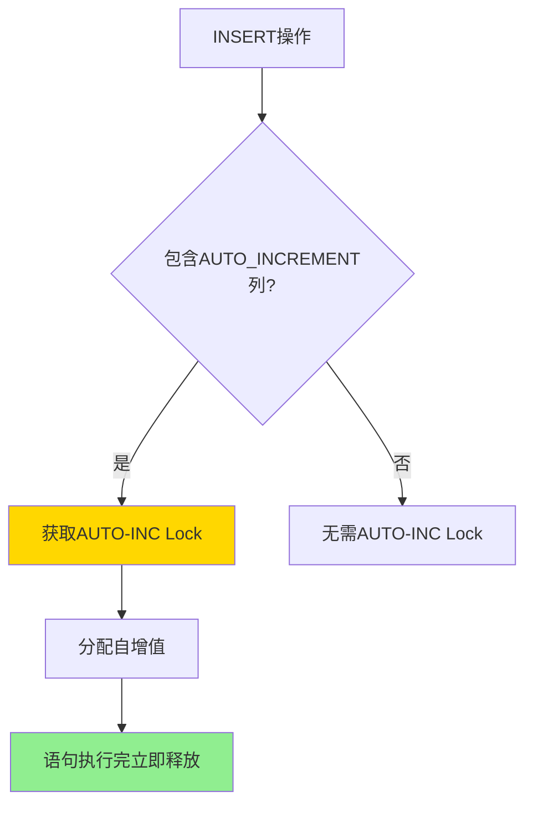
```mermaid
graph TB
    Insert[INSERT操作] --> AutoInc{包含AUTO_INCREMENT列?}

    AutoInc -->|是| GetLock[获取AUTO-INC Lock]
    AutoInc -->|否| NoLock[无需AUTO-INC Lock]

    GetLock --> Allocate[分配自增值]
    Allocate --> Release[语句执行完立即释放]

    style GetLock fill:#FFD700
    style Release fill:#90EE90
```

**自增锁模式**：

InnoDB提供三种自增锁模式，通过参数 `innodb_autoinc_lock_mode`控制。

| 模式值 | 名称             | 锁机制                   | 性能 | 安全性                |
| ------ | ---------------- | ------------------------ | ---- | --------------------- |
| 0      | 传统模式         | 表级AUTO-INC Lock        | 低   | 主从复制安全          |
| 1      | 连续模式（默认） | 轻量级互斥量（简单插入） | 中   | statement复制时不安全 |
| 2      | 交叉模式         | 无锁，可能不连续         | 高   | 仅row-based复制时安全 |

**模式详解**：

**模式0：传统模式（Traditional）**

```sql
-- 设置
SET GLOBAL innodb_autoinc_lock_mode = 0;

-- 行为
INSERT INTO t1 (name) VALUES ('a'), ('b'), ('c');
-- 1. 获取表级AUTO-INC Lock
-- 2. 分配id=1,2,3
-- 3. 语句结束后释放锁

-- 特点：
-- - 所有INSERT都持有AUTO-INC Lock直到语句结束
-- - 并发INSERT会串行化
-- - 保证自增值严格连续
```

**模式1：连续模式（Consecutive，MySQL 8.0默认）**

```sql
SET GLOBAL innodb_autoinc_lock_mode = 1;

-- 简单INSERT（可预先确定插入行数）
INSERT INTO t1 (name) VALUES ('a'); -- 使用轻量级mutex，立即释放
INSERT INTO t1 (name) VALUES ('b'), ('c'); -- 使用轻量级mutex

-- 批量INSERT（无法预先确定行数）
INSERT INTO t1 (name) SELECT name FROM t2; -- 使用传统AUTO-INC Lock

-- 特点：
-- - 简单INSERT使用mutex，性能更好
-- - 批量INSERT仍用AUTO-INC Lock
-- - 大多数场景下自增值连续
```

**模式2：交叉模式（Interleaved）**

```sql
SET GLOBAL innodb_autoinc_lock_mode = 2;

-- 所有INSERT都不持有AUTO-INC Lock
-- 使用原子操作分配自增值

-- 并发场景
-- 事务1: INSERT INTO t1 VALUES (), (), ();  -- 可能得到id=1,5,8
-- 事务2: INSERT INTO t1 VALUES (), ();      -- 可能得到id=2,3
-- 事务3: INSERT INTO t1 VALUES (), (), ();  -- 可能得到id=4,6,7

-- 特点：
-- - 最高并发性能
-- - 自增值可能不连续
-- - 仅适用于row-based复制
```

**不同复制模式的影响**：

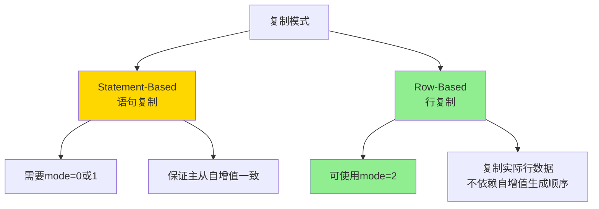
```mermaid
graph TB
    Replication[复制模式] --> SBR[Statement-Based<br/>语句复制]
    Replication --> RBR[Row-Based<br/>行复制]

    SBR --> Mode01[需要mode=0或1]
    SBR --> Reason1[保证主从自增值一致]

    RBR --> Mode2[可使用mode=2]
    RBR --> Reason2[复制实际行数据<br/>不依赖自增值生成顺序]

    style SBR fill:#FFD700
    style RBR fill:#90EE90
    style Mode2 fill:#90EE90
```

**查看自增锁状态**：

```sql
-- 查看当前模式
SHOW VARIABLES LIKE 'innodb_autoinc_lock_mode';

-- 查看表的下一个自增值
SHOW TABLE STATUS LIKE 'table_name'\G
-- Auto_increment: 123

-- 查看自增锁等待
SELECT * FROM performance_schema.data_locks
WHERE LOCK_TYPE = 'TABLE' AND LOCK_MODE = 'AUTO-INC';
```

**性能对比实验**：

```sql
-- 测试表
CREATE TABLE test_autoinc (
    id BIGINT AUTO_INCREMENT PRIMARY KEY,
    data VARCHAR(100)
);

-- 并发插入测试（10个线程，每个插入10000行）
-- mode=0: 约15秒
-- mode=1: 约8秒
-- mode=2: 约5秒
```

---

### 6.3.5 外键和锁

**外键约束与锁的关系**：

InnoDB在处理外键约束时会自动加锁，这是容易被忽视但对性能有显著影响的特性。

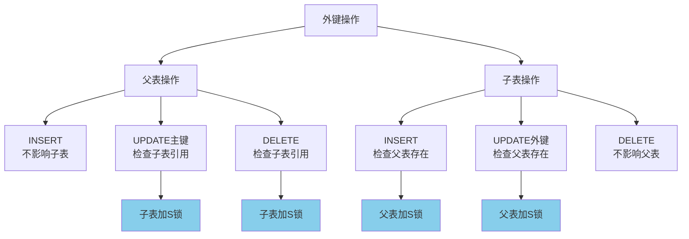
```mermaid
graph TB
    FK[外键操作] --> Parent[父表操作]
    FK --> Child[子表操作]

    Parent --> PInsert[INSERT<br/>不影响子表]
    Parent --> PUpdate[UPDATE主键<br/>检查子表引用]
    Parent --> PDelete[DELETE<br/>检查子表引用]

    Child --> CInsert[INSERT<br/>检查父表存在]
    Child --> CUpdate[UPDATE外键<br/>检查父表存在]
    Child --> CDelete[DELETE<br/>不影响父表]

    PUpdate --> Lock1[子表加S锁]
    PDelete --> Lock2[子表加S锁]
    CInsert --> Lock3[父表加S锁]
    CUpdate --> Lock4[父表加S锁]

    style Lock1 fill:#87CEEB
    style Lock2 fill:#87CEEB
    style Lock3 fill:#87CEEB
    style Lock4 fill:#87CEEB
```

**外键检查的加锁行为**：

```sql
-- 表结构
CREATE TABLE parent (
    id INT PRIMARY KEY,
    name VARCHAR(50)
) ENGINE=InnoDB;

CREATE TABLE child (
    id INT PRIMARY KEY,
    parent_id INT,
    data VARCHAR(100),
    FOREIGN KEY (parent_id) REFERENCES parent(id)
) ENGINE=InnoDB;

-- 数据
INSERT INTO parent VALUES (1, 'A'), (2, 'B');
INSERT INTO child VALUES (1, 1, 'data1'), (2, 1, 'data2');
```

**场景1：插入子表记录**

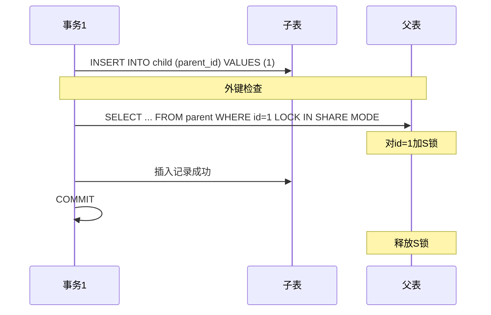
```mermaid
sequenceDiagram
    participant T1 as 事务1
    participant Child as 子表
    participant Parent as 父表

    T1->>Child: INSERT INTO child (parent_id) VALUES (1)

    Note over T1,Parent: 外键检查
    T1->>Parent: SELECT ... FROM parent WHERE id=1 LOCK IN SHARE MODE
    Note over Parent: 对id=1加S锁

    T1->>Child: 插入记录成功
    T1->>T1: COMMIT
    Note over Parent: 释放S锁
```

```sql
-- 事务1
BEGIN;
INSERT INTO child (id, parent_id, data) VALUES (3, 1, 'data3');
-- InnoDB自动执行：SELECT * FROM parent WHERE id=1 LOCK IN SHARE MODE
-- 对parent表的id=1加S锁

-- 事务2（并发）
BEGIN;
UPDATE parent SET name='AA' WHERE id=1;
-- 被阻塞！等待事务1的S锁释放

-- 事务1
COMMIT; -- 事务2此时可以继续执行
```

**场景2：删除父表记录**

```sql
-- 事务1
BEGIN;
DELETE FROM parent WHERE id=1;
-- InnoDB自动检查：SELECT * FROM child WHERE parent_id=1 LOCK IN SHARE MODE
-- 发现有引用记录，报错

-- ERROR 1451 (23000): Cannot delete or update a parent row:
-- a foreign key constraint fails (`db`.`child`, CONSTRAINT `child_ibfk_1`
-- FOREIGN KEY (`parent_id`) REFERENCES `parent` (`id`))
```

**场景3：更新父表主键**

```sql
-- 事务1
BEGIN;
UPDATE parent SET id=10 WHERE id=1;
-- InnoDB检查子表：SELECT * FROM child WHERE parent_id=1 LOCK IN SHARE MODE
-- 发现有引用，报错

-- ERROR 1451 (23000): Cannot delete or update a parent row
```

**ON DELETE/ON UPDATE行为**：

```sql
-- 级联删除
CREATE TABLE child (
    id INT PRIMARY KEY,
    parent_id INT,
    FOREIGN KEY (parent_id) REFERENCES parent(id)
        ON DELETE CASCADE  -- 父记录删除时，级联删除子记录
        ON UPDATE CASCADE  -- 父主键更新时，级联更新子记录
);

-- 设置NULL
CREATE TABLE child (
    id INT PRIMARY KEY,
    parent_id INT,
    FOREIGN KEY (parent_id) REFERENCES parent(id)
        ON DELETE SET NULL  -- 父记录删除时，子记录外键设为NULL
        ON UPDATE SET NULL
);

-- 限制（默认）
CREATE TABLE child (
    id INT PRIMARY KEY,
    parent_id INT,
    FOREIGN KEY (parent_id) REFERENCES parent(id)
        ON DELETE RESTRICT  -- 有子记录时不允许删除父记录
        ON UPDATE RESTRICT
);
```

**级联操作的加锁**：

```sql
-- ON DELETE CASCADE示例
-- 事务1
BEGIN;
DELETE FROM parent WHERE id=1;
-- InnoDB执行：
-- 1. 对parent表id=1加X锁
-- 2. SELECT FROM child WHERE parent_id=1 FOR UPDATE（加X锁）
-- 3. DELETE FROM child WHERE parent_id=1（级联删除）
-- 4. DELETE FROM parent WHERE id=1

-- 加锁范围：
-- parent表：Record Lock (id=1)
-- child表：所有parent_id=1的记录的Record Lock + 可能的Gap Lock
```

**外键与死锁**：

外键检查可能导致意想不到的死锁：

```sql
-- 表结构（带外键）
CREATE TABLE parent (id INT PRIMARY KEY) ENGINE=InnoDB;
CREATE TABLE child (
    id INT PRIMARY KEY,
    pid INT,
    FOREIGN KEY (pid) REFERENCES parent(id)
) ENGINE=InnoDB;

INSERT INTO parent VALUES (1), (2);

-- 会话1
BEGIN;
INSERT INTO child VALUES (1, 1); -- 对parent.id=1加S锁

-- 会话2
BEGIN;
INSERT INTO child VALUES (2, 2); -- 对parent.id=2加S锁

-- 会话1
DELETE FROM parent WHERE id=2; -- 需要X锁，等待会话2的S锁

-- 会话2
DELETE FROM parent WHERE id=1; -- 需要X锁，等待会话1的S锁
-- ERROR 1213: Deadlock found
```

**性能影响**：

```mermaid
graph TB
    FK[外键约束] --> Impact1[额外的锁开销]
    FK --> Impact2[死锁风险增加]
    FK --> Impact3[级联操作性能]

    Impact1 --> Solution1[评估是否真需要外键]
    Impact2 --> Solution2[应用层保证一致性]
    Impact3 --> Solution3[批量操作时暂时禁用]

    style FK fill:#FFD700
    style Impact1 fill:#FF6B6B
    style Impact2 fill:#FF6B6B
    style Impact3 fill:#FF6B6B
    style Solution1 fill:#90EE90
    style Solution2 fill:#90EE90
    style Solution3 fill:#90EE90
```

**外键索引的重要性**：

```sql
-- 子表外键列必须有索引，否则性能极差

-- 不好的设计（无索引）
CREATE TABLE child (
    id INT PRIMARY KEY,
    parent_id INT,
    FOREIGN KEY (parent_id) REFERENCES parent(id)
) ENGINE=InnoDB;
-- 检查父表引用时需要全表扫描，加表级锁！

-- 正确的设计（有索引）
CREATE TABLE child (
    id INT PRIMARY KEY,
    parent_id INT,
    KEY idx_parent_id (parent_id),  -- 关键！
    FOREIGN KEY (parent_id) REFERENCES parent(id)
) ENGINE=InnoDB;
-- 检查时使用索引，只加必要的行锁
```

**查看外键信息**：

```sql
-- 查看表的外键约束
SELECT
    CONSTRAINT_NAME,
    TABLE_NAME,
    COLUMN_NAME,
    REFERENCED_TABLE_NAME,
    REFERENCED_COLUMN_NAME
FROM information_schema.KEY_COLUMN_USAGE
WHERE REFERENCED_TABLE_NAME IS NOT NULL
  AND TABLE_SCHEMA = 'your_database';

-- 查看外键引起的锁等待
SELECT * FROM performance_schema.data_locks
WHERE OBJECT_SCHEMA = 'your_database'
  AND OBJECT_NAME IN ('parent', 'child');
```

---

## 6.4 锁的算法

### 6.4.1 行锁的3种算法

**核心特点**：锁定单个索引记录。

```mermaid
graph LR
    Index[索引值] --> I1[10]
    Index --> I2[20]
    Index --> I3[30]
    Index --> I4[40]

    I2 --> Lock[锁定记录20]

    style I2 fill:#FF6B6B
    style Lock fill:#FF6B6B
```

**示例场景**：

```
-- 表结构
CREATE TABLE t (
    id INT PRIMARY KEY,
    name VARCHAR(50)
);

-- 数据：id = 10, 20, 30, 40

-- 事务1
BEGIN;
SELECT * FROM t WHERE id = 20 FOR UPDATE;
-- 锁定：记录id=20
```

**特点**：

- 总是锁定索引记录
- 如果表没有索引，InnoDB会创建隐藏的聚簇索引并对其加锁

---

### Gap Lock（间隙锁）

**核心特点**：锁定索引记录之间的间隙，防止其他事务插入数据。

```mermaid
graph LR
    I1[10] --> Gap1[间隙1]
    Gap1 --> I2[20]
    I2 --> Gap2[间隙2]
    Gap2 --> I3[30]
    I3 --> Gap3[间隙3]
    Gap3 --> I4[40]

    Gap2 -.-> Lock[锁定间隙 20-30之间]

    style Gap2 fill:#FFD700
    style Lock fill:#FFD700
```

**作用**：防止幻读

```mermaid
sequenceDiagram
    participant T1 as 事务1<br/>(REPEATABLE READ)
    participant DB as 数据库<br/>id: 10,20,30,40
    participant T2 as 事务2

    T1->>DB: SELECT * FROM t WHERE id > 20 FOR UPDATE
    Note over DB: 锁定间隙: (20,30], (30,40], (40,+∞)

    T2->>DB: INSERT INTO t VALUES (25, 'new')
    Note over T2: 被阻塞！<br/>25在间隙(20,30)内

    T2->>DB: INSERT INTO t VALUES (15, 'new')
    Note over T2: 成功<br/>15不在锁定间隙内
```

**重要特性**：

| 特性     | 说明                              |
| -------- | --------------------------------- |
| 隔离级别 | 只在REPEATABLE READ及以上级别生效 |
| 锁定范围 | 开区间，不包含端点记录            |
| 目的     | 防止幻读（Phantom Read）          |
| 性能影响 | 降低并发插入性能                  |

---

### Next-Key Lock

**核心特点**：Record Lock + Gap Lock，锁定一个范围（左开右闭区间）。

```mermaid
graph LR
    I1[10] --> Gap1[间隙]
    Gap1 --> I2[20]
    I2 --> Gap2[间隙]
    Gap2 --> I3[30]
    I3 --> Gap3[间隙]
    Gap3 --> I4[40]

    Gap2 -.-> Lock[Next-Key Lock 锁定范围: 20,30]
    I3 -.-> Lock

    style Gap2 fill:#FFD700
    style I3 fill:#FF6B6B
    style Lock fill:#90EE90
```

**Next-Key Lock范围示例**：

假设索引有值：10, 20, 30, 40

| 查询条件                       | 锁定的Next-Key Lock范围       |
| ------------------------------ | ----------------------------- |
| `WHERE id = 20`              | (10, 20]                      |
| `WHERE id > 20`              | (20, 30], (30, 40], (40, +∞) |
| `WHERE id >= 20 AND id < 40` | (10, 20], (20, 30], (30, 40)  |

**工作原理**：

```mermaid
graph TB
    Query[查询: SELECT * WHERE id > 20 FOR UPDATE] --> Analyze[分析索引]
    Analyze --> Range[确定扫描范围]
    Range --> Lock1[锁定: 20,30]
    Range --> Lock2[锁定: 30,40]
    Range --> Lock3[锁定: 40,+∞]

    Lock1 --> Prevent[防止插入id在20-30之间的记录]
    Lock2 --> Prevent
    Lock3 --> Prevent

    style Query fill:#87CEEB
    style Prevent fill:#90EE90
```

**降级为Record Lock的情况**：

```
-- 当使用唯一索引精确匹配时，Next-Key Lock降级为Record Lock

-- 索引：PRIMARY KEY (id)
-- 数据：id = 10, 20, 30, 40

-- 查询1：唯一索引等值查询，记录存在
SELECT * FROM t WHERE id = 20 FOR UPDATE;
-- 锁定：Record Lock on id=20

-- 查询2：唯一索引等值查询，记录不存在
SELECT * FROM t WHERE id = 25 FOR UPDATE;
-- 锁定：Gap Lock (20, 30)

-- 查询3：非唯一索引或范围查询
SELECT * FROM t WHERE id > 20 FOR UPDATE;
-- 锁定：Next-Key Lock (20,30], (30,40], (40,+∞)
```

---

### 6.4.2 解决Phantom Problem

**幻读问题**（Phantom Problem）是数据库并发控制的经典难题，InnoDB通过Next-Key Lock机制完美解决了这个问题。

**什么是幻读？**

```mermaid
sequenceDiagram
    participant T1 as 事务1
    participant DB as 数据库<br/>id: 10,20,30
    participant T2 as 事务2

    Note over T1,T2: 经典幻读场景

    T1->>DB: BEGIN
    T1->>DB: SELECT * WHERE id>15
    Note over T1: 返回2条（id=20,30）

    T2->>DB: BEGIN
    T2->>DB: INSERT INTO t VALUES (25)
    T2->>DB: COMMIT

    T1->>DB: SELECT * WHERE id>15
    Note over T1: 返回3条（id=20,25,30）<br/>出现"幻影"记录！

    T1->>DB: UPDATE t SET name='x' WHERE id>15
    Note over T1: 影响3行<br/>与第一次SELECT不一致
```

**InnoDB的双重防护机制**：

```mermaid
graph TB
    Phantom[防幻读机制] --> MVCC[MVCC<br/>快照读]
    Phantom --> NextKey[Next-Key Lock<br/>当前读]

    MVCC --> Scenario1[普通SELECT]
    MVCC --> Result1[读取一致性快照<br/>看不到新插入]

    NextKey --> Scenario2[SELECT...FOR UPDATE<br/>UPDATE/DELETE]
    NextKey --> Result2[锁定范围<br/>阻止插入]

    style MVCC fill:#90EE90
    style NextKey fill:#87CEEB
    style Result1 fill:#90EE90
    style Result2 fill:#87CEEB
```

**场景1：MVCC防幻读（快照读）**

```sql
-- 表数据：id=10,20,30

-- 事务1（REPEATABLE READ）
BEGIN;
SELECT * FROM t WHERE id>15; -- 创建Read View，返回id=20,30

-- 事务2
BEGIN;
INSERT INTO t VALUES (25, 'new');
COMMIT;

-- 事务1
SELECT * FROM t WHERE id>15; -- 仍返回id=20,30（MVCC防幻读）
-- Read View不包含事务2的ID，所以看不到新插入的记录

-- 但是！
UPDATE t SET name='updated' WHERE id>15;
-- 影响3行！包括id=25
-- 因为UPDATE是当前读，会读到最新数据

SELECT * FROM t WHERE id>15; -- 现在返回id=20,25,30
-- 之前的UPDATE将id=25变为当前事务的修改，现在可见了
```

**场景2：Next-Key Lock防幻读（当前读）**

```sql
-- 表数据：id=10,20,30

-- 事务1
BEGIN;
SELECT * FROM t WHERE id>15 FOR UPDATE;
-- 加锁：
-- Next-Key Lock: (15,20], (20,30], (30,+∞)

-- 事务2
BEGIN;
INSERT INTO t VALUES (25, 'new');
-- 25落在间隙(20,30)内，被阻塞！

INSERT INTO t VALUES (35, 'new2');
-- 35落在间隙(30,+∞)内，被阻塞！

INSERT INTO t VALUES (5, 'new3');
-- 5不在锁定范围内，成功插入
```

**Next-Key Lock的精确范围计算**：

```mermaid
graph TB
    Start[范围查询] --> Parse[解析WHERE条件]

    Parse --> Scan[扫描索引]
    Scan --> First[找到第一条满足的记录]

    First --> Lock1[锁定该记录及其前面的间隙]
    Lock1 --> Next[继续扫描]

    Next --> Match{还有匹配记录?}
    Match -->|是| Lock2[锁定该记录及前间隙]
    Lock2 --> Next

    Match -->|否| Final[锁定最后一个间隙到正无穷]

    style Lock1 fill:#87CEEB
    style Lock2 fill:#87CEEB
    style Final fill:#87CEEB
```

**详细示例：不同条件的加锁分析**

```sql
-- 表结构和数据
CREATE TABLE t (
    a INT PRIMARY KEY,
    b INT,
    KEY(b)
);
INSERT INTO t VALUES (0,0), (5,5), (10,10), (15,15), (20,20);

-- 示例1：主键范围查询
SELECT * FROM t WHERE a>=10 FOR UPDATE;
-- 加锁：
-- Next-Key Lock: (5, 10], (10, 15], (15, 20], (20, +∞)

-- 示例2：非唯一索引等值查询
SELECT * FROM t WHERE b=5 FOR UPDATE;
-- 加锁：
-- 1. 辅助索引b上：Next-Key Lock (0,5], Gap Lock (5,10)
-- 2. 主键索引a上：Record Lock (a=5)

-- 示例3：非唯一索引范围查询
SELECT * FROM t WHERE b>=5 AND b<15 FOR UPDATE;
-- 加锁：
-- 辅助索引b上：Next-Key Lock (0,5], (5,10], (10,15)
-- 主键索引a上：Record Lock (a=5, a=10)

-- 验证：插入测试
-- 会话2
INSERT INTO t VALUES (3, 3);   -- 成功（不在锁定范围）
INSERT INTO t VALUES (7, 7);   -- 阻塞（落在间隙(5,10)）
INSERT INTO t VALUES (12, 12); -- 阻塞（落在间隙(10,15)）
INSERT INTO t VALUES (16, 16); -- 成功（超出锁定范围）
```

**特殊情况：唯一索引的优化**

```sql
-- 唯一索引等值查询，Next-Key Lock退化为Record Lock

-- 示例：主键精确查询
SELECT * FROM t WHERE a=10 FOR UPDATE;
-- 加锁：仅Record Lock (a=10)
-- 不需要Gap Lock，因为唯一索引保证不会有重复值插入

-- 但范围查询仍使用Next-Key Lock
SELECT * FROM t WHERE a>=10 AND a<=20 FOR UPDATE;
-- 加锁：Next-Key Lock (5,10], (10,15], (15,20]
```

**幻读防护的完整性证明**：

```mermaid
graph TB
    Query[SELECT...FOR UPDATE<br/>WHERE id>10] --> Lock[Next-Key Locks]

    Lock --> Range1[10,20]
    Lock --> Range2[20,30]
    Lock --> Range3[30,+∞]

    Range1 --> Block1[阻止INSERT id=11~19]
    Range2 --> Block2[阻止INSERT id=21~29]
    Range3 --> Block3[阻止INSERT id>30]

    Block1 --> Proof[任何id>10的插入<br/>都会被阻塞]
    Block2 --> Proof
    Block3 --> Proof

    Proof --> Conclusion[完全防止幻读]

    style Lock fill:#87CEEB
    style Conclusion fill:#90EE90
```

**READ COMMITTED级别下的幻读**：

```sql
-- RC级别不使用Gap Lock，无法防止幻读

SET SESSION TRANSACTION ISOLATION LEVEL READ COMMITTED;

-- 事务1
BEGIN;
SELECT * FROM t WHERE id>10 FOR UPDATE;
-- 加锁：仅Record Lock on id=20,30（无Gap Lock）

-- 事务2
BEGIN;
INSERT INTO t VALUES (25, 'new');
COMMIT; -- 成功！RC级别下不锁间隙

-- 事务1
SELECT * FROM t WHERE id>10 FOR UPDATE;
-- 返回id=20,25,30（出现幻读）
```

---

## 6.5 锁问题

InnoDB虽然通过各种机制解决了许多并发问题，但在不同的隔离级别下，仍可能遇到一些经典的并发异常。

### 6.5.1 脏读（Dirty Read）

**问题**：读取到其他事务未提交的数据。

```mermaid
sequenceDiagram
    participant T1 as 事务1
    participant DB as 数据库<br/>balance=1000
    participant T2 as 事务2

    T1->>DB: BEGIN
    T1->>DB: UPDATE balance=500
    Note over DB: 未提交: balance=500

    T2->>DB: BEGIN (READ UNCOMMITTED)
    T2->>DB: SELECT balance
    Note over T2: 读到500（脏读！）

    T1->>DB: ROLLBACK
    Note over DB: 回滚: balance=1000

    Note over T2: T2读到的500是无效数据
```

**解决方案**：使用READ COMMITTED或更高隔离级别。

---

### 6.5.2 不可重复读（Non-Repeatable Read）

**问题**：同一事务内，多次读取同一数据返回不同结果。

**发生条件**：

- 事务隔离级别：READ COMMITTED
- 其他事务对已读取的数据进行了UPDATE并COMMIT

```mermaid
sequenceDiagram
    participant T1 as 事务1
    participant DB as 数据库<br/>balance=1000
    participant T2 as 事务2

    T1->>DB: BEGIN (READ COMMITTED)
    T1->>DB: SELECT balance
    Note over T1: 读到1000

    T2->>DB: BEGIN
    T2->>DB: UPDATE balance=500
    T2->>DB: COMMIT
    Note over DB: balance=500

    T1->>DB: SELECT balance
    Note over T1: 读到500（不可重复读！）
```

**解决方案**：使用REPEATABLE READ隔离级别（InnoDB默认）。

**与脏读的区别**：

| 异常类型   | 读取的数据   | 数据来源           | 隔离级别         |
| ---------- | ------------ | ------------------ | ---------------- |
| 脏读       | 未提交的数据 | 其他事务的脏数据   | READ UNCOMMITTED |
| 不可重复读 | 已提交的数据 | 其他事务已提交修改 | READ COMMITTED   |

**实际影响**：

```sql
-- 场景：银行转账确认

-- 事务1：检查余额并转账
SET SESSION TRANSACTION ISOLATION LEVEL READ COMMITTED;
BEGIN;

SELECT balance FROM account WHERE id=1; -- 读到1000
-- 用户看到余额1000，决定转账900

-- 事务2：同时有笔收入
BEGIN;
UPDATE account SET balance=balance+500 WHERE id=1;
COMMIT; -- balance=1500

-- 事务1：再次检查余额
SELECT balance FROM account WHERE id=1; -- 读到1500（不可重复读）
-- 如果基于第一次读取的1000判断，可能产生逻辑错误

UPDATE account SET balance=balance-900 WHERE id=1;
COMMIT; -- balance=600
```

**解决方案**：使用REPEATABLE READ隔离级别（InnoDB默认）。

```sql
SET SESSION TRANSACTION ISOLATION LEVEL REPEATABLE READ;

-- 事务1
BEGIN;
SELECT balance FROM account WHERE id=1; -- 1000

-- 事务2
BEGIN;
UPDATE account SET balance=balance+500 WHERE id=1;
COMMIT;

-- 事务1
SELECT balance FROM account WHERE id=1; -- 仍是1000（可重复读）
-- MVCC保证读取一致性快照
```

---

### 6.5.3 丢失更新（Lost Update）

**问题**：两个事务读取同一数据并基于该值进行更新，后提交的事务覆盖先提交的事务的修改。

**丢失更新的类型**：

```mermaid
graph TB
    LostUpdate[丢失更新] --> Type1[第一类丢失更新<br/>脏写]
    LostUpdate --> Type2[第二类丢失更新<br/>不可重复读的特例]

    Type1 --> T1Desc[事务回滚覆盖<br/>另一事务已提交的更新]
    Type2 --> T2Desc[事务提交覆盖<br/>另一事务已提交的更新]

    Type1 --> Prevent1[InnoDB完全避免<br/>通过行锁]
    Type2 --> Prevent2[需要应用层处理<br/>使用锁定读或乐观锁]

    style Type1 fill:#FF6B6B
    style Type2 fill:#FFD700
    style Prevent1 fill:#90EE90
    style Prevent2 fill:#87CEEB
```

**第一类丢失更新**（脏写）：

```mermaid
sequenceDiagram
    participant T1 as 事务1
    participant DB as 数据库<br/>balance=100
    participant T2 as 事务2

    Note over T1,T2: 第一类丢失更新（InnoDB已防止）

    T1->>DB: BEGIN
    T1->>DB: UPDATE balance=150

    T2->>DB: BEGIN
    T2->>DB: UPDATE balance=120
    Note over T2: 等待T1的X锁释放<br/>（InnoDB阻止）

    T1->>DB: ROLLBACK
    Note over DB: 回滚到100

    Note over T2: 获得锁
    T2->>DB: UPDATE balance=120
    T2->>DB: COMMIT
    Note over DB: balance=120（正确）
```

**InnoDB如何防止第一类丢失更新**：

```mermaid
sequenceDiagram
    participant T1 as 事务1
    participant Lock as 锁管理器
    participant Data as 数据 balance=100
    participant T2 as 事务2

    T1->>T1: BEGIN
    T1->>Lock: UPDATE balance=150<br/>请求X锁
    Lock->>T1: 授予X锁
    Note over Data: balance=150 未提交

    T2->>T2: BEGIN
    T2->>Lock: UPDATE balance=120<br/>请求X锁
    Note over T2: 被阻塞等待

    T1->>T1: ROLLBACK
    T1->>Lock: 释放X锁
    Note over Data: 回滚到balance=100

    Lock->>T2: 授予X锁
    T2->>Data: UPDATE balance=120
    Note over Data: balance=120 正确
    T2->>T2: COMMIT
```

**第二类丢失更新**（更常见）：

```mermaid
sequenceDiagram
    participant T1 as 事务1
    participant DB as 数据库<br/>stock=100
    participant T2 as 事务2

    Note over T1,T2: 第二类丢失更新（应用需处理）

    T1->>DB: BEGIN
    T1->>DB: SELECT stock WHERE id=1
    Note over T1: stock=100

    T2->>DB: BEGIN
    T2->>DB: SELECT stock WHERE id=1
    Note over T2: stock=100

    T1->>DB: UPDATE stock=100-10=90
    T1->>DB: COMMIT
    Note over DB: stock=90

    T2->>DB: UPDATE stock=100-20=80
    T2->>DB: COMMIT
    Note over DB: stock=80<br/>T1的-10丢失！
```

**解决方案对比**：

| 方案       | 实现方式                  | 优点           | 缺点             | 适用场景     |
| ---------- | ------------------------- | -------------- | ---------------- | ------------ |
| 悲观锁     | `SELECT ... FOR UPDATE` | 简单可靠       | 性能差，可能死锁 | 冲突多的场景 |
| 乐观锁     | 版本号/时间戳             | 并发性能好     | 需要重试逻辑     | 冲突少的场景 |
| 原子操作   | `UPDATE stock=stock-10` | 性能最优       | 仅适用简单更新   | 简单计算     |
| 数据库约束 | CHECK约束                 | 保证数据一致性 | 需要额外约束     | 需要数据校验 |

**方案1：悲观锁（SELECT FOR UPDATE）**

```mermaid
flowchart TB
    Start1[事务1 BEGIN] --> T1S[SELECT stock FOR UPDATE<br/>获取X锁 stock=100]
    Start2[事务2 BEGIN] --> T2S[SELECT stock FOR UPDATE]

    T1S --> T1U[UPDATE stock=90]
    T2S -.阻塞.-> Wait[等待T1释放锁]

    T1U --> T1C[COMMIT 释放锁<br/>stock=90]
    T1C --> Wake[唤醒事务2]
    Wake --> T2Read[读到stock=90 最新值]

    T2Read --> T2U[UPDATE stock=70]
    T2U --> T2C[COMMIT stock=70 正确]

    style T1S fill:#90EE90
    style T2S fill:#FFD700
    style Wait fill:#FF6B6B
    style T2C fill:#90EE90
```

**方案2：乐观锁（版本号）**

**表结构**：
```sql
CREATE TABLE products (
    id INT PRIMARY KEY,
    stock INT,
    version INT DEFAULT 0,  -- 版本号
    INDEX(version)
);
```

**执行流程**：

```mermaid
flowchart TB
    T1Start[事务1 BEGIN] --> T1R[SELECT stock, version<br/>读到: stock=100, version=5]
    T2Start[事务2 BEGIN] --> T2R[SELECT stock, version<br/>读到: stock=100, version=5]

    T1R --> T1Calc[计算: new_stock=90]
    T2R --> T2Calc[计算: new_stock=80]

    T1Calc --> T1U[UPDATE stock=90, version=6<br/>WHERE version=5]
    T1U --> T1Check{影响行数?}
    T1Check -->|1行| T1C[COMMIT 成功<br/>stock=90, version=6]

    T2Calc --> T2U[UPDATE stock=80, version=6<br/>WHERE version=5]
    T2U --> T2Check{影响行数?}
    T2Check -->|0行| T2Fail[更新失败<br/>version已变为6]

    T2Fail --> T2Retry[应用层重试]
    T2Retry --> T2R2[SELECT 读到<br/>stock=90, version=6]
    T2R2 --> T2Calc2[计算: new_stock=70]
    T2Calc2 --> T2U2[UPDATE stock=70, version=7<br/>WHERE version=6]
    T2U2 --> T2C[COMMIT 成功<br/>stock=70, version=7]

    style T1C fill:#90EE90
    style T2Fail fill:#FF6B6B
    style T2C fill:#90EE90
```

**方案3：原子操作（最佳实践）**

```mermaid
flowchart LR
    Init[初始 stock=100] --> T1[事务1 BEGIN]
    Init --> T2[事务2 BEGIN]

    T1 --> T1U[UPDATE stock=stock-10<br/>原子操作]
    T2 --> T2U[UPDATE stock=stock-20<br/>原子操作]

    T1U --> Lock{行锁竞争}
    T2U --> Lock

    Lock -->|T1先获得锁| T1Exec[执行: stock=90]
    T1Exec --> T1C[COMMIT]

    T1C --> T2Exec[T2获得锁<br/>执行: stock=90-20=70]
    T2Exec --> T2C[COMMIT]

    T2C --> Result[最终结果: stock=70 正确]

    style Result fill:#90EE90
    style T1U fill:#87CEEB
    style T2U fill:#87CEEB

```

**优势**：
- ✅ 无需先SELECT，减少网络往返
- ✅ InnoDB行锁自动保证串行执行
- ✅ 代码简洁，性能最优

**方案4：CHECK约束（MySQL 8.0.16+）**

```sql
-- 添加约束防止库存为负
CREATE TABLE products (
    id INT PRIMARY KEY,
    stock INT,
    CONSTRAINT chk_stock CHECK (stock >= 0)
);

-- 如果并发导致库存为负，会报错
UPDATE products SET stock=stock-150 WHERE id=1;
-- ERROR 3819: Check constraint 'chk_stock' is violated.
```

**实际案例：电商秒杀场景**

**场景**：1000个用户抢购100件商品

**❌ 错误做法（会超卖）**：

```mermaid
flowchart TB
    Start[1000个并发请求] --> Read[SELECT stock<br/>多个事务同时读到stock=100]
    Read --> Check{stock > 0?}
    Check -->|是| Update[UPDATE stock=stock-1]
    Update --> Commit[COMMIT]
    Commit --> Problem[结果: 超卖!<br/>可能卖出200件]

    style Problem fill:#FF6B6B
```

**✅ 正确做法对比**：

| 方案 | SQL示例 | 性能 | 复杂度 | 适用场景 |
|------|---------|------|--------|----------|
| 原子操作 | `UPDATE SET stock=stock-1 WHERE stock>0` | ⭐⭐⭐⭐⭐ | 简单 | 高并发秒杀 |
| 悲观锁 | `SELECT FOR UPDATE` | ⭐⭐⭐ | 中等 | 中等并发 |
| 乐观锁 | 版本号 + 重试 | ⭐⭐⭐⭐ | 复杂 | 冲突较少 |

**推荐方案：原子操作**

```mermaid
flowchart LR
    Request[用户请求] --> Atomic[UPDATE products<br/>SET stock=stock-1<br/>WHERE id=1 AND stock>0]
    Atomic --> Check{影响行数?}
    Check -->|1行| Success[扣减成功<br/>创建订单]
    Check -->|0行| Fail[库存不足<br/>返回失败]

    style Success fill:#90EE90
    style Fail fill:#FFD700
```

**核心代码**：
```sql
-- 一条SQL搞定，原子操作 + 库存检查
UPDATE products
SET stock = stock - 1
WHERE id = 1 AND stock > 0;

-- 检查影响行数决定是否成功
```

---

## 6.6 阻塞

**阻塞**（Blocking）是指一个事务需要等待另一个事务释放锁的现象。阻塞是锁机制的正常行为，但过多的阻塞会严重影响系统性能。

### 阻塞的产生

```mermaid
sequenceDiagram
    participant T1 as 事务1
    participant Lock as 锁管理器
    participant T2 as 事务2

    T1->>Lock: 请求X锁 on row1
    Lock->>T1: 授予X锁

    T2->>Lock: 请求X锁 on row1
    Note over T2: 阻塞等待

    Note over T1: 执行业务逻辑...

    T1->>Lock: COMMIT（释放X锁）
    Lock->>T2: 唤醒，授予X锁
    Note over T2: 继续执行
```

### 阻塞参数配置

```sql
-- 查看锁等待超时时间（默认50秒）
SHOW VARIABLES LIKE 'innodb_lock_wait_timeout';

-- 设置超时时间
SET innodb_lock_wait_timeout = 10;

-- 超时后的行为
-- innodb_rollback_on_timeout = OFF（默认）：仅回滚当前语句
-- innodb_rollback_on_timeout = ON：回滚整个事务

SHOW VARIABLES LIKE 'innodb_rollback_on_timeout';
```

**超时示例**：

```sql
-- 会话1
BEGIN;
UPDATE t SET name='A' WHERE id=1; -- 获取X锁

-- 会话2
BEGIN;
UPDATE t SET name='B' WHERE id=1; -- 等待X锁

-- 50秒后
-- ERROR 1205 (HY000): Lock wait timeout exceeded; try restarting transaction

-- innodb_rollback_on_timeout=OFF时：
-- UPDATE语句失败，但事务仍活跃，可以继续其他操作或COMMIT

-- innodb_rollback_on_timeout=ON时：
-- 整个事务被回滚
```

### 监控阻塞

**查看当前锁等待情况**：

```sql
-- MySQL 8.0+
SELECT
    waiting_trx_id,
    waiting_pid,
    waiting_query,
    blocking_trx_id,
    blocking_pid,
    blocking_query,
    wait_age_secs
FROM sys.innodb_lock_waits;

-- 输出示例：
-- waiting_trx_id | waiting_pid | blocking_trx_id | wait_age_secs
-- 12345          | 42          | 12344           | 15
```

**查看Performance Schema锁信息**：

```sql
-- 查看当前持有的锁
SELECT
    OBJECT_SCHEMA,
    OBJECT_NAME,
    LOCK_TYPE,
    LOCK_MODE,
    LOCK_STATUS,
    LOCK_DATA
FROM performance_schema.data_locks;

-- 查看锁等待关系
SELECT
    requesting_thread_id,
    requesting_event_id,
    blocking_thread_id,
    blocking_event_id
FROM performance_schema.data_lock_waits;
```

**使用SHOW ENGINE INNODB STATUS**：

```sql
SHOW ENGINE INNODB STATUS\G

-- 输出片段：
-- TRANSACTIONS
-- ---TRANSACTION 12345, ACTIVE 60 sec starting index read
-- mysql tables in use 1, locked 1
-- LOCK WAIT 2 lock struct(s), heap size 1136, 1 row lock(s)
-- MySQL thread id 42, OS thread handle 140123456, query id 9876 localhost root updating
-- UPDATE t SET name='B' WHERE id=1
-- ------- TRX HAS BEEN WAITING 15 SEC FOR THIS LOCK TO BE GRANTED:
-- RECORD LOCKS space id 58 page no 3 n bits 72 index PRIMARY of table `test`.`t` trx id 12345 lock_mode X locks rec but not gap waiting
```

### 阻塞分析和处理

```mermaid
graph TB
    Detect[发现阻塞] --> Analyze[分析阻塞原因]

    Analyze --> Long[长事务持锁]
    Analyze --> Deadlock[死锁风险]
    Analyze --> BadSQL[低效SQL]

    Long --> Solution1[终止长事务<br/>KILL]
    Deadlock --> Solution2[调整事务顺序]
    BadSQL --> Solution3[优化SQL<br/>添加索引]

    Solution1 --> Monitor[持续监控]
    Solution2 --> Monitor
    Solution3 --> Monitor

    style Detect fill:#FFD700
    style Solution1 fill:#90EE90
    style Solution2 fill:#90EE90
    style Solution3 fill:#90EE90
```

**终止阻塞事务**：

```sql
-- 查找阻塞的事务
SELECT
    r.trx_id AS waiting_trx,
    r.trx_mysql_thread_id AS waiting_thread,
    b.trx_id AS blocking_trx,
    b.trx_mysql_thread_id AS blocking_thread,
    b.trx_query AS blocking_query
FROM information_schema.INNODB_LOCK_WAITS w
JOIN information_schema.INNODB_TRX b ON b.trx_id = w.blocking_trx_id
JOIN information_schema.INNODB_TRX r ON r.trx_id = w.requesting_trx_id;

-- 终止阻塞的事务
KILL 123; -- thread_id
```

### 减少阻塞的策略

| 策略         | 具体措施                          | 效果           |
| ------------ | --------------------------------- | -------------- |
| 缩短事务     | 拆分大事务为小事务                | 减少锁持有时间 |
| 优化SQL      | 添加索引，减少扫描行数            | 减少锁范围     |
| 降低隔离级别 | RC代替RR（如果可接受幻读）        | 减少Gap Lock   |
| 设置合理超时 | 调整 `innodb_lock_wait_timeout` | 快速失败重试   |
| 业务层面优化 | 错峰处理，异步化                  | 减少并发冲突   |

---

### 幻读（Phantom Read）

**问题**：同一事务内，范围查询时发现新插入的数据。

**说明**：幻读问题已在6.4.2节详细讨论，这里回顾要点。

```mermaid
sequenceDiagram
    participant T1 as 事务1
    participant DB as 数据库<br/>id: 10,30,50
    participant T2 as 事务2

    T1->>DB: BEGIN (REPEATABLE READ)
    T1->>DB: SELECT COUNT(*) WHERE id > 10
    Note over T1: 返回2条（id=30,50）

    T2->>DB: BEGIN
    T2->>DB: INSERT INTO t VALUES (20)
    T2->>DB: COMMIT

    T1->>DB: SELECT COUNT(*) WHERE id > 10
    Note over T1: 仍返回2条（MVCC防止幻读）

    T1->>DB: UPDATE t SET name='x' WHERE id > 10
    Note over DB: 影响3行！包括id=20<br/>（当前读，出现幻读）
```

**InnoDB的防幻读机制**：

| 操作类型 | 机制                   | 能否防止幻读 |
| -------- | ---------------------- | ------------ |
| 快照读   | MVCC（多版本并发控制） | ✅ 能防止    |
| 当前读   | Next-Key Lock          | ✅ 能防止    |

```
-- 快照读（使用MVCC）
SELECT * FROM t WHERE id > 10;

-- 当前读（使用Next-Key Lock）
SELECT * FROM t WHERE id > 10 FOR UPDATE;
SELECT * FROM t WHERE id > 10 LOCK IN SHARE MODE;
UPDATE t SET name = 'x' WHERE id > 10;
DELETE FROM t WHERE id > 10;
```

---

### 丢失更新（Lost Update）

**问题场景对比**：

**问题场景**：

```mermaid
graph TB
    Problem[问题: 丢失更新] --> A1[事务1读取balance=100]
    Problem --> B1[事务2读取balance=100]

    A1 --> A2[事务1计算: 100+50=150]
    B1 --> B2[事务2计算: 100-30=70]

    A2 --> A3[事务1写入150]
    B2 --> B3[事务2写入70]

    A3 --> Result1[最终: 70 - 事务1的+50丢失!]
    B3 --> Result1

    style Result1 fill:#FF6B6B
```

**解决方案**：

```mermaid
graph TB
    Solution[解决方案: SELECT FOR UPDATE] --> C1[事务1获取排他锁 balance=100]

    C1 --> C2[事务2被阻塞]
    C1 --> C3[事务1更新为150并提交]

    C3 --> C4[事务1释放锁]
    C4 --> C5[事务2获得锁 读到150]

    C5 --> C6[事务2更新为120并提交]
    C6 --> Result2[最终: 120 - 两个更新都生效]

    style Result2 fill:#90EE90
```

**解决方案对比**：

| 方案     | SQL示例                       | 优点     | 缺点           |
| -------- | ----------------------------- | -------- | -------------- |
| 显式加锁 | `SELECT ... FOR UPDATE`     | 简单可靠 | 性能较差       |
| 乐观锁   | 使用version字段               | 性能好   | 需要重试逻辑   |
| 原子操作 | `UPDATE balance=balance+50` | 最优     | 仅适用简单场景 |

---

## 死锁

### 死锁产生的原因

```mermaid
sequenceDiagram
    participant T1 as 事务1
    participant R1 as 资源1<br/>(row id=1)
    participant R2 as 资源2<br/>(row id=2)
    participant T2 as 事务2

    Note over T1,T2: 时刻1
    T1->>R1: 请求X锁（成功）
    T2->>R2: 请求X锁（成功）

    Note over T1,T2: 时刻2
    T1->>R2: 请求X锁（等待T2释放）
    Note over T1: 阻塞中...

    T2->>R1: 请求X锁（等待T1释放）
    Note over T2: 阻塞中...

    Note over T1,T2: 形成循环等待 = 死锁！
```

**死锁的四个必要条件**：

```mermaid
graph TB
    Deadlock[死锁发生] --> C1[互斥条件<br/>资源不能共享]
    Deadlock --> C2[请求与保持<br/>持有资源再请求]
    Deadlock --> C3[不可剥夺<br/>不能强制释放]
    Deadlock --> C4[循环等待<br/>形成等待环]

    Break[破坏任一条件<br/>即可预防死锁]

    C1 -.-> Break
    C2 -.-> Break
    C3 -.-> Break
    C4 -.-> Break

    style Deadlock fill:#FF6B6B
    style Break fill:#90EE90
```

---

### InnoDB的死锁检测

```mermaid
graph TB
    Start[事务请求锁] --> Check{锁是否可用?}

    Check -->|是| Grant[授予锁]
    Check -->|否| Wait[加入等待队列]

    Wait --> Detect[死锁检测算法<br/>Wait-for Graph]

    Detect --> IsDeadlock{检测到死锁?}

    IsDeadlock -->|否| Continue[继续等待]
    IsDeadlock -->|是| ChooseVictim[选择牺牲者<br/>回滚代价最小的事务]

    ChooseVictim --> Rollback[回滚事务]
    Rollback --> Error[返回错误:<br/>ERROR 1213 Deadlock]

    style Detect fill:#87CEEB
    style Rollback fill:#FF6B6B
    style Grant fill:#90EE90
```

**死锁检测参数**：

| 参数                         | 默认值 | 说明             |
| ---------------------------- | ------ | ---------------- |
| `innodb_deadlock_detect`   | ON     | 是否开启死锁检测 |
| `innodb_lock_wait_timeout` | 50秒   | 锁等待超时时间   |

**查看死锁信息**：

```sql
-- 查看最近一次死锁信息
SHOW ENGINE INNODB STATUS;

-- 启用死锁日志
SET GLOBAL innodb_print_all_deadlocks = ON;
```

---

### 死锁示例

**示例1：经典死锁（交叉等待）**

```mermaid
sequenceDiagram
    participant S1 as 会话1
    participant R1 as 资源id=1
    participant R2 as 资源id=2
    participant S2 as 会话2
    participant DD as 死锁检测器

    S1->>S1: BEGIN
    S1->>R1: UPDATE id=1
    Note over R1: S1持有X锁

    S2->>S2: BEGIN
    S2->>R2: UPDATE id=2
    Note over R2: S2持有X锁

    S1->>R2: UPDATE id=2
    Note over S1: 等待S2释放锁

    S2->>R1: UPDATE id=1
    Note over S2: 等待S1释放锁

    Note over DD: 检测到循环等待<br/>S1→R2→S2→R1→S1

    DD->>S2: 回滚会话2
    Note over S2: ERROR 1213<br/>Deadlock found

    DD->>S1: 授予R2的锁
    S1->>S1: 继续执行
```

**示例2：间隙锁死锁**

**表结构**：
```sql
CREATE TABLE t (id INT PRIMARY KEY, name VARCHAR(10));
INSERT INTO t VALUES (10, 'a'), (30, 'c');
```

**死锁过程**：

```mermaid
sequenceDiagram
    participant S1 as 会话1
    participant Gap as 间隙(10,30)
    participant S2 as 会话2

    S1->>S1: BEGIN
    S1->>Gap: SELECT id=20 FOR UPDATE
    Note over Gap: S1获得Gap Lock(10,30)

    S2->>S2: BEGIN
    S2->>Gap: SELECT id=25 FOR UPDATE
    Note over Gap: S2也获得Gap Lock(10,30)<br/>Gap锁互相兼容

    S1->>Gap: INSERT id=20
    Note over S1: 需要插入意向锁<br/>等待S2的Gap锁

    S2->>Gap: INSERT id=25
    Note over S2: 需要插入意向锁<br/>等待S1的Gap锁

    Note over S1,S2: 死锁！<br/>S1等S2, S2等S1

    Note over S2: ERROR 1213 被回滚
```

**关键点**：
- Gap Lock之间是兼容的（两个SELECT都成功）
- 但INSERT需要插入意向锁，与Gap Lock冲突
- 形成循环等待：S1的INSERT等S2的Gap Lock，S2的INSERT等S1的Gap Lock

---

### 避免死锁的策略

```mermaid
graph TB
    Strategy[避免死锁策略] --> S1[应用层设计]
    Strategy --> S2[数据库配置]
    Strategy --> S3[SQL优化]

    S1 --> S1A[按固定顺序访问资源]
    S1 --> S1B[缩短事务时间]
    S1 --> S1C[降低事务隔离级别]

    S2 --> S2A[调整锁等待超时]
    S2 --> S2B[启用死锁检测]

    S3 --> S3A[使用索引减少锁范围]
    S3 --> S3B[减少间隙锁使用]
    S3 --> S3C[拆分大事务]

    style S1 fill:#90EE90
    style S2 fill:#87CEEB
    style S3 fill:#FFD700
```

**最佳实践**：

| 策略         | 具体措施                 | 效果             |
| ------------ | ------------------------ | ---------------- |
| 按顺序加锁   | 多个资源按id排序后加锁   | 破坏循环等待条件 |
| 快速提交     | 减少事务持有锁的时间     | 降低死锁概率     |
| 使用索引     | 避免全表扫描导致的锁升级 | 减少锁范围       |
| 降低隔离级别 | 使用READ COMMITTED       | 减少间隙锁       |
| 批量操作分批 | 大批量操作分多次执行     | 减少锁冲突       |

---

## 6.8 锁升级

**什么是锁升级？**

锁升级（Lock Escalation）是指数据库将大量的细粒度锁（如行锁）转换为更粗粒度锁（如表锁）的过程，目的是减少锁管理的内存开销。

```mermaid
graph LR
    Start[大量行锁] --> Threshold{超过阈值?}
    Threshold -->|否| Keep[保持行锁]
    Threshold -->|是| Upgrade[升级为表锁]

    Upgrade --> Problem[问题: 降低并发度]

    style Start fill:#87CEEB
    style Upgrade fill:#FF6B6B
    style Problem fill:#FF6B6B
```

**InnoDB vs SQL Server**：

| 数据库               | 是否支持锁升级 | 说明                                 |
| -------------------- | -------------- | ------------------------------------ |
| **SQL Server** | ✅ 支持        | 行锁数量超过阈值时自动升级为表锁     |
| **InnoDB**     | ❌ 不支持      | 根据事务访问的每个页加锁，锁粒度固定 |

**InnoDB不支持锁升级的原因**：

1. **高效的锁管理机制**：

```cpp
// InnoDB的锁结构（简化）
struct lock_t {
    trx_t*      trx;           // 持有该锁的事务
    lock_t*     trx_locks;     // 事务的锁链表
    ulint       type_mode;     // 锁类型和模式
    hash_node_t hash;          // 哈希表节点
    dict_index_t* index;       // 锁定的索引
    union {
        lock_table_t tab;      // 表锁
        lock_rec_t rec;        // 行锁（使用位图）
    } un_member;
};

// 行锁使用位图
struct lock_rec_t {
    ulint    space;            // 表空间ID
    ulint    page_no;          // 页号
    ulint    n_bits;           // 位图大小
    // 位图存储在结构体后面，每个bit代表页中的一条记录
};
```

2. **内存优化**：

```mermaid
graph TB
    Page[一个页面16KB<br/>假设100条记录] --> Bitmap[位图锁管理]

    Bitmap --> Size1[100个行锁<br/>仅需100 bits≈13 bytes]
    Bitmap --> Size2[加上lock_rec_t结构<br/>总共约64 bytes]

    Compare[对比其他数据库]
    Compare --> OtherDB[每个行锁单独结构<br/>100×64=6400 bytes]

    Size2 --> Efficient[内存高效<br/>无需升级]
    OtherDB --> NeedEscalate[内存压力大<br/>需要锁升级]

    style Efficient fill:#90EE90
    style NeedEscalate fill:#FF6B6B
```

3. **性能稳定性**：

```sql
-- 场景：批量更新操作

-- SQL Server（支持锁升级）
-- 更新5000行
UPDATE orders SET status='shipped' WHERE order_date='2024-01-01';
-- 可能触发锁升级：5000个行锁 -> 1个表锁
-- 结果：其他事务完全阻塞，并发度骤降

-- InnoDB（不支持锁升级）
UPDATE orders SET status='shipped' WHERE order_date='2024-01-01';
-- 始终保持行锁，锁定5000行
-- 结果：其他事务仍可访问其他行，并发度高
```

**锁升级的利弊对比**：

| 特性               | 支持锁升级（如SQL Server） | 不支持锁升级（InnoDB） |
| ------------------ | -------------------------- | ---------------------- |
| **内存占用** | 节省（行锁->表锁）         | 优化（位图）           |
| **并发性能** | 不稳定（升级后骤降）       | 稳定（始终行锁）       |
| **可预测性** | 差（何时升级不确定）       | 好（行为一致）         |
| **死锁风险** | 升级时可能死锁             | 无升级相关死锁         |

**InnoDB的锁内存管理**：

```sql
-- 查看锁占用的内存
SELECT
    COUNT(*) AS lock_count,
    SUM(OBJECT_INSTANCE_BEGIN) AS total_locks
FROM performance_schema.data_locks;

-- InnoDB即使有大量锁，内存占用仍然可控
-- 100万行锁约占用内存：
-- 100万 bits / 8 / 1024 / 1024 ≈ 0.12 MB（位图本身）
-- 加上锁结构体，总共约几MB
```

**为什么有些数据库需要锁升级？**

```mermaid
graph TB
    Other[其他数据库系统] --> LockStruct[每个行锁独立结构]

    LockStruct --> Example[示例：1万行锁]
    Example --> Mem[64 bytes × 10000<br/>= 640 KB]

    Mem --> Problem[10万行锁 = 6.4 MB<br/>100万行锁 = 64 MB<br/>内存压力大]

    Problem --> Solution[触发锁升级<br/>减少内存]

    InnoDB[InnoDB设计] --> Bitmap[位图 + 共享结构]
    Bitmap --> IBMem[100万行锁<br/>仅约5 MB]
    IBMem --> NoProblem[无需锁升级]

    style Problem fill:#FF6B6B
    style NoProblem fill:#90EE90
```

**实际场景对比**：

```sql
-- 场景：批量数据迁移

-- 场景1：支持锁升级的数据库
BEGIN TRANSACTION;
-- 更新100万行
UPDATE products SET category='electronics' WHERE type='phone';
-- 可能触发锁升级：100万行锁 -> 表锁
-- 影响：整个products表被锁定，所有并发操作阻塞

-- 场景2：InnoDB
BEGIN;
UPDATE products SET category='electronics' WHERE type='phone';
-- 保持行锁，锁定100万行
-- 影响：仅锁定的100万行不可访问，其他行仍可并发访问

-- 其他事务
UPDATE products SET price=price*1.1 WHERE type='laptop'; -- 可以执行
INSERT INTO products VALUES (...); -- 可能可以执行（取决于是否有Gap Lock冲突）
```

**控制锁升级的参数（SQL Server）**：

```sql
-- SQL Server示例（InnoDB无此参数）
ALTER TABLE products SET (LOCK_ESCALATION = AUTO);   -- 自动升级（默认）
ALTER TABLE products SET (LOCK_ESCALATION = TABLE);  -- 总是升级到表锁
ALTER TABLE products SET (LOCK_ESCALATION = DISABLE); -- 禁用锁升级
```

**InnoDB的替代策略**：

虽然InnoDB不支持锁升级，但提供了其他机制优化大批量操作：

```sql
-- 策略1：分批处理
DELIMITER $$
CREATE PROCEDURE batch_update()
BEGIN
    DECLARE done INT DEFAULT 0;
    DECLARE batch_size INT DEFAULT 1000;

    WHILE done = 0 DO
        UPDATE products
        SET status='processed'
        WHERE status='pending'
        LIMIT batch_size;

        IF ROW_COUNT() = 0 THEN
            SET done = 1;
        END IF;

        COMMIT; -- 每批次提交，释放锁
    END WHILE;
END$$
DELIMITER ;

-- 策略2：使用较低隔离级别
SET SESSION TRANSACTION ISOLATION LEVEL READ COMMITTED;
-- 减少Gap Lock，提高并发

-- 策略3：优化索引
-- 确保WHERE条件使用索引，避免全表扫描
CREATE INDEX idx_status ON products(status);
```

---

## 6.9 小结

本章深入介绍了InnoDB存储引擎的锁机制，这是理解数据库并发控制的关键。

### 核心知识点回顾

```mermaid
graph TB
    Lock[第6章 锁] --> Concept[核心概念]
    Lock --> Types[锁类型]
    Lock --> Algorithms[锁算法]
    Lock --> Problems[锁问题]
    Lock --> Advanced[高级主题]

    Concept --> C1[lock vs latch]
    Concept --> C2[MVCC一致性读]

    Types --> T1[共享锁S/排他锁X]
    Types --> T2[意向锁IS/IX]
    Types --> T3[Record/Gap/Next-Key]
    Types --> T4[AUTO-INC锁]

    Algorithms --> A1[Record Lock]
    Algorithms --> A2[Gap Lock]
    Algorithms --> A3[Next-Key Lock]
    Algorithms --> A4[防幻读机制]

    Problems --> P1[脏读]
    Problems --> P2[不可重复读]
    Problems --> P3[幻读]
    Problems --> P4[丢失更新]
    Problems --> P5[死锁]

    Advanced --> AD1[阻塞监控]
    Advanced --> AD2[外键与锁]
    Advanced --> AD3[锁升级]

    style Lock fill:#87CEEB
    style Types fill:#90EE90
    style Algorithms fill:#FFD700
    style Problems fill:#FF6B6B
```

### 重要结论

**1. lock与latch的本质区别**：

- **Lock（锁）**：保护数据库逻辑内容，事务级别，支持死锁检测
- **Latch（闩锁）**：保护内存数据结构，线程级别，极短持续时间

**2. InnoDB的锁层次**：

```
表级锁
├── 意向共享锁（IS）
├── 意向排他锁（IX）
├── 表共享锁（S）
├── 表排他锁（X）
└── AUTO-INC锁

行级锁
├── Record Lock（记录锁）- 锁定单个索引记录
├── Gap Lock（间隙锁）- 锁定索引间隙
└── Next-Key Lock（临键锁）- Record + Gap，防幻读
```

**3. 一致性读的两种模式**：

| 模式             | 隔离级别 | Read View创建 | 特点         |
| ---------------- | -------- | ------------- | ------------ |
| 非锁定读（MVCC） | RC/RR    | 每次/第一次   | 高并发，无锁 |
| 锁定读           | 所有级别 | 不使用MVCC    | 保证数据不变 |

**4. 幻读的完整解决方案**：

- **快照读**：MVCC提供一致性快照
- **当前读**：Next-Key Lock锁定范围

**5. 锁问题的解决之道**：

```mermaid
graph LR
    DR[脏读] --> RU[隔离级别 ≥ RC]
    NR[不可重复读] --> RR[隔离级别 ≥ RR]
    PH[幻读] --> NK[Next-Key Lock<br/>或MVCC]
    LU[丢失更新] --> App[应用层处理<br/>悲观/乐观锁]

    style RU fill:#90EE90
    style RR fill:#90EE90
    style NK fill:#90EE90
    style App fill:#FFD700
```

**6. 死锁的预防策略**：

- 按固定顺序访问资源
- 缩短事务时间
- 使用合适的索引减少锁范围
- 降低隔离级别（如果业务允许）

**7. InnoDB不支持锁升级的优势**：

- 使用位图管理锁，内存高效
- 并发性能稳定可预测
- 避免锁升级导致的阻塞

### 实践建议

**1. 选择合适的隔离级别**：

```sql
-- 默认RR级别适合大多数场景
-- 如果不需要防幻读，可使用RC提高并发
SET SESSION TRANSACTION ISOLATION LEVEL READ COMMITTED;
```

**2. 显式加锁的最佳实践**：

```sql
-- 读取后要修改，使用FOR UPDATE
SELECT * FROM account WHERE id=1 FOR UPDATE;

-- 只是读取并确保数据不变，使用FOR SHARE
SELECT * FROM products WHERE id=1 FOR SHARE;
```

**3. 避免长事务**：

```sql
-- 不好的做法
BEGIN;
SELECT ...; -- 大量查询
-- 做复杂计算
UPDATE ...;
COMMIT; -- 持锁时间过长

-- 好的做法
-- 先查询（非锁定读）
SELECT ...;
-- 应用层计算
BEGIN;
-- 仅在必要时加锁
UPDATE ...;
COMMIT; -- 快速释放锁
```

**4. 监控锁等待**：

```sql
-- 定期检查锁等待
SELECT * FROM sys.innodb_lock_waits\G

-- 查看长事务
SELECT * FROM information_schema.INNODB_TRX
WHERE TIME_TO_SEC(TIMEDIFF(NOW(), trx_started)) > 60;
```

**5. 外键使用注意事项**：

- 外键列必须有索引
- 级联操作会大量加锁
- 高并发场景考虑应用层维护一致性

### 调优检查清单

- [ ] 所有查询的WHERE条件都有合适的索引
- [ ] 事务尽可能短，避免长时间持锁
- [ ] 批量操作分批执行，每批COMMIT
- [ ] 监控锁等待超时和死锁频率
- [ ] 外键列有索引
- [ ] 合理设置 `innodb_lock_wait_timeout`
- [ ] 根据业务需求选择隔离级别
- [ ] 避免在事务中执行耗时操作（网络IO、文件操作）

### 延伸阅读

- 第7章：事务（深入理解MVCC实现）
- 第5章：索引与算法（理解锁与索引的关系）
- MySQL官方文档：InnoDB Locking
- 论文：《A Critique of ANSI SQL Isolation Levels》

---

**本章总结**：锁是InnoDB并发控制的核心机制。理解锁的类型、算法和问题，掌握MVCC和Next-Key Lock的原理，能够有效解决并发场景下的数据一致性问题，并优化数据库性能。实际应用中，需要根据业务特点在并发性能和数据一致性之间取得平衡。

---

## 锁监控与诊断

### 查看锁信息

```sql
-- 查看当前锁等待情况（MySQL 8.0+）
SELECT * FROM performance_schema.data_locks;
SELECT * FROM performance_schema.data_lock_waits;

-- 查看事务信息
SELECT * FROM information_schema.INNODB_TRX;

-- 查看锁等待信息（旧版本）
SELECT * FROM information_schema.INNODB_LOCKS;
SELECT * FROM information_schema.INNODB_LOCK_WAITS;

-- 查看InnoDB引擎状态
SHOW ENGINE INNODB STATUS;
```

### 锁等待分析流程

```mermaid
graph TB
    Start[发现性能问题] --> Check1[查看锁等待]
    Check1 --> Query1[查询data_lock_waits表]

    Query1 --> Identify[识别阻塞事务]
    Identify --> Analyze[分析SQL语句]

    Analyze --> Decision{是否长事务?}
    Decision -->|是| Kill[终止事务<br/>KILL thread_id]
    Decision -->|否| Optimize[优化SQL<br/>添加索引]

    Optimize --> Monitor[持续监控]
    Kill --> Monitor

    style Check1 fill:#87CEEB
    style Kill fill:#FF6B6B
    style Optimize fill:#90EE90
```

---

## 隔离级别与锁的关系

### 四种隔离级别对比

```mermaid
graph LR
    RU[READ UNCOMMITTED<br/>不加锁 可能脏读] --> RC[READ COMMITTED<br/>记录锁 不锁间隙]
    RC --> RR[REPEATABLE READ<br/>Next-Key Lock 默认级别]
    RR --> S[SERIALIZABLE<br/>所有读加共享锁 严格串行]

    Note1[并发性能降低] -.-> Note2[数据一致性提高]

    style RU fill:#FF6B6B
    style RC fill:#FFD700
    style RR fill:#90EE90
    style S fill:#87CEEB
```

**隔离级别与锁对比表**：

| 隔离级别         | 脏读 | 不可重复读 | 幻读 | 加锁方式      | 间隙锁 |
| ---------------- | ---- | ---------- | ---- | ------------- | ------ |
| READ UNCOMMITTED | ❌   | ❌         | ❌   | 几乎不加锁    | ❌     |
| READ COMMITTED   | ✅   | ❌         | ❌   | 记录锁        | ❌     |
| REPEATABLE READ  | ✅   | ✅         | ✅   | Next-Key Lock | ✅     |
| SERIALIZABLE     | ✅   | ✅         | ✅   | 所有读加锁    | ✅     |

**查看和设置隔离级别**：

```sql
-- 查看全局隔离级别
SELECT @@global.transaction_isolation;

-- 查看会话隔离级别
SELECT @@transaction_isolation;

-- 设置会话隔离级别
SET SESSION TRANSACTION ISOLATION LEVEL READ COMMITTED;
SET SESSION TRANSACTION ISOLATION LEVEL REPEATABLE READ;
```

---

## 核心要点总结

### 锁的本质

```mermaid
graph LR
    A[并发控制需求] --> B[锁机制]
    B --> C[数据一致性]
    B --> D[高并发性能]

    style B fill:#87CEEB
    style C fill:#90EE90
    style D fill:#90EE90
```

### InnoDB锁机制核心

**锁类型层次**：

```
表级
├── 意向共享锁 (IS)
├── 意向排他锁 (IX)
├── 表级共享锁 (S)
└── 表级排他锁 (X)

行级
├── 记录锁 (Record Lock) - 锁定索引记录
├── 间隙锁 (Gap Lock) - 锁定间隙，防止插入
└── Next-Key Lock - 记录锁+间隙锁，防止幻读
```

### 关键决策树

```mermaid
graph TD
    Start[遇到并发问题] --> Q1{需要什么隔离级别?}

    Q1 -->|读未提交| L1[READ UNCOMMITTED<br/>几乎不加锁]
    Q1 -->|读已提交| L2[READ COMMITTED<br/>记录锁，无间隙锁]
    Q1 -->|可重复读| L3[REPEATABLE READ<br/>Next-Key Lock]
    Q1 -->|串行化| L4[SERIALIZABLE<br/>最严格]

    L3 --> Q2{是否有幻读问题?}
    Q2 -->|是| Keep[使用Next-Key Lock]
    Q2 -->|否| Consider[考虑降级到RC<br/>提高并发]

    style L3 fill:#90EE90
    style Keep fill:#87CEEB
    style Consider fill:#FFD700
```

### 设计建议

1. **合理选择隔离级别**：大多数场景REPEATABLE READ足够
2. **利用索引**：减少锁的范围，避免全表扫描
3. **控制事务大小**：小事务减少锁持有时间
4. **按顺序加锁**：避免死锁
5. **监控锁等待**：及时发现和优化锁冲突

### 性能优化权衡

| 优化目标 | 措施                   | 代价           |
| -------- | ---------------------- | -------------- |
| 提高并发 | 降低隔离级别到RC       | 可能出现幻读   |
| 防止幻读 | 使用RR + Next-Key Lock | 降低插入并发   |
| 减少死锁 | 缩短事务、按序加锁     | 增加应用复杂度 |
| 快速响应 | 设置锁等待超时         | 需要重试逻辑   |
