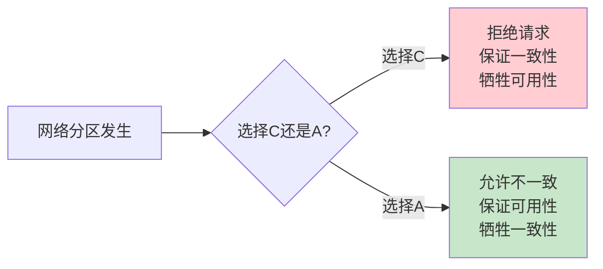

# CAP Twelve Years Later: How the "Rules" Have Changed

> **作者**: Eric Brewer (CAP定理提出者)
> **发表时间**: 2012年
> **核心观点**: CAP定理常被误解,实际应用比"三选二"更加细微和灵活

- [知乎论文笔记](https://zhuanlan.zhihu.com/p/582488636)

---

## 论文概述

这篇论文是Eric Brewer对自己在2000年提出的CAP定理的反思和澄清。在CAP定理提出12年后,Brewer指出业界对CAP存在许多误解,并提供了更实用的指导原则。

**核心信息**:
- CAP不是"非黑即白"的三选二
- 分区(P)是罕见事件,而非常态
- 应该关注分区期间和分区恢复后的策略
- C和A之间存在连续的权衡空间,而非二元选择

---

## 1. CAP定理基础回顾

### 1.1 三个属性定义

**C - Consistency (一致性)**:
```
定义: 所有节点在同一时间看到相同的数据
等价于: 线性一致性 (Linearizability)

示例:
Client写入x=1到节点A
→ 所有后续从任何节点的读取都返回x=1
```

**A - Availability (可用性)**:
```
定义: 每个请求都能收到响应(成功或失败),不论节点状态
要求:
- 非故障节点必须在合理时间内返回响应
- 不能无限期等待

注意: 不保证返回的是最新数据!
```

**P - Partition Tolerance (分区容忍性)**:
```
定义: 即使网络分区(节点间通信中断),系统仍能继续运行
含义: 系统必须能够容忍任意数量的消息丢失

实际情况: 网络分区不可避免,所以P总是需要的
```

### 1.2 原始定理陈述

```
CAP定理 (2000):
分布式系统最多只能同时满足一致性(C)、可用性(A)、分区容忍性(P)中的两个
```

**数学证明思路**:


**简单证明**:
```
假设两个节点G1和G2因网络分区无法通信:

场景1 - 客户端向G1写入v1:
- 如果要求一致性(C): G2必须拒绝读请求(因为无法确认最新值)
  → 牺牲可用性(A)

场景2 - 允许G2返回旧值v0:
- 保证可用性(A): G2响应请求
  → 牺牲一致性(C): G1和G2返回不同值

结论: 网络分区(P)存在时,C和A无法同时满足
```

---

## 2. 常见误解与澄清

### 2.1 误解1: "CAP三选二"

**错误观点**:
```
"我需要设计一个CP系统"或"我需要设计一个AP系统"
→ 暗示系统在所有时间都做同样的选择
```

**Brewer的澄清**:
> CAP应该是"在分区期间,选择C还是A",而非"系统永远是CP或AP"

**正确理解**:
```
正常情况(无分区): 系统可以同时提供C和A
分区期间: 必须在C和A之间选择
分区恢复后: 需要恢复一致性

时间线:
|--CA--|--选择CA--|--CA--|--选择CA--|--CA--|
       ↑          ↑      ↑          ↑
     分区开始   分区恢复 分区开始   分区恢复
```

**实际意义**:
- 不应该静态地将系统分类为"CP"或"AP"
- 应该关注**分区期间的策略**和**分区后的恢复机制**
- 大部分时间系统运行在无分区状态

### 2.2 误解2: 分区是常态

**错误观点**:
```
"网络总是不可靠的,所以必须时刻准备应对分区"
→ 过度设计,引入不必要的复杂性
```

**Brewer的观察**:
```
现代数据中心网络:
- 分区非常罕见(可能几个月甚至几年才一次)
- 更常见的是短暂延迟,而非完全分区
- 单个节点故障比网络分区更常见

建议:
1. 默认设计为CA(正常情况下既一致又可用)
2. 为分区设计明确的处理策略(检测、切换、恢复)
3. 测试和演练分区场景(混沌工程)
```

### 2.3 误解3: 可用性的定义

**错误理解**:
```
可用性 = 系统正常运行时间百分比(如99.9%可用)
```

**CAP中的可用性定义**:
```
CAP的A: 每个非故障节点对每个请求都必须返回响应
        → 非常严格的要求

传统可用性: 系统整体在99.9%的时间可用
           → 允许短暂的全局不可用

区别:
CAP-A要求每个节点都可用,更强的约束
传统可用性允许部分节点不可用,只要整体可用
```

**示例**:
```
场景: 5个节点的系统,网络分区分成{1,2}和{3,4,5}

CAP-A的要求:
- 所有5个节点都必须响应请求
- 即使1,2节点看不到最新数据,也必须返回响应

传统99.9%可用:
- 可以让1,2节点拒绝服务
- 只要3,4,5节点继续服务即可
```

### 2.4 误解4: C和A是二元选择

**错误观点**:
```
"必须100%一致或100%可用,没有中间状态"
```

**Brewer的洞察**:
> C和A是一个**连续的光谱**,而非离散的二选一

**一致性光谱**:
```
强一致性 ←────────────────────────────→ 弱一致性
    ↑           ↑           ↑           ↑
  线性一致   顺序一致   因果一致   最终一致

每个级别都有不同的:
- 性能特征
- 延迟要求
- 实现复杂度
- 应用场景
```

**可用性光谱**:
```
永不拒绝 ←────────────────────────────→ 严格拒绝
    ↑           ↑           ↑           ↑
  乐观复制   读己写一致  会话一致   强一致读

策略:
- 降级服务: 返回缓存数据而非拒绝
- 部分功能: 只读模式,不允许写入
- 备用路径: 从副本读取,标记为"可能过期"
```

---

## 3. 实践中的CAP权衡

### 3.1 分区检测

**关键挑战**: 如何区分"网络分区"和"节点慢/故障"?

```
超时时间的困境:
- 太短: 误判为分区,不必要地牺牲一致性
- 太长: 延迟检测,影响用户体验

推荐策略:
1. 多重超时层级:
   - 快速超时(100ms): 切换到备用副本
   - 中等超时(1s): 标记节点为可疑
   - 长超时(10s): 确认分区,触发CAP选择

2. 主动心跳:
   - 不依赖请求超时
   - 独立的健康检查线程
   - 多路径验证(不同网络路径)
```

**示例 - etcd的分区检测**:
```go
// etcd使用心跳机制
const (
    ElectionTimeout  = 1000ms  // 无心跳则触发选举
    HeartbeatInterval = 100ms  // Leader发送心跳频率
)

// Follower逻辑
if time.Since(lastHeartbeat) > ElectionTimeout {
    // 检测到可能的分区
    r.state = Candidate
    r.startElection()
}

// 多数派机制避免脑裂
// 少数分区的节点无法获得多数票,保持Follower状态
```

### 3.2 分区期间策略

**CP策略 - 牺牲可用性保证一致性**:

```
适用场景:
- 金融交易
- 库存扣减
- 配置管理
- 分布式锁

实现方式:
1. 拒绝少数分区的请求
2. 仅允许多数派分区提供服务
3. 等待分区恢复

示例 - MongoDB:
if (replicaSet.majorityUnreachable()) {
    // 主节点降级为从节点
    self.stepDown()
    // 拒绝所有写请求
    return Error("Not master")
}
```

**AP策略 - 牺牲一致性保证可用性**:

```
适用场景:
- 购物车
- 社交网络(点赞、评论)
- 监控指标
- 日志收集

实现方式:
1. 允许所有分区继续服务
2. 接受临时的不一致
3. 分区恢复后合并冲突

示例 - Amazon Dynamo:
// 所有节点都接受写入
put(key, value, vector_clock):
    // 写入本地
    local.write(key, value, vc)

    // 异步复制到N个副本
    for replica in preferenceList:
        async_replicate(replica, key, value, vc)

    // 立即返回成功(无需等待多数派)
    return OK
```

**混合策略 - 更细粒度的权衡**:

```
策略1 - 按操作类型区分:
- 读操作: 允许从任何副本读(AP)
- 写操作: 需要多数派确认(CP)

策略2 - 按数据重要性区分:
- 关键数据: 强一致性(CP)
  例: 用户余额
- 非关键数据: 最终一致性(AP)
  例: 用户浏览历史

策略3 - 降级服务:
正常: 返回实时数据
分区: 返回缓存数据 + 警告标识
```

**实际案例 - Google**:
```
Gmail在分区期间的策略:
✓ 读邮件: 允许(AP,可能看不到最新邮件)
✓ 写草稿: 允许(AP,本地保存,后续同步)
✗ 发送邮件: 禁止(CP,避免重复发送)
```

### 3.3 分区恢复

**核心问题**: 分区期间产生的不一致如何解决?

**自动合并策略**:

**1. Last-Write-Wins (LWW)**:
```
规则: 使用时间戳,保留最新的写入

优点: 简单,自动合并
缺点:
- 需要同步时钟(困难!)
- 可能丢失并发写入

示例:
分区1: set(x, 1) at t=100
分区2: set(x, 2) at t=101
合并后: x=2 (时间戳更大)

问题: 如果时钟不同步,t=100可能实际更晚!
```

**2. 版本向量 (Vector Clocks)**:
```go
// 检测并发冲突
type VectorClock map[NodeID]int

// 示例
分区1: set(x, "value1", VC{N1:2, N2:1, N3:1})
分区2: set(x, "value2", VC{N1:1, N2:2, N3:1})

合并时:
VC1 和 VC2 并发(neither happens-before the other)
→ 保留两个版本,等待应用层解决

// Dynamo的实现
get(key) {
    versions := getAllVersions(key)
    if len(versions) == 1 {
        return versions[0]
    } else {
        // 返回所有冲突版本,由客户端合并
        return ConflictingVersions(versions)
    }
}
```

**3. CRDTs (Conflict-free Replicated Data Types)**:
```
原理: 设计特殊的数据结构,保证合并操作满足:
- 交换律: merge(A, B) = merge(B, A)
- 结合律: merge(A, merge(B, C)) = merge(merge(A, B), C)
- 幂等性: merge(A, A) = A

示例 - 只增集合(G-Set):
分区1: add(x), add(y)
分区2: add(y), add(z)
合并: {x, y, z} (集合并集,自动无冲突)

示例 - 计数器(PN-Counter):
每个节点维护独立的增量和减量
合并时求和: sum(所有增量) - sum(所有减量)
```

**人工介入策略**:

```
适用场景: 关键业务数据,自动合并可能导致错误

流程:
1. 检测冲突
2. 记录冲突日志
3. 标记数据为"需人工审核"
4. 通知管理员
5. 人工决策保留哪个版本

示例 - 银行系统:
分区1: 账户余额扣减 $100
分区2: 账户余额扣减 $50
合并: 不自动决定,冻结账户,人工审核交易记录
```

---

## 4. ACID vs BASE

Brewer在论文中将CAP权衡与两种数据库哲学关联:

### 4.1 ACID (传统关系数据库)

```
A - Atomicity    (原子性): 事务要么全做要么全不做
C - Consistency  (一致性): 数据满足所有约束
I - Isolation    (隔离性): 并发事务互不干扰
D - Durability   (持久性): 提交的数据永久保存

CAP对应: 倾向于选择C (一致性)
代表: PostgreSQL, MySQL InnoDB

特点:
- 强调正确性
- 悲观并发控制(锁)
- 分区时牺牲可用性
```

### 4.2 BASE (NoSQL数据库)

```
BA - Basically Available  (基本可用): 系统大部分时间可用
S  - Soft state           (软状态): 状态可以不一致
E  - Eventually consistent(最终一致): 最终达到一致

CAP对应: 倾向于选择A (可用性)
代表: Cassandra, DynamoDB, Riak

特点:
- 强调可用性和性能
- 乐观复制
- 分区时继续服务,事后解决冲突
```

### 4.3 现代趋势: ACID + BASE混合

```
观察: 许多系统支持可调节的一致性

Cassandra一致性级别:
- ONE: 一个副本确认即可(高可用,弱一致)
- QUORUM: 多数派确认(平衡)
- ALL: 所有副本确认(强一致,低可用)

MongoDB读关注级别:
- local: 从主节点读(可能未复制)
- majority: 从多数派读(确保已复制)
- linearizable: 线性一致性读

建议:
根据具体操作选择级别,而非系统全局设置
```

---

## 5. 超越CAP: PACELC

### 5.1 PACELC模型

**提出者**: Daniel Abadi (2010)

**观察**: CAP只考虑分区情况,但正常情况下也有权衡

```
PACELC:
- 如果有分区(P),在可用性(A)和一致性(C)间选择
- 否则(E = Else),在延迟(L)和一致性(C)间选择

公式:
if (分区) then (A vs C)
else (延迟 vs 一致性)
```

### 5.2 实际系统分类

```
PA/EL系统 (分区时选A,正常时选低延迟):
- Dynamo, Cassandra, Riak
- 优先性能,容忍不一致

PC/EL系统 (分区时选C,正常时选低延迟):
- MongoDB (读从副本时)
- 大部分时间快速,分区时拒绝服务

PA/EC系统 (分区时选A,正常时选一致性):
- 罕见,理论上可行但矛盾

PC/EC系统 (始终选一致性):
- ZooKeeper, HBase, etcd
- 强一致性,牺牲性能和可用性
```

**为什么正常情况下也有L vs C权衡?**

```
强一致性读需要:
1. 确认自己是Leader(心跳确认)
2. 等待之前的写入提交
3. 从最新状态读取

→ 增加延迟

最终一致性读:
1. 直接从本地副本读
→ 低延迟,但可能过期
```

---

## 6. Brewer的实践建议

### 6.1 设计原则

**原则1: 最小化分区影响范围**

```
策略:
1. 分片/分区数据
   → 分区只影响部分数据,而非全部

2. 多数据中心部署
   → 单个数据中心分区不影响全局

3. 优雅降级
   → 关键功能CP,辅助功能AP

示例 - Twitter:
- 核心功能: 发推文(CP,确保不重复)
- 辅助功能: 查看时间线(AP,允许延迟)
```

**原则2: 利用分区的稀有性**

```
正常情况下优化:
- 假设无分区,提供CA
- 优化低延迟和高吞吐

分区情况下有策略:
- 快速检测
- 明确的模式切换
- 清晰的用户反馈("系统正在恢复中")

避免:
- 过度设计复杂的分区处理
- 为罕见情况牺牲常见情况的性能
```

**原则3: 客户端参与一致性保证**

```
服务端提供机制:
- 多个一致性级别选项
- 冲突版本返回
- 单调读保证

客户端选择策略:
- 关键操作: 强一致性
- 非关键操作: 弱一致性
- 合并冲突逻辑

示例 - 购物车:
客户端逻辑:
if (冲突版本) {
    // 合并两个购物车,取并集(用户不会介意多看到商品)
    return union(version1, version2)
}
```

### 6.2 测试和验证

**分区测试**:

```bash
# 使用工具模拟网络分区
# 工具: Jepsen, Chaos Monkey, toxiproxy

# 示例: toxiproxy模拟分区
toxiproxy-cli toxic add -t latency -a latency=1000 redis
toxiproxy-cli toxic add -t timeout -a timeout=0 redis

# 测试场景:
1. 完全分区: 节点间完全无法通信
2. 单向分区: A可以发消息给B,但B无法回复
3. 延迟分区: 消息延迟极高(秒级)
4. 间歇分区: 网络时好时坏
```

**验证清单**:

```
□ 分区检测: 系统能在多久检测到分区?
□ 模式切换: 从CA切换到CP/AP需要多久?
□ 数据完整性: 分区期间是否保证选定的C或A?
□ 恢复时间: 分区恢复后多久恢复正常?
□ 冲突解决: 冲突如何检测和解决?
□ 用户体验: 用户是否收到清晰的错误信息?
```

---

## 7. 关键洞察总结

### 7.1 核心观点

**1. CAP不是静态的三选二**
```
错误: "我的系统是CP系统"
正确: "分区时我选择C,正常情况下CA都提供,恢复后用版本向量合并冲突"
```

**2. 分区是例外,而非常态**
```
设计重心:
60% - 优化正常情况(无分区)
30% - 处理单节点故障
10% - 处理网络分区

而不是:
100% - 假设网络总是分区
```

**3. 一致性和可用性是光谱**
```
不是:       C ←→ A (二选一)
而是:       C ←-----连续光谱-----→ A
           强一致   会话一致   最终一致
```

**4. 应用层参与至关重要**
```
不能只依赖基础设施:
- 数据库提供机制(多版本,一致性级别)
- 应用选择策略(何时强一致,何时最终一致)
- 应用处理冲突(合并逻辑,业务规则)
```

### 7.2 设计检查表

**需求分析**:
```
□ 哪些操作必须强一致?(如:扣款)
□ 哪些操作可以最终一致?(如:点赞数)
□ 分区期间哪些功能可以降级?(如:只读模式)
□ 什么级别的不可用是可接受的?
```

**架构设计**:
```
□ 如何检测分区?(超时?心跳?多路径?)
□ 分区时的策略是什么?(CP?AP?混合?)
□ 如何恢复一致性?(自动?人工?CRDT?)
□ 用户体验如何?(错误提示?降级服务?)
```

**实现细节**:
```
□ 使用什么共识算法?(Raft?Paxos?无Leader?)
□ 数据如何分片?(减小分区影响范围)
□ 如何测试分区场景?(混沌工程)
□ 监控指标是什么?(分区检测时间?恢复时间?)
```

---

## 8. 与其他章节的联系

### 8.1 与DDIA第九章的关系

```
DDIA第九章详细讲解:
- 线性一致性(CAP中的C的形式化定义)
- 共识算法(实现CP的核心机制)
- 最终一致性(AP系统的保证)

本论文强调:
- 这些不是绝对的选择
- 实际系统在不同时间、不同操作使用不同级别
- 分区期间和正常期间的策略不同
```

### 8.2 实际系统案例

**etcd (PC/EC系统)**:
```
正常情况:
- 所有写入通过Raft确保一致性
- 读取可以选择: Leader读(一致)或Follower读(可能过期)

分区情况:
- 多数派分区: 继续服务(CP)
- 少数派分区: 拒绝服务,等待恢复
```

**Cassandra (PA/EL系统)**:
```
正常情况:
- 写入异步复制,低延迟
- 读取可调级别(ONE到ALL)

分区情况:
- 所有节点继续服务(AP)
- 使用版本向量检测冲突
- Last-Write-Wins合并策略
```

**MongoDB (PC/EL系统)**:
```
正常情况:
- 主节点写入,从节点异步复制(低延迟)
- 可选读从节点(牺牲一致性换性能)

分区情况:
- 多数派选举新主节点(CP)
- 少数派节点降级为只读或拒绝服务
```

---

## 9. 思考题

**1. 理论理解**:
- Brewer说"CAP应该是在分区期间选择C或A",这如何改变你对系统设计的看法?
- PACELC模型相比CAP增加了什么洞察?为什么重要?

**2. 实际应用**:
- 设计一个电商系统:
  - 商品浏览: 选择什么一致性级别?
  - 下单: 选择什么一致性级别?
  - 查看订单状态: 选择什么一致性级别?

**3. 权衡分析**:
- 为什么Google Spanner可以在多数据中心提供强一致性,代价是什么?
- 社交网络的点赞功能,使用CRDT计数器vs强一致性计数器,各有什么优劣?

**4. 系统演进**:
- 一个初创公司从单机系统演进到分布式系统,CAP权衡如何影响架构选择?
- 如何平滑迁移从CP系统到AP系统(或反向)?

**5. 测试验证**:
- 设计实验验证你的系统在网络分区时的行为
- 如何测量"分区检测时间"和"恢复时间"?

---

## 10. 扩展阅读

### 相关论文

1. **Harvest, Yield, and Scalable Tolerant Systems** (Fox & Brewer, 1999)
   - CAP定理的前身,引入收获率和产出率概念

2. **Eventually Consistent** (Vogels, 2008)
   - Amazon CTO对最终一致性的深入探讨

3. **Consistency Tradeoffs in Modern Distributed Database System Design** (Abadi, 2012)
   - 提出PACELC模型

4. **Brewer's Conjecture and the Feasibility of Consistent, Available, Partition-Tolerant Web Services** (Gilbert & Lynch, 2002)
   - CAP定理的形式化证明

### 实践资源

**源码阅读**:
- `etcd`: 理解PC/EC系统的实现
- `Cassandra`: 理解PA/EL系统的实现
- `CockroachDB`: 理解如何在分布式系统中提供强一致性

**测试工具**:
- **Jepsen**: Kyle Kingsbury的分布式系统测试框架
- **Chaos Monkey**: Netflix的混沌工程工具
- **toxiproxy**: Shopify的网络故障模拟工具

---

## 11. 总结

Eric Brewer在"CAP Twelve Years Later"中最重要的贡献是**纠正对CAP的简化理解**:

**从**:
```
"分布式系统是CP或AP,三选二"
```

**到**:
```
"分布式系统在不同时间、不同操作有不同的CA权衡,
 应该关注分区期间的策略和恢复机制,
 C和A是连续的光谱而非离散的选择"
```

**关键要点**:

1. **分区是罕见的** - 不要为罕见情况过度设计
2. **动态权衡** - 分区时选择C/A,正常时都提供
3. **光谱思维** - 一致性和可用性不是二元选择
4. **应用参与** - 应用层必须参与一致性保证
5. **测试验证** - 必须测试分区场景,不能只靠理论

**实践智慧**:

> "完美的一致性和完美的可用性都是不可能的,
> 真正的艺术在于找到业务需求和技术约束的最佳平衡点"
>
> —— Eric Brewer

---

**下一步建议**:

- 阅读DDIA第9章,深入理解一致性模型
- 实现一个支持可调一致性级别的简单KV存储
- 使用Jepsen测试你的系统在分区场景下的行为
- 分析实际系统(etcd, Cassandra)如何处理分区
