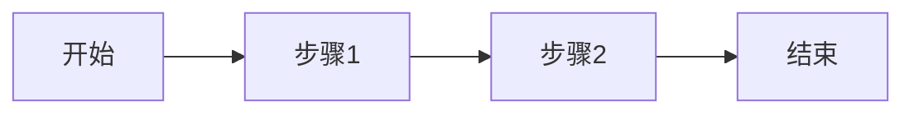

# Day {N} - {主题}

**日期**: YYYY-MM-DD
**学习时长**: X 小时

---

## 📚 学习内容

### 1. 主要概念

- **概念1**: 简要说明
- **概念2**: 简要说明
- **概念3**: 简要说明

### 2. 关键知识点

#### 2.1 知识点A

详细说明知识点A的内容...

**为什么重要?**
...

**如何应用?**
...

#### 2.2 知识点B

详细说明知识点B的内容...

**与其他知识的关联:**
...

---

## 💻 代码示例

### 示例1: XXX

```go
// Go 代码示例
package main

import "fmt"

func main() {
    fmt.Println("Hello, System Design!")
}
```

**代码说明:**
...

### 示例2: XXX

```python
# Python 代码示例
def example():
    pass
```

**代码说明:**
...

---

## 📊 架构图/流程图

### 图1: XXX架构

```
+----------+       +----------+       +----------+
| 客户端   | ----> | 负载均衡 | ----> | 服务器   |
+----------+       +----------+       +----------+
```

**图示说明:**
...

### 图2: XXX流程

使用 Mermaid 绘制:



---

## ✨ 重点总结

今日学习的核心要点:

1. **要点1**: ...
2. **要点2**: ...
3. **要点3**: ...

### 记忆口诀/技巧

- ...

---

## ❓ 疑问与思考

### 疑问

- ❓ 疑问1: xxx?
  - 待解决 / 已解决: ...

- ❓ 疑问2: xxx?
  - 待解决 / 已解决: ...

### 深入思考

- 💭 思考1: 如果场景变化会怎样?
  - 分析: ...

- 💭 思考2: 有没有更好的方案?
  - 想法: ...

---

## 🔗 参考资料

### 文章
- [文章标题1](链接) - 关键要点: ...
- [文章标题2](链接) - 关键要点: ...

### 视频
- [视频标题1](链接) - 时长: XX分钟 - 核心内容: ...

### 文档
- [官方文档](链接) - 相关章节: ...

### 代码仓库
- [项目名](链接) - 值得学习的点: ...

---

## 📋 下一步计划

明日学习计划:

- [ ] 任务1: ...
- [ ] 任务2: ...
- [ ] 任务3: ...

需要复习的内容:

- [ ] 复习内容1
- [ ] 复习内容2

---

## 💡 个人感悟

今天学习的感受:

...

遇到的挑战:

...

克服方法:

...

---

**打卡**: ✅ 已完成
