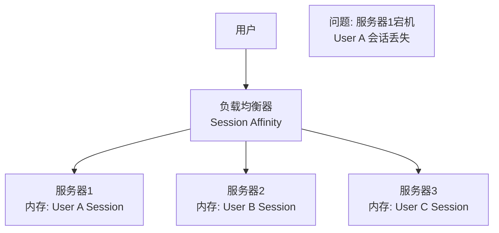
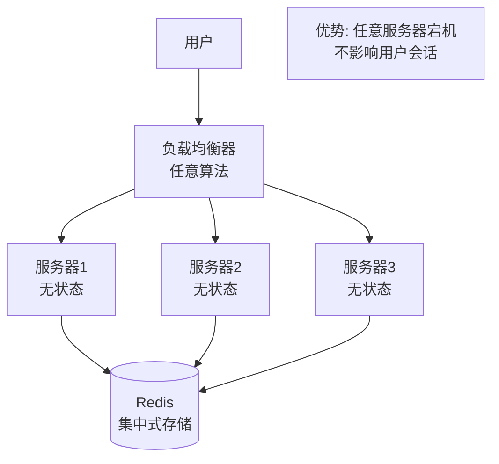
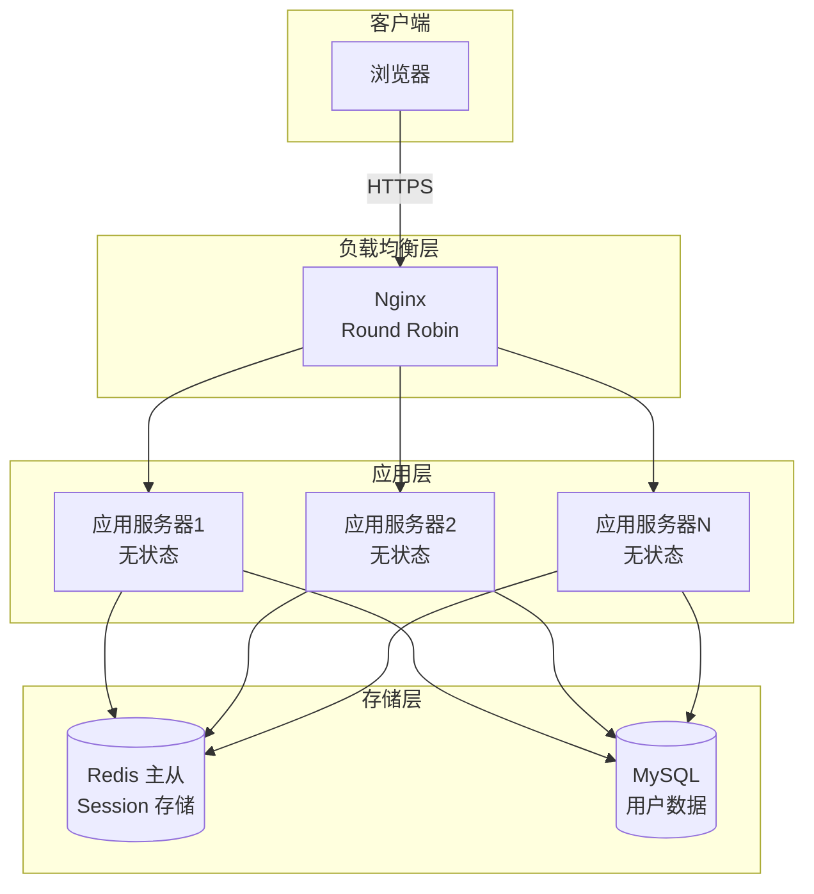

# Week 1 - Module 1.3: 无状态服务设计

## 💡 核心概念

### 无状态服务定义

**什么是无状态服务？**
- 服务器不保存客户端的会话状态
- 每个请求都是独立的，包含所有必要信息
- 服务器可以随时重启、替换，不影响用户

**The Twelve-Factor App - VI. Processes 原则**:
> "Twelve-factor processes are stateless and share-nothing. Any data that needs to persist must be stored in a stateful backing service."

### 为什么需要无状态？

**核心原因**: 实现水平扩展的前提

1. **水平扩展**
   - 可以轻松添加/删除服务器
   - 不需要关心请求路由到哪台服务器

2. **高可用性**
   - 单个服务器故障不影响用户
   - 快速故障恢复（直接替换实例）

3. **负载均衡**
   - 可以使用任意负载均衡算法
   - 不需要 Session Affinity（粘性会话）

4. **云原生架构**
   - 符合容器化、微服务理念
   - 支持自动伸缩（Auto Scaling）

---

## 📊 无状态 vs 有状态对比

| 维度 | 无状态服务 | 有状态服务 |
|------|----------|----------|
| **会话存储** | 外部存储（Redis、JWT） | 服务器内存 |
| **扩展性** | 容易水平扩展 | 困难（需要会话同步） |
| **负载均衡** | 任意算法（Round Robin, Least Conn） | 需要 Session Affinity |
| **故障恢复** | 快速（直接替换实例） | 慢（会话丢失） |
| **部署** | 滚动更新简单 | 需要会话迁移 |
| **资源利用** | 高（无内存开销） | 低（内存存储会话） |
| **复杂度** | 需要外部依赖 | 实现简单 |

### 架构对比图

**有状态服务（传统）**:


**无状态服务（现代）**:


---

## 🏗️ 无状态服务实现方案

### 方案 1: JWT Token（推荐用于认证）

**流程**:
```
1. 用户登录 → 服务器验证凭证
2. 服务器生成 JWT（包含用户ID、过期时间等）
3. 客户端存储 JWT（LocalStorage/Cookie）
4. 后续请求携带 JWT → 服务器验证签名 → 提取用户信息
```

**JWT 结构**:
```
Header.Payload.Signature
eyJhbGc...（Base64 编码）
```

**优点**:
- ✅ 完全无状态，服务器不需要存储
- ✅ 跨域友好（可用于微服务）
- ✅ 性能高（无需查询数据库）

**缺点**:
- ❌ Token 无法主动撤销（除非设置短过期时间 + Refresh Token）
- ❌ Token 体积大（包含用户信息）
- ❌ 泄露风险（需要 HTTPS）

**适用场景**:
- 微服务架构（服务间认证）
- 移动 APP（无 Cookie）
- 短期会话（1-2小时过期）

---

### 方案 2: 集中式 Session（Redis/Memcached）

**流程**:
```
1. 用户登录 → 服务器验证凭证
2. 生成 Session ID → 存储用户信息到 Redis
3. 返回 Session ID（通过 Cookie）
4. 后续请求携带 Session ID → 服务器从 Redis 读取用户信息
```

**架构图**:
```mermaid
graph LR
    Client[客户端<br/>Cookie: sessionId=abc123] --> Server1[服务器1]
    Client --> Server2[服务器2]
    Server1 --> Redis[(Redis<br/>abc123: {userId:1, ...})]
    Server2 --> Redis
```

**优点**:
- ✅ 可以主动撤销会话（删除 Redis key）
- ✅ Session 数据可以很大（Redis 存储）
- ✅ 安全（Session ID 无意义，无法伪造）

**缺点**:
- ❌ 依赖 Redis 可用性（需要 Redis 高可用）
- ❌ 网络开销（每次请求都查 Redis）
- ❌ 序列化开销

**适用场景**:
- Web 应用（有 Cookie 支持）
- 需要主动登出功能
- Session 数据复杂（购物车、用户偏好）

---

### 方案 3: 混合方案（JWT + Redis）

**策略**:
- 使用 JWT 存储不敏感信息（用户ID、角色）
- 使用 Redis 存储敏感/可变信息（权限、黑名单）

**流程**:
```
1. 颁发 JWT（短期，如 15 分钟）
2. 关键操作时，额外检查 Redis 黑名单
3. 使用 Refresh Token（存 Redis）延长会话
```

**优点**:
- ✅ 兼顾性能和安全
- ✅ 可以主动撤销（黑名单机制）

---

## ✍️ 实践任务：无状态用户认证系统设计

### 需求分析

**功能需求**:
- 用户登录/登出
- 用户信息获取
- 水平扩展（支持 10 台服务器）

**非功能需求**:
- 高可用（单台服务器宕机不影响）
- 低延迟（Session 读取 < 10ms）
- 安全（防止会话劫持）

### 架构设计

**我的设计**:



**技术选型**:
- 认证方式: Session ID + Redis
- Session 存储: Redis 主从 + Sentinel
- Session 过期: 30 分钟（TTL）
- Cookie 设置: HttpOnly, Secure, SameSite

**关键流程**:

1. **登录流程**:
```
POST /api/login
{username, password}

服务器:
1. 验证用户名密码（查 MySQL）
2. 生成 Session ID（UUID）
3. 存储到 Redis: SET session:{id} {userId:1, ...} EX 1800
4. 返回 Set-Cookie: sessionId={id}; HttpOnly; Secure
```

2. **请求验证流程**:
```
GET /api/user/profile
Cookie: sessionId=abc123

服务器:
1. 从 Cookie 提取 Session ID
2. 查询 Redis: GET session:abc123
3. 如果存在 → 提取 userId → 查询用户信息
4. 如果不存在 → 返回 401 Unauthorized
```

3. **登出流程**:
```
POST /api/logout

服务器:
1. 从 Cookie 提取 Session ID
2. 删除 Redis: DEL session:abc123
3. 返回 Set-Cookie: sessionId=; Max-Age=0
```

---

## 🤔 思考与反思

### 关键洞察

1. **无状态是水平扩展的前提**
   - 与 Module 1.1 的"水平扩展"概念呼应
   - 只有无状态服务才能随意添加服务器

2. **无状态 ≠ 无存储**
   - 状态存储从服务器内存转移到外部（Redis/数据库）
   - 服务器变成"计算层"，不保存状态

3. **无状态服务的核心是解耦**
   - 请求处理与服务器实例解耦
   - 任何服务器都能处理任何请求

### 与之前知识的联系

- **垂直扩展 vs 水平扩展**: 无状态服务是水平扩展的基础
- **负载均衡**: 无状态服务可以使用任意负载均衡算法
- **CAP 定理**: Session 存储（Redis）需要考虑 CAP 权衡

### 待深入问题

- [ ] Redis 如何保证高可用？（主从、Sentinel、Cluster）
- [ ] JWT Refresh Token 的最佳实践是什么？
- [ ] 如何防止 Session Fixation 攻击？
- [ ] 分布式 Session 的一致性如何保证？

---

## 📖 参考资源

### 核心阅读
- [The Twelve-Factor App - VI. Processes](https://12factor.net/processes)
- [Stateless vs Stateful Services](https://medium.com/@maniakhitoccori/stateless-vs-stateful-architecture-63194d749c08)

### 视频
- [Stateless Architecture](https://www.youtube.com/watch?v=1T2Xw9k6h8I) (10分钟)

### 延伸阅读
- [JWT 官方文档](https://jwt.io/introduction)
- [Redis Session Store Pattern](https://redis.io/docs/manual/patterns/)
- [OWASP Session Management](https://cheatsheetseries.owasp.org/cheatsheets/Session_Management_Cheat_Sheet.html)

---

**学习时长**: _____ 小时
**完成日期**: _____
**下一步**: [Module 1.4: 会话状态管理](module1-4-session-management.md)
