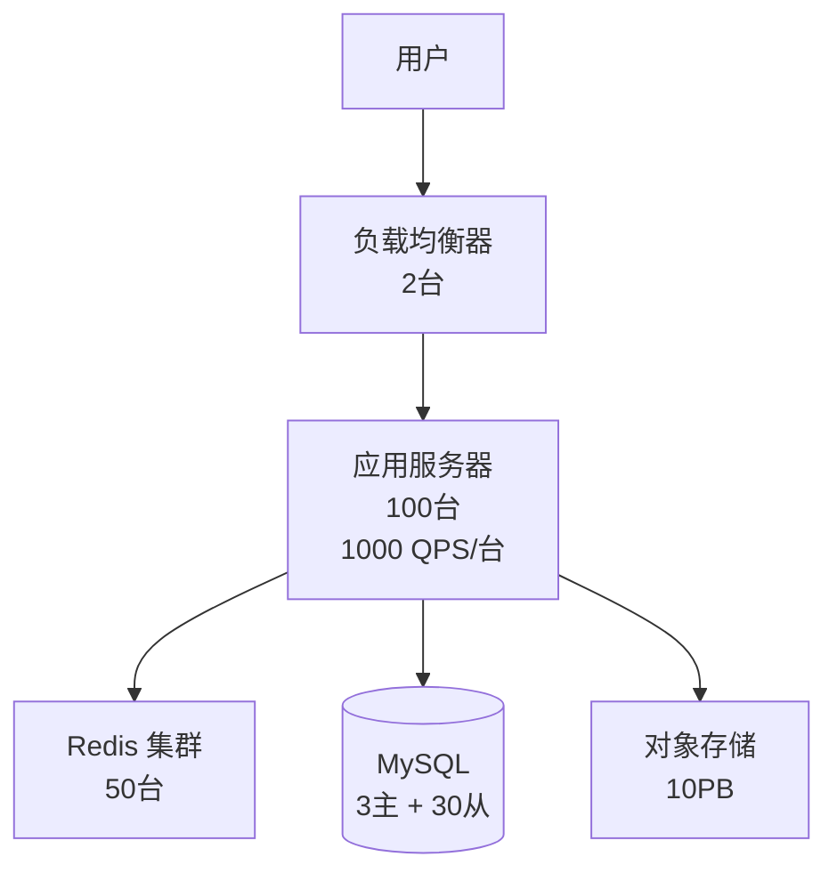

# Week 1 - 模块 3: 性能评估与容量规划 - 学习笔记

> **学习时间**: _____ 小时
> **完成日期**: _____

---

## 📚 学习内容总结

### 1. QPS vs TPS

#### 核心理解

**QPS (Queries Per Second)**:
- 定义: 每秒查询数，服务器每秒能够处理的请求的数量
- 适用场景: 读密集型服务
- 我的理解:

**TPS (Transactions Per Second)**:
- 定义: 每秒事务数，服务器每秒能够处理的事务的数量
- 适用场景: 写密集型服务
- 我的理解:

#### 实际计算练习

**练习 1: 电商系统 QPS 估算**

```
已知条件:
- DAU: 100万
- 每用户请求数/天: 20次
- 峰值因子: 3倍

我的计算过程:
平均请求数：100,0000 * 20 / (24 * 3600) = 231.48 QPS
峰值：231.48 * 3 = 694.44 QPS

20%冗余：694.44 * 1.2 = 833.33 QPS


结果:
- 平均 QPS: 231.48
- 峰值 QPS: 694.44
- 系统设计目标: 833.33
```

### 2. Latency 延迟分析

#### 为什么百分位数重要？

平均值的问题:
- 平均值掩盖了尾长效应，没有办法衡量真实的用户体验（我和马云的资产平均一下我也是亿万富翁！！）

#### 尾延迟放大效应

**案例**: 微服务调用链

```
假设 10 个服务，每个 P99 = 100ms

至少1个服务超时的概率:
即单个服务超时的概率是0.01

p = 1 - (1 - 0.01)^10 = 0.0956 = 9.56%

我的理解:
如果不严格控制每个服务的p99值，则会导致很严重的尾效应延迟
```

---

### 3. Throughput 与带宽估算

#### 核心公式

```
吞吐量 = QPS × 单个请求大小
```

#### 实战计算: 图片分发服务

```
已知:
- DAU: 500万
- 每用户查看图片: 50张/天
- 图片大小: 200KB
- 峰值因子: 3倍

我的计算:
日总流量 = 5000000 * 50 * 200 KB = 50000000000 KB = 46.57 TB

平均带宽 = 46.57 * 1024 / (24 * 3600) GB/s = 0.55 GB/s = 4.4 Gpbs


峰值带宽 = 4.4 Gpbs * 3 = 13.2 Gpbs


加 20% 冗余 = 13.2 Gpbs * 1.2 = 15.84 Gpbs
```

#### 必记数字

Jeff Dean 的延迟数据（我记住的）:
- L1 缓存: 0.5 ns
- 内存引用: 100 ns
- SSD 随机读: 150 μs
- 磁盘寻道: 10 ms
- 网络往返: 150 ms

带宽换算:
- 1 Gbps = (1/8) * 1024 = 128 MB/s
- 实际问题: 1 Gbps 能传输多少张 1MB 图片/秒？ 128

---

### 4. Little's Law

#### 公式

```
L = λ × W

L = 系统中的平均请求数 (并发数)
λ = 请求到达率 (QPS)
W = 平均响应时间
```

#### 应用练习

**练习 1: 计算并发数**

```
已知:
- QPS = 1000
- 响应时间 = 100ms

计算:
L = 1000 * 0.1 = 100


验证:

```

**练习 2: 数据库连接池设计**

```
已知:
- 应用 QPS = 5000
- 单次查询耗时 = 10ms

计算:
理论连接数 = 5000 * 0.01 = 50


实际建议配置 = 80 - 100


原因: 考虑峰值和抖动因素

```

#### 关键洞察

- 为什么不能让系统运行在 90% 以上利用率？


---

### 5. 容量规划实战

#### 我选择的系统: ___________________

**Step 1: 需求分析**

| 功能 | 读/写 | 频率估计 |
|------|-------|----------|
|      |       |          |
|      |       |          |
|      |       |          |

用户规模:
- 注册用户: _____
- MAU: _____
- DAU: _____

**Step 2: QPS 估算**

```
写 QPS:
平均 =
峰值 =

读 QPS:
平均 =
峰值 =

读写比 =
```

**Step 3: 存储容量估算**

```
数据类型 1 (如推文):
- 单条大小: _____
- 每天新增: _____
- 5年总量: _____

数据类型 2 (如图片):
- 单个大小: _____
- 每天新增: _____
- 5年总量: _____

总存储 (含副本): _____
```

**Step 4: 带宽估算**

```
写带宽:
- 文本: _____
- 媒体: _____
- 总计 (峰值): _____

读带宽:
- 总计 (峰值): _____
```

**Step 5: 服务器估算**

```
应用服务器:
- 单机能力: _____ QPS
- 需要数量: _____
- 考虑冗余: _____

数据库:
- 主库: _____ 台
- 从库: _____ 台

缓存:
- 缓存数据量: _____
- Redis 数量: _____ 台
```

**Step 6: 成本估算**

| 类型 | 数量 | 单价 | 月成本 |
|------|------|------|--------|
| 应用服务器 |  |  |  |
| 数据库 |  |  |  |
| 缓存 |  |  |  |
| 存储 |  |  |  |
| 带宽 |  |  |  |
| **总计** |  |  | **$_____** |

---

## 🔍 深度思考

### 问题与解答

**Q1: 为什么电商系统的峰值因子通常是 3-5 倍？**

我的理解:


**Q2: 微服务架构下，如何控制整体 P99 延迟？**

我的想法:


**Q3: 容量规划中最容易被低估的因素是什么？**

我的观察:


---

## 💻 实践练习记录

### 练习 1: QPS 计算

**题目**: 某电商网站 DAU 50万，每用户 30 页面/天，高峰 2 小时占 40% 流量，峰值因子 4 倍

```
我的计算:


答案:
- 平均 QPS: _____
- 高峰 QPS: _____
- 瞬时峰值: _____
- 需要 Nginx: _____ 台
```

### 练习 2: 延迟分析

**题目**: 100 次请求数据，计算百分位数

```
我的方法:


结果:
- P50: _____
- P95: _____
- P99: _____
```

### 练习 3: Little's Law

**题目**: 连接池 200 个连接，查询 20ms，计算最大 QPS

```
计算:


结论:

```

### 练习 4: 短视频容量规划

**题目**: DAU 1000万，每人上传 2 视频 (50MB)，观看 30 视频

```
每天新增存储:


1年存储:


峰值带宽 (10万并发):


CDN 月成本:

```

---

## 📊 容量规划案例输出

### 架构图

```
[在此绘制或粘贴架构图]

或使用 Mermaid:


```

### Excel 容量规划表

| 指标 | 数值 | 计算依据 |
|------|------|----------|
| DAU |  |  |
| 平均 QPS |  |  |
| 峰值 QPS |  |  |
| 存储需求 |  |  |
| 带宽需求 |  |  |
| 服务器数 |  |  |
| 月成本 |  |  |

---

## 🎯 学习收获

### 最大突破

1.
2.
3.

### 仍需加强

1.
2.

### 应用场景

在实际工作中，我可以将这些知识应用于:
-
-

---

## 📚 资源记录

### 阅读的文章

- [ ] AWS: Using Load Testing to Scale
  - 链接:
  - 关键收获:

- [ ] Brendan Gregg: USE Method
  - 链接:
  - 关键收获:

- [ ] Numbers Every Programmer Should Know
  - 关键数据记录:

### 观看的视频

- [ ] 视频标题: _____
  - 时长: _____
  - 关键点:

### 参考代码

- 项目: _____
  - 仓库: _____
  - 学到的技巧:

---

## ✅ 模块完成检查

- [ ] 能解释 QPS 和 TPS 的区别并举例
- [ ] 能手工计算 P50、P95、P99
- [ ] 理解 P99 比平均值重要的原因
- [ ] 记住至少 10 个常用延迟数字
- [ ] 能使用 Little's Law 进行计算
- [ ] 完成 1 个完整容量规划案例
- [ ] 输出架构图和成本估算
- [ ] 了解云服务定价

---

## 📝 下一步计划

1. 复习本周所有模块 (模块1、2、3)
2. 准备 Week 1 总结
3. 开始 Week 2 学习

**备注**:


---

**学习座右铭**: "Depth over breadth. Understanding over memorization." 🚀
