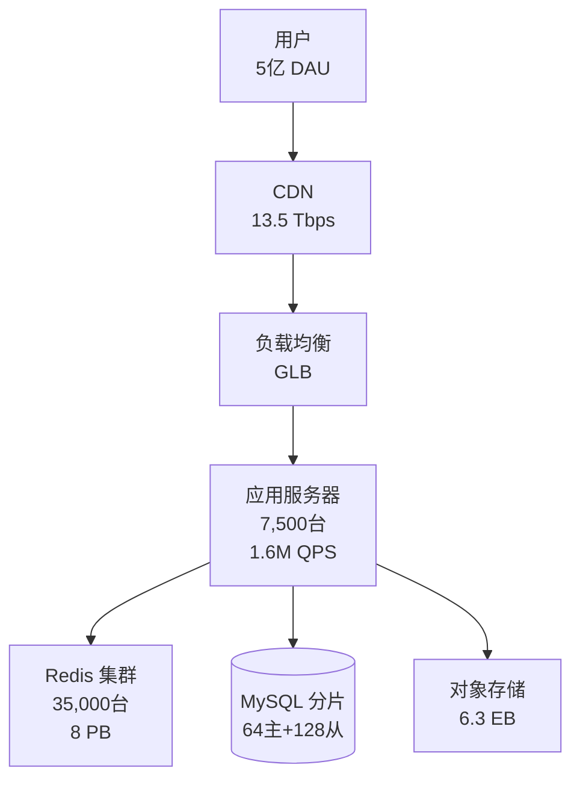

# 容量规划实战指南

> 从需求分析到成本估算的完整流程

---

## 一、容量规划方法论

### 1.1 自底向上估算法

**核心思想**: 从基础数据开始,逐层推导

```
步骤 1: 用户规模 →
步骤 2: 功能定义 →
步骤 3: 流量估算 (QPS/TPS) →
步骤 4: 存储容量 →
步骤 5: 带宽需求 →
步骤 6: 服务器数量 →
步骤 7: 成本预算
```

### 1.2 关键假设

**必须明确的假设**:

```
用户行为:
- DAU (日活用户)
- 人均请求数/天
- 使用时段分布
- 峰值因子

数据特征:
- 平均数据大小
- 读写比例
- 热点数据比例
- 数据保留时长

性能目标:
- SLA 延迟要求
- 可用性目标 (如 99.9%)
- 数据一致性要求
```

---

## 二、Instagram 容量规划案例

### 2.1 需求分析

**系统功能**:
```
核心功能:
1. 上传照片/视频
2. 浏览 Feed
3. 点赞/评论
4. 关注/粉丝
5. Stories (24小时后消失)
```

**用户规模假设**:

```
注册用户: 20 亿
MAU (月活): 12 亿 (60%)
DAU (日活): 5 亿 (41.7% of MAU)

地理分布:
- 北美: 15%
- 欧洲: 20%
- 亚洲: 50%
- 其他: 15%
```

**用户行为假设**:

```
上传:
- 人均上传照片: 1 张/天
- 人均发 Story: 2 个/天

浏览:
- 人均刷 Feed: 50 次/天
- 人均看 Story: 30 次/天
- 人均点赞: 10 次/天
```

### 2.2 流量估算

**写操作 QPS**:

```
照片上传:
日总量 = 5 亿 × 1 = 5 亿张/天
平均 QPS = 500,000,000 / 86,400 ≈ 5,787 QPS
峰值 QPS (×3) = 5,787 × 3 ≈ 17,361 QPS

Story 上传:
日总量 = 5 亿 × 2 = 10 亿个/天
平均 QPS = 1,000,000,000 / 86,400 ≈ 11,574 QPS
峰值 QPS (×3) = 11,574 × 3 ≈ 34,722 QPS

点赞:
日总量 = 5 亿 × 10 = 50 亿次/天
平均 QPS = 5,000,000,000 / 86,400 ≈ 57,870 QPS
峰值 QPS (×3) = 57,870 × 3 ≈ 173,610 QPS

总写 QPS:
峰值 = 17,361 + 34,722 + 173,610 ≈ 225,693 QPS
```

**读操作 QPS**:

```
Feed 浏览:
日总量 = 5 亿 × 50 = 250 亿次/天
平均 QPS = 25,000,000,000 / 86,400 ≈ 289,351 QPS
峰值 QPS (×3) = 289,351 × 3 ≈ 868,053 QPS

Story 观看:
日总量 = 5 亿 × 30 = 150 亿次/天
平均 QPS = 15,000,000,000 / 86,400 ≈ 173,611 QPS
峰值 QPS (×3) = 173,611 × 3 ≈ 520,833 QPS

总读 QPS:
峰值 = 868,053 + 520,833 ≈ 1,388,886 QPS

读写比:
1,388,886 / 225,693 ≈ 6:1
```

### 2.3 存储容量估算

**照片存储**:

```
原图:
平均大小: 2 MB (高清照片)
日新增: 5 亿 × 2 MB = 1,000,000 GB = 1 PB/天
5 年: 1 PB × 365 × 5 = 1,825 PB

缩略图 (3 个尺寸):
- 150x150: 20 KB
- 640x640: 100 KB
- 1080x1080: 200 KB
每张照片缩略图总计: ≈ 320 KB

日新增: 5 亿 × 320 KB = 160,000 GB ≈ 156 TB/天
5 年: 156 TB × 365 × 5 = 284,700 TB ≈ 285 PB

照片总存储 (5年):
原图: 1,825 PB
缩略图: 285 PB
总计: 2,110 PB
```

**Story 存储** (24小时后删除):

```
单个 Story: 3 MB (照片或短视频)
日活跃 Story: 10 亿个 × 3 MB = 3,000,000 GB = 3 PB

只需保留 1 天:
存储需求: 3 PB × 2 (双副本) = 6 PB
```

**元数据存储**:

```
照片元数据 (每张):
- 照片 ID: 8 bytes
- 用户 ID: 8 bytes
- 时间戳: 8 bytes
- 位置信息: 50 bytes
- 标签: 100 bytes
- 点赞数/评论数: 8 bytes
总计: ≈ 200 bytes

5 年照片数:
5 亿张/天 × 365 × 5 = 912,500,000,000 张
≈ 9,125 亿张

元数据存储:
9,125 亿 × 200 bytes = 1,825,000,000,000 bytes
≈ 1,825 GB ≈ 1.8 TB
```

**总存储需求**:

```
照片: 2,110 PB
Story: 6 PB
元数据: 1.8 TB (可忽略不计)

总计 (含 3 副本):
(2,110 + 6) PB × 3 = 6,348 PB ≈ 6.3 EB
```

### 2.4 带宽估算

**上行带宽 (上传)**:

```
照片上传:
峰值 QPS: 17,361
平均大小: 2 MB

峰值带宽 = 17,361 × 2 MB = 34,722 MB/s ≈ 34 GB/s = 272 Gbps

Story 上传:
峰值 QPS: 34,722
平均大小: 3 MB

峰值带宽 = 34,722 × 3 MB = 104,166 MB/s ≈ 104 GB/s = 832 Gbps

总上行峰值带宽:
272 + 832 = 1,104 Gbps ≈ 1.1 Tbps
```

**下行带宽 (浏览)**:

```
Feed 浏览 (缩略图为主):
峰值 QPS: 868,053
平均大小: 200 KB (缩略图)

峰值带宽 = 868,053 × 200 KB = 173,610,600 KB/s
≈ 169,541 MB/s ≈ 165 GB/s = 1,320 Gbps

Story 观看:
峰值 QPS: 520,833
平均大小: 3 MB

峰值带宽 = 520,833 × 3 MB = 1,562,499 MB/s
≈ 1,526 GB/s = 12,208 Gbps

总下行峰值带宽:
1,320 + 12,208 = 13,528 Gbps ≈ 13.5 Tbps
```

**实际带宽 (CDN 优化)**:

```
CDN 承担 95% 流量:
源站下行: 13.5 Tbps × 5% = 675 Gbps
CDN 边缘: 13.5 Tbps

源站上行: 1.1 Tbps (无法通过 CDN)

总源站带宽:
上行: 1.1 Tbps
下行: 675 Gbps
```

### 2.5 服务器估算

**应用服务器**:

```
单机能力: 1,000 QPS (假设)
峰值总 QPS: 1,388,886 + 225,693 = 1,614,579 QPS

需要服务器:
1,614,579 / 1,000 ≈ 1,615 台

考虑:
- N+1 冗余: ×1.5 = 2,423 台
- 多机房 (3 个): ×3 = 7,269 台
- 四舍五入: 7,500 台应用服务器
```

**数据库服务器 (MySQL)**:

```
主库 (写):
峰值写 QPS: 225,693
单机写能力: 5,000 TPS
需要主库: 225,693 / 5,000 ≈ 46 台

分片策略: 按用户 ID 分 64 个分片
实际主库: 64 台 (每分片 1 主)

从库 (读):
峰值读 QPS: 1,388,886
缓存命中率: 90% (假设)
实际 DB 读: 1,388,886 × 10% = 138,889 QPS

单机读能力: 10,000 QPS
需要从库: 138,889 / 10,000 ≈ 14 台

实际配置: 每个分片 2 个从库
总从库: 64 × 2 = 128 台

数据库总计:
主库: 64 台
从库: 128 台
总计: 192 台
```

**缓存服务器 (Redis)**:

```
缓存热数据:
- 照片元数据: 1.8 TB
- 热门照片缩略图: 2,110 PB × 10% = 211 PB
- Feed 数据: 估算 100 TB
- 用户 Session: 估算 50 TB

总缓存需求: ≈ 211.2 PB

单台 Redis: 256 GB 内存
需要 Redis: 211.2 PB / 256 GB = 862,500 台

优化 (只缓存最近 7 天数据):
7 天照片: 1 PB × 7 = 7 PB
缩略图: 156 TB × 7 = 1,092 TB ≈ 1 PB
其他: 150 TB

优化后总需求: 8.15 PB
需要 Redis: 8.15 PB / 256 GB ≈ 32,500 台

实际部署 (考虑冗余): 35,000 台
```

**对象存储**:

```
使用 S3/GCS/Azure Blob:
总存储: 6.3 EB
无需自建服务器
```

### 2.6 成本估算

**服务器成本** (AWS EC2 c5.2xlarge, $0.34/h):

```
应用服务器:
7,500 台 × $0.34/h × 730 h/月 = $1,861,500/月
```

**数据库成本** (RDS db.r5.8xlarge, $3.20/h):

```
主库: 64 台 × $3.20/h × 730 h/月 = $149,504/月
从库: 128 台 × $3.20/h × 730 h/月 = $299,008/月
总计: $448,512/月
```

**缓存成本** (ElastiCache r5.4xlarge, $1.34/h):

```
35,000 台 × $1.34/h × 730 h/月 = $34,279,000/月
```

**对象存储成本** (S3 Standard, $0.023/GB/月):

```
6.3 EB = 6,300,000,000 GB
照片 (冷数据迁移到 S3 Glacier):
- Standard (最近 30 天): 30 PB × $0.023/GB = $690,000
- Glacier (旧数据): 6,270 PB × $0.004/GB = $25,080,000
总计: $25,770,000/月
```

**CDN 成本** (CloudFront, 平均 $0.05/GB):

```
月流量估算:
13.5 Tbps 峰值 → 假设平均 6 Tbps
日流量 = 6 Tbps × 86,400 s ÷ 8 = 64,800,000 GB = 63,281 TB
月流量 = 63,281 × 30 = 1,898,438 TB ≈ 1.9 PB

成本 = 1,900,000 GB × $0.05 = $95,000,000/月
```

**总成本**:

```
应用服务器:     $1,861,500
数据库:         $448,512
缓存:          $34,279,000
对象存储:      $25,770,000
CDN:           $95,000,000
─────────────────────────────
总计:         $157,359,012/月

年成本:        $1,888,308,144 ≈ $1.89B/年
```

### 2.7 优化方案

**成本优化**:

```
1. 图片压缩 & WebP:
   - 原图从 2MB → 1MB (50% 节省)
   - 存储成本减半: $25,770,000 → $12,885,000
   - CDN 成本减半: $95,000,000 → $47,500,000

2. CDN 分层缓存:
   - Edge PoP (边缘): 95% 命中
   - Mid-Tier: 4% 命中
   - Origin: 1% 流量
   - 源站带宽降至 135 Gbps
   - 应用服务器减少: 7,500 → 1,000 台

3. 智能缓存淘汰:
   - 基于访问频率的 LRU
   - Redis 需求降低 30%
   - 35,000 → 24,500 台

4. 预留实例 & Savings Plan:
   - 应用服务器: 节省 30%
   - 数据库: 节省 40%
   - 缓存: 节省 30%

优化后成本:
应用服务器:    $186,150      (-90%)
数据库:        $269,107      (-40%)
缓存:         $24,000,000    (-30%)
对象存储:     $12,885,000    (-50%)
CDN:          $47,500,000    (-50%)
─────────────────────────────
总计:         $84,840,257/月

年成本:       $1,018,083,084 ≈ $1.02B/年

总节省: $1.89B - $1.02B = $870M/年 (46% 节省!)
```

---

## 三、完整容量规划模板

### 3.1 Excel 表格结构

**Sheet 1: 用户规模**

```
| 指标 | 数值 | 说明 |
|------|------|------|
| 注册用户 | 20亿 | 历史累计 |
| MAU | 12亿 | 月活用户 |
| DAU | 5亿 | 日活用户 |
| 峰值因子 | 3 | 峰值/平均 |
```

**Sheet 2: QPS 估算**

```
| 功能 | 人均/天 | 日总量 | 平均QPS | 峰值QPS |
|------|--------|--------|---------|---------|
| Feed浏览 | 50 | 250亿 | 289,351 | 868,053 |
| 照片上传 | 1 | 5亿 | 5,787 | 17,361 |
| ... | ... | ... | ... | ... |
```

**Sheet 3: 存储估算**

```
| 数据类型 | 单位大小 | 日新增 | 保留期 | 总存储 | 副本 | 实际存储 |
|----------|----------|--------|--------|--------|------|----------|
| 照片原图 | 2MB | 5亿张 | 5年 | 1825PB | 3 | 5475PB |
| ... | ... | ... | ... | ... | ... | ... |
```

**Sheet 4: 服务器估算**

```
| 服务器类型 | 单机能力 | 需求 | 冗余 | 实际数量 | 单价 | 月成本 |
|------------|----------|------|------|----------|------|--------|
| 应用服务器 | 1000 QPS | 1615台 | ×1.5 | 2500台 | $0.34/h | $xxx |
| ... | ... | ... | ... | ... | ... | ... |
```

**Sheet 5: 总成本**

```
| 类型 | 月成本 | 年成本 | 优化后月成本 | 节省 |
|------|--------|--------|--------------|------|
| 计算 | $xxx | $xxx | $xxx | xx% |
| 存储 | $xxx | $xxx | $xxx | xx% |
| 带宽 | $xxx | $xxx | $xxx | xx% |
| 总计 | $xxx | $xxx | $xxx | xx% |
```

### 3.2 架构图模板

**高层架构**:



---

## 四、实战练习

### 练习 1: 电商平台容量规划

**需求**:
- DAU: 200 万
- 人均浏览商品: 50 个/天
- 人均下单: 0.5 单/天
- 商品图片: 500 KB/张 (4 张/商品)
- 保留订单: 永久
- 峰值: 双 11 期间 10 倍流量

**任务**:
1. 估算 QPS (浏览、下单、搜索)
2. 估算存储 (商品图片、订单数据、用户数据)
3. 估算带宽 (峰值带宽)
4. 估算服务器 (应用、数据库、缓存)
5. 估算成本 (月成本和年成本)
6. 提出优化方案

### 练习 2: 在线教育平台

**需求**:
- DAU: 100 万学生
- 人均观看视频: 2 小时/天
- 视频码率: 2 Mbps (720p)
- 课程数: 10,000 门
- 每门课程: 50 个视频, 每个 30 分钟

**任务**:
1. 估算并发观看数
2. 估算带宽需求
3. 估算视频存储 (含多码率)
4. CDN 成本
5. 流媒体服务器数量

---

## 五、容量规划检查清单

**规划完成前检查**:

```
用户与流量:
- [ ] DAU/MAU 数据合理吗？
- [ ] 读写比例符合业务特征吗？
- [ ] 峰值因子考虑了营销活动吗？
- [ ] 增长预期合理吗 (6个月/1年)？

存储与带宽:
- [ ] 数据大小估算准确吗？
- [ ] 副本数量足够吗 (至少3副本)？
- [ ] 带宽峰值留有冗余吗 (>20%)？
- [ ] 考虑了CDN优化吗？

服务器与成本:
- [ ] 单机能力假设合理吗？
- [ ] 冗余策略够吗 (N+1, 多机房)？
- [ ] 成本估算包含所有组件了吗？
- [ ] 有优化方案吗？

SLA与监控:
- [ ] 定义了延迟 SLA 吗 (P99)？
- [ ] 定义了可用性目标吗 (如 99.9%)？
- [ ] 监控指标完整吗？
- [ ] 告警阈值合理吗？
```

---

## 六、常见错误与避免

### 错误 1: 忘记峰值因子

```
❌ 错误:
   平均 QPS = 1000
   配置 1000 QPS 服务器

✅ 正确:
   平均 QPS = 1000
   峰值 QPS = 1000 × 3 = 3000
   配置 3000 × 1.2 = 3600 QPS 服务器
```

### 错误 2: 忘记副本

```
❌ 错误:
   存储需求 = 100 TB

✅ 正确:
   原始数据 = 100 TB
   3 副本 = 100 × 3 = 300 TB
```

### 错误 3: 忽略网络开销

```
❌ 错误:
   传输 1 MB 数据 = 1 MB

✅ 正确:
   应用数据 = 1 MB
   HTTP 头 ≈ 1 KB
   TCP/IP 开销 ≈ 40 bytes/packet
   实际传输 ≈ 1.05 MB (5% 开销)
```

### 错误 4: 低估数据增长

```
❌ 错误:
   只按当前规模设计

✅ 正确:
   当前: 1 PB
   6个月增长 50%: 1.5 PB
   1年增长 100%: 2 PB
   设计目标: 2 PB
```

---

## 七、学习检查清单

完成以下检查，说明你掌握了容量规划:

- [ ] 能独立完成一个系统的完整容量规划
- [ ] 能合理估算 QPS (考虑峰值)
- [ ] 能计算存储需求 (含副本)
- [ ] 能估算带宽 (上行和下行)
- [ ] 能估算服务器数量 (考虑冗余)
- [ ] 能粗略估算云成本
- [ ] 能提出优化方案 (降低成本)
- [ ] 能用 Excel 整理容量规划数据
- [ ] 能画出架构图并标注容量
- [ ] 理解常见错误并能避免

---

## 参考资料

1. **AWS Well-Architected Framework**: Capacity Planning
2. **Google SRE Book**: Chapter 26 - Data Processing Pipelines
3. **Instagram Engineering Blog**: Scaling Instagram Infrastructure
4. **Twitter Engineering Blog**: The Infrastructure Behind Twitter

**恭喜!** 完成 Week 1 模块 3 的学习后，你应该能够:
- ✅ 估算任意系统的 QPS/TPS
- ✅ 分析延迟百分位数 (P50/P95/P99)
- ✅ 使用 Little's Law 计算并发数
- ✅ 估算带宽和存储需求
- ✅ 完成完整的容量规划

**下一步**: 开始 Week 1 总结，回顾负载均衡、性能评估、容量规划的所有知识点！
