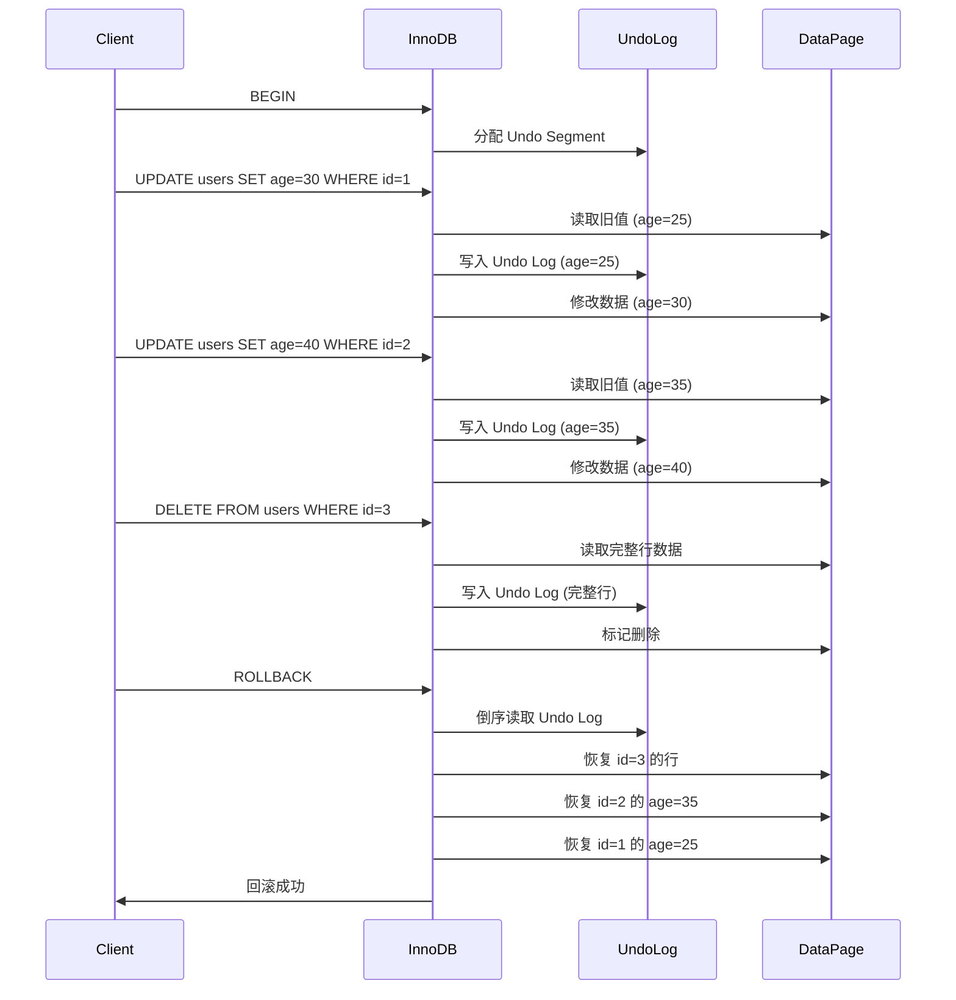

# 1.1 原子性 (Atomicity) - Undo Log 机制深度解析

> **学习目标**: 深入理解数据库如何通过 Undo Log 实现事务的原子性，掌握回滚机制的底层原理

---

## 📚 前置知识

在学习 Undo Log 之前，请确保你已经理解：

- ✅ ACID 特性的基本概念（特别是原子性 Atomicity）
- ✅ 事务的基本操作（BEGIN、COMMIT、ROLLBACK）
- ✅ 数据库的基本数据结构（表、行、页）

---

## 🎯 核心概念

### 什么是原子性 (Atomicity)？

**原子性**保证事务中的所有操作要么**全部成功**，要么**全部失败**，不存在部分成功的情况。

**例子**：银行转账
```sql
BEGIN TRANSACTION;
UPDATE accounts SET balance = balance - 100 WHERE id = 1;  -- A账户扣款
UPDATE accounts SET balance = balance + 100 WHERE id = 2;  -- B账户入账
COMMIT;
```

**原子性要求**：
- ✅ 两条 UPDATE 都成功 → 提交事务
- ❌ 任意一条失败 → **回滚**所有操作，恢复到事务开始前的状态

**核心问题**：数据库如何"撤销"已经执行的操作？
**答案**：**Undo Log（回滚日志）**

---

## 🔍 Undo Log 是什么？

### 定义

**Undo Log**（回滚日志）是数据库用于**记录数据修改前状态**的日志，当事务需要回滚时，通过 Undo Log 将数据恢复到修改前的状态。

### 核心作用

1. **事务回滚**：显式 `ROLLBACK` 或遇到错误时，撤销事务的所有修改
2. **多版本并发控制 (MVCC)**：提供数据的历史版本，实现一致性读（后续章节详解）

---

## 📝 Undo Log 的工作原理

### 1. Undo Log 记录内容

每次修改数据**之前**，先将**旧值**记录到 Undo Log 中。

**示例**：执行 `UPDATE users SET age = 30 WHERE id = 1`

| 步骤 | 操作 | Undo Log 内容 |
|------|------|---------------|
| 1 | 读取旧值：age = 25 | 无 |
| 2 | 记录 Undo Log | `UPDATE users SET age = 25 WHERE id = 1`（逆操作） |
| 3 | 执行 UPDATE | age = 30（新值写入 Buffer Pool） |

**关键点**：Undo Log 记录的是**逆操作**（如何"撤销"这次修改）

### 2. 不同操作的 Undo Log

| SQL 操作 | Undo Log 记录 | 回滚操作 |
|----------|---------------|----------|
| `INSERT` | 记录插入行的主键 | `DELETE` 该行 |
| `DELETE` | 记录被删除的完整行数据 | `INSERT` 该行 |
| `UPDATE` | 记录修改前的列值 | `UPDATE` 回旧值 |

**例子**：
```sql
-- 原操作
INSERT INTO users (id, name, age) VALUES (10, 'Alice', 25);

-- Undo Log 记录
DELETE FROM users WHERE id = 10;
```

```sql
-- 原操作
DELETE FROM users WHERE id = 5;

-- Undo Log 记录（伪代码，实际是二进制格式）
INSERT INTO users (id, name, age) VALUES (5, 'Bob', 30);
```

---

## 🏗️ Undo Log 的物理结构

### InnoDB 中的 Undo Log

在 MySQL InnoDB 存储引擎中：

1. **Undo Log 存储位置**：
   - 早期版本：存储在**共享表空间** (`ibdata1`)
   - MySQL 5.6+：可配置为**独立 Undo 表空间** (`undo001`, `undo002`)

2. **Undo Log 页结构**：
   ```
   +------------------+
   | Page Header      |
   +------------------+
   | Undo Log Records | ← 多条 Undo 记录
   +------------------+
   | Page Trailer     |
   +------------------+
   ```

3. **Undo Log Record 格式**（简化）：
   ```
   +------------------+
   | Undo Type        | ← INSERT/UPDATE/DELETE
   +------------------+
   | Table ID         |
   +------------------+
   | Primary Key      |
   +------------------+
   | Old Values       | ← 旧数据（列值）
   +------------------+
   | Transaction ID   | ← 生成该 Undo Log 的事务 ID
   +------------------+
   | Roll Pointer     | ← 指向前一个 Undo Log（版本链）
   +------------------+
   ```

### Undo Log Segment

InnoDB 将 Undo Log 组织为 **Undo Segment**（回滚段）：
- 每个事务分配一个 **Undo Log Slot**
- 一个回滚段可以支持 **1024 个并发事务**
- MySQL 5.7+ 支持 **128 个回滚段** → 最多支持 **128K 并发事务**

---

## 🔄 事务回滚的完整流程

### 场景：回滚一个包含多次修改的事务

```sql
BEGIN;
UPDATE users SET age = 30 WHERE id = 1;  -- 操作1
UPDATE users SET age = 40 WHERE id = 2;  -- 操作2
DELETE FROM users WHERE id = 3;          -- 操作3
ROLLBACK;  -- 回滚
```

### 流程图



### 关键步骤详解

1. **事务开始**：分配一个唯一的**事务ID (Transaction ID, TRX_ID)**

2. **执行 UPDATE/DELETE/INSERT**：
   - **先写 Undo Log**（记录旧值）
   - 再修改数据页（Buffer Pool 中）

3. **执行 ROLLBACK**：
   - 从 Undo Log Segment 中**倒序读取** Undo Log Records
   - 按照逆操作逐一**恢复数据**
   - 释放 Undo Log 空间（通过 Purge 线程异步清理）

---

## 🛠️ PostgreSQL 中的 Undo Log 实现

PostgreSQL **没有传统的 Undo Log**，而是使用 **MVCC 的不同实现方式**：

### PostgreSQL 的方案：多版本行存储

- **每次 UPDATE**：不覆盖旧数据，而是**插入新版本的行**
- **旧版本行**：直接存储在数据页中，通过事务可见性判断是否可见
- **回滚操作**：标记新版本行为"无效"，继续使用旧版本行

**优势**：
- ✅ 无需单独的 Undo Log 存储空间
- ✅ MVCC 实现更简洁

**劣势**：
- ❌ 表空间膨胀（需要定期 `VACUUM` 清理无效行）
- ❌ 长事务会导致大量旧版本行堆积

**对比**：

| 特性 | InnoDB (MySQL) | PostgreSQL |
|------|----------------|------------|
| Undo Log 存储 | 独立 Undo 表空间 | 无（旧行存储在表中） |
| 回滚方式 | 通过 Undo Log 恢复 | 切换到旧版本行 |
| 空间回收 | Purge 线程异步清理 | VACUUM 命令 |
| 更新成本 | 旧值写入 Undo Log | 插入新行 |

---

## 📖 源码阅读指引

### MySQL InnoDB Undo Log 源码

**核心文件**：
- `storage/innobase/trx/trx0undo.cc`：Undo Log 管理
- `storage/innobase/trx/trx0rec.cc`：Undo Log Record 格式
- `storage/innobase/row/row0undo.cc`：回滚操作实现

**关键函数**：
```cpp
// 分配 Undo Log Segment
trx_undo_assign_undo(trx_t *trx, ulint type);

// 写入 Undo Log Record
trx_undo_report_row_operation(
    ulint        flags,
    ulint        op_type,    // TRX_UNDO_INSERT_OP / TRX_UNDO_MODIFY_OP
    que_thr_t*   thr,
    dict_index_t* index,
    const dtuple_t* clust_entry,
    const upd_t*    update,
    ...
);

// 回滚操作
row_undo_step(que_thr_t* thr);
```

**阅读建议**：
1. 先理解 `trx_undo_assign_undo` 如何分配 Undo Segment
2. 跟踪 `trx_undo_report_row_operation` 查看如何记录 Undo Log
3. 阅读 `row_undo_step` 理解回滚的逐步执行

### PostgreSQL 源码（对比学习）

**核心文件**：
- `src/backend/access/heap/heapam.c`：Heap Access Method（直接在表中存储多版本）
- `src/backend/access/transam/xlog.c`：WAL 日志（对应持久性，下一节）

**关键点**：
- 搜索 `HeapTupleHeaderSetXmin`：设置行的创建事务ID
- 搜索 `HeapTupleHeaderSetXmax`：设置行的删除事务ID
- 理解如何通过事务ID判断行版本的可见性

---

## 🧪 实验：观察 Undo Log 的工作

### 实验 1：查看 Undo Log 空间使用

**MySQL 命令**：
```sql
-- 查看 Undo 表空间信息
SHOW VARIABLES LIKE 'innodb_undo%';

-- 查看当前活跃事务的 Undo Log 使用
SELECT
    trx_id,
    trx_state,
    trx_started,
    trx_rows_modified,
    trx_isolation_level
FROM information_schema.INNODB_TRX;

-- 查看 Undo Log 段使用情况（MySQL 8.0+）
SELECT
    TABLESPACE_NAME,
    FILE_NAME,
    FILE_SIZE / 1024 / 1024 AS 'Size (MB)'
FROM information_schema.FILES
WHERE TABLESPACE_NAME LIKE 'innodb_undo%';
```

### 实验 2：模拟回滚过程

**步骤**：

```sql
-- 1. 创建测试表
CREATE TABLE test_rollback (
    id INT PRIMARY KEY,
    value VARCHAR(50)
);

INSERT INTO test_rollback VALUES (1, 'original');

-- 2. 开启事务并修改数据
BEGIN;
UPDATE test_rollback SET value = 'modified' WHERE id = 1;

-- 3. 在另一个会话中查看（可见性由 MVCC 保证，后续章节）
-- Session 2:
SELECT * FROM test_rollback WHERE id = 1;  -- 仍然看到 'original'

-- 4. 回滚事务
ROLLBACK;

-- 5. 验证数据恢复
SELECT * FROM test_rollback WHERE id = 1;  -- 'original'
```

**思考问题**：
1. 在步骤 3 中，为什么另一个会话看到的是旧值？（提示：MVCC + Undo Log）
2. `ROLLBACK` 执行时，InnoDB 内部做了什么？

### 实验 3：长事务对 Undo Log 的影响

```sql
-- Session 1: 开启长事务
BEGIN;
UPDATE test_rollback SET value = 'v1' WHERE id = 1;
-- 不提交，保持事务打开

-- Session 2: 执行大量更新
UPDATE test_rollback SET value = 'v2' WHERE id = 1;
UPDATE test_rollback SET value = 'v3' WHERE id = 1;
-- ... 重复多次

-- 观察 Undo Log 空间增长
SELECT
    SUM(FILE_SIZE) / 1024 / 1024 AS 'Total Undo Size (MB)'
FROM information_schema.FILES
WHERE TABLESPACE_NAME LIKE 'innodb_undo%';
```

**现象**：长事务会导致 Undo Log 无法被清理，空间持续增长！

**生产环境警告**：
- ⚠️ 避免长时间未提交的事务
- ⚠️ 定期监控 Undo Log 空间使用

---

## 🎨 Undo Log 的可视化理解

### 场景：连续三次更新同一行

```sql
BEGIN;
UPDATE users SET age = 20 WHERE id = 1;  -- 原值 18
UPDATE users SET age = 25 WHERE id = 1;  -- 当前 20
UPDATE users SET age = 30 WHERE id = 1;  -- 当前 25
-- 未提交
```

**Undo Log 版本链**：

```
当前数据页中的行:
+----+------+--------+---------------+
| id | age  | TRX_ID | Roll Pointer  |
+----+------+--------+---------------+
| 1  | 30   | 1001   | → Undo Log 3  |
+----+------+--------+---------------+

Undo Log 链（倒序）:
┌─────────────────────────────┐
│ Undo Log 3                  │
│ - Old Value: age = 25       │
│ - TRX_ID: 1001              │
│ - Roll Pointer → Undo Log 2 │
└─────────────────────────────┘
           ↓
┌─────────────────────────────┐
│ Undo Log 2                  │
│ - Old Value: age = 20       │
│ - TRX_ID: 1001              │
│ - Roll Pointer → Undo Log 1 │
└─────────────────────────────┘
           ↓
┌─────────────────────────────┐
│ Undo Log 1                  │
│ - Old Value: age = 18       │
│ - TRX_ID: 1001              │
│ - Roll Pointer → NULL       │
└─────────────────────────────┘
```

**回滚操作**：
```
ROLLBACK 时，倒序应用 Undo Log：
1. 应用 Undo Log 3 → age = 25
2. 应用 Undo Log 2 → age = 20
3. 应用 Undo Log 1 → age = 18
最终恢复到事务开始前的状态
```

---

## 🔗 Undo Log 与其他机制的关系

### 1. Undo Log + Redo Log = 事务持久性

| 日志类型 | 作用 | 记录内容 |
|----------|------|----------|
| **Undo Log** | 回滚操作（原子性） | **旧值**（如何撤销） |
| **Redo Log** | 崩溃恢复（持久性） | **新值**（如何重做） |

**协同工作**：
- **Redo Log**：保证已提交事务的修改不丢失
- **Undo Log**：保证未提交事务的修改可以回滚

### 2. Undo Log + MVCC = 一致性读

- **Undo Log 版本链**：提供数据的历史版本
- **Read View**：判断哪个版本对当前事务可见
- **一致性读**：读取数据的快照版本，不加锁

**例子**：
```sql
-- 事务 A
BEGIN;
SELECT * FROM users WHERE id = 1;  -- 读取到 age = 18（快照版本）

-- 此时事务 B 修改并提交
UPDATE users SET age = 30 WHERE id = 1;

-- 事务 A 再次读取
SELECT * FROM users WHERE id = 1;  -- 仍然是 age = 18（通过 Undo Log 获取旧版本）
```

**下一章节**（1.3 MVCC）将详细讲解这一机制！

---

## 📊 Undo Log 的性能影响

### 写操作开销

| 操作 | 额外开销 |
|------|----------|
| `INSERT` | 低（仅记录主键） |
| `UPDATE` | 中（记录修改的列） |
| `DELETE` | 高（记录完整行） |

**优化建议**：
- ✅ 尽量减少单事务中的修改操作数量
- ✅ 避免更新大字段（如 `TEXT`, `BLOB`）
- ✅ 及时提交或回滚事务

### 空间占用

**Undo Log 何时被清理？**

1. **Purge 线程**：异步清理已提交事务的 Undo Log
2. **条件**：
   - 事务已提交
   - 没有其他事务需要读取该版本（MVCC 可见性检查）

**监控命令**：
```sql
-- 查看 Purge 线程进度
SHOW ENGINE INNODB STATUS\G
-- 搜索 "Purge done for trx's" 部分
```

---

## 🧠 深度思考题

1. **为什么 Undo Log 要按照"逆操作"记录？**
   <details>
   <summary>点击查看答案</summary>

   因为回滚时需要"撤销"已执行的操作。例如：
   - 执行了 `INSERT`，回滚时需要 `DELETE`
   - 执行了 `UPDATE age = 30`，回滚时需要 `UPDATE age = old_value`

   逆操作保证了回滚的正确性。
   </details>

2. **Undo Log 和 Redo Log 能否只保留一种？**
   <details>
   <summary>点击查看答案</summary>

   不能！
   - **仅 Undo Log**：崩溃后无法恢复已提交事务的修改（丢失持久性）
   - **仅 Redo Log**：无法回滚未提交事务（丢失原子性）

   两者缺一不可，分别保证原子性和持久性。
   </details>

3. **为什么长事务会导致 Undo Log 膨胀？**
   <details>
   <summary>点击查看答案</summary>

   因为 MVCC 机制：
   - 长事务开启时创建的 **Read View** 需要读取旧版本数据
   - Purge 线程无法清理该 Read View 依赖的 Undo Log
   - 导致后续事务的 Undo Log 也无法清理（版本链依赖）

   **解决方案**：避免长事务，及时提交。
   </details>

---

## 📚 扩展阅读

### 必读资源

1. **MySQL 官方文档 - Undo Logs**
   - 链接：https://dev.mysql.com/doc/refman/8.0/en/innodb-undo-logs.html
   - 关键章节：
     - 15.6.6 Undo Logs
     - 15.6.7 Undo Tablespaces

2. **《MySQL技术内幕:InnoDB存储引擎》第2版**
   - 作者：姜承尧
   - 章节：第 6 章 - 锁（6.3.3 Undo Log）

3. **《高性能MySQL》第4版**
   - 章节：第 1 章 - 事务（1.2.2 回滚日志）

### 源码阅读

1. **InnoDB Undo Log 实现**
   - 仓库：https://github.com/mysql/mysql-server
   - 路径：`storage/innobase/trx/trx0undo.cc`
   - 搜索关键字：`trx_undo_report_row_operation`

2. **PostgreSQL 多版本实现**
   - 仓库：https://github.com/postgres/postgres
   - 路径：`src/backend/access/heap/heapam.c`
   - 搜索关键字：`heap_update`, `HeapTupleSatisfiesMVCC`

### 进阶论文

1. **ARIES: A Transaction Recovery Method**
   - 作者：C. Mohan et al. (IBM)
   - 链接：https://cs.stanford.edu/people/chrismre/cs345/rl/aries.pdf
   - 重点：理解 Undo Log 在崩溃恢复中的作用

---

## ✅ 学习检查清单

完成以下任务，确保你真正掌握了 Undo Log：

- [ ] 能用自己的话解释 Undo Log 的作用（原子性 + MVCC）
- [ ] 画出一次 UPDATE 操作的完整流程（包含 Undo Log 记录）
- [ ] 理解 InnoDB 和 PostgreSQL 实现方式的差异
- [ ] 完成至少 2 个实验，观察 Undo Log 的实际效果
- [ ] 阅读 MySQL 源码中 `trx0undo.cc` 的核心函数（至少 200 行）
- [ ] 回答上述 3 个深度思考题
- [ ] 绘制 Undo Log 版本链的可视化图

---

## 📝 下一步学习

完成 Undo Log 学习后，继续以下内容：

1. **1.2 一致性 (Consistency)**：约束检查机制
2. **1.3 隔离性 (Isolation)**：MVCC 多版本并发控制（会用到 Undo Log 版本链！）
3. **1.4 持久性 (Durability)**：WAL (Write-Ahead Logging)

**建议**：
- 在学习 MVCC (1.3) 前，务必完全理解 Undo Log 的版本链机制
- Undo Log 和 Redo Log 是互补的，建议对比学习

---

## 🎯 本节总结

**核心要点**：

1. **Undo Log 是什么**：记录数据修改前状态的日志，用于事务回滚
2. **工作原理**：
   - 修改前记录旧值（逆操作）
   - 回滚时倒序应用 Undo Log
   - 形成版本链，支持 MVCC
3. **物理结构**：
   - 存储在 Undo 表空间
   - 组织为 Undo Segment 和 Undo Log Record
4. **性能影响**：
   - 写操作额外开销
   - 长事务导致 Undo Log 膨胀
5. **与其他机制的关系**：
   - Undo Log (原子性) + Redo Log (持久性) = 完整事务保证
   - Undo Log 版本链 + Read View = MVCC 一致性读

**关键理解**：
> Undo Log 不仅仅是"回滚日志"，更是 MVCC 多版本并发控制的核心基础设施！

---

**学习时长记录**: _____ 小时
**理解深度**: ⭐⭐⭐⭐☆ (1-5星自评)
**需要加强**: _____________________

**下一节**：[1.2 一致性 (Consistency) - 约束检查](./1.2-consistency-constraints.md)
