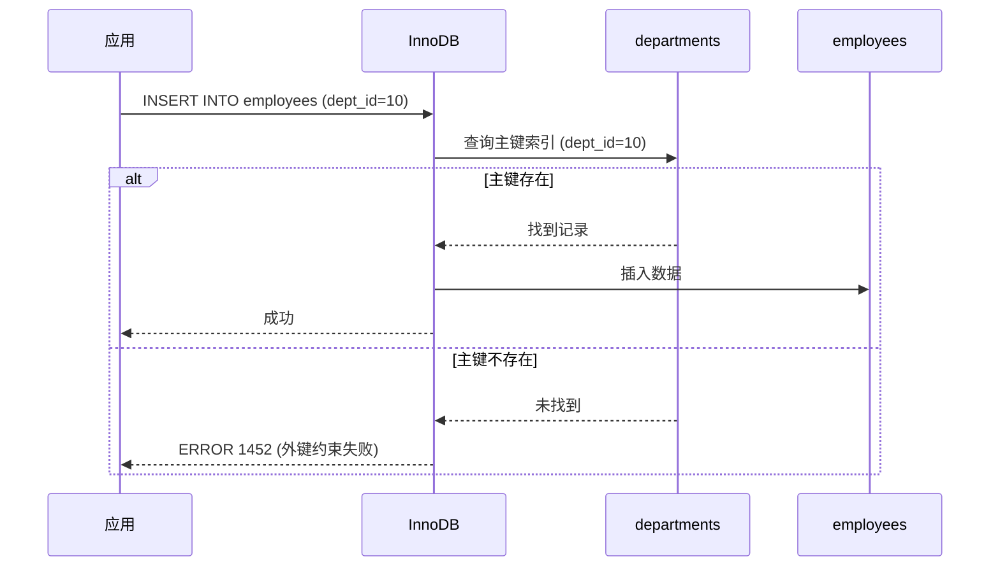

# 1.2 一致性 (Consistency) - 约束检查机制深度解析

> **学习目标**: 深入理解数据库如何通过完整性约束保证数据的一致性，掌握各类约束的实现原理和应用场景

---

## 📚 前置知识

在学习一致性约束之前，请确保你已经理解：

- ✅ ACID 中的 Consistency（一致性）概念
- ✅ 关系型数据库的基本概念（表、列、行、主键、外键）
- ✅ SQL 的基本语法（CREATE TABLE、INSERT、UPDATE、DELETE）

**与 1.1 原子性的联系**：
- **原子性**：保证事务的"全部成功"或"全部失败"
- **一致性**：保证事务执行前后，数据库从一个**一致状态**转移到另一个**一致状态**

---

## 🎯 核心概念

### 什么是一致性 (Consistency)？

**一致性**保证数据库中的数据**始终满足预定义的规则**（完整性约束），事务执行不会破坏这些规则。

### ACID 中的一致性 vs 完整性约束

| 概念 | 定义 | 示例 |
|------|------|------|
| **ACID 一致性** | 事务前后数据库状态都符合约束 | 转账前后，账户余额总和不变 |
| **完整性约束** | 数据库层面强制执行的规则 | 主键唯一、外键引用存在、年龄 > 0 |

**关系**：完整性约束是实现 ACID 一致性的**主要手段**。

### 一致性的两个层面

1. **数据库一致性**（本节重点）
   - 由数据库管理系统（DBMS）通过**约束检查**保证
   - 例如：主键唯一、外键引用存在

2. **应用一致性**（业务逻辑）
   - 由应用程序保证
   - 例如：转账时，A 账户扣款 = B 账户入账

**本节重点**：数据库层面的完整性约束机制！

---

## 🔍 五种完整性约束

### 1. 主键约束 (Primary Key Constraint)

#### 定义
**主键**唯一标识表中的每一行数据，具有以下特性：
- ✅ **唯一性**：主键值不能重复
- ✅ **非空性**：主键值不能为 NULL
- ✅ **不可变性**：主键值一旦确定，通常不应修改

#### SQL 语法

```sql
-- 方式 1: 列级约束
CREATE TABLE users (
    id INT PRIMARY KEY,
    name VARCHAR(50)
);

-- 方式 2: 表级约束
CREATE TABLE users (
    id INT,
    name VARCHAR(50),
    PRIMARY KEY (id)
);

-- 方式 3: 复合主键（多列）
CREATE TABLE order_items (
    order_id INT,
    product_id INT,
    quantity INT,
    PRIMARY KEY (order_id, product_id)
);
```

#### 底层实现原理

**MySQL InnoDB**：
1. **主键索引 = 聚簇索引**（Clustered Index）
   - 数据行按主键顺序物理存储
   - 主键索引的叶子节点存储完整行数据

2. **唯一性检查**：
   - 插入/更新时，通过 B+Tree 索引快速查找主键是否存在
   - 时间复杂度：O(log N)

3. **非空检查**：
   - 在 SQL 解析阶段检查主键值是否为 NULL
   - 如果为 NULL，直接拒绝操作

**可视化**：
```
主键索引结构（B+Tree）
        [50]
       /    \
   [20,40]  [60,80]
   /  |  \    /  \
 [10][30][45][55][70][90]
  ↓   ↓   ↓   ↓   ↓   ↓
[数据行] [数据行] ...
```

#### 违反主键约束的错误

```sql
INSERT INTO users (id, name) VALUES (1, 'Alice');
INSERT INTO users (id, name) VALUES (1, 'Bob');  -- 错误！

-- MySQL 错误信息
ERROR 1062 (23000): Duplicate entry '1' for key 'PRIMARY'
```

**错误代码**：
- `1062`：重复键错误
- `23000`：SQLSTATE（完整性约束违规）

---

### 2. 外键约束 (Foreign Key Constraint)

#### 定义
**外键**建立两个表之间的引用关系，保证**引用完整性**：
- ✅ 子表的外键值必须在父表的主键中存在，或为 NULL（如果允许）
- ✅ 删除/更新父表时，可配置级联操作（CASCADE）或拒绝（RESTRICT）

#### SQL 语法

```sql
-- 父表
CREATE TABLE departments (
    dept_id INT PRIMARY KEY,
    dept_name VARCHAR(50)
);

-- 子表（带外键）
CREATE TABLE employees (
    emp_id INT PRIMARY KEY,
    emp_name VARCHAR(50),
    dept_id INT,
    FOREIGN KEY (dept_id) REFERENCES departments(dept_id)
);

-- 外键 + 级联操作
CREATE TABLE employees (
    emp_id INT PRIMARY KEY,
    emp_name VARCHAR(50),
    dept_id INT,
    FOREIGN KEY (dept_id) REFERENCES departments(dept_id)
        ON DELETE CASCADE       -- 删除部门时，删除所有员工
        ON UPDATE CASCADE       -- 更新部门 ID 时，同步更新员工的 dept_id
);
```

#### 级联操作选项

| 选项 | 删除父表行时 | 更新父表主键时 |
|------|--------------|----------------|
| `CASCADE` | 删除所有引用行 | 同步更新外键值 |
| `RESTRICT` | 拒绝删除（默认） | 拒绝更新（默认） |
| `SET NULL` | 设置外键为 NULL | 设置外键为 NULL |
| `NO ACTION` | 同 RESTRICT | 同 RESTRICT |
| `SET DEFAULT` | 设置为默认值 | 设置为默认值 |

#### 底层实现原理

**MySQL InnoDB**：

1. **外键索引**：
   - 外键列自动创建索引（如果不存在）
   - 用于快速检查引用完整性

2. **插入/更新检查**：
   ```sql
   INSERT INTO employees (emp_id, emp_name, dept_id) VALUES (1, 'Alice', 10);
   ```
   - 检查 `dept_id = 10` 是否在 `departments.dept_id` 中存在
   - 通过父表主键索引快速查找

3. **删除/更新父表**：
   ```sql
   DELETE FROM departments WHERE dept_id = 10;
   ```
   - 检查是否有子表引用该行（通过外键索引）
   - 根据级联规则执行对应操作

**流程图**：



#### 违反外键约束的错误

```sql
-- 父表中没有 dept_id = 99
INSERT INTO employees (emp_id, emp_name, dept_id) VALUES (1, 'Alice', 99);

-- MySQL 错误信息
ERROR 1452 (23000): Cannot add or update a child row:
a foreign key constraint fails (`testdb`.`employees`,
CONSTRAINT `employees_ibfk_1` FOREIGN KEY (`dept_id`)
REFERENCES `departments` (`dept_id`))
```

#### 外键的性能影响

**优点**：
- ✅ 自动维护数据一致性
- ✅ 清晰表达表间关系

**缺点**：
- ❌ 每次插入/更新需要检查父表（额外查询）
- ❌ 删除父表时需要检查子表（可能扫描大量数据）
- ❌ 影响分库分表（跨库外键无法维护）

**生产环境实践**：
- 🏢 **传统企业系统**：使用外键约束（数据一致性优先）
- 🚀 **互联网高并发系统**：通常**不使用**外键，由应用层保证（性能优先）

---

### 3. 唯一约束 (Unique Constraint)

#### 定义
**唯一约束**保证列（或列组合）的值不重复，但允许多个 NULL 值。

**与主键的区别**：

| 特性 | 主键 | 唯一约束 |
|------|------|----------|
| 唯一性 | ✅ | ✅ |
| 允许 NULL | ❌ | ✅（多个 NULL） |
| 每表数量 | 1 个 | 多个 |
| 自动创建索引 | ✅（聚簇索引） | ✅（唯一索引） |

#### SQL 语法

```sql
-- 列级唯一约束
CREATE TABLE users (
    id INT PRIMARY KEY,
    email VARCHAR(100) UNIQUE,
    phone VARCHAR(20) UNIQUE
);

-- 表级唯一约束
CREATE TABLE users (
    id INT PRIMARY KEY,
    email VARCHAR(100),
    phone VARCHAR(20),
    UNIQUE KEY uk_email (email),
    UNIQUE KEY uk_phone (phone)
);

-- 复合唯一约束
CREATE TABLE course_enrollments (
    id INT PRIMARY KEY AUTO_INCREMENT,
    student_id INT,
    course_id INT,
    UNIQUE KEY uk_student_course (student_id, course_id)
    -- 同一学生不能重复选同一门课
);
```

#### 底层实现原理

**MySQL InnoDB**：

1. **唯一索引**（Unique Index）：
   - 自动为唯一约束列创建 B+Tree 索引
   - 叶子节点存储主键值（二级索引）

2. **唯一性检查**：
   - 插入/更新时，通过唯一索引检查值是否存在
   - 时间复杂度：O(log N)

3. **NULL 值处理**：
   - MySQL/PostgreSQL：允许多个 NULL（NULL ≠ NULL）
   - SQL Server：只允许一个 NULL

**示例**：
```sql
INSERT INTO users (id, email) VALUES (1, NULL);
INSERT INTO users (id, email) VALUES (2, NULL);  -- 成功（MySQL）
INSERT INTO users (id, email) VALUES (3, 'alice@example.com');
INSERT INTO users (id, email) VALUES (4, 'alice@example.com');  -- 失败
```

#### 应用场景

- ✅ 邮箱地址（全局唯一）
- ✅ 手机号码（全局唯一）
- ✅ 身份证号（全局唯一）
- ✅ 订单号（全局唯一）
- ✅ 用户名（同一系统内唯一）

---

### 4. 检查约束 (Check Constraint)

#### 定义
**检查约束**对列值进行自定义验证，保证数据符合业务规则。

**注意**：MySQL 8.0.16 之前**不支持** Check 约束（会被忽略）！

#### SQL 语法

```sql
-- 简单检查约束
CREATE TABLE employees (
    id INT PRIMARY KEY,
    name VARCHAR(50),
    age INT CHECK (age >= 18 AND age <= 65),  -- 年龄范围
    salary DECIMAL(10, 2) CHECK (salary > 0), -- 工资必须为正数
    gender CHAR(1) CHECK (gender IN ('M', 'F')) -- 性别只能是 M 或 F
);

-- 表级检查约束（涉及多列）
CREATE TABLE orders (
    id INT PRIMARY KEY,
    order_date DATE,
    ship_date DATE,
    CHECK (ship_date >= order_date)  -- 发货日期不能早于订单日期
);

-- 命名检查约束
CREATE TABLE products (
    id INT PRIMARY KEY,
    price DECIMAL(10, 2),
    discount_price DECIMAL(10, 2),
    CONSTRAINT chk_price CHECK (price > 0),
    CONSTRAINT chk_discount CHECK (discount_price IS NULL OR discount_price < price)
);
```

#### 底层实现原理

**检查时机**：
1. **插入数据**：检查新行是否满足约束
2. **更新数据**：检查修改后的行是否满足约束

**实现方式**（MySQL 8.0.16+）：

1. **解析阶段**：
   - 将 CHECK 表达式解析为内部表示（表达式树）

2. **执行阶段**：
   - 每次插入/更新时，计算表达式的布尔值
   - 如果返回 FALSE 或 NULL，拒绝操作

**性能影响**：
- 复杂的 CHECK 表达式会降低插入/更新性能
- 建议：简单的范围检查 > 复杂的子查询

#### 违反检查约束的错误

```sql
INSERT INTO employees (id, name, age, salary) VALUES (1, 'Alice', 15, 5000);

-- MySQL 8.0.16+ 错误信息
ERROR 3819 (HY000): Check constraint 'employees_chk_1' is violated.
```

#### 应用场景

- ✅ 数值范围验证（年龄、分数、温度）
- ✅ 枚举值验证（性别、状态）
- ✅ 逻辑关系验证（结束日期 > 开始日期）
- ✅ 格式验证（邮箱、手机号 - 配合正则）

**注意**：
- ⚠️ CHECK 约束**不能包含子查询**
- ⚠️ CHECK 约束**不能引用其他表**

---

### 5. 非空约束 (Not Null Constraint)

#### 定义
**非空约束**保证列值不能为 NULL。

#### SQL 语法

```sql
CREATE TABLE users (
    id INT PRIMARY KEY,
    name VARCHAR(50) NOT NULL,    -- 必填
    email VARCHAR(100) NOT NULL,
    phone VARCHAR(20)              -- 可选（允许 NULL）
);
```

#### 底层实现原理

**MySQL InnoDB**：

1. **元数据标记**：
   - 在表结构定义中标记列的 `NOT NULL` 属性
   - 存储在数据字典（`information_schema.COLUMNS.IS_NULLABLE`）

2. **检查时机**：
   - **SQL 解析阶段**：检查 INSERT/UPDATE 语句是否为 NOT NULL 列赋值
   - **执行阶段**：检查值是否为 NULL

3. **NULL 值存储**：
   - InnoDB 使用 **NULL 位图**（Null Bitmap）标记每行中哪些列为 NULL
   - NOT NULL 列不占用 NULL 位图空间（轻微优化）

**行格式中的 NULL 位图**：
```
+----------------+------------------+------------------+
| NULL Bitmap    | Column 1 (NOT NULL) | Column 2 (NULL) |
+----------------+------------------+------------------+
| 0 0 1 0 ...    | 'Alice'          | (空)             |
+----------------+------------------+------------------+
```

#### 违反非空约束的错误

```sql
INSERT INTO users (id, email) VALUES (1, 'alice@example.com');
-- 缺少 name 列（NOT NULL）

-- MySQL 错误信息
ERROR 1364 (HY000): Field 'name' doesn't have a default value
```

#### NULL vs 空字符串

| 值 | 含义 | 示例 |
|-----|------|------|
| `NULL` | 未知/不存在 | 未填写电话号码 |
| `''` (空字符串) | 已知为空 | 填写了电话但为空 |
| `0` | 数值零 | 余额为零 |

**最佳实践**：
- ✅ 优先使用 `NOT NULL` + 默认值（避免 NULL 带来的复杂性）
- ✅ 避免在 WHERE 条件中使用 `IS NULL`（影响索引使用）

---

## 🔗 约束的组合使用

### 示例：完整的用户表设计

```sql
CREATE TABLE users (
    -- 主键
    id INT AUTO_INCREMENT PRIMARY KEY,

    -- 唯一 + 非空
    username VARCHAR(50) NOT NULL UNIQUE,
    email VARCHAR(100) NOT NULL UNIQUE,

    -- 非空 + 检查
    age INT NOT NULL CHECK (age BETWEEN 13 AND 120),
    gender ENUM('M', 'F', 'Other') NOT NULL,

    -- 外键
    country_id INT,
    FOREIGN KEY (country_id) REFERENCES countries(id)
        ON DELETE SET NULL,

    -- 检查约束（表级）
    created_at TIMESTAMP NOT NULL DEFAULT CURRENT_TIMESTAMP,
    updated_at TIMESTAMP NOT NULL DEFAULT CURRENT_TIMESTAMP ON UPDATE CURRENT_TIMESTAMP,

    CONSTRAINT chk_username_length CHECK (CHAR_LENGTH(username) >= 3),
    CONSTRAINT chk_email_format CHECK (email LIKE '%@%.%')
);
```

**约束说明**：
- ✅ `id`：主键，自动递增
- ✅ `username`, `email`：唯一 + 非空（核心标识）
- ✅ `age`：范围检查（13-120 岁）
- ✅ `gender`：枚举约束（使用 ENUM 类型）
- ✅ `country_id`：外键，删除国家时设置为 NULL
- ✅ `username`：长度检查（至少 3 个字符）
- ✅ `email`：简单格式检查（包含 @）

---

## 🧪 实验：观察约束检查的实际效果

### 实验 1：主键唯一性检查

```sql
-- 创建测试表
CREATE TABLE test_pk (
    id INT PRIMARY KEY,
    name VARCHAR(50)
);

-- 插入数据
INSERT INTO test_pk VALUES (1, 'Alice');
INSERT INTO test_pk VALUES (1, 'Bob');  -- 失败！

-- 观察错误
SHOW WARNINGS;

-- 查看主键索引
SHOW INDEX FROM test_pk;
```

**预期结果**：
- 第二次插入失败：`Duplicate entry '1' for key 'PRIMARY'`
- 主键索引类型：`BTREE`，唯一性：`Non_unique = 0`

---

### 实验 2：外键级联操作

```sql
-- 创建父表和子表
CREATE TABLE departments (
    id INT PRIMARY KEY,
    name VARCHAR(50)
);

CREATE TABLE employees (
    id INT PRIMARY KEY,
    name VARCHAR(50),
    dept_id INT,
    FOREIGN KEY (dept_id) REFERENCES departments(id)
        ON DELETE CASCADE
);

-- 插入数据
INSERT INTO departments VALUES (1, 'Engineering'), (2, 'Sales');
INSERT INTO employees VALUES (1, 'Alice', 1), (2, 'Bob', 1), (3, 'Charlie', 2);

-- 查看数据
SELECT * FROM employees;

-- 删除部门（观察级联删除）
DELETE FROM departments WHERE id = 1;

-- 再次查看员工表
SELECT * FROM employees;
-- 预期：Alice 和 Bob 被自动删除
```

**思考问题**：
1. 如果使用 `ON DELETE RESTRICT`，删除部门 1 会发生什么？
2. 如何查看当前表的所有外键约束？（提示：`information_schema.KEY_COLUMN_USAGE`）

---

### 实验 3：检查约束验证

```sql
-- 创建带检查约束的表（MySQL 8.0.16+）
CREATE TABLE products (
    id INT PRIMARY KEY,
    name VARCHAR(100) NOT NULL,
    price DECIMAL(10, 2) CHECK (price > 0),
    discount_price DECIMAL(10, 2),
    CONSTRAINT chk_discount CHECK (
        discount_price IS NULL OR discount_price < price
    )
);

-- 正常插入
INSERT INTO products VALUES (1, 'Laptop', 1000.00, 800.00);

-- 违反价格检查
INSERT INTO products VALUES (2, 'Mouse', -10.00, NULL);  -- 失败！

-- 违反折扣检查
INSERT INTO products VALUES (3, 'Keyboard', 100.00, 120.00);  -- 失败！

-- 查看约束定义
SELECT
    CONSTRAINT_NAME,
    CHECK_CLAUSE
FROM information_schema.CHECK_CONSTRAINTS
WHERE TABLE_NAME = 'products';
```

---

### 实验 4：NULL vs 非 NULL 性能对比

```sql
-- 创建两个表：一个允许 NULL，一个全部 NOT NULL
CREATE TABLE test_nullable (
    id INT PRIMARY KEY,
    col1 VARCHAR(50),
    col2 VARCHAR(50),
    col3 VARCHAR(50)
);

CREATE TABLE test_not_null (
    id INT PRIMARY KEY,
    col1 VARCHAR(50) NOT NULL DEFAULT '',
    col2 VARCHAR(50) NOT NULL DEFAULT '',
    col3 VARCHAR(50) NOT NULL DEFAULT ''
);

-- 插入 100 万条数据（使用存储过程或脚本）
DELIMITER $$
CREATE PROCEDURE insert_test_data()
BEGIN
    DECLARE i INT DEFAULT 1;
    WHILE i <= 1000000 DO
        INSERT INTO test_nullable VALUES (i, 'value1', NULL, 'value3');
        INSERT INTO test_not_null VALUES (i, 'value1', '', 'value3');
        SET i = i + 1;
    END WHILE;
END$$
DELIMITER ;

CALL insert_test_data();

-- 对比查询性能
SELECT COUNT(*) FROM test_nullable WHERE col2 IS NULL;
SELECT COUNT(*) FROM test_not_null WHERE col2 = '';

-- 对比表大小
SELECT
    TABLE_NAME,
    ROUND((DATA_LENGTH + INDEX_LENGTH) / 1024 / 1024, 2) AS 'Size (MB)'
FROM information_schema.TABLES
WHERE TABLE_NAME IN ('test_nullable', 'test_not_null');
```

**预期观察**：
- NOT NULL 表通常略小（NULL 位图开销）
- `IS NULL` 查询可能不走索引，`= ''` 可以走索引

---

## 🎨 约束检查的执行时机

### 立即检查 vs 延迟检查

**MySQL/PostgreSQL 默认行为**：
- ✅ **立即检查**（Immediate）：每条 SQL 执行后立即验证约束

**PostgreSQL 支持延迟检查**：
```sql
-- PostgreSQL 特有功能
CREATE TABLE orders (
    id INT PRIMARY KEY,
    total DECIMAL(10, 2),
    paid DECIMAL(10, 2),
    CONSTRAINT chk_payment CHECK (paid <= total) DEFERRABLE INITIALLY DEFERRED
);

BEGIN;
INSERT INTO orders VALUES (1, 100.00, 120.00);  -- 违反约束，但暂不检查
UPDATE orders SET total = 150.00 WHERE id = 1;  -- 修正数据
COMMIT;  -- 提交时才检查约束
```

**MySQL 的限制**：
- ❌ **不支持延迟约束检查**
- 解决方案：使用触发器（Trigger）模拟

---

## 🛠️ 约束的管理操作

### 添加约束

```sql
-- 添加主键（表已存在）
ALTER TABLE users ADD PRIMARY KEY (id);

-- 添加唯一约束
ALTER TABLE users ADD UNIQUE KEY uk_email (email);

-- 添加外键
ALTER TABLE employees ADD CONSTRAINT fk_dept
    FOREIGN KEY (dept_id) REFERENCES departments(id);

-- 添加检查约束（MySQL 8.0.16+）
ALTER TABLE employees ADD CONSTRAINT chk_age
    CHECK (age >= 18);

-- 添加非空约束
ALTER TABLE users MODIFY COLUMN name VARCHAR(50) NOT NULL;
```

### 删除约束

```sql
-- 删除主键
ALTER TABLE users DROP PRIMARY KEY;

-- 删除唯一约束
ALTER TABLE users DROP INDEX uk_email;

-- 删除外键
ALTER TABLE employees DROP FOREIGN KEY fk_dept;

-- 删除检查约束（MySQL 8.0.16+）
ALTER TABLE employees DROP CHECK chk_age;

-- 删除非空约束
ALTER TABLE users MODIFY COLUMN name VARCHAR(50) NULL;
```

### 查看约束

```sql
-- 查看表结构（包含约束）
DESCRIBE users;
SHOW CREATE TABLE users;

-- 查看所有约束（MySQL）
SELECT
    CONSTRAINT_NAME,
    CONSTRAINT_TYPE
FROM information_schema.TABLE_CONSTRAINTS
WHERE TABLE_NAME = 'users';

-- 查看外键约束
SELECT
    CONSTRAINT_NAME,
    COLUMN_NAME,
    REFERENCED_TABLE_NAME,
    REFERENCED_COLUMN_NAME
FROM information_schema.KEY_COLUMN_USAGE
WHERE TABLE_NAME = 'employees' AND REFERENCED_TABLE_NAME IS NOT NULL;

-- 查看检查约束（MySQL 8.0.16+）
SELECT
    CONSTRAINT_NAME,
    CHECK_CLAUSE
FROM information_schema.CHECK_CONSTRAINTS
WHERE TABLE_NAME = 'employees';
```

---

## 📊 约束的性能影响

### 性能开销对比

| 约束类型 | 插入/更新开销 | 删除开销 | 空间开销 |
|----------|---------------|----------|----------|
| 主键 | 中（索引查找） | 低 | 高（聚簇索引） |
| 唯一约束 | 中（索引查找） | 低 | 中（二级索引） |
| 外键 | 高（需查询父表） | 高（需查询子表） | 中（索引） |
| 检查约束 | 低-高（取决于表达式复杂度） | 无 | 无 |
| 非空约束 | 极低（元数据检查） | 无 | 极低（NULL 位图） |

### 优化建议

1. **主键选择**：
   - ✅ 使用自增整数 ID（避免 UUID 导致的随机写入）
   - ✅ 尽量保持主键不变（避免更新聚簇索引）

2. **外键使用**：
   - ⚠️ 高并发场景谨慎使用（考虑应用层维护）
   - ✅ 如果使用外键，确保外键列有索引

3. **检查约束**：
   - ✅ 优先使用简单的范围检查（如 `age > 0`）
   - ❌ 避免复杂的函数调用或子查询

4. **唯一约束**：
   - ✅ 为高频查询的唯一列创建唯一索引
   - ✅ 考虑使用分布式唯一 ID（如 Snowflake）

---

## 🧠 深度思考题

### 问题 1：为什么外键约束在互联网公司较少使用？

<details>
<summary>点击查看答案</summary>

**原因**：

1. **性能开销**：
   - 每次插入/更新子表需要检查父表（额外查询）
   - 删除父表需要扫描子表（锁表风险）

2. **分库分表困难**：
   - 跨库外键无法维护（父表和子表在不同数据库）

3. **灵活性不足**：
   - 数据库层面的强约束，难以根据业务需求灵活调整

**替代方案**：
- ✅ 应用层维护引用完整性（在代码中检查）
- ✅ 定期数据校验脚本（异步检查一致性）
- ✅ 使用消息队列保证最终一致性

**适用场景**：
- ✅ 传统企业系统（数据一致性优先）
- ✅ 单库小规模系统
</details>

---

### 问题 2：NULL 值在约束检查中的特殊性

<details>
<summary>点击查看答案</summary>

**特殊规则**：

1. **唯一约束**：
   - MySQL/PostgreSQL：允许多个 NULL（`NULL ≠ NULL`）
   - SQL Server：只允许一个 NULL

2. **检查约束**：
   ```sql
   CREATE TABLE test (
       age INT CHECK (age > 18)
   );

   INSERT INTO test VALUES (NULL);  -- 成功！
   ```
   - CHECK 约束对 NULL 值**不生效**（NULL 既不满足也不违反约束）

3. **外键约束**：
   - 外键列可以为 NULL（表示"无引用"）
   - NULL 值不会触发父表检查

**三值逻辑**：
| 表达式 | 结果 |
|--------|------|
| `NULL > 18` | **UNKNOWN**（不是 TRUE 也不是 FALSE） |
| `CHECK (NULL > 18)` | **通过**（UNKNOWN 被视为满足约束） |

**最佳实践**：
- ✅ 明确区分"未知"（NULL）和"已知为空"（空字符串）
- ✅ 尽量使用 `NOT NULL` + 默认值
</details>

---

### 问题 3：如何实现"软删除"并保持唯一性？

<details>
<summary>点击查看答案</summary>

**问题场景**：
- 用户表的 `email` 字段有唯一约束
- 实现软删除（`deleted_at` 字段标记删除）
- 删除后的邮箱应该可以被新用户注册

**方案 1：复合唯一约束（MySQL 8.0+）**
```sql
CREATE TABLE users (
    id INT PRIMARY KEY,
    email VARCHAR(100) NOT NULL,
    deleted_at TIMESTAMP NULL,
    UNIQUE KEY uk_email_deleted (email, deleted_at)
);

-- 正常用户：deleted_at = NULL
INSERT INTO users VALUES (1, 'alice@example.com', NULL);

-- 删除用户（软删除）
UPDATE users SET deleted_at = NOW() WHERE id = 1;

-- 新用户可以使用相同邮箱
INSERT INTO users VALUES (2, 'alice@example.com', NULL);
```

**方案 2：函数索引（MySQL 8.0.13+）**
```sql
CREATE TABLE users (
    id INT PRIMARY KEY,
    email VARCHAR(100) NOT NULL,
    deleted_at TIMESTAMP NULL,
    UNIQUE KEY uk_active_email ((CASE WHEN deleted_at IS NULL THEN email END))
);
```

**方案 3：PostgreSQL 部分索引**
```sql
CREATE UNIQUE INDEX uk_active_email ON users(email) WHERE deleted_at IS NULL;
```

**最佳实践**：
- ✅ 根据数据库版本选择合适方案
- ✅ 文档清晰说明软删除逻辑
</details>

---

## 📚 扩展阅读

### 必读资源

1. **《Database System Concepts》（数据库系统概念）**
   - 作者：Silberschatz 等
   - 章节：Chapter 4-6（SQL 与完整性约束）
   - 重点：4.4 Integrity Constraints

2. **MySQL 官方文档**
   - [Using FOREIGN KEY Constraints](https://dev.mysql.com/doc/refman/8.0/en/create-table-foreign-keys.html)
   - [CHECK Constraint](https://dev.mysql.com/doc/refman/8.0/en/create-table-check-constraints.html)

3. **PostgreSQL 官方文档**
   - [Constraints](https://www.postgresql.org/docs/current/ddl-constraints.html)
   - 特色功能：延迟约束检查、排除约束

### 进阶主题

1. **触发器 (Trigger)**：
   - 更灵活的约束检查（跨表、复杂逻辑）
   - 示例：审计日志、数据同步

2. **断言 (Assertion)**：
   - SQL 标准定义，但大部分数据库未实现
   - 可以检查全表级别的约束

3. **域约束 (Domain)**：
   - PostgreSQL 支持自定义类型 + 约束
   ```sql
   CREATE DOMAIN email_type AS VARCHAR(100)
       CHECK (VALUE ~ '^[A-Za-z0-9._%+-]+@[A-Za-z0-9.-]+\.[A-Z|a-z]{2,}$');

   CREATE TABLE users (
       id INT PRIMARY KEY,
       email email_type
   );
   ```

---

## ✅ 学习检查清单

完成以下任务，确保你真正掌握了一致性约束：

- [ ] 能列举并解释五种完整性约束（主键、外键、唯一、检查、非空）
- [ ] 理解每种约束的底层实现原理（索引、元数据检查）
- [ ] 完成至少 3 个实验，观察约束的实际效果
- [ ] 能设计一个包含多种约束的表结构（如用户表、订单表）
- [ ] 理解外键级联操作的 5 种选项及应用场景
- [ ] 掌握约束的增删改查操作（ALTER TABLE）
- [ ] 回答上述 3 个深度思考题
- [ ] 了解 NULL 值在约束检查中的特殊性

---

## 📝 下一步学习

完成一致性约束学习后，继续以下内容：

1. **1.3 隔离性 (Isolation)**：MVCC 多版本并发控制
   - 将深入使用 Undo Log 版本链
   - 理解四种事务隔离级别

2. **1.4 持久性 (Durability)**：WAL (Write-Ahead Logging)
   - Redo Log 的实现原理
   - 崩溃恢复机制

3. **第 2 节：索引结构深度剖析**
   - B-Tree vs B+Tree
   - 主键索引 vs 二级索引

---

## 🎯 本节总结

**核心要点**：

1. **一致性的定义**：
   - 事务前后数据库状态都符合完整性约束
   - 由 DBMS 自动维护（声明式）

2. **五种完整性约束**：
   | 约束 | 作用 | 实现方式 |
   |------|------|----------|
   | 主键 | 唯一标识 | 聚簇索引 + 非空检查 |
   | 外键 | 引用完整性 | 索引 + 父表查找 |
   | 唯一 | 值不重复 | 唯一索引 |
   | 检查 | 自定义规则 | 表达式计算 |
   | 非空 | 值不为 NULL | 元数据标记 |

3. **性能权衡**：
   - 约束检查有性能开销（尤其是外键）
   - 高并发场景可考虑应用层维护

4. **最佳实践**：
   - ✅ 优先使用 `NOT NULL` + 默认值
   - ✅ 谨慎使用外键（分库分表场景）
   - ✅ 检查约束保持简单
   - ✅ 唯一约束配合业务需求（如软删除）

**关键理解**：
> 完整性约束是数据库的"守门员"，在数据进入数据库之前进行验证，防止脏数据污染系统！

---

**学习时长记录**: _____ 小时
**理解深度**: ⭐⭐⭐⭐☆ (1-5星自评)
**需要加强**: _____________________

**上一节**：[1.1 原子性 (Atomicity) - Undo Log](./1.1-undo-log-atomicity.md)
**下一节**：[1.3 隔离性 (Isolation) - MVCC](./1.3-isolation-mvcc.md)
