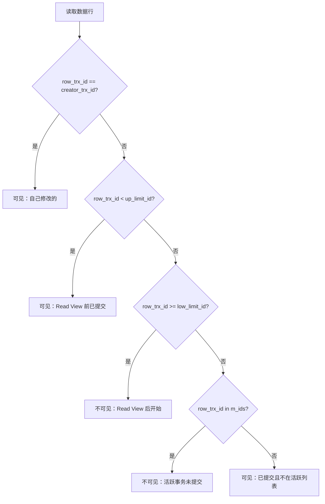
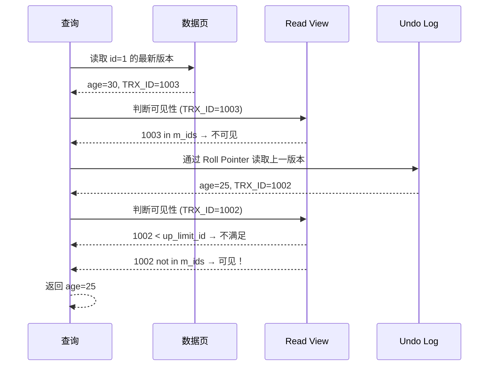

# 1.3 隔离性 (Isolation) - MVCC 多版本并发控制深度解析

> **学习目标**: 深入理解数据库如何通过 MVCC 实现事务隔离，掌握四种隔离级别的原理和应用场景

---

## 📚 前置知识

在学习 MVCC 之前，请确保你已经理解：

- ✅ **1.1 原子性**：Undo Log 的版本链机制（本节核心基础！）
- ✅ ACID 中的隔离性 (Isolation) 概念
- ✅ 并发问题：脏读、不可重复读、幻读
- ✅ 锁的基本概念（共享锁、排他锁）

---

## 🎯 核心概念

### 什么是隔离性 (Isolation)？

**隔离性**保证并发执行的事务之间相互隔离，一个事务的中间状态对其他事务**不可见**（或有限可见）。

### 为什么需要隔离性？

**没有隔离性的问题**：

```sql
-- 账户表：id=1, balance=1000

-- 时间线
T1: BEGIN;
T1: SELECT balance FROM accounts WHERE id=1;  -- 读到 1000
T2: BEGIN;
T2: UPDATE accounts SET balance=500 WHERE id=1;  -- 修改为 500
T2: COMMIT;
T1: SELECT balance FROM accounts WHERE id=1;  -- 读到 500（不一致！）
T1: COMMIT;
```

**问题**：事务 T1 两次读取到不同的值（**不可重复读**）

**隔离性目标**：让事务感觉"像串行执行一样"，避免并发异常。

---

## 🚨 并发事务的三大问题

### 1. 脏读 (Dirty Read)

**定义**：读取到其他事务**未提交**的数据。

**场景**：
```sql
-- T1: 转账事务
T1: BEGIN;
T1: UPDATE accounts SET balance = balance - 100 WHERE id = 1;  -- 未提交

-- T2: 查询余额
T2: BEGIN;
T2: SELECT balance FROM accounts WHERE id = 1;  -- 读到修改后的值（脏数据）
T2: COMMIT;

T1: ROLLBACK;  -- T1 回滚，T2 读到的数据无效！
```

**危害**：T2 基于脏数据做决策，可能导致业务错误。

---

### 2. 不可重复读 (Non-Repeatable Read)

**定义**：同一事务内，**多次读取同一行**得到不同结果。

**场景**：
```sql
T1: BEGIN;
T1: SELECT balance FROM accounts WHERE id = 1;  -- 读到 1000

T2: BEGIN;
T2: UPDATE accounts SET balance = 500 WHERE id = 1;
T2: COMMIT;

T1: SELECT balance FROM accounts WHERE id = 1;  -- 读到 500（不一致！）
T1: COMMIT;
```

**危害**：事务内数据不一致，无法保证逻辑正确性。

---

### 3. 幻读 (Phantom Read)

**定义**：同一事务内，**多次查询同一范围**，结果集的行数不同。

**场景**：
```sql
T1: BEGIN;
T1: SELECT COUNT(*) FROM orders WHERE status = 'pending';  -- 结果：5

T2: BEGIN;
T2: INSERT INTO orders (status) VALUES ('pending');
T2: COMMIT;

T1: SELECT COUNT(*) FROM orders WHERE status = 'pending';  -- 结果：6（幻行！）
T1: COMMIT;
```

**与不可重复读的区别**：
- **不可重复读**：同一行数据内容变化（UPDATE/DELETE）
- **幻读**：结果集行数变化（INSERT）

---

## 🔒 传统解决方案：锁机制

### 两阶段锁协议 (2PL)

**原理**：
- **共享锁 (S-Lock)**：读取时加锁，允许其他事务读，禁止写
- **排他锁 (X-Lock)**：写入时加锁，禁止其他事务读和写

**问题**：
- ❌ **读写冲突**：读操作会阻塞写操作
- ❌ **性能差**：大量锁竞争，并发度低
- ❌ **死锁风险**：需要死锁检测和处理

**示例**：
```sql
-- T1 读取（加共享锁）
T1: BEGIN;
T1: SELECT * FROM users WHERE id = 1 LOCK IN SHARE MODE;

-- T2 无法更新（被 T1 的共享锁阻塞）
T2: BEGIN;
T2: UPDATE users SET age = 30 WHERE id = 1;  -- 等待 T1 释放锁...
```

---

## 🌟 MVCC：多版本并发控制

### 核心思想

**MVCC (Multi-Version Concurrency Control)** 通过保存数据的**多个版本**，让读写操作不冲突：
- ✅ **读操作**：读取数据的历史版本（快照），无需加锁
- ✅ **写操作**：创建新版本，不影响正在读的事务

**优势**：
- ✅ **读不阻塞写**
- ✅ **写不阻塞读**
- ✅ 极大提高并发性能

### MVCC 的实现基础

MVCC 依赖以下三个核心组件：

1. **Undo Log 版本链**（1.1 节已学习）
   - 记录数据的历史版本
   - 每次更新形成新的版本节点

2. **事务 ID (Transaction ID)**
   - 每个事务分配一个**递增的唯一 ID**
   - 用于判断数据版本的新旧

3. **Read View（读视图）**
   - 记录事务开始时的活跃事务列表
   - 用于判断某个版本是否对当前事务可见

---

## 🏗️ MVCC 的底层实现

### InnoDB 行记录的隐藏字段

InnoDB 为每行记录添加三个隐藏字段：

| 字段名 | 长度 | 说明 |
|--------|------|------|
| `DB_TRX_ID` | 6 bytes | 最后修改该行的**事务 ID** |
| `DB_ROLL_PTR` | 7 bytes | **回滚指针**，指向 Undo Log 中的上一个版本 |
| `DB_ROW_ID` | 6 bytes | 行 ID（没有主键时使用） |

**可视化**：
```
+----+------+------------+-------------+---------+
| id | name | DB_TRX_ID  | DB_ROLL_PTR | age     |
+----+------+------------+-------------+---------+
| 1  | Alice| 1001       | → Undo Log  | 30      |
+----+------+------------+-------------+---------+
```

---

### Undo Log 版本链（复习 1.1 节）

**场景**：事务 1001、1002、1003 依次修改同一行

```
当前数据页中的行（最新版本）:
+----+------+------------+-------------+
| id | age  | DB_TRX_ID  | DB_ROLL_PTR |
+----+------+------------+-------------+
| 1  | 30   | 1003       | → Undo Log 3|
+----+------+------------+-------------+

Undo Log 版本链:
┌─────────────────────────────┐
│ Undo Log 3 (TRX_ID: 1003)   │
│ - Old Value: age = 25       │
│ - Roll Pointer → Undo Log 2 │
└─────────────────────────────┘
           ↓
┌─────────────────────────────┐
│ Undo Log 2 (TRX_ID: 1002)   │
│ - Old Value: age = 20       │
│ - Roll Pointer → Undo Log 1 │
└─────────────────────────────┘
           ↓
┌─────────────────────────────┐
│ Undo Log 1 (TRX_ID: 1001)   │
│ - Old Value: age = 18       │
│ - Roll Pointer → NULL       │
└─────────────────────────────┘
```

**关键点**：版本链记录了数据的**完整修改历史**！

---

### Read View（读视图）

**Read View 是什么？**
- 事务开始时（或每次查询时，取决于隔离级别）创建的**快照**
- 记录当前时刻所有活跃（未提交）的事务 ID

**Read View 的数据结构**：

```cpp
class ReadView {
    trx_id_t m_low_limit_id;     // 当前系统中尚未分配的下一个事务 ID
    trx_id_t m_up_limit_id;      // 活跃事务中的最小事务 ID
    trx_ids_t m_ids;             // 创建 Read View 时的活跃事务 ID 列表
    trx_id_t m_creator_trx_id;   // 创建 Read View 的事务 ID
};
```

**示例**：
```
当前活跃事务：1001, 1003, 1005
下一个事务 ID：1006

Read View:
- m_up_limit_id = 1001      （最小活跃事务 ID）
- m_low_limit_id = 1006     （下一个事务 ID）
- m_ids = [1001, 1003, 1005] （活跃事务列表）
- m_creator_trx_id = 1004   （假设当前事务 ID 为 1004）
```

---

### 可见性判断算法

**核心问题**：当前事务能否看到某个版本的数据？

**判断逻辑**（伪代码）：

```python
def is_visible(row_trx_id, read_view):
    # 规则 1: 如果版本是当前事务自己修改的，可见
    if row_trx_id == read_view.creator_trx_id:
        return True

    # 规则 2: 如果版本在 Read View 创建前已提交，可见
    if row_trx_id < read_view.up_limit_id:
        return True

    # 规则 3: 如果版本在 Read View 创建后才开始，不可见
    if row_trx_id >= read_view.low_limit_id:
        return False

    # 规则 4: 如果版本在活跃事务列表中，不可见（未提交）
    if row_trx_id in read_view.ids:
        return False

    # 规则 5: 其他情况（已提交但不在活跃列表），可见
    return True
```

**可视化流程图**：



---

### 完整的 MVCC 读取流程

**场景**：事务 1004 读取 `id=1` 的数据

```sql
-- 当前状态：
-- 数据页中最新版本：age=30 (TRX_ID=1003)
-- Undo Log 链：1003(30) → 1002(25) → 1001(20)
-- Read View: up_limit_id=1001, low_limit_id=1006, ids=[1001, 1003, 1005]

SELECT age FROM users WHERE id = 1;
```

**执行流程**：



**步骤详解**：

1. **读取最新版本**：age=30 (TRX_ID=1003)
2. **可见性判断**：
   - 1003 in [1001, 1003, 1005] → **不可见**（活跃事务）
3. **回溯 Undo Log**：读取 age=25 (TRX_ID=1002)
4. **可见性判断**：
   - 1002 not in [1001, 1003, 1005] → **可见**（已提交）
5. **返回结果**：age=25

---

## 📊 四种事务隔离级别

### 隔离级别概览

| 隔离级别 | 脏读 | 不可重复读 | 幻读 | 实现方式 |
|----------|------|------------|------|----------|
| **Read Uncommitted** | ✅ 可能 | ✅ 可能 | ✅ 可能 | 不使用 MVCC |
| **Read Committed** | ❌ 不可能 | ✅ 可能 | ✅ 可能 | 每次查询创建 Read View |
| **Repeatable Read** | ❌ 不可能 | ❌ 不可能 | ✅ 可能 | 事务开始创建 Read View |
| **Serializable** | ❌ 不可能 | ❌ 不可能 | ❌ 不可能 | 加锁（串行化） |

**MySQL InnoDB 默认**：**Repeatable Read**

---

### 1. Read Uncommitted（读未提交）

**特点**：不使用 MVCC，直接读取最新数据（无论是否提交）

**实现**：
- 读操作**不创建 Read View**
- 总是读取数据页中的最新版本

**问题**：允许**脏读**

**示例**：
```sql
-- 设置隔离级别
SET SESSION TRANSACTION ISOLATION LEVEL READ UNCOMMITTED;

-- T1
BEGIN;
UPDATE accounts SET balance = 500 WHERE id = 1;  -- 未提交

-- T2
BEGIN;
SELECT balance FROM accounts WHERE id = 1;  -- 读到 500（脏读！）
COMMIT;

-- T1
ROLLBACK;  -- T2 读到的数据无效
```

**适用场景**：几乎不使用（数据一致性无保证）

---

### 2. Read Committed（读已提交）

**特点**：每次查询都创建新的 Read View

**实现**：
- **每次 SELECT** 都生成一个新的 Read View
- 只能读取已提交事务的修改

**问题**：允许**不可重复读**

**示例**：
```sql
-- 设置隔离级别
SET SESSION TRANSACTION ISOLATION LEVEL READ COMMITTED;

-- T1
BEGIN;
SELECT balance FROM accounts WHERE id = 1;  -- 读到 1000

-- T2
BEGIN;
UPDATE accounts SET balance = 500 WHERE id = 1;
COMMIT;

-- T1
SELECT balance FROM accounts WHERE id = 1;  -- 读到 500（不可重复读！）
COMMIT;
```

**执行流程**：

| 时间 | T1 操作 | T2 操作 | Read View (T1) |
|------|---------|---------|----------------|
| t1 | BEGIN | - | - |
| t2 | SELECT (读到 1000) | - | 创建 RV1：[T2未启动] |
| t3 | - | BEGIN; UPDATE; COMMIT | - |
| t4 | SELECT (读到 500) | - | 创建 RV2：[T2已提交] |

**关键点**：
- t2 时刻：Read View 1 看不到 T2 的修改（T2 还未启动或未提交）
- t4 时刻：Read View 2 看到 T2 的修改（T2 已提交）

**适用场景**：
- ✅ Oracle、PostgreSQL 的默认级别
- ✅ 对数据新鲜度要求高的场景

---

### 3. Repeatable Read（可重复读）

**特点**：事务开始时创建 Read View，整个事务期间使用同一个 Read View

**实现**：
- **事务第一次 SELECT** 时创建 Read View
- 后续所有 SELECT 都**复用**这个 Read View

**问题**：理论上允许**幻读**（但 InnoDB 通过 Next-Key Lock 解决了大部分幻读）

**示例**：
```sql
-- 设置隔离级别（MySQL 默认）
SET SESSION TRANSACTION ISOLATION LEVEL REPEATABLE READ;

-- T1
BEGIN;
SELECT balance FROM accounts WHERE id = 1;  -- 读到 1000

-- T2
BEGIN;
UPDATE accounts SET balance = 500 WHERE id = 1;
COMMIT;

-- T1
SELECT balance FROM accounts WHERE id = 1;  -- 仍然读到 1000（可重复读！）
COMMIT;
```

**执行流程**：

| 时间 | T1 操作 | T2 操作 | Read View (T1) |
|------|---------|---------|----------------|
| t1 | BEGIN | - | - |
| t2 | SELECT (读到 1000) | - | 创建 RV：[T2可能在活跃列表] |
| t3 | - | BEGIN; UPDATE; COMMIT | - |
| t4 | SELECT (读到 1000) | - | 复用 RV：看不到 T2 的修改 |

**关键点**：
- t2 时刻：创建 Read View（记录活跃事务列表）
- t4 时刻：复用 Read View，T2 的修改对 T1 不可见（即使 T2 已提交）

**幻读问题**：

虽然 MVCC 解决了**不可重复读**，但**幻读**仍可能发生：

```sql
-- T1
BEGIN;
SELECT COUNT(*) FROM orders WHERE status = 'pending';  -- 结果：5

-- T2
BEGIN;
INSERT INTO orders (status) VALUES ('pending');
COMMIT;

-- T1
SELECT COUNT(*) FROM orders WHERE status = 'pending';  -- 结果：5（MVCC 生效）

-- 但如果 T1 执行更新：
UPDATE orders SET priority = 'high' WHERE status = 'pending';  -- 更新了 6 行（幻行！）
SELECT COUNT(*) FROM orders WHERE status = 'pending';  -- 结果：6（当前读）
```

**InnoDB 的解决方案**：
- **Next-Key Lock**（间隙锁 + 行锁）
- 锁定查询范围，防止其他事务插入

**适用场景**：
- ✅ MySQL InnoDB 默认级别
- ✅ 大多数 OLTP 业务场景
- ✅ 需要事务内一致性读的场景

---

### 4. Serializable（可串行化）

**特点**：完全串行化执行，使用锁机制（不依赖 MVCC）

**实现**：
- **读操作**：自动加**共享锁** (S-Lock)
- **写操作**：自动加**排他锁** (X-Lock)
- 其他事务必须等待锁释放

**问题**：性能最差，并发度最低

**示例**：
```sql
-- 设置隔离级别
SET SESSION TRANSACTION ISOLATION LEVEL SERIALIZABLE;

-- T1
BEGIN;
SELECT * FROM accounts WHERE id = 1;  -- 自动加共享锁

-- T2
BEGIN;
UPDATE accounts SET balance = 500 WHERE id = 1;  -- 等待 T1 释放锁...
```

**适用场景**：
- ✅ 对数据一致性要求极高的场景（如金融核心系统）
- ❌ 大多数场景不推荐（性能太差）

---

## 🔄 快照读 vs 当前读

### 快照读 (Snapshot Read)

**定义**：读取数据的历史版本（通过 MVCC）

**操作**：
- `SELECT ...` （普通查询）

**特点**：
- ✅ **不加锁**
- ✅ 读取 Read View 创建时刻的快照
- ✅ 性能高

**示例**：
```sql
BEGIN;
SELECT * FROM users WHERE id = 1;  -- 快照读，读取历史版本
COMMIT;
```

---

### 当前读 (Current Read)

**定义**：读取数据的最新版本，并加锁

**操作**：
- `SELECT ... LOCK IN SHARE MODE`（共享锁）
- `SELECT ... FOR UPDATE`（排他锁）
- `INSERT`, `UPDATE`, `DELETE`（自动加排他锁）

**特点**：
- ✅ 读取**最新提交**的数据
- ❌ **加锁**，可能阻塞其他事务

**示例**：
```sql
BEGIN;
SELECT * FROM users WHERE id = 1 FOR UPDATE;  -- 当前读，加排他锁
UPDATE users SET age = 30 WHERE id = 1;       -- 当前读
COMMIT;
```

**快照读 vs 当前读对比**：

| 特性 | 快照读 | 当前读 |
|------|--------|--------|
| 读取版本 | 历史快照 | 最新版本 |
| 是否加锁 | 否 | 是 |
| 实现机制 | MVCC | 锁 |
| 性能 | 高 | 低 |
| 使用场景 | 普通查询 | 修改前查询、悲观锁 |

---

## 🧪 实验：观察 MVCC 的实际效果

### 实验 1：验证 Repeatable Read 的可重复读

**准备**：
```sql
CREATE TABLE test_mvcc (
    id INT PRIMARY KEY,
    value VARCHAR(50)
);

INSERT INTO test_mvcc VALUES (1, 'initial');
```

**步骤**：

```sql
-- Session 1 (T1)
SET SESSION TRANSACTION ISOLATION LEVEL REPEATABLE READ;
BEGIN;
SELECT * FROM test_mvcc WHERE id = 1;  -- 结果：'initial'

-- Session 2 (T2)
BEGIN;
UPDATE test_mvcc SET value = 'modified' WHERE id = 1;
COMMIT;

-- Session 1 (T1)
SELECT * FROM test_mvcc WHERE id = 1;  -- 结果：'initial'（可重复读！）
COMMIT;

-- Session 1 (T1) - 新事务
BEGIN;
SELECT * FROM test_mvcc WHERE id = 1;  -- 结果：'modified'（新 Read View）
COMMIT;
```

**观察点**：
- ✅ T1 第二次 SELECT 仍然读到 'initial'（MVCC 生效）
- ✅ T1 提交后重新开启事务，读到 'modified'（新 Read View）

---

### 实验 2：Read Committed vs Repeatable Read

**步骤**：

```sql
-- Session 1: Read Committed
SET SESSION TRANSACTION ISOLATION LEVEL READ COMMITTED;
BEGIN;
SELECT * FROM test_mvcc WHERE id = 1;  -- 结果：'initial'

-- Session 2: 修改数据
UPDATE test_mvcc SET value = 'v1' WHERE id = 1;

-- Session 1:
SELECT * FROM test_mvcc WHERE id = 1;  -- 结果：'v1'（不可重复读）
COMMIT;

-- Session 3: Repeatable Read
SET SESSION TRANSACTION ISOLATION LEVEL REPEATABLE READ;
BEGIN;
SELECT * FROM test_mvcc WHERE id = 1;  -- 结果：'v1'

-- Session 2: 修改数据
UPDATE test_mvcc SET value = 'v2' WHERE id = 1;

-- Session 3:
SELECT * FROM test_mvcc WHERE id = 1;  -- 结果：'v1'（可重复读）
COMMIT;
```

---

### 实验 3：观察 Undo Log 版本链

**步骤**：

```sql
-- 创建测试表
CREATE TABLE test_undo (
    id INT PRIMARY KEY,
    value INT
);

INSERT INTO test_undo VALUES (1, 10);

-- 多次更新同一行
BEGIN;
UPDATE test_undo SET value = 20 WHERE id = 1;
UPDATE test_undo SET value = 30 WHERE id = 1;
UPDATE test_undo SET value = 40 WHERE id = 1;
COMMIT;

-- 查看 InnoDB 状态（包含 Undo Log 信息）
SHOW ENGINE INNODB STATUS\G

-- 搜索 "TRANSACTIONS" 部分，查看 Undo Log 记录数
```

**观察 Undo Log 大小**：
```sql
SELECT
    TABLESPACE_NAME,
    FILE_NAME,
    ROUND(FILE_SIZE / 1024 / 1024, 2) AS 'Size (MB)'
FROM information_schema.FILES
WHERE TABLESPACE_NAME LIKE 'innodb_undo%';
```

---

### 实验 4：幻读现象

**步骤**：

```sql
-- Session 1 (T1)
BEGIN;
SELECT * FROM test_mvcc WHERE id > 10;  -- 结果：空

-- Session 2 (T2)
INSERT INTO test_mvcc VALUES (11, 'new row');

-- Session 1 (T1)
SELECT * FROM test_mvcc WHERE id > 10;  -- 结果：仍然为空（MVCC）

-- 但如果 T1 执行更新：
UPDATE test_mvcc SET value = 'updated' WHERE id > 10;  -- 更新了 1 行（当前读）
SELECT * FROM test_mvcc WHERE id > 10;  -- 结果：1 行（幻读！）
COMMIT;
```

**解释**：
- **快照读**（SELECT）：使用 MVCC，看不到 T2 插入的行
- **当前读**（UPDATE）：加锁并读取最新数据，看到 T2 插入的行

**InnoDB 的解决方案**：
```sql
-- 使用 Next-Key Lock 防止幻读
BEGIN;
SELECT * FROM test_mvcc WHERE id > 10 FOR UPDATE;  -- 锁定范围
-- 此时 T2 的 INSERT 会被阻塞
```

---

## 🎨 MVCC 的可视化理解

### 场景：三个并发事务

```
时间线：
t1: T1(1001) BEGIN
t2: T2(1002) BEGIN
t3: T1 UPDATE age=20 → 30
t4: T3(1003) BEGIN
t5: T2 UPDATE age=30 → 40
t6: T1 COMMIT
t7: T3 SELECT age  -- 读到多少？
```

**版本链演变**：

```
t1-t2: 初始状态
+----+-----+------------+-------------+
| id | age | DB_TRX_ID  | DB_ROLL_PTR |
+----+-----+------------+-------------+
| 1  | 20  | 1000       | NULL        |
+----+-----+------------+-------------+

t3: T1 UPDATE
+----+-----+------------+-------------+
| id | age | DB_TRX_ID  | DB_ROLL_PTR |
+----+-----+------------+-------------+
| 1  | 30  | 1001       | → Undo(20)  |
+----+-----+------------+-------------+

t4: T3 创建 Read View
Read View: up_limit_id=1001, low_limit_id=1004, ids=[1001, 1002]

t5: T2 UPDATE
+----+-----+------------+-------------+
| id | age | DB_TRX_ID  | DB_ROLL_PTR |
+----+-----+------------+-------------+
| 1  | 40  | 1002       | → Undo(30)  |
+----+-----+------------+-------------+

Undo Log 链:
1002(40) → 1001(30) → 1000(20)

t7: T3 SELECT age (Repeatable Read)
- 读取最新版本: age=40 (TRX_ID=1002)
- 可见性判断: 1002 in [1001, 1002] → 不可见
- 回溯: age=30 (TRX_ID=1001)
- 可见性判断: 1001 in [1001, 1002] → 不可见
- 回溯: age=20 (TRX_ID=1000)
- 可见性判断: 1000 < 1001 → 可见！
- 返回: age=20
```

---

## 🛠️ PostgreSQL 的 MVCC 实现对比

### PostgreSQL vs MySQL InnoDB

| 特性 | MySQL InnoDB | PostgreSQL |
|------|--------------|------------|
| 版本存储 | Undo Log（独立表空间） | 表内多版本行 |
| 回滚机制 | Undo Log 逐行恢复 | 标记旧版本行为无效 |
| 垃圾回收 | Purge 线程异步清理 | VACUUM 命令 |
| 事务 ID | 递增整数 | 递增整数（有环绕） |
| 默认隔离级别 | Repeatable Read | Read Committed |

### PostgreSQL 的行版本结构

```c
typedef struct HeapTupleHeaderData {
    TransactionId t_xmin;  // 创建该行的事务 ID
    TransactionId t_xmax;  // 删除该行的事务 ID（0 表示未删除）
    CommandId t_cid;       // 命令 ID
    // ... 其他字段
} HeapTupleHeaderData;
```

**可见性判断**：
- 如果 `t_xmin` 已提交且 `t_xmax` 未提交（或为 0）→ 该行可见

**示例**：
```
+----+-------+--------+--------+
| id | value | t_xmin | t_xmax |
+----+-------+--------+--------+
| 1  | old   | 100    | 200    |  -- 已被事务 200 删除
| 1  | new   | 200    | 0      |  -- 事务 200 插入的新版本
+----+-------+--------+--------+
```

---

## 🧠 深度思考题

### 问题 1：为什么 MVCC 不能完全解决幻读？

<details>
<summary>点击查看答案</summary>

**原因**：

1. **MVCC 只对快照读有效**：
   - 快照读（SELECT）：使用 Read View，看不到其他事务的插入
   - 当前读（UPDATE/DELETE/SELECT FOR UPDATE）：读取最新数据，会看到其他事务的插入

2. **幻读的定义**：
   - 同一事务内，**范围查询**的结果集行数变化
   - MVCC 保证**单行**的可重复读，但无法阻止其他事务**插入新行**

**示例**：
```sql
-- T1 (Repeatable Read)
BEGIN;
SELECT COUNT(*) FROM orders WHERE status = 'pending';  -- 快照读：5

-- T2
INSERT INTO orders (status) VALUES ('pending');  -- 插入新行

-- T1
SELECT COUNT(*) FROM orders WHERE status = 'pending';  -- 快照读：5（MVCC 生效）
UPDATE orders SET priority = 'high' WHERE status = 'pending';  -- 当前读：更新 6 行（幻读！）
```

**解决方案**：
- ✅ **InnoDB**：Next-Key Lock（间隙锁 + 行锁）
- ✅ **Serializable**：完全加锁
- ✅ **应用层**：乐观锁（版本号）

</details>

---

### 问题 2：长事务为什么会导致性能问题？

<details>
<summary>点击查看答案</summary>

**原因**：

1. **Undo Log 无法清理**：
   - 长事务的 Read View 可能依赖很旧的版本
   - Purge 线程无法清理这些旧版本
   - 导致 Undo Log 表空间膨胀

2. **锁持有时间长**：
   - 长事务持有的锁不释放
   - 阻塞其他事务

3. **版本链过长**：
   - 其他事务读取数据时，需要回溯很多版本
   - 影响查询性能

**示例**：
```sql
-- 长事务 T1
BEGIN;
SELECT * FROM users WHERE id = 1;  -- 创建 Read View

-- ... 1 小时后 ...

-- 期间其他事务多次更新同一行
-- 版本链: v100 → v99 → ... → v1
-- T1 的 Read View 可能依赖 v1，导致 v2-v99 都无法清理
```

**监控方法**：
```sql
-- 查找长时间未提交的事务
SELECT
    trx_id,
    trx_state,
    trx_started,
    TIMESTAMPDIFF(SECOND, trx_started, NOW()) AS duration_seconds,
    trx_rows_modified
FROM information_schema.INNODB_TRX
WHERE TIMESTAMPDIFF(SECOND, trx_started, NOW()) > 60
ORDER BY trx_started;
```

**最佳实践**：
- ✅ 避免在事务中执行耗时操作（如调用外部 API）
- ✅ 及时提交或回滚事务
- ✅ 设置事务超时时间

</details>

---

### 问题 3：Read View 何时创建？

<details>
<summary>点击查看答案</summary>

**取决于隔离级别**：

| 隔离级别 | Read View 创建时机 |
|----------|-------------------|
| **Read Uncommitted** | 不创建（直接读最新版本） |
| **Read Committed** | **每次 SELECT** 创建新的 Read View |
| **Repeatable Read** | **事务第一次 SELECT** 创建，后续复用 |
| **Serializable** | 不依赖 MVCC（使用锁） |

**示例**：

```sql
-- Read Committed
BEGIN;
SELECT * FROM users WHERE id = 1;  -- 创建 RV1
-- ... 其他事务提交修改 ...
SELECT * FROM users WHERE id = 1;  -- 创建 RV2（新的！）
COMMIT;

-- Repeatable Read
BEGIN;
SELECT * FROM users WHERE id = 1;  -- 创建 RV
-- ... 其他事务提交修改 ...
SELECT * FROM users WHERE id = 1;  -- 复用 RV（同一个！）
COMMIT;
```

**源码验证**（MySQL InnoDB）：
- 文件：`storage/innobase/read/read0read.cc`
- 函数：`ReadView::prepare()` - 创建 Read View
- 调用位置：
  - RC：`row_search_mvcc()` - 每次查询调用
  - RR：首次查询时调用，后续复用

</details>

---

## 📖 源码阅读指引

### MySQL InnoDB MVCC 源码

**核心文件**：
- `storage/innobase/read/read0read.cc`：Read View 实现
- `storage/innobase/trx/trx0trx.cc`：事务管理
- `storage/innobase/row/row0sel.cc`：行查询与可见性判断

**关键函数**：

```cpp
// 创建 Read View
ReadView* ReadView::prepare(trx_id_t trx_id);

// 可见性判断
bool ReadView::changes_visible(
    trx_id_t id,        // 行的 DB_TRX_ID
    const table_name_t& name
) const;

// 行查询（包含 MVCC 逻辑）
dberr_t row_search_mvcc(
    byte* buf,
    page_cur_mode_t mode,
    row_prebuilt_t* prebuilt,
    ...
);
```

**阅读步骤**：

1. **理解 Read View 结构**：
   - 阅读 `read0read.h` 中的 `ReadView` 类定义
   - 理解 `m_ids`、`m_low_limit_id`、`m_up_limit_id` 的含义

2. **跟踪 Read View 创建**：
   - 在 `row_search_mvcc()` 中搜索 `ReadView::prepare`
   - 理解 RC 和 RR 的不同调用时机

3. **分析可见性判断**：
   - 阅读 `ReadView::changes_visible()` 函数
   - 对照前面的可见性算法理解实现

---

### PostgreSQL MVCC 源码

**核心文件**：
- `src/backend/access/heap/heapam.c`：Heap Access Method
- `src/backend/utils/time/tqual.c`：可见性判断

**关键函数**：

```c
// 可见性判断（MVCC 核心）
bool HeapTupleSatisfiesMVCC(
    HeapTuple htup,
    Snapshot snapshot,
    Buffer buffer
);

// 获取事务快照
Snapshot GetTransactionSnapshot(void);
```

**对比学习重点**：
- PostgreSQL 的行版本直接存储在表中
- 可见性通过 `t_xmin` 和 `t_xmax` 判断
- VACUUM 机制与 InnoDB Purge 的差异

---

## 📚 扩展阅读

### 必读资源

1. **《MySQL技术内幕:InnoDB存储引擎》第2版**
   - 作者：姜承尧
   - 章节：第 6 章 - 锁（6.4 一致性非锁定读）

2. **《高性能MySQL》第4版**
   - 章节：第 1 章 - MySQL 架构（1.5 事务）

3. **MySQL 官方文档**
   - [InnoDB Multi-Versioning](https://dev.mysql.com/doc/refman/8.0/en/innodb-multi-versioning.html)
   - [Transaction Isolation Levels](https://dev.mysql.com/doc/refman/8.0/en/innodb-transaction-isolation-levels.html)

4. **PostgreSQL 官方文档**
   - [MVCC Introduction](https://www.postgresql.org/docs/current/mvcc-intro.html)

### 进阶论文

1. **"Concurrency Control and Recovery in Database Systems"**
   - 作者：Philip A. Bernstein, Nathan Goodman
   - 经典并发控制理论

2. **"A Critique of ANSI SQL Isolation Levels"**
   - 作者：Hal Berenson et al.
   - 链接：https://www.microsoft.com/en-us/research/wp-content/uploads/2016/02/tr-95-51.pdf
   - 重点：揭示 ANSI SQL 隔离级别的不足

---

## ✅ 学习检查清单

完成以下任务，确保你真正掌握了 MVCC：

- [ ] 能用自己的话解释 MVCC 的核心思想（多版本）
- [ ] 理解 Undo Log 版本链的结构和作用
- [ ] 掌握 Read View 的三个关键字段（up_limit_id、low_limit_id、m_ids）
- [ ] 能手写可见性判断算法（5 条规则）
- [ ] 理解四种隔离级别的实现差异（Read View 创建时机）
- [ ] 完成至少 3 个实验，观察 MVCC 的实际效果
- [ ] 理解快照读 vs 当前读的区别
- [ ] 回答上述 3 个深度思考题
- [ ] 阅读 MySQL InnoDB MVCC 源码（至少 500 行）

---

## 📝 下一步学习

完成 MVCC 学习后，继续以下内容：

1. **1.4 持久性 (Durability)**：WAL (Write-Ahead Logging)
   - Redo Log 的实现原理
   - 崩溃恢复机制
   - Undo Log vs Redo Log 的协同工作

2. **第 2 节：索引结构深度剖析**
   - B-Tree vs B+Tree
   - 聚簇索引 vs 非聚簇索引
   - 索引的 MVCC 实现

3. **第 4 节：事务隔离级别实验**
   - 使用两个并发事务验证四种隔离级别
   - 观察脏读、不可重复读、幻读现象

---

## 🎯 本节总结

**核心要点**：

1. **MVCC 的本质**：
   - 通过保存数据的多个版本，实现**读写不冲突**
   - 极大提高并发性能

2. **实现基础**：
   - **Undo Log 版本链**：记录历史版本
   - **事务 ID**：标识版本新旧
   - **Read View**：判断版本可见性

3. **可见性判断**（核心算法）：
   ```
   if row_trx_id == creator_trx_id: 可见（自己修改）
   if row_trx_id < up_limit_id: 可见（已提交）
   if row_trx_id >= low_limit_id: 不可见（未开始）
   if row_trx_id in m_ids: 不可见（活跃事务）
   else: 可见（已提交）
   ```

4. **四种隔离级别**：
   | 级别 | Read View 创建 | 问题 |
   |------|----------------|------|
   | RU | 不创建 | 脏读 |
   | RC | 每次查询 | 不可重复读 |
   | RR | 事务第一次查询 | 幻读（部分） |
   | Serializable | 不依赖 MVCC | 无（加锁） |

5. **快照读 vs 当前读**：
   - **快照读**：MVCC，无锁，读历史版本
   - **当前读**：加锁，读最新版本

**关键理解**：
> MVCC 通过 Undo Log 版本链 + Read View，让每个事务看到自己的"数据快照"，从而实现高并发下的事务隔离！

---

**学习时长记录**: _____ 小时
**理解深度**: ⭐⭐⭐⭐☆ (1-5星自评)
**需要加强**: _____________________

**上一节**：[1.2 一致性 (Consistency) - 约束检查](./1.2-consistency-constraints.md)
**下一节**：[1.4 持久性 (Durability) - WAL](./1.4-durability-wal.md)
