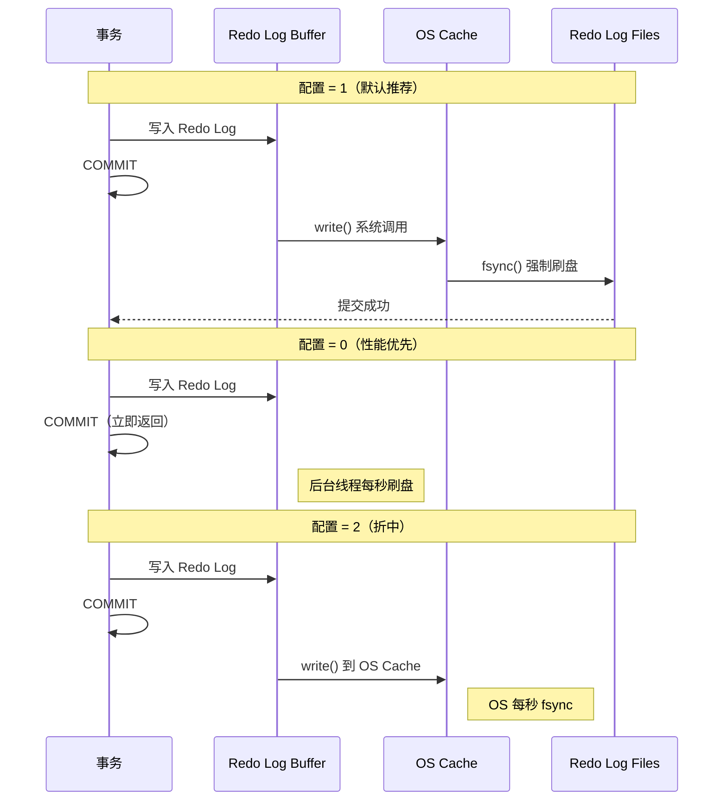
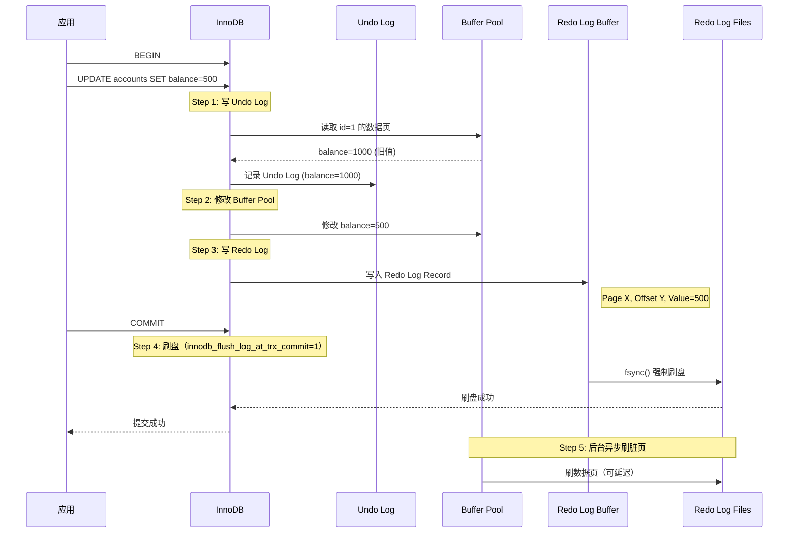
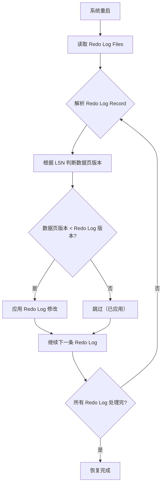

# 1.4 持久性 (Durability) - WAL (Write-Ahead Logging) 深度解析

> **学习目标**: 深入理解数据库如何通过 WAL 机制保证事务持久性，掌握 Redo Log 的原理和崩溃恢复流程

---

## 📚 前置知识

在学习持久性之前，请确保你已经理解：

- ✅ **1.1 原子性**：Undo Log 的作用（回滚）
- ✅ ACID 中的持久性 (Durability) 概念
- ✅ 数据库的存储层次（内存 Buffer Pool → 磁盘）
- ✅ 操作系统的文件 I/O 机制（fsync、刷盘）

---

## 🎯 核心概念

### 什么是持久性 (Durability)？

**持久性**保证已提交事务的修改**永久保存**，即使系统崩溃、断电，数据也不会丢失。

### 为什么需要持久性？

**没有持久性的问题**：

```sql
-- 时间线
T1: BEGIN;
T1: UPDATE accounts SET balance = 500 WHERE id = 1;
T1: COMMIT;  -- 提交成功

-- 此时修改只在内存中（Buffer Pool）
-- 还未写入磁盘

-- 系统崩溃！电源断电...

-- 重启后：数据丢失！balance 仍然是旧值
```

**挑战**：
- ❌ **直接写磁盘太慢**：随机 I/O 性能差（每次 UPDATE 都刷盘？）
- ❌ **延迟写入有风险**：崩溃前的修改丢失

**解决方案**：**Write-Ahead Logging (WAL)**

---

## 🌟 WAL：预写日志机制

### 核心思想

**WAL (Write-Ahead Logging)** 的核心原则：

> **先写日志，再写数据**
> - 在修改数据页之前，先将修改记录写入**日志文件**
> - 日志文件是**顺序写**，性能远高于随机写
> - 崩溃后通过**日志重做**恢复数据

### WAL 的两条黄金法则

1. **事务提交前，必须先将 Redo Log 刷盘**
   - 保证：即使数据页还在内存，崩溃后也能恢复

2. **修改数据页前，必须先写 Redo Log**
   - 保证：日志记录了所有修改操作

### WAL 的优势

| 特性 | 直接写数据页 | WAL (写日志) |
|------|-------------|--------------|
| I/O 模式 | 随机写 | **顺序写** |
| 写入大小 | 整页（16KB） | **日志条目**（几十字节） |
| 持久化时机 | 每次修改 | 事务提交时 |
| 性能 | **慢** | **快** |

**性能对比**：
- 机械硬盘顺序写：**100+ MB/s**
- 机械硬盘随机写：**< 1 MB/s**
- **顺序写比随机写快 100 倍！**

---

## 🏗️ Redo Log 的底层实现

### Redo Log 是什么？

**Redo Log（重做日志）** 记录数据页的**物理修改**，用于崩溃后恢复已提交事务的修改。

**与 Undo Log 的对比**：

| 日志类型 | 作用 | 记录内容 | 使用时机 |
|----------|------|----------|----------|
| **Undo Log** | 回滚（原子性） | **旧值**（如何撤销） | 事务回滚 |
| **Redo Log** | 重做（持久性） | **新值**（如何重做） | 崩溃恢复 |

**协同工作**：
```
事务执行流程：
1. 写 Undo Log（记录旧值）
2. 修改数据页（在 Buffer Pool 中）
3. 写 Redo Log（记录新值）
4. 提交时，先刷 Redo Log，再刷数据页（可延迟）
```

---

### Redo Log 的物理结构

#### 1. 日志文件组织

MySQL InnoDB 的 Redo Log 文件：

```bash
# MySQL 数据目录
datadir/
├── ib_logfile0   # Redo Log 文件 1
├── ib_logfile1   # Redo Log 文件 2
└── ...

# MySQL 8.0.30+ 使用新命名
datadir/
└── #innodb_redo/
    ├── #ib_redo0
    ├── #ib_redo1
    └── ...
```

**特点**：
- **循环使用**：写满后从头覆盖（类似环形缓冲区）
- **固定大小**：默认 2 个文件，每个 48MB（可配置）

**可视化**：
```
Redo Log 文件组（循环写入）:
┌──────────────────────────────────────┐
│ ib_logfile0                          │
│ [已写入]─→[写入位置]──→[未使用]      │
└──────────┬───────────────────────────┘
           │
           ↓ 写满后切换
┌──────────────────────────────────────┐
│ ib_logfile1                          │
│ [未使用]──────────────────────→      │
└──────────┬───────────────────────────┘
           │
           ↓ 写满后回到 ib_logfile0
```

---

#### 2. Redo Log Record 格式

每条 Redo Log 记录包含：

```
+------------------+
| Type             | ← 操作类型（INSERT/UPDATE/DELETE）
+------------------+
| Space ID         | ← 表空间 ID
+------------------+
| Page Number      | ← 页号
+------------------+
| Offset           | ← 页内偏移量
+------------------+
| Data Length      | ← 数据长度
+------------------+
| Data             | ← 修改的数据（新值）
+------------------+
| Checksum         | ← 校验和
+------------------+
```

**示例**：
```
操作: UPDATE users SET age = 30 WHERE id = 1;

Redo Log Record:
- Type: MLOG_WRITE_STRING  (写字符串)
- Space ID: 10
- Page Number: 100
- Offset: 256
- Data Length: 4
- Data: 0x0000001E  (30 的二进制表示)
```

**关键点**：
- ✅ **物理日志**：记录"在哪个页的哪个位置写入什么数据"
- ✅ **幂等性**：重复执行 Redo Log 不会产生副作用

---

#### 3. Redo Log Buffer

**内存中的日志缓冲区**：

```
内存层次：
┌─────────────────────────────────────┐
│ Redo Log Buffer (内存)               │ ← 事务写入日志先到这里
│ - 默认大小: 16MB                     │
│ - 循环使用                           │
└──────────────┬──────────────────────┘
               │
               │ 刷盘策略（innodb_flush_log_at_trx_commit）
               ↓
┌─────────────────────────────────────┐
│ OS Cache (操作系统缓存)              │
└──────────────┬──────────────────────┘
               │
               │ fsync() 系统调用
               ↓
┌─────────────────────────────────────┐
│ Redo Log Files (磁盘)                │ ← 持久化存储
└─────────────────────────────────────┘
```

---

### 刷盘策略：innodb_flush_log_at_trx_commit

**关键配置参数**（控制持久性 vs 性能权衡）：

| 值 | 行为 | 持久性 | 性能 | 适用场景 |
|----|------|--------|------|----------|
| **0** | 每秒刷盘一次 | ❌ 差（可能丢失 1 秒数据） | ⚡ 最快 | 非关键数据 |
| **1** | 每次提交刷盘 | ✅ 强（ACID 完全保证） | 🐢 慢 | **生产环境推荐** |
| **2** | 每次提交写 OS Cache，每秒 fsync | ⚠️ 中（OS 崩溃丢数据） | ⚡ 较快 | 允许 OS 级别丢失 |

**详细流程**：



**生产环境建议**：
- ✅ **金融、支付系统**：设置为 **1**（完全持久性）
- ⚠️ **日志、监控系统**：可设置为 **2**（性能优先）
- ❌ **不推荐设置为 0**（除非数据可以丢失）

---

## 🔄 完整的事务提交流程

### 场景：执行一次 UPDATE 操作

```sql
BEGIN;
UPDATE accounts SET balance = 500 WHERE id = 1;
COMMIT;
```

### 详细执行流程



**关键步骤详解**：

1. **写 Undo Log**（保证原子性）
   - 记录旧值 `balance=1000`
   - 用于回滚或 MVCC

2. **修改 Buffer Pool**（内存操作）
   - 更新缓存中的数据页
   - 标记为"脏页"（dirty page）

3. **写 Redo Log Buffer**（内存操作）
   - 记录新值 `balance=500`
   - 还在内存中，未持久化

4. **刷 Redo Log 到磁盘**（关键！）
   - `fsync()` 强制刷盘
   - **只有这一步完成，COMMIT 才返回成功**

5. **异步刷脏页**（后台线程）
   - 由后台线程（Page Cleaner）定期执行
   - 不阻塞事务提交

---

## 🛡️ 崩溃恢复机制

### 崩溃场景分类

| 场景 | Redo Log 状态 | 数据页状态 | 恢复策略 |
|------|---------------|-----------|----------|
| **场景 1** | ✅ 已刷盘 | ✅ 已刷盘 | 无需恢复 |
| **场景 2** | ✅ 已刷盘 | ❌ 未刷盘 | **重做（Redo）** |
| **场景 3** | ❌ 未刷盘 | ❌ 未刷盘 | **回滚（Undo）** |
| **场景 4** | ✅ 已刷盘（部分） | ❌ 未刷盘 | **重做 + 回滚** |

---

### 场景 2：重做（Redo Recovery）

**典型情况**：事务已提交（Redo Log 已刷盘），但数据页还在内存中未刷盘，此时崩溃。

```
时间线：
t1: 事务提交，Redo Log 刷盘成功
t2: 数据页还在 Buffer Pool（未刷盘）
t3: 系统崩溃！

重启后：
1. 扫描 Redo Log
2. 发现未刷盘的修改
3. 重新应用到数据页（Redo）
```

**重做流程**：



**示例**：

```
Redo Log:
- LSN 100: Page 10, Offset 50, Value = 500
- LSN 200: Page 20, Offset 100, Value = 'Alice'

数据页状态（崩溃时）:
- Page 10: LSN = 50  (旧于 Redo Log)
- Page 20: LSN = 200 (已是最新)

恢复操作:
1. Page 10: 应用 LSN 100 的修改 → Value = 500
2. Page 20: 跳过（已是最新版本）
```

**关键点**：
- ✅ **幂等性**：重复执行 Redo Log 不会出错
- ✅ **LSN 版本号**：判断是否需要重做

---

### 场景 3：回滚（Undo Recovery）

**典型情况**：事务未提交（Redo Log 未刷盘），此时崩溃。

```
时间线：
t1: 事务执行 UPDATE
t2: 写入 Undo Log（已刷盘）
t3: 写入 Redo Log Buffer（未刷盘）
t4: 系统崩溃！

重启后：
1. 发现未提交的事务
2. 读取 Undo Log
3. 回滚修改
```

**回滚流程**：
- 与 1.1 节原子性中的回滚流程一致
- 通过 Undo Log 恢复到事务开始前的状态

---

### LSN：日志序列号

**LSN (Log Sequence Number)** 是 Redo Log 的**全局递增序列号**，用于标识日志位置和版本。

**用途**：

1. **判断数据页版本**：
   - 每个数据页有一个 `FIL_PAGE_LSN` 字段
   - 如果 `Page LSN < Redo Log LSN` → 需要重做

2. **确定恢复起点**：
   - 从上次 Checkpoint 的 LSN 开始恢复
   - 避免重复扫描整个 Redo Log

**示例**：
```
数据页头部:
+------------------+
| FIL_PAGE_LSN     | ← 该页最后一次修改的 LSN
+------------------+

Redo Log Record:
+------------------+
| LSN: 12345       | ← 全局递增
| Space ID: 10     |
| Page Number: 100 |
| ...              |
+------------------+
```

---

## ⚡ Checkpoint 机制

### 什么是 Checkpoint？

**Checkpoint（检查点）** 是一个时间点，表示：
- 在此之前的所有修改已经刷盘
- 崩溃恢复时，只需从 Checkpoint 之后的 Redo Log 开始重做

**作用**：
- ✅ **加速恢复**：无需扫描整个 Redo Log
- ✅ **释放日志空间**：Checkpoint 之前的日志可以覆盖

### Checkpoint 的两种类型

| 类型 | 触发时机 | 刷盘内容 | 性能影响 |
|------|----------|----------|----------|
| **Sharp Checkpoint** | 数据库关闭时 | 所有脏页 | 阻塞所有操作 |
| **Fuzzy Checkpoint** | 运行时定期触发 | 部分脏页 | 不阻塞（后台） |

**InnoDB 使用 Fuzzy Checkpoint**（生产环境）：

1. **Master Thread Checkpoint**
   - 每秒或每 10 秒触发
   - 异步刷一定比例的脏页

2. **Flush_LRU_List Checkpoint**
   - Buffer Pool 中 LRU 列表末尾的脏页被淘汰时触发

3. **Async/Sync Flush Checkpoint**
   - Redo Log 空间不足时触发
   - 强制刷脏页释放日志空间

4. **Dirty Page Too Much Checkpoint**
   - 脏页比例超过阈值（默认 75%）时触发

### Checkpoint 的工作流程

```
时间线：
t1: 写入多个事务的 Redo Log
t2: 触发 Checkpoint
    - 选择部分脏页刷盘
    - 记录 Checkpoint LSN = 1000
t3: 继续写入 Redo Log
t4: 系统崩溃

恢复：
1. 读取最新的 Checkpoint LSN = 1000
2. 从 LSN 1000 之后的 Redo Log 开始重做
3. 无需扫描 LSN < 1000 的日志（已持久化）
```

**可视化**：
```
Redo Log 时间线:
├────────────┼──────────────┼──────────>
0           1000          2000        LSN

         Checkpoint
            ↓
        已刷盘           可能未刷盘
```

---

## 🔗 Undo Log vs Redo Log 协同工作

### 完整的事务生命周期

```
事务执行阶段:
┌─────────────────────────────────────────┐
│ 1. BEGIN                                │
│ 2. 写 Undo Log (旧值)                   │ ← 原子性
│ 3. 修改 Buffer Pool                     │
│ 4. 写 Redo Log (新值)                   │ ← 持久性
│ 5. COMMIT → 刷 Redo Log 到磁盘          │
└─────────────────────────────────────────┘

崩溃恢复阶段:
┌─────────────────────────────────────────┐
│ 1. 扫描 Redo Log                        │
│ 2. 重做已提交事务 (Redo)                │ ← 持久性
│ 3. 回滚未提交事务 (Undo)                │ ← 原子性
└─────────────────────────────────────────┘
```

### 两种日志的对比总结

| 对比项 | Undo Log | Redo Log |
|--------|----------|----------|
| **ACID 特性** | 原子性 (Atomicity) | 持久性 (Durability) |
| **记录内容** | **旧值**（如何撤销） | **新值**（如何重做） |
| **日志类型** | 逻辑日志（操作级别） | 物理日志（页级别） |
| **存储位置** | Undo 表空间 | Redo Log Files |
| **使用时机** | 回滚、MVCC | 崩溃恢复 |
| **刷盘时机** | 随数据页刷盘 | 事务提交时立即刷盘 |
| **是否循环使用** | 否（Purge 清理） | 是（循环覆盖） |

**协同示例**：

```sql
-- 事务执行
BEGIN;
UPDATE accounts SET balance = 500 WHERE id = 1;  -- 旧值 1000

-- 日志记录：
Undo Log: balance = 1000  (用于回滚)
Redo Log: balance = 500   (用于重做)

-- 场景 1: 事务回滚
ROLLBACK;
→ 使用 Undo Log 恢复: balance = 1000

-- 场景 2: 事务提交后崩溃
COMMIT;  -- Redo Log 已刷盘
[系统崩溃]
→ 使用 Redo Log 重做: balance = 500
```

---

## 🧪 实验：观察 WAL 的实际效果

### 实验 1：观察 Redo Log 刷盘

**步骤**：

```sql
-- 1. 查看当前 Redo Log 配置
SHOW VARIABLES LIKE 'innodb_log_file%';
SHOW VARIABLES LIKE 'innodb_flush_log_at_trx_commit';

-- 2. 查看 Redo Log 文件位置
SHOW VARIABLES LIKE 'datadir';

-- 3. 创建测试表
CREATE TABLE test_redo (
    id INT PRIMARY KEY AUTO_INCREMENT,
    value VARCHAR(100)
);

-- 4. 监控 Redo Log 写入
-- 在另一个终端执行：
-- watch -n 1 'ls -lh /var/lib/mysql/ib_logfile*'

-- 5. 执行大量插入
BEGIN;
INSERT INTO test_redo (value) VALUES ('test1');
INSERT INTO test_redo (value) VALUES ('test2');
-- ... 重复 1000 次
COMMIT;

-- 6. 观察 InnoDB 状态
SHOW ENGINE INNODB STATUS\G

-- 搜索 "LOG" 部分，查看：
-- - Log sequence number（当前 LSN）
-- - Log flushed up to（已刷盘的 LSN）
-- - Pages flushed up to（数据页刷盘进度）
```

**观察点**：
- ✅ Redo Log 文件大小变化
- ✅ `Log sequence number` 持续增长
- ✅ `Log flushed up to` 与 `Log sequence number` 的差距（Buffer 中的日志）

---

### 实验 2：测试不同刷盘策略的性能

**步骤**：

```sql
-- 创建性能测试脚本（Bash）
#!/bin/bash

# 测试函数
test_performance() {
    local flush_mode=$1
    local iterations=10000

    mysql -e "SET GLOBAL innodb_flush_log_at_trx_commit=$flush_mode;"

    start_time=$(date +%s.%N)

    for i in $(seq 1 $iterations); do
        mysql -e "INSERT INTO test_redo (value) VALUES ('test$i');"
    done

    end_time=$(date +%s.%N)
    duration=$(echo "$end_time - $start_time" | bc)

    echo "Mode $flush_mode: $duration seconds"
}

# 测试三种模式
test_performance 0
test_performance 1
test_performance 2
```

**预期结果**：
```
Mode 0: 5.2 seconds   (最快)
Mode 1: 18.7 seconds  (最慢，但最安全)
Mode 2: 9.3 seconds   (折中)
```

**结论**：
- 模式 1（每次刷盘）比模式 0（每秒刷盘）慢约 **3-4 倍**
- 生产环境必须使用模式 1，牺牲性能换取数据安全

---

### 实验 3：模拟崩溃恢复

**步骤**：

```sql
-- 1. 设置刷盘模式为 1（确保 Redo Log 持久化）
SET GLOBAL innodb_flush_log_at_trx_commit=1;

-- 2. 记录初始状态
SELECT COUNT(*) FROM test_redo;  -- 假设结果：1000

-- 3. 执行插入（不提交）
BEGIN;
INSERT INTO test_redo (value) VALUES ('will be lost');
-- 不 COMMIT！

-- 4. 在另一个会话执行并提交
BEGIN;
INSERT INTO test_redo (value) VALUES ('will be recovered');
COMMIT;  -- Redo Log 已刷盘

-- 5. 模拟崩溃（强制关闭 MySQL）
-- 方式 1: kill -9 <mysql_pid>
-- 方式 2: 直接关闭虚拟机电源

-- 6. 重启 MySQL
sudo systemctl start mysql

-- 7. 检查恢复结果
SELECT * FROM test_redo WHERE value LIKE 'will%';

-- 预期结果：
-- - 'will be lost': 不存在（未提交，被回滚）
-- - 'will be recovered': 存在（已提交，被重做）
```

**观察 MySQL 错误日志**：
```bash
tail -f /var/log/mysql/error.log

# 搜索关键词：
# - "InnoDB: Starting crash recovery"
# - "InnoDB: Applying log records"
# - "InnoDB: Rolling back trx"
```

---

### 实验 4：观察 Checkpoint 机制

**步骤**：

```sql
-- 1. 查看当前 Checkpoint 信息
SHOW ENGINE INNODB STATUS\G

-- 搜索 "LOG" 部分：
-- Log sequence number          12345678  ← 当前 LSN
-- Log flushed up to            12345000  ← Redo Log 刷盘位置
-- Pages flushed up to          12340000  ← 数据页刷盘位置（Checkpoint）
-- Last checkpoint at           12340000  ← 最后一次 Checkpoint

-- 2. 计算未刷盘的日志量
-- Redo Log Buffer: 12345678 - 12345000 = 678 bytes
-- 未刷盘的数据页对应日志: 12345000 - 12340000 = 5000 bytes

-- 3. 执行大量更新触发 Checkpoint
UPDATE test_redo SET value = CONCAT(value, '_updated');

-- 4. 再次查看
SHOW ENGINE INNODB STATUS\G

-- 观察 "Last checkpoint at" 是否增长
```

---

## 🎨 WAL 的可视化理解

### 完整的数据写入流程

```
用户执行 UPDATE:
   │
   ↓
┌──────────────────────────────────────┐
│ Step 1: 写 Undo Log (内存)            │
│  - 记录旧值到 Undo Buffer             │
└────────────┬─────────────────────────┘
             │
             ↓
┌──────────────────────────────────────┐
│ Step 2: 修改 Buffer Pool              │
│  - 在内存中修改数据页                 │
│  - 标记为脏页                         │
└────────────┬─────────────────────────┘
             │
             ↓
┌──────────────────────────────────────┐
│ Step 3: 写 Redo Log (内存)            │
│  - 记录新值到 Redo Log Buffer         │
└────────────┬─────────────────────────┘
             │
             ↓ 用户执行 COMMIT
             │
┌──────────────────────────────────────┐
│ Step 4: 刷 Redo Log (磁盘)            │
│  - fsync() 强制刷盘                   │
│  - 此时 COMMIT 才返回成功             │
└────────────┬─────────────────────────┘
             │
             ↓ 后台异步
             │
┌──────────────────────────────────────┐
│ Step 5: Checkpoint                   │
│  - 后台线程刷脏页到磁盘               │
│  - 释放 Redo Log 空间                 │
└──────────────────────────────────────┘
```

### 崩溃恢复的决策树

```
系统重启
   │
   ↓
读取 Redo Log
   │
   ├─→ Redo Log 包含事务 T1 的提交记录？
   │   │
   │   ├─→ Yes: 数据页已刷盘？
   │   │   │
   │   │   ├─→ Yes: 无需操作
   │   │   └─→ No:  重做（Redo）
   │   │
   │   └─→ No: 数据页有 T1 的修改？
   │       │
   │       ├─→ Yes: 回滚（Undo）
   │       └─→ No:  无需操作
```

---

## 🛠️ PostgreSQL 的 WAL 实现对比

### PostgreSQL vs MySQL InnoDB

| 特性 | MySQL InnoDB | PostgreSQL |
|------|--------------|------------|
| WAL 文件名称 | Redo Log | WAL (Write-Ahead Log) |
| 文件组织 | 固定大小循环使用 | 按需创建 WAL 段文件 |
| 刷盘参数 | `innodb_flush_log_at_trx_commit` | `synchronous_commit` |
| 日志格式 | 物理日志 | 物理 + 逻辑混合 |
| Checkpoint | Fuzzy Checkpoint | CHECKPOINT 命令 |
| 归档 | 不支持（Binlog 归档） | 支持 WAL 归档（PITR） |

### PostgreSQL WAL 的独特之处

**1. WAL 归档与 PITR（时间点恢复）**：
```sql
-- PostgreSQL 支持恢复到任意时间点
-- MySQL 需要依赖 Binlog + 备份
```

**2. WAL 文件命名**：
```bash
# PostgreSQL WAL 文件（按需创建）
pg_wal/
├── 000000010000000000000001
├── 000000010000000000000002
└── ...

# MySQL Redo Log（固定文件循环使用）
ib_logfile0
ib_logfile1
```

**3. 同步级别更灵活**：
```sql
-- PostgreSQL synchronous_commit 参数
SET synchronous_commit = 'on';       -- 完全同步
SET synchronous_commit = 'local';    -- 本地同步
SET synchronous_commit = 'remote_write';  -- 远程写入
SET synchronous_commit = 'off';      -- 异步（性能优先）
```

---

## 🧠 深度思考题

### 问题 1：为什么 Redo Log 要循环使用？

<details>
<summary>点击查看答案</summary>

**原因**：

1. **固定空间占用**：
   - Redo Log 文件大小固定（如 2 × 48MB）
   - 避免日志文件无限增长

2. **Checkpoint 保证安全覆盖**：
   - Checkpoint 确保旧日志对应的数据页已刷盘
   - 覆盖旧日志不会丢失数据

3. **性能优化**：
   - 循环使用避免频繁创建/删除文件
   - 顺序写性能最优

**可视化**：
```
Redo Log 环形结构:
┌─────────────────────────────────────┐
│ [已刷盘区] → [写入点] → [空闲区]     │
└──────┬──────────────────────────────┘
       │
       └→ Checkpoint 推进后，[已刷盘区] 可被覆盖
```

**风险**：
- ⚠️ 如果脏页刷盘太慢，Redo Log 空间不足
- ⚠️ 可能导致写入阻塞（Async/Sync Flush Checkpoint）

**监控方法**：
```sql
SHOW ENGINE INNODB STATUS\G
-- 搜索 "LOG"，观察 Redo Log 使用率
```

</details>

---

### 问题 2：为什么先写 Redo Log，再刷数据页？

<details>
<summary>点击查看答案</summary>

**原因**：

1. **性能：顺序写 vs 随机写**：
   - Redo Log：顺序写，速度快（100+ MB/s）
   - 数据页：随机写，速度慢（< 1 MB/s）
   - **先写快的，提高提交速度**

2. **持久性保证**：
   - Redo Log 刷盘成功 = 提交成功
   - 即使数据页未刷盘，崩溃后也能恢复

3. **减少写放大**：
   - 一次修改可能只改数据页的几个字节
   - 但刷数据页需要写整个页（16KB）
   - Redo Log 只写几十字节

**反例：如果先刷数据页？**
```
问题 1: 性能差
- 每次 COMMIT 都要随机写磁盘
- 严重影响吞吐量

问题 2: 一致性难保证
- 如果刷盘一半时崩溃，数据页可能处于不一致状态
```

**关键点**：
> WAL 的核心思想就是"先写日志，延迟刷数据页"，用顺序写的性能优势换取持久性保证！

</details>

---

### 问题 3：Double Write Buffer 的作用是什么？

<details>
<summary>点击查看答案</summary>

**问题背景**：
- InnoDB 数据页大小：16KB
- 操作系统页大小：通常 4KB
- 写入 16KB 数据页时，可能只写入部分（4KB、8KB）就崩溃
- **部分写入（Partial Page Write）** 导致数据页损坏

**Double Write Buffer 机制**：

```
写数据页的流程:
1. 先将数据页写入 Double Write Buffer（连续空间）
2. fsync() 确保 Double Write Buffer 刷盘
3. 再将数据页写入实际位置（随机位置）

如果步骤 3 崩溃:
→ 从 Double Write Buffer 恢复完整的数据页
```

**可视化**：
```
┌──────────────────────────────────────┐
│ Buffer Pool 中的脏页                  │
└────────────┬─────────────────────────┘
             │
             ↓ Step 1: 批量写入
┌──────────────────────────────────────┐
│ Double Write Buffer (连续 2MB 空间)   │
│ - 系统表空间中的固定区域              │
│ - 顺序写，性能好                      │
└────────────┬─────────────────────────┘
             │
             ↓ Step 2: fsync 确保刷盘
             │
             ↓ Step 3: 写入实际位置
┌──────────────────────────────────────┐
│ 数据文件（.ibd）中的实际位置          │
└──────────────────────────────────────┘
```

**性能影响**：
- ⚠️ 数据页需要写两次（Double Write）
- ✅ 但 Double Write Buffer 是顺序写，性能影响较小
- ✅ 可以禁用（`innodb_doublewrite=0`），但不推荐

**监控**：
```sql
SHOW GLOBAL STATUS LIKE 'Innodb_dblwr%';

-- Innodb_dblwr_pages_written: Double Write 写入的页数
-- Innodb_dblwr_writes: Double Write 操作次数
```

</details>

---

## 📖 源码阅读指引

### MySQL InnoDB WAL 源码

**核心文件**：
- `storage/innobase/log/log0log.cc`：Redo Log 写入
- `storage/innobase/log/log0recv.cc`：崩溃恢复
- `storage/innobase/buf/buf0flu.cc`：脏页刷盘

**关键函数**：

```cpp
// Redo Log 写入
void log_buffer_write_completed(
    lsn_t start_lsn,
    lsn_t end_lsn
);

// Redo Log 刷盘
void log_write_up_to(
    lsn_t lsn,
    bool flush_to_disk
);

// 崩溃恢复
dberr_t recv_recovery_from_checkpoint_start(
    lsn_t flush_lsn
);

// Checkpoint
void log_checkpoint();
```

**阅读步骤**：

1. **理解 Redo Log 写入流程**：
   - 搜索 `log_buffer_write_completed`
   - 跟踪事务提交时如何写入 Redo Log Buffer

2. **理解刷盘策略**：
   - 搜索 `log_write_up_to`
   - 理解 `innodb_flush_log_at_trx_commit` 的实现

3. **理解崩溃恢复**：
   - 阅读 `recv_recovery_from_checkpoint_start`
   - 理解如何从 Checkpoint 开始扫描 Redo Log

---

### PostgreSQL WAL 源码

**核心文件**：
- `src/backend/access/transam/xlog.c`：WAL 核心逻辑
- `src/backend/access/transam/xloginsert.c`：WAL 记录插入
- `src/backend/postmaster/checkpointer.c`：Checkpoint

**关键函数**：

```c
// WAL 写入
XLogRecPtr XLogInsert(RmgrId rmid, uint8 info, XLogRecData *rdata);

// WAL 刷盘
void XLogFlush(XLogRecPtr record);

// Checkpoint
void CreateCheckPoint(int flags);
```

**对比学习重点**：
- PostgreSQL 的 WAL 包含逻辑日志（SQL 级别）
- MySQL Redo Log 是纯物理日志（页级别）

---

## 📚 扩展阅读

### 必读资源

1. **《MySQL技术内幕:InnoDB存储引擎》第2版**
   - 作者：姜承尧
   - 章节：第 2 章 - InnoDB 存储引擎（2.4 Redo Log）

2. **《高性能MySQL》第4版**
   - 章节：第 1 章 - MySQL 架构（1.8 事务日志）

3. **MySQL 官方文档**
   - [InnoDB Redo Log](https://dev.mysql.com/doc/refman/8.0/en/innodb-redo-log.html)
   - [InnoDB Startup Options](https://dev.mysql.com/doc/refman/8.0/en/innodb-parameters.html#sysvar_innodb_flush_log_at_trx_commit)

4. **PostgreSQL 官方文档**
   - [WAL Reliability](https://www.postgresql.org/docs/current/wal-reliability.html)
   - [WAL Configuration](https://www.postgresql.org/docs/current/wal-configuration.html)

### 进阶论文

1. **"ARIES: A Transaction Recovery Method"**
   - 作者：C. Mohan et al. (IBM Research, 1992)
   - 链接：https://cs.stanford.edu/people/chrismre/cs345/rl/aries.pdf
   - 重点：WAL 和崩溃恢复的经典算法

2. **"The Design and Implementation of Modern Column-Oriented Database Systems"**
   - 包含 WAL 在列存储中的应用

---

## ✅ 学习检查清单

完成以下任务，确保你真正掌握了 WAL：

- [ ] 能用自己的话解释 WAL 的核心思想（先写日志，再写数据）
- [ ] 理解 Redo Log 的物理结构（循环使用、LSN、Checkpoint）
- [ ] 掌握三种刷盘策略的区别（innodb_flush_log_at_trx_commit = 0/1/2）
- [ ] 能画出完整的事务提交流程（包含 Undo Log + Redo Log）
- [ ] 理解崩溃恢复的两个阶段（Redo + Undo）
- [ ] 完成至少 3 个实验，观察 WAL 的实际效果
- [ ] 理解 Undo Log vs Redo Log 的协同工作
- [ ] 回答上述 3 个深度思考题
- [ ] 阅读 MySQL InnoDB WAL 源码（至少 500 行）

---

## 📝 下一步学习

完成持久性学习后，你已经完成了 **ACID 四大特性**的学习！

### ACID 总结

| 特性 | 实现机制 | 核心文件 | 关键概念 |
|------|----------|----------|----------|
| **A**tomicity | Undo Log | trx0undo.cc | 版本链、回滚 |
| **C**onsistency | 约束检查 | constraint | 主键、外键、检查约束 |
| **I**solation | MVCC + 锁 | read0read.cc | Read View、隔离级别 |
| **D**urability | Redo Log (WAL) | log0log.cc | LSN、Checkpoint |

### 继续学习

1. **第 2 节：索引结构深度剖析**
   - B-Tree vs B+Tree
   - 聚簇索引 vs 非聚簇索引
   - 索引优化技巧

2. **第 3 节：查询优化器**
   - EXPLAIN 执行计划分析
   - 索引选择策略
   - JOIN 算法

3. **第 4 节：事务隔离级别实验**
   - 验证四种隔离级别
   - 观察并发问题（脏读、不可重复读、幻读）

---

## 🎯 本节总结

**核心要点**：

1. **WAL 的本质**：
   - **先写日志，再写数据**
   - 用顺序写的性能换取持久性保证

2. **Redo Log 的作用**：
   - 记录数据页的物理修改（新值）
   - 崩溃后重做已提交事务的修改

3. **关键机制**：
   - **LSN**：日志序列号，判断版本新旧
   - **Checkpoint**：加速恢复，释放日志空间
   - **刷盘策略**：innodb_flush_log_at_trx_commit 控制持久性 vs 性能

4. **事务提交流程**：
   ```
   1. 写 Undo Log (旧值)
   2. 修改 Buffer Pool
   3. 写 Redo Log (新值)
   4. COMMIT → 刷 Redo Log 到磁盘
   5. 后台异步刷数据页
   ```

5. **崩溃恢复**：
   - **重做（Redo）**：已提交但未刷盘 → 应用 Redo Log
   - **回滚（Undo）**：未提交 → 应用 Undo Log

6. **Undo Log vs Redo Log**：
   | 特性 | Undo Log | Redo Log |
   |------|----------|----------|
   | 作用 | 原子性 | 持久性 |
   | 内容 | 旧值 | 新值 |
   | 时机 | 回滚 | 崩溃恢复 |

**关键理解**：
> WAL 通过 Redo Log 的顺序写特性，将随机 I/O 转换为顺序 I/O，在保证持久性的同时实现高性能！

---

**学习时长记录**: _____ 小时
**理解深度**: ⭐⭐⭐⭐☆ (1-5星自评)
**需要加强**: _____________________

**上一节**：[1.3 隔离性 (Isolation) - MVCC](./1.3-isolation-mvcc.md)
**下一节**：[2.1 B-Tree vs B+Tree](../module2/2.1-btree-vs-bplustree.md)

---

## 🎉 恭喜完成 ACID 四大特性学习！

你已经掌握了数据库事务的核心原理：

- ✅ **原子性**：Undo Log 保证全部成功或全部失败
- ✅ **一致性**：约束检查保证数据符合规则
- ✅ **隔离性**：MVCC 实现高并发下的事务隔离
- ✅ **持久性**：WAL 保证已提交事务永不丢失

**下一步建议**：
1. 复习四个章节，绘制 ACID 的完整知识图谱
2. 完成 Week 2 Module 1 的所有实验
3. 阅读推荐的源码文件（至少 2000 行）
4. 继续学习索引结构，将 ACID 知识应用到实践中

**继续加油！** 🚀
